# Machine Learning – Specialty: 332 câu hỏi và giải thích

Chuyển từ **Machine Learning - Specialty Exam.pdf**, 621 trang, đủ câu 1–332. Giữ tiếng Anh của câu hỏi/lựa chọn; giải thích bằng tiếng Việt. Nội dung thuộc bộ **Machine Learning – Specialty** trong PDF.

Đối chiếu ngày **21/09/2026**: **278 câu đã đối chiếu**, **26 câu theo bối cảnh dịch vụ cũ**, **28 câu cần xác minh hoặc sửa đề**. Đáp án là kết luận biên soạn dựa trên tài liệu được dẫn, không phải đáp án do AWS công bố cho bộ câu hỏi này. Các kiến thức thống kê/ML có thêm tài liệu gốc của thư viện hoặc bài nghiên cứu.

Đáp án PDF và bình chọn cộng đồng không được dùng làm bằng chứng độc lập. Câu thiếu dữ kiện, tham số sai hoặc có nhiều cách hiểu được ghi rõ, không ép chốt đáp án. Hình gốc được giữ cùng mô tả chữ; số đọc từ biểu đồ được ghi là xấp xỉ.

Để nhập Quizlet, dùng [ML_SPECIALTY_332_QUIZLET_IMPORT.md](ML_SPECIALTY_332_QUIZLET_IMPORT.md); để tránh học các câu mơ hồ, dùng [ML_SPECIALTY_QUIZLET_KHONG_CO_CAU_MO_HO.md](ML_SPECIALTY_QUIZLET_KHONG_CO_CAU_MO_HO.md). Xem [hướng dẫn và danh sách câu cần chú ý](HUONG_DAN_QUIZLET.md).

## Câu 001

Trang PDF: [2](../../Machine%20Learning%20-%20Specialty%20Exam.pdf#page=2) · CẦN XÁC MINH / SỬA ĐỀ

A large mobile network operating company is building a machine learning model to predict customers who are likely to unsubscribe from the service. The company plans to offer an incentive for these customers as the cost of churn is far greater than the cost of the incentive. The model produces the following confusion matrix after evaluating on a test dataset of 100 customers: Based on the model evaluation results, why is this a viable model for production?

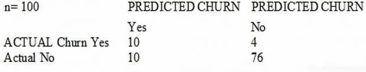

**Dữ kiện hình dạng chữ:** Confusion matrix: rows Actual Yes, Actual No; columns Predicted Yes, Predicted No. Actual Yes: [10, 4]. Actual No: [10, 76]. Total: 100.

**A.** The model is 86% accurate and the cost incurred by the company as a result of false negatives is less than the false positives.

**B.** The precision of the model is 86%, which is less than the accuracy of the model.

**C.** The model is 86% accurate and the cost incurred by the company as a result of false positives is less than the false negatives.

**D.** The precision of the model is 86%, which is greater than the accuracy of the model.

**Chưa chốt đáp án.** Phương án tham khảo có điều kiện: **C**.

Accuracy = 86%; precision = 50%. C phù hợp nếu nói chi phí mỗi lỗi; tổng chi phí còn phụ thuộc tỷ lệ chi phí churn/incentive.

Đáp án in trong PDF: `A` (giữ để đối chiếu nguồn, không dùng làm căn cứ chấm).

Nguồn đối chiếu: [Binary Model Insights - Amazon Machine Learning](https://docs.aws.amazon.com/machine-learning/latest/dg/binary-model-insights.html).

---

## Câu 002

Trang PDF: [5](../../Machine%20Learning%20-%20Specialty%20Exam.pdf#page=5) · ĐÃ ĐỐI CHIẾU

A Machine Learning Specialist is designing a system for improving sales for a company. The objective is to use the large amount of information the company has on users' behavior and product preferences to predict which products users would like based on the users' similarity to other users. What should the Specialist do to meet this objective?

**A.** Build a content-based filtering recommendation engine with Apache Spark ML on Amazon EMR

**B.** Build a collaborative filtering recommendation engine with Apache Spark ML on Amazon EMR.

**C.** Build a model-based filtering recommendation engine with Apache Spark ML on Amazon EMR

**D.** Build a combinative filtering recommendation engine with Apache Spark ML on Amazon EMR

**Đáp án sau đối chiếu: B.**

Collaborative filtering dùng tương tác của những người dùng tương tự.

Đáp án in trong PDF: `B` (giữ để đối chiếu nguồn, không dùng làm căn cứ chấm).

Nguồn đối chiếu: [Accelerate and improve recommender system training and predictions using Amazon SageMaker Feature Store | Artificial Intelligence](https://aws.amazon.com/blogs/machine-learning/accelerate-and-improve-recommender-system-training-and-predictions-using-amazon-sagemaker-feature-store/).

---

## Câu 003

Trang PDF: [7](../../Machine%20Learning%20-%20Specialty%20Exam.pdf#page=7) · ĐÃ ĐỐI CHIẾU

A Mobile Network Operator is building an analytics platform to analyze and optimize a company's operations using Amazon Athena and Amazon S3. The source systems send data in .CSV format in real time. The Data Engineering team wants to transform the data to the Apache Parquet format before storing it on Amazon S3. Which solution takes the LEAST effort to implement?

**A.** Ingest .CSV data using Apache Kafka Streams on Amazon EC2 instances and use Kafka Connect S3 to serialize data as Parquet

**B.** Ingest .CSV data from Amazon Kinesis Data Streams and use Amazon Glue to convert data into Parquet.

**C.** Ingest .CSV data using Apache Spark Structured Streaming in an Amazon EMR cluster and use Apache Spark to convert data into Parquet.

**D.** Ingest .CSV data from Amazon Kinesis Data Streams and use Amazon Kinesis Data Firehose to convert data into Parquet.

**Đáp án sau đối chiếu: B.**

Glue xử lý CSV từ Kinesis; Firehose chỉ đổi JSON sang Parquet nếu không thêm Lambda.

Đáp án in trong PDF: `B` (giữ để đối chiếu nguồn, không dùng làm căn cứ chấm).

Nguồn đối chiếu: [Streaming ETL jobs in AWS Glue - AWS Glue](https://docs.aws.amazon.com/glue/latest/dg/add-job-streaming.html); [Convert input data format in Amazon Data Firehose - Amazon Data Firehose](https://docs.aws.amazon.com/firehose/latest/dev/record-format-conversion.html).

---

## Câu 004

Trang PDF: [10](../../Machine%20Learning%20-%20Specialty%20Exam.pdf#page=10) · ĐÃ ĐỐI CHIẾU

A city wants to monitor its air quality to address the consequences of air pollution. A Machine Learning Specialist needs to forecast the air quality in parts per million of contaminates for the next 2 days in the city. As this is a prototype, only daily data from the last year is available. Which model is MOST likely to provide the best results in Amazon SageMaker?

**A.** Use the Amazon SageMaker k-Nearest-Neighbors (kNN) algorithm on the single time series consisting of the full year of data with a predictor_type of regressor.

**B.** Use Amazon SageMaker Random Cut Forest (RCF) on the single time series consisting of the full year of data.

**C.** Use the Amazon SageMaker Linear Learner algorithm on the single time series consisting of the full year of data with a predictor_type of regressor.

**D.** Use the Amazon SageMaker Linear Learner algorithm on the single time series consisting of the full year of data with a predictor_type of classifier.

**Đáp án sau đối chiếu: C.**

Đích là giá trị liên tục; Linear Learner ở chế độ regression phù hợp nhất trong các lựa chọn.

Đáp án in trong PDF: `C` (giữ để đối chiếu nguồn, không dùng làm căn cứ chấm).

Nguồn đối chiếu: [Linear Learner Algorithm - Amazon SageMaker AI](https://docs.aws.amazon.com/sagemaker/latest/dg/linear-learner.html).

---

## Câu 005

Trang PDF: [13](../../Machine%20Learning%20-%20Specialty%20Exam.pdf#page=13) · ĐÃ ĐỐI CHIẾU

A Data Engineer needs to build a model using a dataset containing customer credit card information How can the Data Engineer ensure the data remains encrypted and the credit card information is secure?

**A.** Use a custom encryption algorithm to encrypt the data and store the data on an Amazon SageMaker instance in a VPC. Use the SageMaker DeepAR algorithm to randomize the credit card numbers.

**B.** Use an IAM policy to encrypt the data on the Amazon S3 bucket and Amazon Kinesis to automatically discard credit card numbers and insert fake credit card numbers.

**C.** Use an Amazon SageMaker launch configuration to encrypt the data once it is copied to the SageMaker instance in a VPC. Use the SageMaker principal component analysis (PCA) algorithm to reduce the length of the credit card numbers.

**D.** Use AWS KMS to encrypt the data on Amazon S3 and Amazon SageMaker, and redact the credit card numbers from the customer data with AWS Glue.

**Đáp án sau đối chiếu: D.**

KMS bảo vệ dữ liệu lưu trữ; Glue hỗ trợ phát hiện và che dữ liệu cá nhân.

Đáp án in trong PDF: `D` (giữ để đối chiếu nguồn, không dùng làm căn cứ chấm).

Nguồn đối chiếu: [Detect and process sensitive data - AWS Glue](https://docs.aws.amazon.com/glue/latest/dg/detect-PII.html); [Protect Data at Rest Using Encryption - Amazon SageMaker AI](https://docs.aws.amazon.com/sagemaker/latest/dg/encryption-at-rest.html).

---

## Câu 006

Trang PDF: [15](../../Machine%20Learning%20-%20Specialty%20Exam.pdf#page=15) · ĐÃ ĐỐI CHIẾU

A Machine Learning Specialist is using an Amazon SageMaker notebook instance in a private subnet of a corporate VPC. The ML Specialist has important data stored on the Amazon SageMaker notebook instance's Amazon EBS volume, and needs to take a snapshot of that EBS volume. However, the ML Specialist cannot find the Amazon SageMaker notebook instance's EBS volume or Amazon EC2 instance within the VPC. Why is the ML Specialist not seeing the instance visible in the VPC?

**A.** Amazon SageMaker notebook instances are based on the EC2 instances within the customer account, but they run outside of VPCs.

**B.** Amazon SageMaker notebook instances are based on the Amazon ECS service within customer accounts.

**C.** Amazon SageMaker notebook instances are based on EC2 instances running within AWS service accounts.

**D.** Amazon SageMaker notebook instances are based on AWS ECS instances running within AWS service accounts.

**Đáp án sau đối chiếu: C.**

Notebook chạy trong tài khoản dịch vụ SageMaker, kết nối VPC khách hàng qua ENI.

Đáp án in trong PDF: `C` (giữ để đối chiếu nguồn, không dùng làm căn cứ chấm).

Nguồn đối chiếu: [Introducing a New Blog Series, Service Spotlight for Financial Services: Featuring Amazon SageMaker Notebook Instances | AWS for Industries](https://aws.amazon.com/blogs/industries/introducing-a-new-blog-series-service-spotlight-for-financial-services-featuring-amazon-sagemaker-notebook-instances/).

---

## Câu 007

Trang PDF: [18](../../Machine%20Learning%20-%20Specialty%20Exam.pdf#page=18) · ĐÃ ĐỐI CHIẾU

A Machine Learning Specialist is building a model that will perform time series forecasting using Amazon SageMaker. The Specialist has finished training the model and is now planning to perform load testing on the endpoint so they can configure Auto Scaling for the model variant. Which approach will allow the Specialist to review the latency, memory utilization, and CPU utilization during the load test?

**A.** Review SageMaker logs that have been written to Amazon S3 by leveraging Amazon Athena and Amazon QuickSight to visualize logs as they are being produced.

**B.** Generate an Amazon CloudWatch dashboard to create a single view for the latency, memory utilization, and CPU utilization metrics that are outputted by Amazon SageMaker.

**C.** Build custom Amazon CloudWatch Logs and then leverage Amazon ES and Kibana to query and visualize the log data as it is generated by Amazon SageMaker.

**D.** Send Amazon CloudWatch Logs that were generated by Amazon SageMaker to Amazon ES and use Kibana to query and visualize the log data.

**Đáp án sau đối chiếu: B.**

CloudWatch cung cấp CPU, bộ nhớ và độ trễ endpoint.

Đáp án in trong PDF: `B` (giữ để đối chiếu nguồn, không dùng làm căn cứ chấm).

Nguồn đối chiếu: [Amazon SageMaker AI metrics in Amazon CloudWatch - Amazon SageMaker AI](https://docs.aws.amazon.com/sagemaker/latest/dg/monitoring-cloudwatch.html).

---

## Câu 008

Trang PDF: [20](../../Machine%20Learning%20-%20Specialty%20Exam.pdf#page=20) · ĐÃ ĐỐI CHIẾU

A manufacturing company has structured and unstructured data stored in an Amazon S3 bucket. A Machine Learning Specialist wants to use SQL to run queries on this data. Which solution requires the LEAST effort to be able to query this data?

**A.** Use AWS Data Pipeline to transform the data and Amazon RDS to run queries.

**B.** Use AWS Glue to catalogue the data and Amazon Athena to run queries.

**C.** Use AWS Batch to run ETL on the data and Amazon Aurora to run the queries.

**D.** Use AWS Lambda to transform the data and Amazon Kinesis Data Analytics to run queries.

**Đáp án sau đối chiếu: B.**

Glue quản lý metadata; Athena truy vấn dữ liệu S3 bằng SQL.

Đáp án in trong PDF: `B` (giữ để đối chiếu nguồn, không dùng làm căn cứ chấm).

Nguồn đối chiếu: [What is Amazon Athena? - Amazon Athena](https://docs.aws.amazon.com/athena/latest/ug/what-is.html).

---

## Câu 009

Trang PDF: [22](../../Machine%20Learning%20-%20Specialty%20Exam.pdf#page=22) · ĐÃ ĐỐI CHIẾU

A Machine Learning Specialist is developing a custom video recommendation model for an application. The dataset used to train this model is very large with millions of data points and is hosted in an Amazon S3 bucket. The Specialist wants to avoid loading all of this data onto an Amazon SageMaker notebook instance because it would take hours to move and will exceed the attached 5 GB Amazon EBS volume on the notebook instance. Which approach allows the Specialist to use all the data to train the model?

**A.** Load a smaller subset of the data into the SageMaker notebook and train locally. Confirm that the training code is executing and the model parameters seem reasonable. Initiate a SageMaker training job using the full dataset from the S3 bucket using Pipe input mode.

**B.** Launch an Amazon EC2 instance with an AWS Deep Learning AMI and attach the S3 bucket to the instance. Train on a small amount of the data to verify the training code and hyperparameters. Go back to Amazon SageMaker and train using the full dataset

**C.** Use AWS Glue to train a model using a small subset of the data to confirm that the data will be compatible with Amazon SageMaker. Initiate a SageMaker training job using the full dataset from the S3 bucket using Pipe input mode.

**D.** Load a smaller subset of the data into the SageMaker notebook and train locally. Confirm that the training code is executing and the model parameters seem reasonable. Launch an Amazon EC2 instance with an AWS Deep Learning AMI and attach the S3 bucket to train the full dataset.

**Đáp án sau đối chiếu: A.**

Pipe mode truyền dữ liệu S3 trực tiếp vào training job, không cần tải hết vào notebook.

Đáp án in trong PDF: `A` (giữ để đối chiếu nguồn, không dùng làm căn cứ chấm).

Nguồn đối chiếu: [Setting up training jobs to access datasets - Amazon SageMaker AI](https://docs.aws.amazon.com/sagemaker/latest/dg/model-access-training-data.html).

---

## Câu 010

Trang PDF: [24](../../Machine%20Learning%20-%20Specialty%20Exam.pdf#page=24) · BỐI CẢNH DỊCH VỤ CŨ

A Machine Learning Specialist has completed a proof of concept for a company using a small data sample, and now the Specialist is ready to implement an end- to-end solution in AWS using Amazon SageMaker. The historical training data is stored in Amazon RDS. Which approach should the Specialist use for training a model using that data?

**A.** Write a direct connection to the SQL database within the notebook and pull data in

**B.** Push the data from Microsoft SQL Server to Amazon S3 using an AWS Data Pipeline and provide the S3 location within the notebook.

**C.** Move the data to Amazon DynamoDB and set up a connection to DynamoDB within the notebook to pull data in.

**D.** Move the data to Amazon ElastiCache using AWS DMS and set up a connection within the notebook to pull data in for fast access.

**Đáp án sau đối chiếu: B.**

Chuyển dữ liệu RDS sang S3 cho training; lựa chọn dùng Data Pipeline là kiến trúc cũ.

Đáp án in trong PDF: `B` (giữ để đối chiếu nguồn, không dùng làm căn cứ chấm).

Nguồn đối chiếu: [Full copy of Amazon RDS MySQL Table to Amazon S3 - AWS Data Pipeline](https://docs.aws.amazon.com/datapipeline/latest/DeveloperGuide/dp-template-copyrdstos3.html).

---

## Câu 011

Trang PDF: [26](../../Machine%20Learning%20-%20Specialty%20Exam.pdf#page=26) · ĐÃ ĐỐI CHIẾU

A Machine Learning Specialist receives customer data for an online shopping website. The data includes demographics, past visits, and locality information. The Specialist must develop a machine learning approach to identify the customer shopping patterns, preferences, and trends to enhance the website for better service and smart recommendations. Which solution should the Specialist recommend?

**A.** Latent Dirichlet Allocation (LDA) for the given collection of discrete data to identify patterns in the customer database.

**B.** A neural network with a minimum of three layers and random initial weights to identify patterns in the customer database.

**C.** Collaborative filtering based on user interactions and correlations to identify patterns in the customer database.

**D.** Random Cut Forest (RCF) over random subsamples to identify patterns in the customer database.

**Đáp án sau đối chiếu: C.**

Tương tác người dùng là đầu vào cho collaborative filtering.

Đáp án in trong PDF: `C` (giữ để đối chiếu nguồn, không dùng làm căn cứ chấm).

Nguồn đối chiếu: [Accelerate and improve recommender system training and predictions using Amazon SageMaker Feature Store | Artificial Intelligence](https://aws.amazon.com/blogs/machine-learning/accelerate-and-improve-recommender-system-training-and-predictions-using-amazon-sagemaker-feature-store/).

---

## Câu 012

Trang PDF: [28](../../Machine%20Learning%20-%20Specialty%20Exam.pdf#page=28) · ĐÃ ĐỐI CHIẾU

A Machine Learning Specialist is working with a large company to leverage machine learning within its products. The company wants to group its customers into categories based on which customers will and will not churn within the next 6 months. The company has labeled the data available to the Specialist. Which machine learning model type should the Specialist use to accomplish this task?

**A.** Linear regression

**B.** Classification

**C.** Clustering

**D.** Reinforcement learning

**Đáp án sau đối chiếu: B.**

Nhãn churn hoặc không churn tạo bài toán phân loại nhị phân.

Đáp án in trong PDF: `B` (giữ để đối chiếu nguồn, không dùng làm căn cứ chấm).

Nguồn đối chiếu: [Linear Learner Algorithm - Amazon SageMaker AI](https://docs.aws.amazon.com/sagemaker/latest/dg/linear-learner.html).

---

## Câu 013

Trang PDF: [30](../../Machine%20Learning%20-%20Specialty%20Exam.pdf#page=30) · ĐÃ ĐỐI CHIẾU

The displayed graph is from a forecasting model for testing a time series. Considering the graph only, which conclusion should a Machine Learning Specialist make about the behavior of the model?

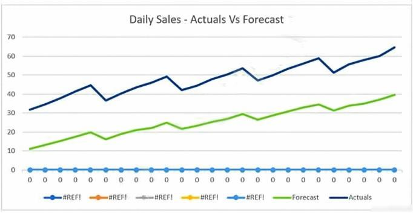

**Dữ kiện hình dạng chữ:** Chart Daily Sales Actuals Vs Forecast: actual sales rise approximately from 32 to 65; forecast rises approximately from 11 to 40. Both lines show repeated peaks and troughs at corresponding times, with the forecast below actual sales. Values are approximate readings from the chart.

**A.** The model predicts both the trend and the seasonality well

**B.** The model predicts the trend well, but not the seasonality.

**C.** The model predicts the seasonality well, but not the trend.

**D.** The model does not predict the trend or the seasonality well.

**Đáp án sau đối chiếu: A.**

Hai đường cùng tăng và có các đỉnh/đáy tương ứng; dự báo vẫn lệch mức tuyệt đối.

Đáp án in trong PDF: `A` (giữ để đối chiếu nguồn, không dùng làm căn cứ chấm).

Nguồn đối chiếu: [What Is Amazon Forecast? - Amazon Forecast](https://docs.aws.amazon.com/forecast/latest/dg/what-is-forecast.html).

---

## Câu 014

Trang PDF: [32](../../Machine%20Learning%20-%20Specialty%20Exam.pdf#page=32) · ĐÃ ĐỐI CHIẾU

A company wants to classify user behavior as either fraudulent or normal. Based on internal research, a Machine Learning Specialist would like to build a binary classifier based on two features: age of account and transaction month. The class distribution for these features is illustrated in the figure provided. Based on this information, which model would have the HIGHEST accuracy?

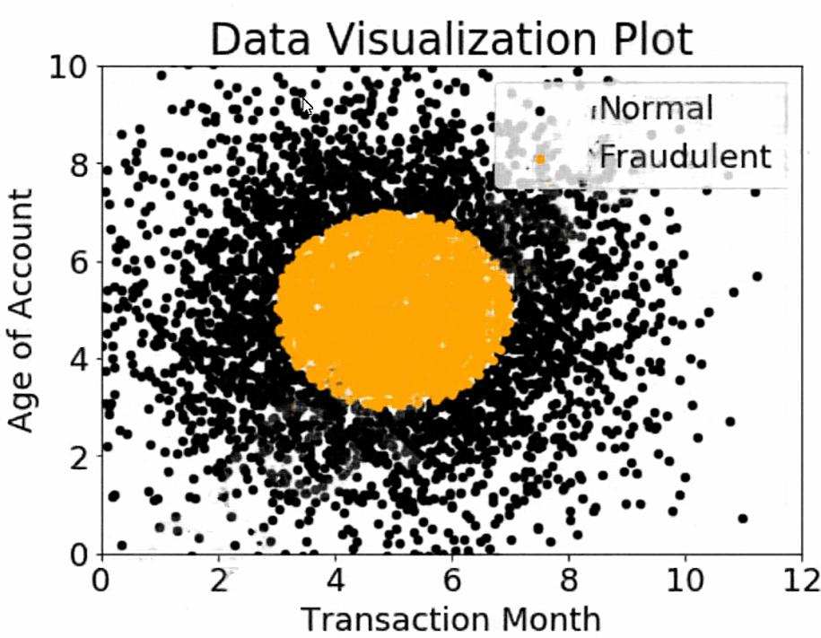

**Dữ kiện hình dạng chữ:** Scatter plot: x=Transaction Month (0–12), y=Account Age (0–10). Orange fraud points occupy a roughly circular central region around x=3–7 and y=3–7. Black normal points surround this central region.

**A.** Long short-term memory (LSTM) model with scaled exponential linear unit (SELU)

**B.** Logistic regression

**C.** Support vector machine (SVM) with non-linear kernel

**D.** Single perceptron with tanh activation function

**Đáp án sau đối chiếu: C.**

Hai lớp có ranh giới phi tuyến dạng vòng tròn; SVM với kernel phi tuyến phù hợp.

Đáp án in trong PDF: `C` (giữ để đối chiếu nguồn, không dùng làm căn cứ chấm).

Nguồn đối chiếu: [1.4. Support Vector Machines — scikit-learn 1.9.1 documentation](https://scikit-learn.org/stable/modules/svm.html).

---

## Câu 015

Trang PDF: [34](../../Machine%20Learning%20-%20Specialty%20Exam.pdf#page=34) · ĐÃ ĐỐI CHIẾU

A Machine Learning Specialist at a company sensitive to security is preparing a dataset for model training. The dataset is stored in Amazon S3 and contains Personally Identifiable Information (PII). The dataset: • Must be accessible from a VPC only. • Must not traverse the public internet. How can these requirements be satisfied?

**A.** Create a VPC endpoint and apply a bucket access policy that restricts access to the given VPC endpoint and the VPC.

**B.** Create a VPC endpoint and apply a bucket access policy that allows access from the given VPC endpoint and an Amazon EC2 instance.

**C.** Create a VPC endpoint and use Network Access Control Lists (NACLs) to allow traffic between only the given VPC endpoint and an Amazon EC2 instance.

**D.** Create a VPC endpoint and use security groups to restrict access to the given VPC endpoint and an Amazon EC2 instance

**Đáp án sau đối chiếu: A.**

Bucket policy có thể giới hạn truy cập theo SourceVpce hoặc SourceVpc.

Đáp án in trong PDF: `A` (giữ để đối chiếu nguồn, không dùng làm căn cứ chấm).

Nguồn đối chiếu: [Controlling access from VPC endpoints with bucket policies - Amazon Simple Storage Service](https://docs.aws.amazon.com/AmazonS3/latest/userguide/example-bucket-policies-vpc-endpoint.html).

---

## Câu 016

Trang PDF: [37](../../Machine%20Learning%20-%20Specialty%20Exam.pdf#page=37) · ĐÃ ĐỐI CHIẾU

During mini-batch training of a neural network for a classification problem, a Data Scientist notices that training accuracy oscillates. What is the MOST likely cause of this issue?

**A.** The class distribution in the dataset is imbalanced.

**B.** Dataset shuffling is disabled.

**C.** The batch size is too big.

**D.** The learning rate is very high.

**Đáp án sau đối chiếu: D.**

Learning rate quá lớn làm cập nhật vượt qua vùng cực tiểu và dao động.

Đáp án in trong PDF: `D` (giữ để đối chiếu nguồn, không dùng làm căn cứ chấm).

Nguồn đối chiếu: [Training Parameters - Amazon Machine Learning](https://docs.aws.amazon.com/machine-learning/latest/dg/training-parameters1.html).

---

## Câu 017

Trang PDF: [39](../../Machine%20Learning%20-%20Specialty%20Exam.pdf#page=39) · ĐÃ ĐỐI CHIẾU

An employee found a video clip with audio on a company's social media feed. The language used in the video is Spanish. English is the employee's first language, and they do not understand Spanish. The employee wants to do a sentiment analysis. What combination of services is the MOST efficient to accomplish the task?

**A.** Amazon Transcribe, Amazon Translate, and Amazon Comprehend

**B.** Amazon Transcribe, Amazon Comprehend, and Amazon SageMaker seq2seq

**C.** Amazon Transcribe, Amazon Translate, and Amazon SageMaker Neural Topic Model (NTM)

**D.** Amazon Transcribe, Amazon Translate and Amazon SageMaker BlazingText

**Đáp án sau đối chiếu: A.**

Transcribe chuyển âm thanh thành chữ, Translate dịch, Comprehend phân tích cảm xúc.

Đáp án in trong PDF: `A` (giữ để đối chiếu nguồn, không dùng làm căn cứ chấm).

Nguồn đối chiếu: [Amazon Transcribe FAQs – Amazon Web Services (AWS)](https://aws.amazon.com/transcribe/faqs/).

---

## Câu 018

Trang PDF: [41](../../Machine%20Learning%20-%20Specialty%20Exam.pdf#page=41) · ĐÃ ĐỐI CHIẾU

A Machine Learning Specialist is packaging a custom ResNet model into a Docker container so the company can leverage Amazon SageMaker for training. The Specialist is using Amazon EC2 P3 instances to train the model and needs to properly configure the Docker container to leverage the NVIDIA GPUs. What does the Specialist need to do?

**A.** Bundle the NVIDIA drivers with the Docker image.

**B.** Build the Docker container to be NVIDIA-Docker compatible.

**C.** Organize the Docker container's file structure to execute on GPU instances.

**D.** Set the GPU flag in the Amazon SageMaker CreateTrainingJob request body.

**Đáp án sau đối chiếu: B.**

Container GPU phải tương thích NVIDIA; không đóng gói NVIDIA driver vào image.

Đáp án in trong PDF: `A` (giữ để đối chiếu nguồn, không dùng làm căn cứ chấm).

Nguồn đối chiếu: [How Amazon SageMaker AI Runs Your Training Image - Amazon SageMaker AI](https://docs.aws.amazon.com/sagemaker/latest/dg/your-algorithms-training-algo-dockerfile.html).

---

## Câu 019

Trang PDF: [43](../../Machine%20Learning%20-%20Specialty%20Exam.pdf#page=43) · ĐÃ ĐỐI CHIẾU

A Machine Learning Specialist is building a logistic regression model that will predict whether or not a person will order a pizza. The Specialist is trying to build the optimal model with an ideal classification threshold. What model evaluation technique should the Specialist use to understand how different classification thresholds will impact the model's performance?

**A.** Receiver operating characteristic (ROC) curve

**B.** Misclassification rate

**C.** Root Mean Square Error (RMSE)

**D.** L1 norm

**Đáp án sau đối chiếu: A.**

ROC so sánh tỷ lệ true positive và false positive ở nhiều ngưỡng.

Đáp án in trong PDF: `A` (giữ để đối chiếu nguồn, không dùng làm căn cứ chấm).

Nguồn đối chiếu: [Binary Model Insights - Amazon Machine Learning](https://docs.aws.amazon.com/machine-learning/latest/dg/binary-model-insights.html).

---

## Câu 020

Trang PDF: [45](../../Machine%20Learning%20-%20Specialty%20Exam.pdf#page=45) · ĐÃ ĐỐI CHIẾU

An interactive online dictionary wants to add a widget that displays words used in similar contexts. A Machine Learning Specialist is asked to provide word features for the downstream nearest neighbor model powering the widget. What should the Specialist do to meet these requirements?

**A.** Create one-hot word encoding vectors.

**B.** Produce a set of synonyms for every word using Amazon Mechanical Turk.

**C.** Create word embedding vectors that store edit distance with every other word.

**D.** Download word embeddings pre-trained on a large corpus.

**Đáp án sau đối chiếu: D.**

Word embeddings biểu diễn quan hệ ngữ nghĩa và ngữ cảnh.

Đáp án in trong PDF: `A` (giữ để đối chiếu nguồn, không dùng làm căn cứ chấm).

Nguồn đối chiếu: [BlazingText algorithm - Amazon SageMaker AI](https://docs.aws.amazon.com/sagemaker/latest/dg/blazingtext.html).

---

## Câu 021

Trang PDF: [47](../../Machine%20Learning%20-%20Specialty%20Exam.pdf#page=47) · ĐÃ ĐỐI CHIẾU

A Machine Learning Specialist is configuring Amazon SageMaker so multiple Data Scientists can access notebooks, train models, and deploy endpoints. To ensure the best operational performance, the Specialist needs to be able to track how often the Scientists are deploying models, GPU and CPU utilization on the deployed SageMaker endpoints, and all errors that are generated when an endpoint is invoked. Which services are integrated with Amazon SageMaker to track this information? (Choose two.)

**A.** AWS CloudTrail

**B.** AWS Health

**C.** AWS Trusted Advisor

**D.** Amazon CloudWatch

**E.** AWS Config

**Đáp án sau đối chiếu: A, D.**

CloudTrail ghi hoạt động API; CloudWatch theo dõi tài nguyên, log và lỗi endpoint.

Đáp án in trong PDF: `AD` (giữ để đối chiếu nguồn, không dùng làm căn cứ chấm).

Nguồn đối chiếu: [Logging Amazon SageMaker AI API calls using AWS CloudTrail - Amazon SageMaker AI](https://docs.aws.amazon.com/sagemaker/latest/dg/logging-using-cloudtrail.html); [Amazon SageMaker AI metrics in Amazon CloudWatch - Amazon SageMaker AI](https://docs.aws.amazon.com/sagemaker/latest/dg/monitoring-cloudwatch.html).

---

## Câu 022

Trang PDF: [49](../../Machine%20Learning%20-%20Specialty%20Exam.pdf#page=49) · BỐI CẢNH DỊCH VỤ CŨ

A retail chain has been ingesting purchasing records from its network of 20,000 stores to Amazon S3 using Amazon Kinesis Data Firehose. To support training an improved machine learning model, training records will require new but simple transformations, and some attributes will be combined. The model needs to be retrained daily. Given the large number of stores and the legacy data ingestion, which change will require the LEAST amount of development effort?

**A.** Require that the stores to switch to capturing their data locally on AWS Storage Gateway for loading into Amazon S3, then use AWS Glue to do the transformation.

**B.** Deploy an Amazon EMR cluster running Apache Spark with the transformation logic, and have the cluster run each day on the accumulating records in Amazon S3, outputting new/transformed records to Amazon S3.

**C.** Spin up a fleet of Amazon EC2 instances with the transformation logic, have them transform the data records accumulating on Amazon S3, and output the transformed records to Amazon S3.

**D.** Insert an Amazon Kinesis Data Analytics stream downstream of the Kinesis Data Firehose stream that transforms raw record attributes into simple transformed values using SQL.

**Đáp án sau đối chiếu: D.**

Kinesis Data Analytics SQL từng nhận Firehose làm đầu vào; dịch vụ SQL cũ đã ngừng hoạt động.

Đáp án in trong PDF: `D` (giữ để đối chiếu nguồn, không dùng làm căn cứ chấm).

Nguồn đối chiếu: [What Is Amazon Kinesis Data Analytics for SQL Applications? - Amazon Kinesis Data Analytics for SQL Applications Developer Guide](https://docs.aws.amazon.com/kinesisanalytics/latest/dev/what-is.html).

---

## Câu 023

Trang PDF: [52](../../Machine%20Learning%20-%20Specialty%20Exam.pdf#page=52) · ĐÃ ĐỐI CHIẾU

A Machine Learning Specialist is building a convolutional neural network (CNN) that will classify 10 types of animals. The Specialist has built a series of layers in a neural network that will take an input image of an animal, pass it through a series of convolutional and pooling layers, and then finally pass it through a dense and fully connected layer with 10 nodes. The Specialist would like to get an output from the neural network that is a probability distribution of how likely it is that the input image belongs to each of the 10 classes. Which function will produce the desired output?

**A.** Dropout

**B.** Smooth L1 loss

**C.** Softmax

**D.** Rectified linear units (ReLU)

**Đáp án sau đối chiếu: C.**

Softmax chuyển đầu ra các lớp thành phân phối xác suất có tổng bằng 1.

Đáp án in trong PDF: `C` (giữ để đối chiếu nguồn, không dùng làm căn cứ chấm).

Nguồn đối chiếu: [torch.nn.functional.softmax — PyTorch main documentation](https://docs.pytorch.org/docs/main/generated/torch.nn.functional.softmax.html).

---

## Câu 024

Trang PDF: [54](../../Machine%20Learning%20-%20Specialty%20Exam.pdf#page=54) · ĐÃ ĐỐI CHIẾU

A Machine Learning Specialist trained a regression model, but the first iteration needs optimizing. The Specialist needs to understand whether the model is more frequently overestimating or underestimating the target. What option can the Specialist use to determine whether it is overestimating or underestimating the target value?

**A.** Root Mean Square Error (RMSE)

**B.** Residual plots

**C.** Area under the curve

**D.** Confusion matrix

**Đáp án sau đối chiếu: B.**

Dấu của residual thể hiện mô hình dự đoán cao hoặc thấp hơn thực tế.

Đáp án in trong PDF: `B` (giữ để đối chiếu nguồn, không dùng làm căn cứ chấm).

Nguồn đối chiếu: [1.1. Linear Models — scikit-learn 1.9.1 documentation](https://scikit-learn.org/stable/modules/linear_model.html).

---

## Câu 025

Trang PDF: [56](../../Machine%20Learning%20-%20Specialty%20Exam.pdf#page=56) · CẦN XÁC MINH / SỬA ĐỀ

A company wants to classify user behavior as either fraudulent or normal. Based on internal research, a Machine Learning Specialist would like to build a binary classifier based on two features: age of account and transaction month. The class distribution for these features is illustrated in the figure provided. Based on this information, which model would have the HIGHEST recall with respect to the fraudulent class?

**Dữ kiện hình dạng chữ:** Scatter plot: x=Transaction Month (0–12), y=Account Age (0–10). Orange fraud points occupy a roughly circular central region around x=3–7 and y=3–7. Black normal points surround this central region.

**A.** Decision tree

**B.** Linear support vector machine (SVM)

**C.** Naive Bayesian classifier

**D.** Single Perceptron with sigmoidal activation function

**Chưa chốt đáp án.**

Không thể khẳng định mô hình có recall cao nhất chỉ từ hình; còn phụ thuộc phân phối, huấn luyện và ngưỡng.

Đáp án in trong PDF: `C` (giữ để đối chiếu nguồn, không dùng làm căn cứ chấm).

Nguồn đối chiếu: [Binary Model Insights - Amazon Machine Learning](https://docs.aws.amazon.com/machine-learning/latest/dg/binary-model-insights.html); [1.4. Support Vector Machines — scikit-learn 1.9.1 documentation](https://scikit-learn.org/stable/modules/svm.html).

---

## Câu 026

Trang PDF: [59](../../Machine%20Learning%20-%20Specialty%20Exam.pdf#page=59) · ĐÃ ĐỐI CHIẾU

A Machine Learning Specialist kicks off a hyperparameter tuning job for a tree-based ensemble model using Amazon SageMaker with Area Under the ROC Curve (AUC) as the objective metric. This workflow will eventually be deployed in a pipeline that retrains and tunes hyperparameters each night to model click-through on data that goes stale every 24 hours. With the goal of decreasing the amount of time it takes to train these models, and ultimately to decrease costs, the Specialist wants to reconfigure the input hyperparameter range(s). Which visualization will accomplish this?

**A.** A histogram showing whether the most important input feature is Gaussian.

**B.** A scatter plot with points colored by target variable that uses t-Distributed Stochastic Neighbor Embedding (t-SNE) to visualize the large number of input variables in an easier-to-read dimension.

**C.** A scatter plot showing the performance of the objective metric over each training iteration.

**D.** A scatter plot showing the correlation between maximum tree depth and the objective metric.

**Đáp án sau đối chiếu: D.**

So sánh max_depth với objective metric giúp thu hẹp miền tìm kiếm hyperparameter.

Đáp án in trong PDF: `B` (giữ để đối chiếu nguồn, không dùng làm căn cứ chấm).

Nguồn đối chiếu: [Automatic model tuning with SageMaker AI - Amazon SageMaker AI](https://docs.aws.amazon.com/sagemaker/latest/dg/automatic-model-tuning.html).

---

## Câu 027

Trang PDF: [62](../../Machine%20Learning%20-%20Specialty%20Exam.pdf#page=62) · ĐÃ ĐỐI CHIẾU

A Machine Learning Specialist is creating a new natural language processing application that processes a dataset comprised of 1 million sentences. The aim is to then run Word2Vec to generate embeddings of the sentences and enable different types of predictions. Here is an example from the dataset: "The quck BROWN FOX jumps over the lazy dog.` Which of the following are the operations the Specialist needs to perform to correctly sanitize and prepare the data in a repeatable manner? (Choose three.)

**A.** Perform part-of-speech tagging and keep the action verb and the nouns only.

**B.** Normalize all words by making the sentence lowercase.

**C.** Remove stop words using an English stopword dictionary.

**D.** Correct the typography on "quck" to "quick."

**E.** One-hot encode all words in the sentence.

**F.** Tokenize the sentence into words.

**Đáp án sau đối chiếu: B, C, F.**

Chuẩn hóa chữ thường, lọc stopword và tokenization là các bước xử lý văn bản trong lựa chọn.

Đáp án in trong PDF: `BCF` (giữ để đối chiếu nguồn, không dùng làm căn cứ chấm).

Nguồn đối chiếu: [8.2. Feature extraction — scikit-learn 1.9.1 documentation](https://scikit-learn.org/stable/modules/feature_extraction.html).

---

## Câu 028

Trang PDF: [64](../../Machine%20Learning%20-%20Specialty%20Exam.pdf#page=64) · ĐÃ ĐỐI CHIẾU

A company is using Amazon Polly to translate plaintext documents to speech for automated company announcements. However, company acronyms are being mispronounced in the current documents. How should a Machine Learning Specialist address this issue for future documents?

**A.** Convert current documents to SSML with pronunciation tags.

**B.** Create an appropriate pronunciation lexicon.

**C.** Output speech marks to guide in pronunciation.

**D.** Use Amazon Lex to preprocess the text files for pronunciation

**Đáp án sau đối chiếu: B.**

Lexicon quy định phát âm acronym và có thể tái sử dụng cho tài liệu sau.

Đáp án in trong PDF: `A` (giữ để đối chiếu nguồn, không dùng làm căn cứ chấm).

Nguồn đối chiếu: [Managing lexicons - Amazon Polly](https://docs.aws.amazon.com/polly/latest/dg/managing-lexicons.html).

---

## Câu 029

Trang PDF: [67](../../Machine%20Learning%20-%20Specialty%20Exam.pdf#page=67) · ĐÃ ĐỐI CHIẾU

An insurance company is developing a new device for vehicles that uses a camera to observe drivers' behavior and alert them when they appear distracted. The company created approximately 10,000 training images in a controlled environment that a Machine Learning Specialist will use to train and evaluate machine learning models. During the model evaluation, the Specialist notices that the training error rate diminishes faster as the number of epochs increases and the model is not accurately inferring on the unseen test images. Which of the following should be used to resolve this issue? (Choose two.)

**A.** Add vanishing gradient to the model.

**B.** Perform data augmentation on the training data.

**C.** Make the neural network architecture complex.

**D.** Use gradient checking in the model.

**E.** Add L2 regularization to the model.

**Đáp án sau đối chiếu: B, E.**

Augmentation tăng đa dạng ảnh; L2 hạn chế overfitting.

Đáp án in trong PDF: `BE` (giữ để đối chiếu nguồn, không dùng làm căn cứ chấm).

Nguồn đối chiếu: [Data augmentation  |  TensorFlow Core](https://www.tensorflow.org/tutorials/images/data_augmentation); [Model Fit: Underfitting vs. Overfitting - Amazon Machine Learning](https://docs.aws.amazon.com/machine-learning/latest/dg/model-fit-underfitting-vs-overfitting.html).

---

## Câu 030

Trang PDF: [69](../../Machine%20Learning%20-%20Specialty%20Exam.pdf#page=69) · CẦN XÁC MINH / SỬA ĐỀ

When submitting Amazon SageMaker training jobs using one of the built-in algorithms, which common parameters MUST be specified? (Choose three.)

**A.** The training channel identifying the location of training data on an Amazon S3 bucket.

**B.** The validation channel identifying the location of validation data on an Amazon S3 bucket.

**C.** The IAM role that Amazon SageMaker can assume to perform tasks on behalf of the users.

**D.** Hyperparameters in a JSON array as documented for the algorithm used.

**E.** The Amazon EC2 instance class specifying whether training will be run using CPU or GPU.

**F.** The output path specifying where on an Amazon S3 bucket the trained model will persist.

**Chưa chốt đáp án.**

Đề yêu cầu chọn 3 nhưng cấu hình built-in training thường cần A, C, E và F; không có bộ ba duy nhất đầy đủ.

Đáp án in trong PDF: `AEF` (giữ để đối chiếu nguồn, không dùng làm căn cứ chấm).

Nguồn đối chiếu: [CreateTrainingJob - Amazon SageMaker](https://docs.aws.amazon.com/sagemaker/latest/APIReference/API_CreateTrainingJob.html).

---

## Câu 031

Trang PDF: [73](../../Machine%20Learning%20-%20Specialty%20Exam.pdf#page=73) · ĐÃ ĐỐI CHIẾU

A monitoring service generates 1 TB of scale metrics record data every minute. A Research team performs queries on this data using Amazon Athena. The queries run slowly due to the large volume of data, and the team requires better performance. How should the records be stored in Amazon S3 to improve query performance?

**A.** CSV files

**B.** Parquet files

**C.** Compressed JSON

**D.** RecordIO

**Đáp án sau đối chiếu: B.**

Parquet lưu theo cột, giảm lượng dữ liệu Athena phải đọc.

Đáp án in trong PDF: `B` (giữ để đối chiếu nguồn, không dùng làm căn cứ chấm).

Nguồn đối chiếu: [Use columnar storage formats - Amazon Athena](https://docs.aws.amazon.com/athena/latest/ug/columnar-storage.html).

---

## Câu 032

Trang PDF: [74](../../Machine%20Learning%20-%20Specialty%20Exam.pdf#page=74) · ĐÃ ĐỐI CHIẾU

Machine Learning Specialist is working with a media company to perform classification on popular articles from the company's website. The company is using random forests to classify how popular an article will be before it is published. A sample of the data being used is below. Given the dataset, the Specialist wants to convert the Day_Of_Week column to binary values. What technique should be used to convert this column to binary values?

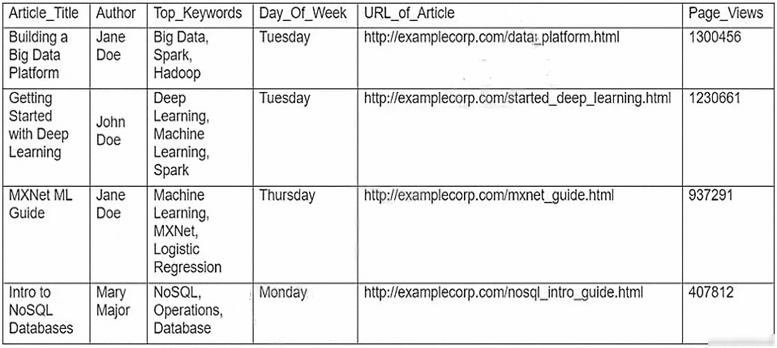

**Dữ kiện hình dạng chữ:** Table columns: Article_Title / Author / Top_Keywords / Day_Of_Week / Url_of_Article / Page_Views. Rows: Building a Big Data Platform / Jane Doe / Big Data, Spark, Hadoop / Tuesday / http://examplecorp.com/data_platform.html / 1300456; Getting Started with Deep Learning / John Doe / Deep Learning, Machine Learning, Spark / Tuesday / http://examplecorp.com/started_deep_learning.html / 1230661; MXNet ML Guide / Jane Doe / Machine Learning, MXNet, Logistic Regression / Thursday / http://examplecorp.com/mxnet_guide.html / 937291; Intro to NoSQL Databases / Mary Major / NoSQL, Operations, Database / Monday / http://examplecorp.com/nosql_intro_guide.html / 407812.

**A.** Binarization

**B.** One-hot encoding

**C.** Tokenization

**D.** Normalization transformation

**Đáp án sau đối chiếu: B.**

One-hot encoding tạo cột nhị phân riêng cho từng ngày trong tuần.

Đáp án in trong PDF: `B` (giữ để đối chiếu nguồn, không dùng làm căn cứ chấm).

Nguồn đối chiếu: [8.3. Preprocessing data — scikit-learn 1.9.1 documentation](https://scikit-learn.org/stable/modules/preprocessing.html).

---

## Câu 033

Trang PDF: [76](../../Machine%20Learning%20-%20Specialty%20Exam.pdf#page=76) · ĐÃ ĐỐI CHIẾU

A gaming company has launched an online game where people can start playing for free, but they need to pay if they choose to use certain features. The company needs to build an automated system to predict whether or not a new user will become a paid user within 1 year. The company has gathered a labeled dataset from 1 million users. The training dataset consists of 1,000 positive samples (from users who ended up paying within 1 year) and 999,000 negative samples (from users who did not use any paid features). Each data sample consists of 200 features including user age, device, location, and play patterns. Using this dataset for training, the Data Science team trained a random forest model that converged with over 99% accuracy on the training set. However, the prediction results on a test dataset were not satisfactory Which of the following approaches should the Data Science team take to mitigate this issue? (Choose two.)

**A.** Add more deep trees to the random forest to enable the model to learn more features.

**B.** Include a copy of the samples in the test dataset in the training dataset.

**C.** Generate more positive samples by duplicating the positive samples and adding a small amount of noise to the duplicated data.

**D.** Change the cost function so that false negatives have a higher impact on the cost value than false positives.

**E.** Change the cost function so that false positives have a higher impact on the cost value than false negatives.

**Đáp án sau đối chiếu: C, D.**

Tăng mẫu lớp thiểu số và tăng chi phí false negative để xử lý mất cân bằng.

Đáp án in trong PDF: `CD` (giữ để đối chiếu nguồn, không dùng làm căn cứ chấm).

Nguồn đối chiếu: [Linear learner hyperparameters - Amazon SageMaker AI](https://docs.aws.amazon.com/sagemaker/latest/dg/ll_hyperparameters.html).

---

## Câu 034

Trang PDF: [78](../../Machine%20Learning%20-%20Specialty%20Exam.pdf#page=78) · ĐÃ ĐỐI CHIẾU

A Data Scientist is developing a machine learning model to predict future patient outcomes based on information collected about each patient and their treatment plans. The model should output a continuous value as its prediction. The data available includes labeled outcomes for a set of 4,000 patients. The study was conducted on a group of individuals over the age of 65 who have a particular disease that is known to worsen with age. Initial models have performed poorly. While reviewing the underlying data, the Data Scientist notices that, out of 4,000 patient observations, there are 450 where the patient age has been input as 0. The other features for these observations appear normal compared to the rest of the sample population How should the Data Scientist correct this issue?

**A.** Drop all records from the dataset where age has been set to 0.

**B.** Replace the age field value for records with a value of 0 with the mean or median value from the dataset

**C.** Drop the age feature from the dataset and train the model using the rest of the features.

**D.** Use k-means clustering to handle missing features

**Đáp án sau đối chiếu: B.**

Coi age=0 là thiếu dữ liệu; thay bằng thống kê của tuổi hợp lệ, không tính các số 0.

Đáp án in trong PDF: `B` (giữ để đối chiếu nguồn, không dùng làm căn cứ chấm).

Nguồn đối chiếu: [8.4. Imputation of missing values — scikit-learn 1.9.1 documentation](https://scikit-learn.org/stable/modules/impute.html).

---

## Câu 035

Trang PDF: [80](../../Machine%20Learning%20-%20Specialty%20Exam.pdf#page=80) · ĐÃ ĐỐI CHIẾU

A Data Science team is designing a dataset repository where it will store a large amount of training data commonly used in its machine learning models. As Data Scientists may create an arbitrary number of new datasets every day, the solution has to scale automatically and be cost-effective. Also, it must be possible to explore the data using SQL. Which storage scheme is MOST adapted to this scenario?

**A.** Store datasets as files in Amazon S3.

**B.** Store datasets as files in an Amazon EBS volume attached to an Amazon EC2 instance.

**C.** Store datasets as tables in a multi-node Amazon Redshift cluster.

**D.** Store datasets as global tables in Amazon DynamoDB.

**Đáp án sau đối chiếu: A.**

S3 mở rộng cho data lake; Athena hoặc Spectrum bổ sung truy vấn SQL.

Đáp án in trong PDF: `A` (giữ để đối chiếu nguồn, không dùng làm căn cứ chấm).

Nguồn đối chiếu: [What is Amazon Athena? - Amazon Athena](https://docs.aws.amazon.com/athena/latest/ug/what-is.html).

---

## Câu 036

Trang PDF: [82](../../Machine%20Learning%20-%20Specialty%20Exam.pdf#page=82) · ĐÃ ĐỐI CHIẾU

A Machine Learning Specialist deployed a model that provides product recommendations on a company's website. Initially, the model was performing very well and resulted in customers buying more products on average. However, within the past few months, the Specialist has noticed that the effect of product recommendations has diminished and customers are starting to return to their original habits of spending less. The Specialist is unsure of what happened, as the model has not changed from its initial deployment over a year ago. Which method should the Specialist try to improve model performance?

**A.** The model needs to be completely re-engineered because it is unable to handle product inventory changes.

**B.** The model's hyperparameters should be periodically updated to prevent drift.

**C.** The model should be periodically retrained from scratch using the original data while adding a regularization term to handle product inventory changes

**D.** The model should be periodically retrained using the original training data plus new data as product inventory changes.

**Đáp án sau đối chiếu: D.**

Huấn luyện lại với dữ liệu mới giúp thích nghi thay đổi phân phối và sản phẩm.

Đáp án in trong PDF: `D` (giữ để đối chiếu nguồn, không dùng làm căn cứ chấm).

Nguồn đối chiếu: [Data and model quality monitoring with Amazon SageMaker Model Monitor - Amazon SageMaker AI](https://docs.aws.amazon.com/sagemaker/latest/dg/model-monitor.html).

---

## Câu 037

Trang PDF: [84](../../Machine%20Learning%20-%20Specialty%20Exam.pdf#page=84) · BỐI CẢNH DỊCH VỤ CŨ

A Machine Learning Specialist working for an online fashion company wants to build a data ingestion solution for the company's Amazon S3-based data lake. The Specialist wants to create a set of ingestion mechanisms that will enable future capabilities comprised of: • Real-time analytics • Interactive analytics of historical data • Clickstream analytics • Product recommendations Which services should the Specialist use?

**A.** AWS Glue as the data catalog; Amazon Kinesis Data Streams and Amazon Kinesis Data Analytics for real-time data insights; Amazon Kinesis Data Firehose for delivery to Amazon ES for clickstream analytics; Amazon EMR to generate personalized product recommendations

**B.** Amazon Athena as the data catalog: Amazon Kinesis Data Streams and Amazon Kinesis Data Analytics for near-real-time data insights; Amazon Kinesis Data Firehose for clickstream analytics; AWS Glue to generate personalized product recommendations

**C.** AWS Glue as the data catalog; Amazon Kinesis Data Streams and Amazon Kinesis Data Analytics for historical data insights; Amazon Kinesis Data Firehose for delivery to Amazon ES for clickstream analytics; Amazon EMR to generate personalized product recommendations

**D.** Amazon Athena as the data catalog; Amazon Kinesis Data Streams and Amazon Kinesis Data Analytics for historical data insights; Amazon DynamoDB streams for clickstream analytics; AWS Glue to generate personalized product recommendations

**Đáp án sau đối chiếu: A.**

Glue làm catalog, Kinesis xử lý luồng, Firehose chuyển dữ liệu, EMR hỗ trợ recommendation; có tên dịch vụ cũ.

Đáp án in trong PDF: `A` (giữ để đối chiếu nguồn, không dùng làm căn cứ chấm).

Nguồn đối chiếu: [What Is Amazon Kinesis Data Analytics for SQL Applications? - Amazon Kinesis Data Analytics for SQL Applications Developer Guide](https://docs.aws.amazon.com/kinesisanalytics/latest/dev/what-is.html); [Accelerate and improve recommender system training and predictions using Amazon SageMaker Feature Store | Artificial Intelligence](https://aws.amazon.com/blogs/machine-learning/accelerate-and-improve-recommender-system-training-and-predictions-using-amazon-sagemaker-feature-store/); [What is Amazon Athena? - Amazon Athena](https://docs.aws.amazon.com/athena/latest/ug/what-is.html).

---

## Câu 038

Trang PDF: [86](../../Machine%20Learning%20-%20Specialty%20Exam.pdf#page=86) · ĐÃ ĐỐI CHIẾU

A company is observing low accuracy while training on the default built-in image classification algorithm in Amazon SageMaker. The Data Science team wants to use an Inception neural network architecture instead of a ResNet architecture. Which of the following will accomplish this? (Choose two.)

**A.** Customize the built-in image classification algorithm to use Inception and use this for model training.

**B.** Create a support case with the SageMaker team to change the default image classification algorithm to Inception.

**C.** Bundle a Docker container with TensorFlow Estimator loaded with an Inception network and use this for model training.

**D.** Use custom code in Amazon SageMaker with TensorFlow Estimator to load the model with an Inception network, and use this for model training.

**E.** Download and apt-get install the inception network code into an Amazon EC2 instance and use this instance as a Jupyter notebook in Amazon SageMaker.

**Đáp án sau đối chiếu: C, D.**

Inception có thể dùng qua TensorFlow script hoặc container tùy chỉnh.

Đáp án in trong PDF: `CD` (giữ để đối chiếu nguồn, không dùng làm căn cứ chấm).

Nguồn đối chiếu: [How Amazon SageMaker AI Runs Your Training Image - Amazon SageMaker AI](https://docs.aws.amazon.com/sagemaker/latest/dg/your-algorithms-training-algo-dockerfile.html); [Image Classification - TensorFlow - Amazon SageMaker AI](https://docs.aws.amazon.com/sagemaker/latest/dg/image-classification-tensorflow.html).

---

## Câu 039

Trang PDF: [88](../../Machine%20Learning%20-%20Specialty%20Exam.pdf#page=88) · ĐÃ ĐỐI CHIẾU

A Machine Learning Specialist built an image classification deep learning model. However, the Specialist ran into an overfitting problem in which the training and testing accuracies were 99% and 75%, respectively. How should the Specialist address this issue and what is the reason behind it?

**A.** The learning rate should be increased because the optimization process was trapped at a local minimum.

**B.** The dropout rate at the flatten layer should be increased because the model is not generalized enough.

**C.** The dimensionality of dense layer next to the flatten layer should be increased because the model is not complex enough.

**D.** The epoch number should be increased because the optimization process was terminated before it reached the global minimum.

**Đáp án sau đối chiếu: B.**

Dropout tăng regularization khi training tốt nhưng test kém.

Đáp án in trong PDF: `D` (giữ để đối chiếu nguồn, không dùng làm căn cứ chấm).

Nguồn đối chiếu: [Dropout layer](https://keras.io/api/layers/regularization_layers/dropout/).

---

## Câu 040

Trang PDF: [90](../../Machine%20Learning%20-%20Specialty%20Exam.pdf#page=90) · ĐÃ ĐỐI CHIẾU

A Machine Learning team uses Amazon SageMaker to train an Apache MXNet handwritten digit classifier model using a research dataset. The team wants to receive a notification when the model is overfitting. Auditors want to view the Amazon SageMaker log activity report to ensure there are no unauthorized API calls. What should the Machine Learning team do to address the requirements with the least amount of code and fewest steps?

**A.** Implement an AWS Lambda function to log Amazon SageMaker API calls to Amazon S3. Add code to push a custom metric to Amazon CloudWatch. Create an alarm in CloudWatch with Amazon SNS to receive a notification when the model is overfitting.

**B.** Use AWS CloudTrail to log Amazon SageMaker API calls to Amazon S3. Add code to push a custom metric to Amazon CloudWatch. Create an alarm in CloudWatch with Amazon SNS to receive a notification when the model is overfitting.

**C.** Implement an AWS Lambda function to log Amazon SageMaker API calls to AWS CloudTrail. Add code to push a custom metric to Amazon CloudWatch. Create an alarm in CloudWatch with Amazon SNS to receive a notification when the model is overfitting.

**D.** Use AWS CloudTrail to log Amazon SageMaker API calls to Amazon S3. Set up Amazon SNS to receive a notification when the model is overfitting

**Đáp án sau đối chiếu: B.**

CloudTrail ghi API; custom metric, CloudWatch alarm và SNS đáp ứng yêu cầu cảnh báo.

Đáp án in trong PDF: `B` (giữ để đối chiếu nguồn, không dùng làm căn cứ chấm).

Nguồn đối chiếu: [Logging Amazon SageMaker AI API calls using AWS CloudTrail - Amazon SageMaker AI](https://docs.aws.amazon.com/sagemaker/latest/dg/logging-using-cloudtrail.html); [Amazon SageMaker AI metrics in Amazon CloudWatch - Amazon SageMaker AI](https://docs.aws.amazon.com/sagemaker/latest/dg/monitoring-cloudwatch.html).

---

## Câu 041

Trang PDF: [93](../../Machine%20Learning%20-%20Specialty%20Exam.pdf#page=93) · ĐÃ ĐỐI CHIẾU

A Machine Learning Specialist is building a prediction model for a large number of features using linear models, such as linear regression and logistic regression. During exploratory data analysis, the Specialist observes that many features are highly correlated with each other. This may make the model unstable. What should be done to reduce the impact of having such a large number of features?

**A.** Perform one-hot encoding on highly correlated features.

**B.** Use matrix multiplication on highly correlated features.

**C.** Create a new feature space using principal component analysis (PCA)

**D.** Apply the Pearson correlation coefficient.

**Đáp án sau đối chiếu: C.**

PCA tạo các thành phần không tương quan và giảm số chiều.

Đáp án in trong PDF: `C` (giữ để đối chiếu nguồn, không dùng làm căn cứ chấm).

Nguồn đối chiếu: [Principal Component Analysis (PCA) Algorithm - Amazon SageMaker AI](https://docs.aws.amazon.com/sagemaker/latest/dg/pca.html).

---

## Câu 042

Trang PDF: [95](../../Machine%20Learning%20-%20Specialty%20Exam.pdf#page=95) · CẦN XÁC MINH / SỬA ĐỀ

A Machine Learning Specialist is implementing a full Bayesian network on a dataset that describes public transit in New York City. One of the random variables is discrete, and represents the number of minutes New Yorkers wait for a bus given that the buses cycle every 10 minutes, with a mean of 3 minutes. Which prior probability distribution should the ML Specialist use for this variable?

**A.** Poisson distribution

**B.** Uniform distribution

**C.** Normal distribution

**D.** Binomial distribution

**Chưa chốt đáp án.**

Đề mô tả thời gian chờ có giới hạn 10 phút nhưng yêu cầu Poisson cho số đếm; không đủ giả định xác định prior.

Đáp án in trong PDF: `D` (giữ để đối chiếu nguồn, không dùng làm căn cứ chấm).

Nguồn đối chiếu: [scipy.stats.poisson — SciPy v1.18.0 Manual](https://docs.scipy.org/doc/scipy/reference/generated/scipy.stats.poisson.html).

---

## Câu 043

Trang PDF: [97](../../Machine%20Learning%20-%20Specialty%20Exam.pdf#page=97) · ĐÃ ĐỐI CHIẾU

A Data Science team within a large company uses Amazon SageMaker notebooks to access data stored in Amazon S3 buckets. The IT Security team is concerned that internet-enabled notebook instances create a security vulnerability where malicious code running on the instances could compromise data privacy. The company mandates that all instances stay within a secured VPC with no internet access, and data communication traffic must stay within the AWS network. How should the Data Science team configure the notebook instance placement to meet these requirements?

**A.** Associate the Amazon SageMaker notebook with a private subnet in a VPC. Place the Amazon SageMaker endpoint and S3 buckets within the same VPC.

**B.** Associate the Amazon SageMaker notebook with a private subnet in a VPC. Use IAM policies to grant access to Amazon S3 and Amazon SageMaker.

**C.** Associate the Amazon SageMaker notebook with a private subnet in a VPC. Ensure the VPC has S3 VPC endpoints and Amazon SageMaker VPC endpoints attached to it.

**D.** Associate the Amazon SageMaker notebook with a private subnet in a VPC. Ensure the VPC has a NAT gateway and an associated security group allowing only outbound connections to Amazon S3 and Amazon SageMaker.

**Đáp án sau đối chiếu: C.**

Dùng endpoint riêng cho S3 và SageMaker, đồng thời tắt direct internet access.

Đáp án in trong PDF: `C` (giữ để đối chiếu nguồn, không dùng làm căn cứ chấm).

Nguồn đối chiếu: [Connect a Notebook Instance in a VPC to External Resources - Amazon SageMaker AI](https://docs.aws.amazon.com/sagemaker/latest/dg/appendix-notebook-and-internet-access.html).

---

## Câu 044

Trang PDF: [99](../../Machine%20Learning%20-%20Specialty%20Exam.pdf#page=99) · ĐÃ ĐỐI CHIẾU

A Machine Learning Specialist has created a deep learning neural network model that performs well on the training data but performs poorly on the test data. Which of the following methods should the Specialist consider using to correct this? (Choose three.)

**A.** Decrease regularization.

**B.** Increase regularization.

**C.** Increase dropout.

**D.** Decrease dropout.

**E.** Increase feature combinations.

**F.** Decrease feature combinations.

**Đáp án sau đối chiếu: B, C, F.**

Tăng regularization/dropout và giảm độ phức tạp đặc trưng giúp hạn chế overfitting.

Đáp án in trong PDF: `BCF` (giữ để đối chiếu nguồn, không dùng làm căn cứ chấm).

Nguồn đối chiếu: [Model Fit: Underfitting vs. Overfitting - Amazon Machine Learning](https://docs.aws.amazon.com/machine-learning/latest/dg/model-fit-underfitting-vs-overfitting.html); [Dropout layer](https://keras.io/api/layers/regularization_layers/dropout/).

---

## Câu 045

Trang PDF: [102](../../Machine%20Learning%20-%20Specialty%20Exam.pdf#page=102) · ĐÃ ĐỐI CHIẾU

A Data Scientist needs to create a serverless ingestion and analytics solution for high-velocity, real-time streaming data. The ingestion process must buffer and convert incoming records from JSON to a query-optimized, columnar format without data loss. The output datastore must be highly available, and Analysts must be able to run SQL queries against the data and connect to existing business intelligence dashboards. Which solution should the Data Scientist build to satisfy the requirements?

**A.** Create a schema in the AWS Glue Data Catalog of the incoming data format. Use an Amazon Kinesis Data Firehose delivery stream to stream the data and transform the data to Apache Parquet or ORC format using the AWS Glue Data Catalog before delivering to Amazon S3. Have the Analysts query the data directly from Amazon S3 using Amazon Athena, and connect to BI tools using the Athena Java Database Connectivity (JDBC) connector.

**B.** Write each JSON record to a staging location in Amazon S3. Use the S3 Put event to trigger an AWS Lambda function that transforms the data into Apache Parquet or ORC format and writes the data to a processed data location in Amazon S3. Have the Analysts query the data directly from Amazon S3 using Amazon Athena, and connect to BI tools using the Athena Java Database Connectivity (JDBC) connector.

**C.** Write each JSON record to a staging location in Amazon S3. Use the S3 Put event to trigger an AWS Lambda function that transforms the data into Apache Parquet or ORC format and inserts it into an Amazon RDS PostgreSQL database. Have the Analysts query and run dashboards from the RDS database.

**D.** Use Amazon Kinesis Data Analytics to ingest the streaming data and perform real-time SQL queries to convert the records to Apache Parquet before delivering to Amazon S3. Have the Analysts query the data directly from Amazon S3 using Amazon Athena and connect to BI tools using the Athena Java Database Connectivity (JDBC) connector.

**Đáp án sau đối chiếu: A.**

Firehose đổi JSON sang Parquet/ORC và ghi S3; Athena cung cấp SQL/JDBC.

Đáp án in trong PDF: `A` (giữ để đối chiếu nguồn, không dùng làm căn cứ chấm).

Nguồn đối chiếu: [Convert input data format in Amazon Data Firehose - Amazon Data Firehose](https://docs.aws.amazon.com/firehose/latest/dev/record-format-conversion.html); [What is Amazon Athena? - Amazon Athena](https://docs.aws.amazon.com/athena/latest/ug/what-is.html).

---

## Câu 046

Trang PDF: [105](../../Machine%20Learning%20-%20Specialty%20Exam.pdf#page=105) · ĐÃ ĐỐI CHIẾU

An online reseller has a large, multi-column dataset with one column missing 30% of its data. A Machine Learning Specialist believes that certain columns in the dataset could be used to reconstruct the missing data. Which reconstruction approach should the Specialist use to preserve the integrity of the dataset?

**A.** Listwise deletion

**B.** Last observation carried forward

**C.** Multiple imputation

**D.** Mean substitution

**Đáp án sau đối chiếu: C.**

Multiple imputation dùng quan hệ giữa các biến để tái tạo giá trị thiếu.

Đáp án in trong PDF: `C` (giữ để đối chiếu nguồn, không dùng làm căn cứ chấm).

Nguồn đối chiếu: [8.4. Imputation of missing values — scikit-learn 1.9.1 documentation](https://scikit-learn.org/stable/modules/impute.html).

---

## Câu 047

Trang PDF: [107](../../Machine%20Learning%20-%20Specialty%20Exam.pdf#page=107) · ĐÃ ĐỐI CHIẾU

A company is setting up an Amazon SageMaker environment. The corporate data security policy does not allow communication over the internet. How can the company enable the Amazon SageMaker service without enabling direct internet access to Amazon SageMaker notebook instances?

**A.** Create a NAT gateway within the corporate VPC.

**B.** Route Amazon SageMaker traffic through an on-premises network.

**C.** Create Amazon SageMaker VPC interface endpoints within the corporate VPC.

**D.** Create VPC peering with Amazon VPC hosting Amazon SageMaker.

**Đáp án sau đối chiếu: C.**

Interface VPC endpoints cung cấp truy cập SageMaker không qua internet.

Đáp án in trong PDF: `A` (giữ để đối chiếu nguồn, không dùng làm căn cứ chấm).

Nguồn đối chiếu: [Connect a Notebook Instance in a VPC to External Resources - Amazon SageMaker AI](https://docs.aws.amazon.com/sagemaker/latest/dg/appendix-notebook-and-internet-access.html).

---

## Câu 048

Trang PDF: [110](../../Machine%20Learning%20-%20Specialty%20Exam.pdf#page=110) · ĐÃ ĐỐI CHIẾU

A Machine Learning Specialist is training a model to identify the make and model of vehicles in images. The Specialist wants to use transfer learning and an existing model trained on images of general objects. The Specialist collated a large custom dataset of pictures containing different vehicle makes and models. What should the Specialist do to initialize the model to re-train it with the custom data?

**A.** Initialize the model with random weights in all layers including the last fully connected layer.

**B.** Initialize the model with pre-trained weights in all layers and replace the last fully connected layer.

**C.** Initialize the model with random weights in all layers and replace the last fully connected layer.

**D.** Initialize the model with pre-trained weights in all layers including the last fully connected layer.

**Đáp án sau đối chiếu: B.**

Tái sử dụng trọng số pretrained, thay lớp đầu ra theo các lớp mới.

Đáp án in trong PDF: `B` (giữ để đối chiếu nguồn, không dùng làm căn cứ chấm).

Nguồn đối chiếu: [Image Classification - TensorFlow - Amazon SageMaker AI](https://docs.aws.amazon.com/sagemaker/latest/dg/image-classification-tensorflow.html).

---

## Câu 049

Trang PDF: [112](../../Machine%20Learning%20-%20Specialty%20Exam.pdf#page=112) · ĐÃ ĐỐI CHIẾU

An office security agency conducted a successful pilot using 100 cameras installed at key locations within the main office. Images from the cameras were uploaded to Amazon S3 and tagged using Amazon Rekognition, and the results were stored in Amazon ES. The agency is now looking to expand the pilot into a full production system using thousands of video cameras in its office locations globally. The goal is to identify activities performed by non-employees in real time Which solution should the agency consider?

**A.** Use a proxy server at each local office and for each camera, and stream the RTSP feed to a unique Amazon Kinesis Video Streams video stream. On each stream, use Amazon Rekognition Video and create a stream processor to detect faces from a collection of known employees, and alert when non-employees are detected.

**B.** Use a proxy server at each local office and for each camera, and stream the RTSP feed to a unique Amazon Kinesis Video Streams video stream. On each stream, use Amazon Rekognition Image to detect faces from a collection of known employees and alert when non-employees are detected.

**C.** Install AWS DeepLens cameras and use the DeepLens_Kinesis_Video module to stream video to Amazon Kinesis Video Streams for each camera. On each stream, use Amazon Rekognition Video and create a stream processor to detect faces from a collection on each stream, and alert when non-employees are detected.

**D.** Install AWS DeepLens cameras and use the DeepLens_Kinesis_Video module to stream video to Amazon Kinesis Video Streams for each camera. On each stream, run an AWS Lambda function to capture image fragments and then call Amazon Rekognition Image to detect faces from a collection of known employees, and alert when non-employees are detected.

**Đáp án sau đối chiếu: A.**

Kinesis Video Streams và Rekognition stream processor hỗ trợ tìm khuôn mặt trong collection.

Đáp án in trong PDF: `D` (giữ để đối chiếu nguồn, không dùng làm căn cứ chấm).

Nguồn đối chiếu: [Working with streaming video events - Amazon Rekognition](https://docs.aws.amazon.com/rekognition/latest/dg/streaming-video.html).

---

## Câu 050

Trang PDF: [115](../../Machine%20Learning%20-%20Specialty%20Exam.pdf#page=115) · ĐÃ ĐỐI CHIẾU

A Marketing Manager at a pet insurance company plans to launch a targeted marketing campaign on social media to acquire new customers. Currently, the company has the following data in Amazon Aurora: • Profiles for all past and existing customers • Profiles for all past and existing insured pets • Policy-level information • Premiums received • Claims paid What steps should be taken to implement a machine learning model to identify potential new customers on social media?

**A.** Use regression on customer profile data to understand key characteristics of consumer segments. Find similar profiles on social media

**B.** Use clustering on customer profile data to understand key characteristics of consumer segments. Find similar profiles on social media

**C.** Use a recommendation engine on customer profile data to understand key characteristics of consumer segments. Find similar profiles on social media.

**D.** Use a decision tree classifier engine on customer profile data to understand key characteristics of consumer segments. Find similar profiles on social media.

**Đáp án sau đối chiếu: B.**

Clustering tìm nhóm khách hàng tương tự khi chưa có nhãn phân khúc.

Đáp án in trong PDF: `C` (giữ để đối chiếu nguồn, không dùng làm căn cứ chấm).

Nguồn đối chiếu: [K-Means Algorithm - Amazon SageMaker AI](https://docs.aws.amazon.com/sagemaker/latest/dg/k-means.html).

---

## Câu 051

Trang PDF: [118](../../Machine%20Learning%20-%20Specialty%20Exam.pdf#page=118) · ĐÃ ĐỐI CHIẾU

A manufacturing company has a large set of labeled historical sales data. The manufacturer would like to predict how many units of a particular part should be produced each quarter. Which machine learning approach should be used to solve this problem?

**A.** Logistic regression

**B.** Random Cut Forest (RCF)

**C.** Principal component analysis (PCA)

**D.** Linear regression

**Đáp án sau đối chiếu: D.**

Dự báo số lượng là regression, không phải classification hoặc phát hiện bất thường.

Đáp án in trong PDF: `B` (giữ để đối chiếu nguồn, không dùng làm căn cứ chấm).

Nguồn đối chiếu: [Linear Learner Algorithm - Amazon SageMaker AI](https://docs.aws.amazon.com/sagemaker/latest/dg/linear-learner.html).

---

## Câu 052

Trang PDF: [120](../../Machine%20Learning%20-%20Specialty%20Exam.pdf#page=120) · ĐÃ ĐỐI CHIẾU

A financial services company is building a robust serverless data lake on Amazon S3. The data lake should be flexible and meet the following requirements: • Support querying old and new data on Amazon S3 through Amazon Athena and Amazon Redshift Spectrum. • Support event-driven ETL pipelines • Provide a quick and easy way to understand metadata Which approach meets these requirements?

**A.** Use an AWS Glue crawler to crawl S3 data, an AWS Lambda function to trigger an AWS Glue ETL job, and an AWS Glue Data catalog to search and discover metadata.

**B.** Use an AWS Glue crawler to crawl S3 data, an AWS Lambda function to trigger an AWS Batch job, and an external Apache Hive metastore to search and discover metadata.

**C.** Use an AWS Glue crawler to crawl S3 data, an Amazon CloudWatch alarm to trigger an AWS Batch job, and an AWS Glue Data Catalog to search and discover metadata.

**D.** Use an AWS Glue crawler to crawl S3 data, an Amazon CloudWatch alarm to trigger an AWS Glue ETL job, and an external Apache Hive metastore to search and discover metadata.

**Đáp án sau đối chiếu: A.**

Glue crawler/catalog quản lý metadata và ETL; Lambda kích hoạt theo sự kiện.

Đáp án in trong PDF: `A` (giữ để đối chiếu nguồn, không dùng làm căn cứ chấm).

Nguồn đối chiếu: [Data discovery and cataloging in AWS Glue - AWS Glue](https://docs.aws.amazon.com/glue/latest/dg/catalog-and-crawler.html).

---

## Câu 053

Trang PDF: [122](../../Machine%20Learning%20-%20Specialty%20Exam.pdf#page=122) · ĐÃ ĐỐI CHIẾU

A company's Machine Learning Specialist needs to improve the training speed of a time-series forecasting model using TensorFlow. The training is currently implemented on a single-GPU machine and takes approximately 23 hours to complete. The training needs to be run daily. The model accuracy is acceptable, but the company anticipates a continuous increase in the size of the training data and a need to update the model on an hourly, rather than a daily, basis. The company also wants to minimize coding effort and infrastructure changes. What should the Machine Learning Specialist do to the training solution to allow it to scale for future demand?

**A.** Do not change the TensorFlow code. Change the machine to one with a more powerful GPU to speed up the training.

**B.** Change the TensorFlow code to implement a Horovod distributed framework supported by Amazon SageMaker. Parallelize the training to as many machines as needed to achieve the business goals.

**C.** Switch to using a built-in AWS SageMaker DeepAR model. Parallelize the training to as many machines as needed to achieve the business goals.

**D.** Move the training to Amazon EMR and distribute the workload to as many machines as needed to achieve the business goals.

**Đáp án sau đối chiếu: B.**

Horovod phân tán TensorFlow training qua nhiều máy mà vẫn giữ mô hình hiện có.

Đáp án in trong PDF: `B` (giữ để đối chiếu nguồn, không dùng làm căn cứ chấm).

Nguồn đối chiếu: [Launching TensorFlow distributed training easily with Horovod or Parameter Servers in Amazon SageMaker | Artificial Intelligence](https://aws.amazon.com/blogs/machine-learning/launching-tensorflow-distributed-training-easily-with-horovod-or-parameter-servers-in-amazon-sagemaker/).

---

## Câu 054

Trang PDF: [125](../../Machine%20Learning%20-%20Specialty%20Exam.pdf#page=125) · ĐÃ ĐỐI CHIẾU

Which of the following metrics should a Machine Learning Specialist generally use to compare/evaluate machine learning classification models against each other?

**A.** Recall

**B.** Misclassification rate

**C.** Mean absolute percentage error (MAPE)

**D.** Area Under the ROC Curve (AUC)

**Đáp án sau đối chiếu: D.**

ROC-AUC so sánh khả năng xếp hạng của mô hình qua các ngưỡng.

Đáp án in trong PDF: `D` (giữ để đối chiếu nguồn, không dùng làm căn cứ chấm).

Nguồn đối chiếu: [Binary Model Insights - Amazon Machine Learning](https://docs.aws.amazon.com/machine-learning/latest/dg/binary-model-insights.html).

---

## Câu 055

Trang PDF: [127](../../Machine%20Learning%20-%20Specialty%20Exam.pdf#page=127) · ĐÃ ĐỐI CHIẾU

A company is running a machine learning prediction service that generates 100 TB of predictions every day. A Machine Learning Specialist must generate a visualization of the daily precision-recall curve from the predictions, and forward a read-only version to the Business team. Which solution requires the LEAST coding effort?

**A.** Run a daily Amazon EMR workflow to generate precision-recall data, and save the results in Amazon S3. Give the Business team read-only access to S3.

**B.** Generate daily precision-recall data in Amazon QuickSight, and publish the results in a dashboard shared with the Business team.

**C.** Run a daily Amazon EMR workflow to generate precision-recall data, and save the results in Amazon S3. Visualize the arrays in Amazon QuickSight, and publish them in a dashboard shared with the Business team.

**D.** Generate daily precision-recall data in Amazon ES, and publish the results in a dashboard shared with the Business team.

**Đáp án sau đối chiếu: C.**

EMR tổng hợp lượng dữ liệu lớn; QuickSight hiển thị và chia sẻ dashboard.

Đáp án in trong PDF: `C` (giữ để đối chiếu nguồn, không dùng làm căn cứ chấm).

Nguồn đối chiếu: [Gaining insights with machine learning (ML) in Amazon Quick Sight - Amazon Quick](https://docs.aws.amazon.com/quick/latest/userguide/making-data-driven-decisions-with-ml-in-quicksight.html).

---

## Câu 056

Trang PDF: [129](../../Machine%20Learning%20-%20Specialty%20Exam.pdf#page=129) · ĐÃ ĐỐI CHIẾU

A Machine Learning Specialist is preparing data for training on Amazon SageMaker. The Specialist is using one of the SageMaker built-in algorithms for the training. The dataset is stored in .CSV format and is transformed into a numpy.array, which appears to be negatively affecting the speed of the training. What should the Specialist do to optimize the data for training on SageMaker?

**A.** Use the SageMaker batch transform feature to transform the training data into a DataFrame.

**B.** Use AWS Glue to compress the data into the Apache Parquet format.

**C.** Transform the dataset into the RecordIO protobuf format.

**D.** Use the SageMaker hyperparameter optimization feature to automatically optimize the data.

**Đáp án sau đối chiếu: C.**

RecordIO protobuf tối ưu serialization cho các built-in algorithm hỗ trợ định dạng này.

Đáp án in trong PDF: `C` (giữ để đối chiếu nguồn, không dùng làm căn cứ chấm).

Nguồn đối chiếu: [Common Data Formats for Training - Amazon SageMaker AI](https://docs.aws.amazon.com/sagemaker/latest/dg/cdf-training.html).

---

## Câu 057

Trang PDF: [130](../../Machine%20Learning%20-%20Specialty%20Exam.pdf#page=130) · ĐÃ ĐỐI CHIẾU

A Machine Learning Specialist is required to build a supervised image-recognition model to identify a cat. The ML Specialist performs some tests and records the following results for a neural network-based image classifier: Total number of images available = 1,000 Test set images = 100 (constant test set) The ML Specialist notices that, in over 75% of the misclassified images, the cats were held upside down by their owners. Which techniques can be used by the ML Specialist to improve this specific test error?

**A.** Increase the training data by adding variation in rotation for training images.

**B.** Increase the number of epochs for model training

**C.** Increase the number of layers for the neural network.

**D.** Increase the dropout rate for the second-to-last layer.

**Đáp án sau đối chiếu: A.**

Bổ sung ảnh xoay giúp mô hình học các tư thế đang thiếu.

Đáp án in trong PDF: `B` (giữ để đối chiếu nguồn, không dùng làm căn cứ chấm).

Nguồn đối chiếu: [Data augmentation  |  TensorFlow Core](https://www.tensorflow.org/tutorials/images/data_augmentation).

---

## Câu 058

Trang PDF: [133](../../Machine%20Learning%20-%20Specialty%20Exam.pdf#page=133) · ĐÃ ĐỐI CHIẾU

A Machine Learning Specialist needs to be able to ingest streaming data and store it in Apache Parquet files for exploration and analysis. Which of the following services would both ingest and store this data in the correct format?

**A.** AWS DMS

**B.** Amazon Kinesis Data Streams

**C.** Amazon Kinesis Data Firehose

**D.** Amazon Kinesis Data Analytics

**Đáp án sau đối chiếu: C.**

Firehose hỗ trợ ingest và chuyển đổi JSON sang Parquet trước khi lưu S3.

Đáp án in trong PDF: `C` (giữ để đối chiếu nguồn, không dùng làm căn cứ chấm).

Nguồn đối chiếu: [Convert input data format in Amazon Data Firehose - Amazon Data Firehose](https://docs.aws.amazon.com/firehose/latest/dev/record-format-conversion.html).

---

## Câu 059

Trang PDF: [135](../../Machine%20Learning%20-%20Specialty%20Exam.pdf#page=135) · ĐÃ ĐỐI CHIẾU

A data scientist has explored and sanitized a dataset in preparation for the modeling phase of a supervised learning task. The statistical dispersion can vary widely between features, sometimes by several orders of magnitude. Before moving on to the modeling phase, the data scientist wants to ensure that the prediction performance on the production data is as accurate as possible. Which sequence of steps should the data scientist take to meet these requirements?

**A.** Apply random sampling to the dataset. Then split the dataset into training, validation, and test sets.

**B.** Split the dataset into training, validation, and test sets. Then rescale the training set and apply the same scaling to the validation and test sets.

**C.** Rescale the dataset. Then split the dataset into training, validation, and test sets.

**D.** Split the dataset into training, validation, and test sets. Then rescale the training set, the validation set, and the test set independently.

**Đáp án sau đối chiếu: B.**

Fit scaler trên training set rồi tái sử dụng cho validation/test để tránh rò rỉ dữ liệu.

Đáp án in trong PDF: `D` (giữ để đối chiếu nguồn, không dùng làm căn cứ chấm).

Nguồn đối chiếu: [12. Common pitfalls and recommended practices — scikit-learn 1.9.1 documentation](https://scikit-learn.org/stable/common_pitfalls.html).

---

## Câu 060

Trang PDF: [138](../../Machine%20Learning%20-%20Specialty%20Exam.pdf#page=138) · CẦN XÁC MINH / SỬA ĐỀ

A Machine Learning Specialist is assigned a TensorFlow project using Amazon SageMaker for training, and needs to continue working for an extended period with no Wi-Fi access. Which approach should the Specialist use to continue working?

**A.** Install Python 3 and boto3 on their laptop and continue the code development using that environment.

**B.** Download the TensorFlow Docker container used in Amazon SageMaker from GitHub to their local environment, and use the Amazon SageMaker Python SDK to test the code.

**C.** Download TensorFlow from tensorflow.org to emulate the TensorFlow kernel in the SageMaker environment.

**D.** Download the SageMaker notebook to their local environment, then install Jupyter Notebooks on their laptop and continue the development in a local notebook.

**Chưa chốt đáp án.** Phương án tham khảo có điều kiện: **B**.

Ý định là SageMaker Local Mode với container đã tải sẵn; image chính thức lấy từ registry, không trực tiếp từ GitHub.

Đáp án in trong PDF: `B` (giữ để đối chiếu nguồn, không dùng làm căn cứ chấm).

Nguồn đối chiếu: [Local mode support in Amazon SageMaker Studio - Amazon SageMaker AI](https://docs.aws.amazon.com/sagemaker/latest/dg/studio-updated-local.html).

---

## Câu 061

Trang PDF: [140](../../Machine%20Learning%20-%20Specialty%20Exam.pdf#page=140) · BỐI CẢNH DỊCH VỤ CŨ

A Machine Learning Specialist is working with a large cybersecurity company that manages security events in real time for companies around the world. The cybersecurity company wants to design a solution that will allow it to use machine learning to score malicious events as anomalies on the data as it is being ingested. The company also wants be able to save the results in its data lake for later processing and analysis. What is the MOST efficient way to accomplish these tasks?

**A.** Ingest the data using Amazon Kinesis Data Firehose, and use Amazon Kinesis Data Analytics Random Cut Forest (RCF) for anomaly detection. Then use Kinesis Data Firehose to stream the results to Amazon S3.

**B.** Ingest the data into Apache Spark Streaming using Amazon EMR, and use Spark MLlib with k-means to perform anomaly detection. Then store the results in an Apache Hadoop Distributed File System (HDFS) using Amazon EMR with a replication factor of three as the data lake.

**C.** Ingest the data and store it in Amazon S3. Use AWS Batch along with the AWS Deep Learning AMIs to train a k-means model using TensorFlow on the data in Amazon S3.

**D.** Ingest the data and store it in Amazon S3. Have an AWS Glue job that is triggered on demand transform the new data. Then use the built-in Random Cut Forest (RCF) model within Amazon SageMaker to detect anomalies in the data.

**Đáp án sau đối chiếu: A.**

RCF trên Kinesis SQL từng phát hiện bất thường luồng; cần thay kiến trúc do dịch vụ cũ ngừng hoạt động.

Đáp án in trong PDF: `B` (giữ để đối chiếu nguồn, không dùng làm căn cứ chấm).

Nguồn đối chiếu: [RANDOM_CUT_FOREST - Amazon Kinesis Data Analytics SQL Reference](https://docs.aws.amazon.com/kinesisanalytics/latest/sqlref/sqlrf-random-cut-forest.html); [What Is Amazon Kinesis Data Analytics for SQL Applications? - Amazon Kinesis Data Analytics for SQL Applications Developer Guide](https://docs.aws.amazon.com/kinesisanalytics/latest/dev/what-is.html).

---

## Câu 062

Trang PDF: [143](../../Machine%20Learning%20-%20Specialty%20Exam.pdf#page=143) · BỐI CẢNH DỊCH VỤ CŨ

A Data Scientist wants to gain real-time insights into a data stream of GZIP files. Which solution would allow the use of SQL to query the stream with the LEAST latency?

**A.** Amazon Kinesis Data Analytics with an AWS Lambda function to transform the data.

**B.** AWS Glue with a custom ETL script to transform the data.

**C.** An Amazon Kinesis Client Library to transform the data and save it to an Amazon ES cluster.

**D.** Amazon Kinesis Data Firehose to transform the data and put it into an Amazon S3 bucket.

**Đáp án sau đối chiếu: A.**

Lambda giải nén trước khi Kinesis SQL xử lý; đây là dịch vụ SQL cũ.

Đáp án in trong PDF: `A` (giữ để đối chiếu nguồn, không dùng làm căn cứ chấm).

Nguồn đối chiếu: [Preprocessing Data Using a Lambda Function - Amazon Kinesis Data Analytics for SQL Applications Developer Guide](https://docs.aws.amazon.com/kinesisanalytics/latest/dev/lambda-preprocessing.html); [What Is Amazon Kinesis Data Analytics for SQL Applications? - Amazon Kinesis Data Analytics for SQL Applications Developer Guide](https://docs.aws.amazon.com/kinesisanalytics/latest/dev/what-is.html).

---

## Câu 063

Trang PDF: [145](../../Machine%20Learning%20-%20Specialty%20Exam.pdf#page=145) · ĐÃ ĐỐI CHIẾU

A retail company intends to use machine learning to categorize new products. A labeled dataset of current products was provided to the Data Science team. The dataset includes 1,200 products. The labeled dataset has 15 features for each product such as title dimensions, weight, and price. Each product is labeled as belonging to one of six categories such as books, games, electronics, and movies. Which model should be used for categorizing new products using the provided dataset for training?

**A.** AnXGBoost model where the objective parameter is set to multi:softmax

**B.** A deep convolutional neural network (CNN) with a softmax activation function for the last layer

**C.** A regression forest where the number of trees is set equal to the number of product categories

**D.** A DeepAR forecasting model based on a recurrent neural network (RNN)

**Đáp án sau đối chiếu: A.**

XGBoost multi:softmax phân loại nhiều lớp trên dữ liệu dạng bảng.

Đáp án in trong PDF: `B` (giữ để đối chiếu nguồn, không dùng làm căn cứ chấm).

Nguồn đối chiếu: [XGBoost hyperparameters - Amazon SageMaker AI](https://docs.aws.amazon.com/sagemaker/latest/dg/xgboost_hyperparameters.html).

---

## Câu 064

Trang PDF: [147](../../Machine%20Learning%20-%20Specialty%20Exam.pdf#page=147) · ĐÃ ĐỐI CHIẾU

A Data Scientist is working on an application that performs sentiment analysis. The validation accuracy is poor, and the Data Scientist thinks that the cause may be a rich vocabulary and a low average frequency of words in the dataset. Which tool should be used to improve the validation accuracy?

**A.** Amazon Comprehend syntax analysis and entity detection

**B.** Amazon SageMaker BlazingText cbow mode

**C.** Natural Language Toolkit (NLTK) stemming and stop word removal

**D.** Scikit-leam term frequency-inverse document frequency (TF-IDF) vectorizer

**Đáp án sau đối chiếu: C.**

Stemming giảm biến thể từ và độ thưa; TF-IDF đơn thuần chỉ đổi trọng số, không giải quyết kích thước từ vựng.

Đáp án in trong PDF: `D` (giữ để đối chiếu nguồn, không dùng làm căn cứ chấm).

Nguồn đối chiếu: [8.2. Feature extraction — scikit-learn 1.9.1 documentation](https://scikit-learn.org/stable/modules/feature_extraction.html).

---

## Câu 065

Trang PDF: [150](../../Machine%20Learning%20-%20Specialty%20Exam.pdf#page=150) · ĐÃ ĐỐI CHIẾU

Machine Learning Specialist is building a model to predict future employment rates based on a wide range of economic factors. While exploring the data, the Specialist notices that the magnitude of the input features vary greatly. The Specialist does not want variables with a larger magnitude to dominate the model. What should the Specialist do to prepare the data for model training?

**A.** Apply quantile binning to group the data into categorical bins to keep any relationships in the data by replacing the magnitude with distribution.

**B.** Apply the Cartesian product transformation to create new combinations of fields that are independent of the magnitude.

**C.** Apply normalization to ensure each field will have a mean of 0 and a variance of 1 to remove any significant magnitude.

**D.** Apply the orthogonal sparse bigram (OSB) transformation to apply a fixed-size sliding window to generate new features of a similar magnitude.

**Đáp án sau đối chiếu: C.**

Chuẩn hóa z-score đưa đặc trưng về mean 0 và variance 1.

Đáp án in trong PDF: `C` (giữ để đối chiếu nguồn, không dùng làm căn cứ chấm).

Nguồn đối chiếu: [8.3. Preprocessing data — scikit-learn 1.9.1 documentation](https://scikit-learn.org/stable/modules/preprocessing.html).

---

## Câu 066

Trang PDF: [153](../../Machine%20Learning%20-%20Specialty%20Exam.pdf#page=153) · ĐÃ ĐỐI CHIẾU

A Machine Learning Specialist must build out a process to query a dataset on Amazon S3 using Amazon Athena. The dataset contains more than 800,000 records stored as plaintext CSV files. Each record contains 200 columns and is approximately 1.5 MB in size. Most queries will span 5 to 10 columns only. How should the Machine Learning Specialist transform the dataset to minimize query runtime?

**A.** Convert the records to Apache Parquet format.

**B.** Convert the records to JSON format.

**C.** Convert the records to GZIP CSV format.

**D.** Convert the records to XML format.

**Đáp án sau đối chiếu: A.**

Parquet cho phép Athena chỉ đọc những cột cần thiết.

Đáp án in trong PDF: `A` (giữ để đối chiếu nguồn, không dùng làm căn cứ chấm).

Nguồn đối chiếu: [Use columnar storage formats - Amazon Athena](https://docs.aws.amazon.com/athena/latest/ug/columnar-storage.html).

---

## Câu 067

Trang PDF: [154](../../Machine%20Learning%20-%20Specialty%20Exam.pdf#page=154) · ĐÃ ĐỐI CHIẾU

A Machine Learning Specialist is developing a daily ETL workflow containing multiple ETL jobs. The workflow consists of the following processes: * Start the workflow as soon as data is uploaded to Amazon S3. * When all the datasets are available in Amazon S3, start an ETL job to join the uploaded datasets with multiple terabyte-sized datasets already stored in Amazon S3. * Store the results of joining datasets in Amazon S3. * If one of the jobs fails, send a notification to the Administrator. Which configuration will meet these requirements?

**A.** Use AWS Lambda to trigger an AWS Step Functions workflow to wait for dataset uploads to complete in Amazon S3. Use AWS Glue to join the datasets. Use an Amazon CloudWatch alarm to send an SNS notification to the Administrator in the case of a failure.

**B.** Develop the ETL workflow using AWS Lambda to start an Amazon SageMaker notebook instance. Use a lifecycle configuration script to join the datasets and persist the results in Amazon S3. Use an Amazon CloudWatch alarm to send an SNS notification to the Administrator in the case of a failure.

**C.** Develop the ETL workflow using AWS Batch to trigger the start of ETL jobs when data is uploaded to Amazon S3. Use AWS Glue to join the datasets in Amazon S3. Use an Amazon CloudWatch alarm to send an SNS notification to the Administrator in the case of a failure.

**D.** Use AWS Lambda to chain other Lambda functions to read and join the datasets in Amazon S3 as soon as the data is uploaded to Amazon S3. Use an Amazon CloudWatch alarm to send an SNS notification to the Administrator in the case of a failure.

**Đáp án sau đối chiếu: A.**

Step Functions điều phối, Glue xử lý dữ liệu lớn, CloudWatch/SNS thông báo lỗi.

Đáp án in trong PDF: `A` (giữ để đối chiếu nguồn, không dùng làm căn cứ chấm).

Nguồn đối chiếu: [Start an AWS Glue job with Step Functions - AWS Step Functions](https://docs.aws.amazon.com/step-functions/latest/dg/connect-glue.html).

---

## Câu 068

Trang PDF: [156](../../Machine%20Learning%20-%20Specialty%20Exam.pdf#page=156) · ĐÃ ĐỐI CHIẾU

An agency collects census information within a country to determine healthcare and social program needs by province and city. The census form collects responses for approximately 500 questions from each citizen. Which combination of algorithms would provide the appropriate insights? (Choose two.)

**A.** The factorization machines (FM) algorithm

**B.** The Latent Dirichlet Allocation (LDA) algorithm

**C.** The principal component analysis (PCA) algorithm

**D.** The k-means algorithm

**E.** The Random Cut Forest (RCF) algorithm

**Đáp án sau đối chiếu: C, D.**

PCA giảm 500 chiều; k-means tìm các nhóm dân cư tương tự.

Đáp án in trong PDF: `CD` (giữ để đối chiếu nguồn, không dùng làm căn cứ chấm).

Nguồn đối chiếu: [Principal Component Analysis (PCA) Algorithm - Amazon SageMaker AI](https://docs.aws.amazon.com/sagemaker/latest/dg/pca.html); [K-Means Algorithm - Amazon SageMaker AI](https://docs.aws.amazon.com/sagemaker/latest/dg/k-means.html).

---

## Câu 069

Trang PDF: [158](../../Machine%20Learning%20-%20Specialty%20Exam.pdf#page=158) · ĐÃ ĐỐI CHIẾU

A large consumer goods manufacturer has the following products on sale: * 34 different toothpaste variants * 48 different toothbrush variants * 43 different mouthwash variants The entire sales history of all these products is available in Amazon S3. Currently, the company is using custom-built autoregressive integrated moving average (ARIMA) models to forecast demand for these products. The company wants to predict the demand for a new product that will soon be launched. Which solution should a Machine Learning Specialist apply?

**A.** Train a custom ARIMA model to forecast demand for the new product.

**B.** Train an Amazon SageMaker DeepAR algorithm to forecast demand for the new product.

**C.** Train an Amazon SageMaker k-means clustering algorithm to forecast demand for the new product.

**D.** Train a custom XGBoost model to forecast demand for the new product.

**Đáp án sau đối chiếu: B.**

DeepAR học chung các chuỗi liên quan và dự báo cho sản phẩm tương tự.

Đáp án in trong PDF: `B` (giữ để đối chiếu nguồn, không dùng làm căn cứ chấm).

Nguồn đối chiếu: [Use the SageMaker AI DeepAR forecasting algorithm - Amazon SageMaker AI](https://docs.aws.amazon.com/sagemaker/latest/dg/deepar.html).

---

## Câu 070

Trang PDF: [160](../../Machine%20Learning%20-%20Specialty%20Exam.pdf#page=160) · ĐÃ ĐỐI CHIẾU

A Machine Learning Specialist uploads a dataset to an Amazon S3 bucket protected with server-side encryption using AWS KMS. How should the ML Specialist define the Amazon SageMaker notebook instance so it can read the same dataset from Amazon S3?

**A.** Define security group(s) to allow all HTTP inbound/outbound traffic and assign those security group(s) to the Amazon SageMaker notebook instance.

**B.** Configure the Amazon SageMaker notebook instance to have access to the VPC. Grant permission in the KMS key policy to the notebook's KMS role.

**C.** Assign an IAM role to the Amazon SageMaker notebook with S3 read access to the dataset. Grant permission in the KMS key policy to that role.

**D.** Assign the same KMS key used to encrypt data in Amazon S3 to the Amazon SageMaker notebook instance.

**Đáp án sau đối chiếu: C.**

Execution role cần quyền đọc S3 và giải mã bằng KMS key.

Đáp án in trong PDF: `D` (giữ để đối chiếu nguồn, không dùng làm căn cứ chấm).

Nguồn đối chiếu: [Protect Data at Rest Using Encryption - Amazon SageMaker AI](https://docs.aws.amazon.com/sagemaker/latest/dg/encryption-at-rest.html).

---

## Câu 071

Trang PDF: [163](../../Machine%20Learning%20-%20Specialty%20Exam.pdf#page=163) · ĐÃ ĐỐI CHIẾU

A Data Scientist needs to migrate an existing on-premises ETL process to the cloud. The current process runs at regular time intervals and uses PySpark to combine and format multiple large data sources into a single consolidated output for downstream processing. The Data Scientist has been given the following requirements to the cloud solution: • Combine multiple data sources. • Reuse existing PySpark logic. • Run the solution on the existing schedule. • Minimize the number of servers that will need to be managed. Which architecture should the Data Scientist use to build this solution?

**A.** Write the raw data to Amazon S3. Schedule an AWS Lambda function to submit a Spark step to a persistent Amazon EMR cluster based on the existing schedule. Use the existing PySpark logic to run the ETL job on the EMR cluster. Output the results to a "processed" location in Amazon S3 that is accessible for downstream use.

**B.** Write the raw data to Amazon S3. Create an AWS Glue ETL job to perform the ETL processing against the input data. Write the ETL job in PySpark to leverage the existing logic. Create a new AWS Glue trigger to trigger the ETL job based on the existing schedule. Configure the output target of the ETL job to write to a "processed" location in Amazon S3 that is accessible for downstream use.

**C.** Write the raw data to Amazon S3. Schedule an AWS Lambda function to run on the existing schedule and process the input data from Amazon S3. Write the Lambda logic in Python and implement the existing PySpark logic to perform the ETL process. Have the Lambda function output the results to a "processed" location in Amazon S3 that is accessible for downstream use.

**D.** Use Amazon Kinesis Data Analytics to stream the input data and perform real-time SQL queries against the stream to carry out the required transformations within the stream. Deliver the output results to a "processed" location in Amazon S3 that is accessible for downstream use.

**Đáp án sau đối chiếu: B.**

Glue chạy PySpark ETL theo lịch mà không quản lý cluster.

Đáp án in trong PDF: `D` (giữ để đối chiếu nguồn, không dùng làm căn cứ chấm).

Nguồn đối chiếu: [Program AWS Glue ETL scripts in PySpark - AWS Glue](https://docs.aws.amazon.com/glue/latest/dg/aws-glue-programming-python.html).

---

## Câu 072

Trang PDF: [165](../../Machine%20Learning%20-%20Specialty%20Exam.pdf#page=165) · ĐÃ ĐỐI CHIẾU

A Data Scientist is building a model to predict customer churn using a dataset of 100 continuous numerical features. The Marketing team has not provided any insight about which features are relevant for churn prediction. The Marketing team wants to interpret the model and see the direct impact of relevant features on the model outcome. While training a logistic regression model, the Data Scientist observes that there is a wide gap between the training and validation set accuracy. Which methods can the Data Scientist use to improve the model performance and satisfy the Marketing team's needs? (Choose two.)

**A.** Add L1 regularization to the classifier

**B.** Add features to the dataset

**C.** Perform recursive feature elimination

**D.** Perform t-distributed stochastic neighbor embedding (t-SNE)

**E.** Perform linear discriminant analysis

**Đáp án sau đối chiếu: A, C.**

L1 và recursive feature elimination chọn đặc trưng, giữ khả năng giải thích hệ số.

Đáp án in trong PDF: `BE` (giữ để đối chiếu nguồn, không dùng làm căn cứ chấm).

Nguồn đối chiếu: [1.13. Feature selection — scikit-learn 1.9.1 documentation](https://scikit-learn.org/stable/modules/feature_selection.html).

---

## Câu 073

Trang PDF: [167](../../Machine%20Learning%20-%20Specialty%20Exam.pdf#page=167) · BỐI CẢNH DỊCH VỤ CŨ

An aircraft engine manufacturing company is measuring 200 performance metrics in a time-series. Engineers want to detect critical manufacturing defects in near- real time during testing. All of the data needs to be stored for offline analysis. What approach would be the MOST effective to perform near-real time defect detection?

**A.** Use AWS IoT Analytics for ingestion, storage, and further analysis. Use Jupyter notebooks from within AWS IoT Analytics to carry out analysis for anomalies.

**B.** Use Amazon S3 for ingestion, storage, and further analysis. Use an Amazon EMR cluster to carry out Apache Spark ML k-means clustering to determine anomalies.

**C.** Use Amazon S3 for ingestion, storage, and further analysis. Use the Amazon SageMaker Random Cut Forest (RCF) algorithm to determine anomalies.

**D.** Use Amazon Kinesis Data Firehose for ingestion and Amazon Kinesis Data Analytics Random Cut Forest (RCF) to perform anomaly detection. Use Kinesis Data Firehose to store data in Amazon S3 for further analysis.

**Đáp án sau đối chiếu: D.**

Kinesis SQL RCF phù hợp kiến trúc thời điểm đề; dịch vụ SQL cũ đã ngừng hoạt động.

Đáp án in trong PDF: `B` (giữ để đối chiếu nguồn, không dùng làm căn cứ chấm).

Nguồn đối chiếu: [RANDOM_CUT_FOREST - Amazon Kinesis Data Analytics SQL Reference](https://docs.aws.amazon.com/kinesisanalytics/latest/sqlref/sqlrf-random-cut-forest.html); [What Is Amazon Kinesis Data Analytics for SQL Applications? - Amazon Kinesis Data Analytics for SQL Applications Developer Guide](https://docs.aws.amazon.com/kinesisanalytics/latest/dev/what-is.html).

---

## Câu 074

Trang PDF: [170](../../Machine%20Learning%20-%20Specialty%20Exam.pdf#page=170) · ĐÃ ĐỐI CHIẾU

A Machine Learning team runs its own training algorithm on Amazon SageMaker. The training algorithm requires external assets. The team needs to submit both its own algorithm code and algorithm-specific parameters to Amazon SageMaker. What combination of services should the team use to build a custom algorithm in Amazon SageMaker? (Choose two.)

**A.** AWS Secrets Manager

**B.** AWS CodeStar

**C.** Amazon ECR

**D.** Amazon ECS

**E.** Amazon S3

**Đáp án sau đối chiếu: C, E.**

ECR lưu container; S3 lưu dữ liệu và model artifacts.

Đáp án in trong PDF: `CE` (giữ để đối chiếu nguồn, không dùng làm căn cứ chấm).

Nguồn đối chiếu: [How Amazon SageMaker AI Runs Your Training Image - Amazon SageMaker AI](https://docs.aws.amazon.com/sagemaker/latest/dg/your-algorithms-training-algo-dockerfile.html).

---

## Câu 075

Trang PDF: [172](../../Machine%20Learning%20-%20Specialty%20Exam.pdf#page=172) · ĐÃ ĐỐI CHIẾU

A Machine Learning Specialist wants to determine the appropriate SageMakerVariantInvocationsPerInstance setting for an endpoint automatic scaling configuration. The Specialist has performed a load test on a single instance and determined that peak requests per second (RPS) without service degradation is about 20 RPS. As this is the first deployment, the Specialist intends to set the invocation safety factor to 0.5. Based on the stated parameters and given that the invocations per instance setting is measured on a per-minute basis, what should the Specialist set as the SageMakerVariantInvocationsPerInstance setting?

**A.** 10

**B.** 30

**C.** 600

**D.** 2,400

**Đáp án sau đối chiếu: C.**

20 request/giây × 60 giây × 0,5 = 600 invocation/phút/instance.

Đáp án in trong PDF: `C` (giữ để đối chiếu nguồn, không dùng làm căn cứ chấm).

Nguồn đối chiếu: [Define a scaling policy - Amazon SageMaker AI](https://docs.aws.amazon.com/sagemaker/latest/dg/endpoint-auto-scaling-add-code-define.html).

---

## Câu 076

Trang PDF: [173](../../Machine%20Learning%20-%20Specialty%20Exam.pdf#page=173) · ĐÃ ĐỐI CHIẾU

A company uses a long short-term memory (LSTM) model to evaluate the risk factors of a particular energy sector. The model reviews multi-page text documents to analyze each sentence of the text and categorize it as either a potential risk or no risk. The model is not performing well, even though the Data Scientist has experimented with many different network structures and tuned the corresponding hyperparameters. Which approach will provide the MAXIMUM performance boost?

**A.** Initialize the words by term frequency-inverse document frequency (TF-IDF) vectors pretrained on a large collection of news articles related to the energy sector.

**B.** Use gated recurrent units (GRUs) instead of LSTM and run the training process until the validation loss stops decreasing.

**C.** Reduce the learning rate and run the training process until the training loss stops decreasing.

**D.** Initialize the words by word2vec embeddings pretrained on a large collection of news articles related to the energy sector.

**Đáp án sau đối chiếu: D.**

Embedding được pretrained trên lĩnh vực năng lượng bổ sung thông tin ngữ nghĩa chuyên ngành.

Đáp án in trong PDF: `C` (giữ để đối chiếu nguồn, không dùng làm căn cứ chấm).

Nguồn đối chiếu: [BlazingText algorithm - Amazon SageMaker AI](https://docs.aws.amazon.com/sagemaker/latest/dg/blazingtext.html).

---

## Câu 077

Trang PDF: [175](../../Machine%20Learning%20-%20Specialty%20Exam.pdf#page=175) · BỐI CẢNH DỊCH VỤ CŨ

A Machine Learning Specialist needs to move and transform data in preparation for training. Some of the data needs to be processed in near-real time, and other data can be moved hourly. There are existing Amazon EMR MapReduce jobs to clean and feature engineering to perform on the data. Which of the following services can feed data to the MapReduce jobs? (Choose two.)

**A.** AWS DMS

**B.** Amazon Kinesis

**C.** AWS Data Pipeline

**D.** Amazon Athena

**E.** Amazon ES

**Đáp án sau đối chiếu: B, C.**

Kinesis cấp dữ liệu luồng; Data Pipeline điều phối xử lý định kỳ trên EMR.

Đáp án in trong PDF: `AE` (giữ để đối chiếu nguồn, không dùng làm căn cứ chấm).

Nguồn đối chiếu: [Full copy of Amazon RDS MySQL Table to Amazon S3 - AWS Data Pipeline](https://docs.aws.amazon.com/datapipeline/latest/DeveloperGuide/dp-template-copyrdstos3.html); [Kinesis - Amazon EMR](https://docs.aws.amazon.com/emr/latest/ReleaseGuide/emr-kinesis.html).

---

## Câu 078

Trang PDF: [177](../../Machine%20Learning%20-%20Specialty%20Exam.pdf#page=177) · ĐÃ ĐỐI CHIẾU

A Machine Learning Specialist previously trained a logistic regression model using scikit-learn on a local machine, and the Specialist now wants to deploy it to production for inference only. What steps should be taken to ensure Amazon SageMaker can host a model that was trained locally?

**A.** Build the Docker image with the inference code. Tag the Docker image with the registry hostname and upload it to Amazon ECR.

**B.** Serialize the trained model so the format is compressed for deployment. Tag the Docker image with the registry hostname and upload it to Amazon S3.

**C.** Serialize the trained model so the format is compressed for deployment. Build the image and upload it to Docker Hub.

**D.** Build the Docker image with the inference code. Configure Docker Hub and upload the image to Amazon ECR.

**Đáp án sau đối chiếu: A.**

Đóng gói inference code trong container và đẩy image lên ECR; model artifact đưa lên S3.

Đáp án in trong PDF: `D` (giữ để đối chiếu nguồn, không dùng làm căn cứ chấm).

Nguồn đối chiếu: [Custom Inference Code with Hosting Services - Amazon SageMaker AI](https://docs.aws.amazon.com/sagemaker/latest/dg/your-algorithms-inference-code.html).

---

## Câu 079

Trang PDF: [179](../../Machine%20Learning%20-%20Specialty%20Exam.pdf#page=179) · ĐÃ ĐỐI CHIẾU

A trucking company is collecting live image data from its fleet of trucks across the globe. The data is growing rapidly and approximately 100 GB of new data is generated every day. The company wants to explore machine learning uses cases while ensuring the data is only accessible to specific IAM users. Which storage option provides the most processing flexibility and will allow access control with IAM?

**A.** Use a database, such as Amazon DynamoDB, to store the images, and set the IAM policies to restrict access to only the desired IAM users.

**B.** Use an Amazon S3-backed data lake to store the raw images, and set up the permissions using bucket policies.

**C.** Setup up Amazon EMR with Hadoop Distributed File System (HDFS) to store the files, and restrict access to the EMR instances using IAM policies.

**D.** Configure Amazon EFS with IAM policies to make the data available to Amazon EC2 instances owned by the IAM users.

**Đáp án sau đối chiếu: B.**

S3 data lake phù hợp ảnh lớn; bucket policy giới hạn IAM principal.

Đáp án in trong PDF: `C` (giữ để đối chiếu nguồn, không dùng làm căn cứ chấm).

Nguồn đối chiếu: [Controlling access from VPC endpoints with bucket policies - Amazon Simple Storage Service](https://docs.aws.amazon.com/AmazonS3/latest/userguide/example-bucket-policies-vpc-endpoint.html).

---

## Câu 080

Trang PDF: [181](../../Machine%20Learning%20-%20Specialty%20Exam.pdf#page=181) · ĐÃ ĐỐI CHIẾU

A credit card company wants to build a credit scoring model to help predict whether a new credit card applicant will default on a credit card payment. The company has collected data from a large number of sources with thousands of raw attributes. Early experiments to train a classification model revealed that many attributes are highly correlated, the large number of features slows down the training speed significantly, and that there are some overfitting issues. The Data Scientist on this project would like to speed up the model training time without losing a lot of information from the original dataset. Which feature engineering technique should the Data Scientist use to meet the objectives?

**A.** Run self-correlation on all features and remove highly correlated features

**B.** Normalize all numerical values to be between 0 and 1

**C.** Use an autoencoder or principal component analysis (PCA) to replace original features with new features

**D.** Cluster raw data using k-means and use sample data from each cluster to build a new dataset

**Đáp án sau đối chiếu: C.**

PCA hoặc autoencoder nén đặc trưng mà giữ phần lớn thông tin.

Đáp án in trong PDF: `B` (giữ để đối chiếu nguồn, không dùng làm căn cứ chấm).

Nguồn đối chiếu: [Principal Component Analysis (PCA) Algorithm - Amazon SageMaker AI](https://docs.aws.amazon.com/sagemaker/latest/dg/pca.html).

---

## Câu 081

Trang PDF: [183](../../Machine%20Learning%20-%20Specialty%20Exam.pdf#page=183) · ĐÃ ĐỐI CHIẾU

A Data Scientist is training a multilayer perception (MLP) on a dataset with multiple classes. The target class of interest is unique compared to the other classes within the dataset, but it does not achieve and acceptable recall metric. The Data Scientist has already tried varying the number and size of the MLP's hidden layers, which has not significantly improved the results. A solution to improve recall must be implemented as quickly as possible. Which techniques should be used to meet these requirements?

**A.** Gather more data using Amazon Mechanical Turk and then retrain

**B.** Train an anomaly detection model instead of an MLP

**C.** Train an XGBoost model instead of an MLP

**D.** Add class weights to the MLP's loss function and then retrain

**Đáp án sau đối chiếu: D.**

Tăng trọng số lớp mục tiêu làm loss phạt mạnh lỗi bỏ sót lớp đó.

Đáp án in trong PDF: `C` (giữ để đối chiếu nguồn, không dùng làm căn cứ chấm).

Nguồn đối chiếu: [Linear learner hyperparameters - Amazon SageMaker AI](https://docs.aws.amazon.com/sagemaker/latest/dg/ll_hyperparameters.html).

---

## Câu 082

Trang PDF: [185](../../Machine%20Learning%20-%20Specialty%20Exam.pdf#page=185) · ĐÃ ĐỐI CHIẾU

A Machine Learning Specialist works for a credit card processing company and needs to predict which transactions may be fraudulent in near-real time. Specifically, the Specialist must train a model that returns the probability that a given transaction may fraudulent. How should the Specialist frame this business problem?

**A.** Streaming classification

**B.** Binary classification

**C.** Multi-category classification

**D.** Regression classification

**Đáp án sau đối chiếu: B.**

Fraud hoặc không fraud là hai nhãn; mô hình trả xác suất lớp dương.

Đáp án in trong PDF: `C` (giữ để đối chiếu nguồn, không dùng làm căn cứ chấm).

Nguồn đối chiếu: [Binary Model Insights - Amazon Machine Learning](https://docs.aws.amazon.com/machine-learning/latest/dg/binary-model-insights.html).

---

## Câu 083

Trang PDF: [187](../../Machine%20Learning%20-%20Specialty%20Exam.pdf#page=187) · ĐÃ ĐỐI CHIẾU

A real estate company wants to create a machine learning model for predicting housing prices based on a historical dataset. The dataset contains 32 features. Which model will meet the business requirement?

**A.** Logistic regression

**B.** Linear regression

**C.** K-means

**D.** Principal component analysis (PCA)

**Đáp án sau đối chiếu: B.**

Giá nhà là biến đích liên tục nên dùng linear regression.

Đáp án in trong PDF: `B` (giữ để đối chiếu nguồn, không dùng làm căn cứ chấm).

Nguồn đối chiếu: [Linear Learner Algorithm - Amazon SageMaker AI](https://docs.aws.amazon.com/sagemaker/latest/dg/linear-learner.html).

---

## Câu 084

Trang PDF: [188](../../Machine%20Learning%20-%20Specialty%20Exam.pdf#page=188) · ĐÃ ĐỐI CHIẾU

A Machine Learning Specialist is applying a linear least squares regression model to a dataset with 1,000 records and 50 features. Prior to training, the ML Specialist notices that two features are perfectly linearly dependent. Why could this be an issue for the linear least squares regression model?

**A.** It could cause the backpropagation algorithm to fail during training

**B.** It could create a singular matrix during optimization, which fails to define a unique solution

**C.** It could modify the loss function during optimization, causing it to fail during training

**D.** It could introduce non-linear dependencies within the data, which could invalidate the linear assumptions of the model

**Đáp án sau đối chiếu: B.**

Hai cột phụ thuộc tuyến tính làm ma trận chuẩn suy biến, hệ số OLS không duy nhất.

Đáp án in trong PDF: `C` (giữ để đối chiếu nguồn, không dùng làm căn cứ chấm).

Nguồn đối chiếu: [1.1. Linear Models — scikit-learn 1.9.1 documentation](https://scikit-learn.org/stable/modules/linear_model.html).

---

## Câu 085

Trang PDF: [190](../../Machine%20Learning%20-%20Specialty%20Exam.pdf#page=190) · ĐÃ ĐỐI CHIẾU

Given the following confusion matrix for a movie classification model, what is the true class frequency for Romance and the predicted class frequency for Adventure?

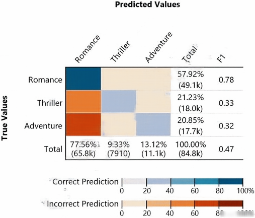

**Dữ kiện hình dạng chữ:** Confusion-matrix graphic: actual class totals Romance 57.92% (49.1k), Thriller 21.23% (18k), Adventure 20.85% (17.7k). Predicted class totals Romance 77.56% (65.8k), Thriller 9.33% (7910), Adventure 13.12% (11.1k). Total 84.8k; class F1 scores 0.78, 0.33, 0.32; overall F1 0.47. Individual cell counts are not printed.

**A.** The true class frequency for Romance is 77.56% and the predicted class frequency for Adventure is 20.85%

**B.** The true class frequency for Romance is 57.92% and the predicted class frequency for Adventure is 13.12%

**C.** The true class frequency for Romance is 0.78 and the predicted class frequency for Adventure is (0.47-0.32)

**D.** The true class frequency for Romance is 77.56% × 0.78 and the predicted class frequency for Adventure is 20.85% × 0.32

**Đáp án sau đối chiếu: B.**

Đọc tổng hàng Romance = 57,92% và tổng cột Adventure = 13,12% trong hình.

Đáp án in trong PDF: `B` (giữ để đối chiếu nguồn, không dùng làm căn cứ chấm).

Nguồn đối chiếu: [Binary Model Insights - Amazon Machine Learning](https://docs.aws.amazon.com/machine-learning/latest/dg/binary-model-insights.html).

---

## Câu 086

Trang PDF: [192](../../Machine%20Learning%20-%20Specialty%20Exam.pdf#page=192) · ĐÃ ĐỐI CHIẾU

A Machine Learning Specialist wants to bring a custom algorithm to Amazon SageMaker. The Specialist implements the algorithm in a Docker container supported by Amazon SageMaker. How should the Specialist package the Docker container so that Amazon SageMaker can launch the training correctly?

**A.** Modify the bash_profile file in the container and add a bash command to start the training program

**B.** Use CMD config in the Dockerfile to add the training program as a CMD of the image

**C.** Configure the training program as an ENTRYPOINT named train

**D.** Copy the training program to directory /opt/ml/train

**Đáp án sau đối chiếu: C.**

Container cần ENTRYPOINT xử lý lệnh train; SageMaker truyền train khi khởi chạy.

Đáp án in trong PDF: `B` (giữ để đối chiếu nguồn, không dùng làm căn cứ chấm).

Nguồn đối chiếu: [How Amazon SageMaker AI Runs Your Training Image - Amazon SageMaker AI](https://docs.aws.amazon.com/sagemaker/latest/dg/your-algorithms-training-algo-dockerfile.html).

---

## Câu 087

Trang PDF: [194](../../Machine%20Learning%20-%20Specialty%20Exam.pdf#page=194) · ĐÃ ĐỐI CHIẾU

A Data Scientist needs to analyze employment data. The dataset contains approximately 10 million observations on people across 10 different features. During the preliminary analysis, the Data Scientist notices that income and age distributions are not normal. While income levels shows a right skew as expected, with fewer individuals having a higher income, the age distribution also shows a right skew, with fewer older individuals participating in the workforce. Which feature transformations can the Data Scientist apply to fix the incorrectly skewed data? (Choose two.)

**A.** Cross-validation

**B.** Numerical value binning

**C.** High-degree polynomial transformation

**D.** Logarithmic transformation

**E.** One hot encoding

**Đáp án sau đối chiếu: B, D.**

Binning và log transform là các cách xử lý đặc trưng số lệch phải trong các lựa chọn.

Đáp án in trong PDF: `AB` (giữ để đối chiếu nguồn, không dùng làm căn cứ chấm).

Nguồn đối chiếu: [Data Transformations Reference - Amazon Machine Learning](https://docs.aws.amazon.com/machine-learning/latest/dg/data-transformations-reference.html).

---

## Câu 088

Trang PDF: [196](../../Machine%20Learning%20-%20Specialty%20Exam.pdf#page=196) · ĐÃ ĐỐI CHIẾU

A web-based company wants to improve its conversion rate on its landing page. Using a large historical dataset of customer visits, the company has repeatedly trained a multi-class deep learning network algorithm on Amazon SageMaker. However, there is an overfitting problem: training data shows 90% accuracy in predictions, while test data shows 70% accuracy only. The company needs to boost the generalization of its model before deploying it into production to maximize conversions of visits to purchases. Which action is recommended to provide the HIGHEST accuracy model for the company's test and validation data?

**A.** Increase the randomization of training data in the mini-batches used in training

**B.** Allocate a higher proportion of the overall data to the training dataset

**C.** Apply L1 or L2 regularization and dropouts to the training

**D.** Reduce the number of layers and units (or neurons) from the deep learning network

**Đáp án sau đối chiếu: C.**

Regularization và dropout giúp giảm khoảng cách giữa training và test.

Đáp án in trong PDF: `D` (giữ để đối chiếu nguồn, không dùng làm căn cứ chấm).

Nguồn đối chiếu: [Model Fit: Underfitting vs. Overfitting - Amazon Machine Learning](https://docs.aws.amazon.com/machine-learning/latest/dg/model-fit-underfitting-vs-overfitting.html); [Dropout layer](https://keras.io/api/layers/regularization_layers/dropout/).

---

## Câu 089

Trang PDF: [198](../../Machine%20Learning%20-%20Specialty%20Exam.pdf#page=198) · ĐÃ ĐỐI CHIẾU

A Machine Learning Specialist is given a structured dataset on the shopping habits of a company's customer base. The dataset contains thousands of columns of data and hundreds of numerical columns for each customer. The Specialist wants to identify whether there are natural groupings for these columns across all customers and visualize the results as quickly as possible. What approach should the Specialist take to accomplish these tasks?

**A.** Embed the numerical features using the t-distributed stochastic neighbor embedding (t-SNE) algorithm and create a scatter plot.

**B.** Run k-means using the Euclidean distance measure for different values of k and create an elbow plot.

**C.** Embed the numerical features using the t-distributed stochastic neighbor embedding (t-SNE) algorithm and create a line graph.

**D.** Run k-means using the Euclidean distance measure for different values of k and create box plots for each numerical column within each cluster.

**Đáp án sau đối chiếu: A.**

t-SNE đưa dữ liệu nhiều chiều về scatter plot để xem cấu trúc nhóm.

Đáp án in trong PDF: `B` (giữ để đối chiếu nguồn, không dùng làm căn cứ chấm).

Nguồn đối chiếu: [2.2. Manifold learning — scikit-learn 1.9.1 documentation](https://scikit-learn.org/stable/modules/manifold.html#t-sne).

---

## Câu 090

Trang PDF: [200](../../Machine%20Learning%20-%20Specialty%20Exam.pdf#page=200) · ĐÃ ĐỐI CHIẾU

A Machine Learning Specialist is planning to create a long-running Amazon EMR cluster. The EMR cluster will have 1 master node, 10 core nodes, and 20 task nodes. To save on costs, the Specialist will use Spot Instances in the EMR cluster. Which nodes should the Specialist launch on Spot Instances?

**A.** Master node

**B.** Any of the core nodes

**C.** Any of the task nodes

**D.** Both core and task nodes

**Đáp án sau đối chiếu: C.**

Task node không chứa HDFS nên thích hợp dùng Spot cho cluster chạy lâu.

Đáp án in trong PDF: `A` (giữ để đối chiếu nguồn, không dùng làm căn cứ chấm).

Nguồn đối chiếu: [Configuring Amazon EMR cluster instance types and best practices for Spot instances - Amazon EMR](https://docs.aws.amazon.com/emr/latest/ManagementGuide/emr-plan-instances-guidelines.html).

---

## Câu 091

Trang PDF: [202](../../Machine%20Learning%20-%20Specialty%20Exam.pdf#page=202) · ĐÃ ĐỐI CHIẾU

A manufacturer of car engines collects data from cars as they are being driven. The data collected includes timestamp, engine temperature, rotations per minute (RPM), and other sensor readings. The company wants to predict when an engine is going to have a problem, so it can notify drivers in advance to get engine maintenance. The engine data is loaded into a data lake for training. Which is the MOST suitable predictive model that can be deployed into production?

**A.** Add labels over time to indicate which engine faults occur at what time in the future to turn this into a supervised learning problem. Use a recurrent neural network (RNN) to train the model to recognize when an engine might need maintenance for a certain fault.

**B.** This data requires an unsupervised learning algorithm. Use Amazon SageMaker k-means to cluster the data.

**C.** Add labels over time to indicate which engine faults occur at what time in the future to turn this into a supervised learning problem. Use a convolutional neural network (CNN) to train the model to recognize when an engine might need maintenance for a certain fault.

**D.** This data is already formulated as a time series. Use Amazon SageMaker seq2seq to model the time series.

**Đáp án sau đối chiếu: A.**

Nhãn lỗi trong tương lai và RNN tận dụng chuỗi sensor để dự báo bảo trì.

Đáp án in trong PDF: `B` (giữ để đối chiếu nguồn, không dùng làm căn cứ chấm).

Nguồn đối chiếu: [Use the SageMaker AI DeepAR forecasting algorithm - Amazon SageMaker AI](https://docs.aws.amazon.com/sagemaker/latest/dg/deepar.html).

---

## Câu 092

Trang PDF: [204](../../Machine%20Learning%20-%20Specialty%20Exam.pdf#page=204) · ĐÃ ĐỐI CHIẾU

A company wants to predict the sale prices of houses based on available historical sales data. The target variable in the company's dataset is the sale price. The features include parameters such as the lot size, living area measurements, non-living area measurements, number of bedrooms, number of bathrooms, year built, and postal code. The company wants to use multi-variable linear regression to predict house sale prices. Which step should a machine learning specialist take to remove features that are irrelevant for the analysis and reduce the model's complexity?

**A.** Plot a histogram of the features and compute their standard deviation. Remove features with high variance.

**B.** Plot a histogram of the features and compute their standard deviation. Remove features with low variance.

**C.** Build a heatmap showing the correlation of the dataset against itself. Remove features with low mutual correlation scores.

**D.** Run a correlation check of all features against the target variable. Remove features with low target variable correlation scores.

**Đáp án sau đối chiếu: D.**

Tương quan với biến đích phù hợp sàng lọc đặc trưng cho mô hình tuyến tính đã nêu.

Đáp án in trong PDF: `D` (giữ để đối chiếu nguồn, không dùng làm căn cứ chấm).

Nguồn đối chiếu: [1.13. Feature selection — scikit-learn 1.9.1 documentation](https://scikit-learn.org/stable/modules/feature_selection.html).

---

## Câu 093

Trang PDF: [207](../../Machine%20Learning%20-%20Specialty%20Exam.pdf#page=207) · ĐÃ ĐỐI CHIẾU

A company wants to classify user behavior as either fraudulent or normal. Based on internal research, a machine learning specialist will build a binary classifier based on two features: age of account, denoted by x, and transaction month, denoted by y. The class distributions are illustrated in the provided figure. The positive class is portrayed in red, while the negative class is portrayed in black. Which model would have the HIGHEST accuracy?

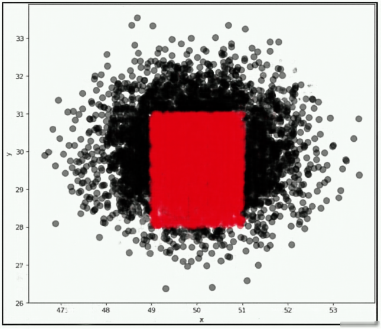

**Dữ kiện hình dạng chữ:** Scatter plot: positive red points lie in a compact rectangular region approximately x=49–51, y=28–31; negative black points surround that region. The sides of the positive region are parallel to the axes.

**A.** Linear support vector machine (SVM)

**B.** Decision tree

**C.** Support vector machine (SVM) with a radial basis function kernel

**D.** Single perceptron with a Tanh activation function

**Đáp án sau đối chiếu: B.**

Ranh giới hình chữ nhật song song trục phù hợp các phép chia của decision tree.

Đáp án in trong PDF: `C` (giữ để đối chiếu nguồn, không dùng làm căn cứ chấm).

Nguồn đối chiếu: [1.10. Decision Trees — scikit-learn 1.9.1 documentation](https://scikit-learn.org/stable/modules/tree.html).

---

## Câu 094

Trang PDF: [210](../../Machine%20Learning%20-%20Specialty%20Exam.pdf#page=210) · ĐÃ ĐỐI CHIẾU

A health care company is planning to use neural networks to classify their X-ray images into normal and abnormal classes. The labeled data is divided into a training set of 1,000 images and a test set of 200 images. The initial training of a neural network model with 50 hidden layers yielded 99% accuracy on the training set, but only 55% accuracy on the test set. What changes should the Specialist consider to solve this issue? (Choose three.)

**A.** Choose a higher number of layers

**B.** Choose a lower number of layers

**C.** Choose a smaller learning rate

**D.** Enable dropout

**E.** Include all the images from the test set in the training set

**F.** Enable early stopping

**Đáp án sau đối chiếu: B, D, F.**

Giảm độ phức tạp, dropout và early stopping xử lý overfitting.

Đáp án in trong PDF: `ADE` (giữ để đối chiếu nguồn, không dùng làm căn cứ chấm).

Nguồn đối chiếu: [Model Fit: Underfitting vs. Overfitting - Amazon Machine Learning](https://docs.aws.amazon.com/machine-learning/latest/dg/model-fit-underfitting-vs-overfitting.html); [Dropout layer](https://keras.io/api/layers/regularization_layers/dropout/); [EarlyStopping](https://keras.io/api/callbacks/early_stopping/).

---

## Câu 095

Trang PDF: [212](../../Machine%20Learning%20-%20Specialty%20Exam.pdf#page=212) · ĐÃ ĐỐI CHIẾU

This graph shows the training and validation loss against the epochs for a neural network. The network being trained is as follows: • Two dense layers, one output neuron • 100 neurons in each layer • 100 epochs Random initialization of weights Which technique can be used to improve model performance in terms of accuracy in the validation set?

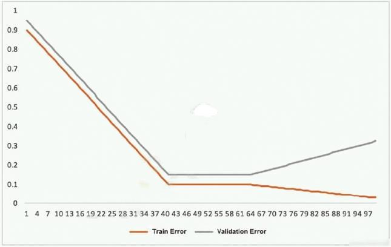

**Dữ kiện hình dạng chữ:** Training/validation error curves: both decline during the first approximately 40 epochs and plateau through approximately epoch 60 (training 0.10, validation 0.15). After epoch 60, training error declines toward 0.03 while validation error increases toward 0.33. Values are approximate.

**A.** Early stopping

**B.** Random initialization of weights with appropriate seed

**C.** Increasing the number of epochs

**D.** Adding another layer with the 100 neurons

**Đáp án sau đối chiếu: A.**

Validation loss tăng sau khoảng epoch 60 dù training loss giảm; dừng sớm tránh overfitting.

Đáp án in trong PDF: `C` (giữ để đối chiếu nguồn, không dùng làm căn cứ chấm).

Nguồn đối chiếu: [EarlyStopping](https://keras.io/api/callbacks/early_stopping/).

---

## Câu 096

Trang PDF: [214](../../Machine%20Learning%20-%20Specialty%20Exam.pdf#page=214) · ĐÃ ĐỐI CHIẾU

A Machine Learning Specialist is attempting to build a linear regression model. Given the displayed residual plot only, what is the MOST likely problem with the model?

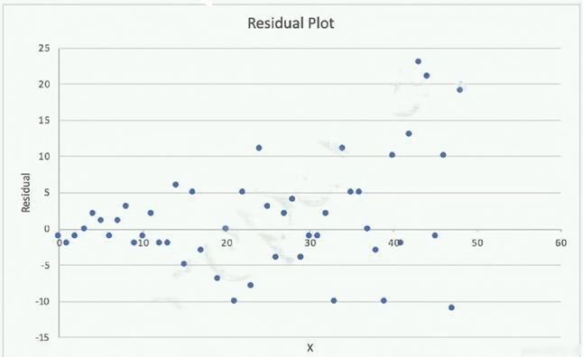

**Dữ kiện hình dạng chữ:** Residual plot: horizontal axis roughly 0–50. Residuals cluster tightly around zero at low x and spread much more widely at high x, approximately −11 to +23.

**A.** Linear regression is inappropriate. The residuals do not have constant variance.

**B.** Linear regression is inappropriate. The underlying data has outliers.

**C.** Linear regression is appropriate. The residuals have a zero mean.

**D.** Linear regression is appropriate. The residuals have constant variance.

**Đáp án sau đối chiếu: A.**

Độ phân tán residual tăng theo X: phương sai không đồng nhất.

Đáp án in trong PDF: `D` (giữ để đối chiếu nguồn, không dùng làm căn cứ chấm).

Nguồn đối chiếu: [1.1. Linear Models — scikit-learn 1.9.1 documentation](https://scikit-learn.org/stable/modules/linear_model.html).

---

## Câu 097

Trang PDF: [216](../../Machine%20Learning%20-%20Specialty%20Exam.pdf#page=216) · CẦN XÁC MINH / SỬA ĐỀ

A large company has developed a BI application that generates reports and dashboards using data collected from various operational metrics. The company wants to provide executives with an enhanced experience so they can use natural language to get data from the reports. The company wants the executives to be able ask questions using written and spoken interfaces. Which combination of services can be used to build this conversational interface? (Choose three.)

**A.** Alexa for Business

**B.** Amazon Connect

**C.** Amazon Lex

**D.** Amazon Polly

**E.** Amazon Comprehend

**F.** Amazon Transcribe

**Chưa chốt đáp án.**

Lex đã hỗ trợ cả tiếng nói và văn bản; đề không đủ yêu cầu để chọn duy nhất ba dịch vụ, các phương án có chức năng chồng lấp.

Đáp án in trong PDF: `BEF` (giữ để đối chiếu nguồn, không dùng làm căn cứ chấm).

Nguồn đối chiếu: [What is Amazon Lex V2? - Amazon Lex](https://docs.aws.amazon.com/lexv2/latest/dg/what-is.html).

---

## Câu 098

Trang PDF: [219](../../Machine%20Learning%20-%20Specialty%20Exam.pdf#page=219) · ĐÃ ĐỐI CHIẾU

A machine learning specialist works for a fruit processing company and needs to build a system that categorizes apples into three types. The specialist has collected a dataset that contains 150 images for each type of apple and applied transfer learning on a neural network that was pretrained on ImageNet with this dataset. The company requires at least 85% accuracy to make use of the model. After an exhaustive grid search, the optimal hyperparameters produced the following: • 68% accuracy on the training set • 67% accuracy on the validation set What can the machine learning specialist do to improve the system's accuracy?

**A.** Upload the model to an Amazon SageMaker notebook instance and use the Amazon SageMaker HPO feature to optimize the model's hyperparameters.

**B.** Add more data to the training set and retrain the model using transfer learning to reduce the bias.

**C.** Use a neural network model with more layers that are pretrained on ImageNet and apply transfer learning to increase the variance.

**D.** Train a new model using the current neural network architecture.

**Đáp án sau đối chiếu: C.**

Training và validation cùng thấp là high bias; mô hình mạnh hơn phù hợp hơn chỉ thêm dữ liệu.

Đáp án in trong PDF: `B` (giữ để đối chiếu nguồn, không dùng làm căn cứ chấm).

Nguồn đối chiếu: [Model Fit: Underfitting vs. Overfitting - Amazon Machine Learning](https://docs.aws.amazon.com/machine-learning/latest/dg/model-fit-underfitting-vs-overfitting.html); [Image Classification - TensorFlow - Amazon SageMaker AI](https://docs.aws.amazon.com/sagemaker/latest/dg/image-classification-tensorflow.html).

---

## Câu 099

Trang PDF: [221](../../Machine%20Learning%20-%20Specialty%20Exam.pdf#page=221) · ĐÃ ĐỐI CHIẾU

A company uses camera images of the tops of items displayed on store shelves to determine which items were removed and which ones still remain. After several hours of data labeling, the company has a total of 1,000 hand-labeled images covering 10 distinct items. The training results were poor. Which machine learning approach fulfills the company's long-term needs?

**A.** Convert the images to grayscale and retrain the model

**B.** Reduce the number of distinct items from 10 to 2, build the model, and iterate

**C.** Attach different colored labels to each item, take the images again, and build the model

**D.** Augment training data for each item using image variants like inversions and translations, build the model, and iterate.

**Đáp án sau đối chiếu: D.**

Augmentation tăng độ đa dạng khi chỉ có ít ảnh gán nhãn.

Đáp án in trong PDF: `A` (giữ để đối chiếu nguồn, không dùng làm căn cứ chấm).

Nguồn đối chiếu: [Data augmentation  |  TensorFlow Core](https://www.tensorflow.org/tutorials/images/data_augmentation).

---

## Câu 100

Trang PDF: [223](../../Machine%20Learning%20-%20Specialty%20Exam.pdf#page=223) · ĐÃ ĐỐI CHIẾU

A Data Scientist is developing a binary classifier to predict whether a patient has a particular disease on a series of test results. The Data Scientist has data on 400 patients randomly selected from the population. The disease is seen in 3% of the population. Which cross-validation strategy should the Data Scientist adopt?

**A.** A k-fold cross-validation strategy with k=5

**B.** A stratified k-fold cross-validation strategy with k=5

**C.** A k-fold cross-validation strategy with k=5 and 3 repeats

**D.** An 80/20 stratified split between training and validation

**Đáp án sau đối chiếu: B.**

Stratified k-fold giữ tỷ lệ lớp hiếm trong từng fold.

Đáp án in trong PDF: `B` (giữ để đối chiếu nguồn, không dùng làm căn cứ chấm).

Nguồn đối chiếu: [3.1. Cross-validation: evaluating estimator performance — scikit-learn 1.9.1 documentation](https://scikit-learn.org/stable/modules/cross_validation.html).

---

## Câu 101

Trang PDF: [224](../../Machine%20Learning%20-%20Specialty%20Exam.pdf#page=224) · ĐÃ ĐỐI CHIẾU

A technology startup is using complex deep neural networks and GPU compute to recommend the company's products to its existing customers based upon each customer's habits and interactions. The solution currently pulls each dataset from an Amazon S3 bucket before loading the data into a TensorFlow model pulled from the company's Git repository that runs locally. This job then runs for several hours while continually outputting its progress to the same S3 bucket. The job can be paused, restarted, and continued at any time in the event of a failure, and is run from a central queue. Senior managers are concerned about the complexity of the solution's resource management and the costs involved in repeating the process regularly. They ask for the workload to be automated so it runs once a week, starting Monday and completing by the close of business Friday. Which architecture should be used to scale the solution at the lowest cost?

**A.** Implement the solution using AWS Deep Learning Containers and run the container as a job using AWS Batch on a GPU-compatible Spot Instance

**B.** Implement the solution using a low-cost GPU-compatible Amazon EC2 instance and use the AWS Instance Scheduler to schedule the task

**C.** Implement the solution using AWS Deep Learning Containers, run the workload using AWS Fargate running on Spot Instances, and then schedule the task using the built-in task scheduler

**D.** Implement the solution using Amazon ECS running on Spot Instances and schedule the task using the ECS service scheduler

**Đáp án sau đối chiếu: A.**

AWS Batch chạy GPU job trên Spot; checkpoint cho phép tiếp tục khi gián đoạn.

Đáp án in trong PDF: `C` (giữ để đối chiếu nguồn, không dùng làm căn cứ chấm).

Nguồn đối chiếu: [Run GPU jobs - AWS Batch](https://docs.aws.amazon.com/batch/latest/userguide/gpu-jobs.html); [Managed compute environments - AWS Batch](https://docs.aws.amazon.com/batch/latest/userguide/managed_compute_environments.html).

---

## Câu 102

Trang PDF: [227](../../Machine%20Learning%20-%20Specialty%20Exam.pdf#page=227) · ĐÃ ĐỐI CHIẾU

A Machine Learning Specialist prepared the following graph displaying the results of k-means for k = [1..10]: Considering the graph, what is a reasonable selection for the optimal choice of k?

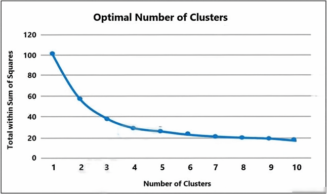

**Dữ kiện hình dạng chữ:** Elbow chart: k=1,2,3,4,5,6,7,8,9,10; corresponding SSE approximately 102,58,38,30,27,24,21,20,19,18.

**A.** 1

**B.** 4

**C.** 7

**D.** 10

**Đáp án sau đối chiếu: B.**

Đường SSE bắt đầu phẳng từ khoảng k=4 trong biểu đồ.

Đáp án in trong PDF: `C` (giữ để đối chiếu nguồn, không dùng làm căn cứ chấm).

Nguồn đối chiếu: [Plan the locations of green car charging stations with an Amazon SageMaker built-in algorithm | Artificial Intelligence](https://aws.amazon.com/blogs/machine-learning/plan-the-locations-of-green-car-charging-stations-with-an-amazon-sagemaker-built-in-algorithm/).

---

## Câu 103

Trang PDF: [229](../../Machine%20Learning%20-%20Specialty%20Exam.pdf#page=229) · ĐÃ ĐỐI CHIẾU

A media company with a very large archive of unlabeled images, text, audio, and video footage wishes to index its assets to allow rapid identification of relevant content by the Research team. The company wants to use machine learning to accelerate the efforts of its in-house researchers who have limited machine learning expertise. Which is the FASTEST route to index the assets?

**A.** Use Amazon Rekognition, Amazon Comprehend, and Amazon Transcribe to tag data into distinct categories/classes.

**B.** Create a set of Amazon Mechanical Turk Human Intelligence Tasks to label all footage.

**C.** Use Amazon Transcribe to convert speech to text. Use the Amazon SageMaker Neural Topic Model (NTM) and Object Detection algorithms to tag data into distinct categories/classes.

**D.** Use the AWS Deep Learning AMI and Amazon EC2 GPU instances to create custom models for audio transcription and topic modeling, and use object detection to tag data into distinct categories/classes.

**Đáp án sau đối chiếu: A.**

Dịch vụ AI dựng sẵn nhận diện ảnh, văn bản và lời nói giảm công sức xây mô hình.

Đáp án in trong PDF: `A` (giữ để đối chiếu nguồn, không dùng làm căn cứ chấm).

Nguồn đối chiếu: [What is Amazon Rekognition Custom Labels? - Rekognition](https://docs.aws.amazon.com/rekognition/latest/customlabels-dg/what-is.html).

---

## Câu 104

Trang PDF: [231](../../Machine%20Learning%20-%20Specialty%20Exam.pdf#page=231) · ĐÃ ĐỐI CHIẾU

A Machine Learning Specialist is working for an online retailer that wants to run analytics on every customer visit, processed through a machine learning pipeline. The data needs to be ingested by Amazon Kinesis Data Streams at up to 100 transactions per second, and the JSON data blob is 100 KB in size. What is the MINIMUM number of shards in Kinesis Data Streams the Specialist should use to successfully ingest this data?

**A.** 1 shards

**B.** 10 shards

**C.** 100 shards

**D.** 1,000 shards

**Đáp án sau đối chiếu: B.**

100 × 100 KB/giây cần khoảng 10 MB/giây; một shard ghi tối đa 1 MB/giây.

Đáp án in trong PDF: `B` (giữ để đối chiếu nguồn, không dùng làm căn cứ chấm).

Nguồn đối chiếu: [Amazon Kinesis Data Streams Terminology and concepts - Amazon Kinesis Data Streams](https://docs.aws.amazon.com/streams/latest/dev/key-concepts.html).

---

## Câu 105

Trang PDF: [232](../../Machine%20Learning%20-%20Specialty%20Exam.pdf#page=232) · CẦN XÁC MINH / SỬA ĐỀ

A Machine Learning Specialist is deciding between building a naive Bayesian model or a full Bayesian network for a classification problem. The Specialist computes the Pearson correlation coefficients between each feature and finds that their absolute values range between 0.1 to 0.95. Which model describes the underlying data in this situation?

**A.** A naive Bayesian model, since the features are all conditionally independent.

**B.** A full Bayesian network, since the features are all conditionally independent.

**C.** A naive Bayesian model, since some of the features are statistically dependent.

**D.** A full Bayesian network, since some of the features are statistically dependent.

**Chưa chốt đáp án.** Phương án tham khảo có điều kiện: **D**.

D là ý định của đề, nhưng tương quan biên không chứng minh phụ thuộc có điều kiện theo nhãn.

Đáp án in trong PDF: `C` (giữ để đối chiếu nguồn, không dùng làm căn cứ chấm).

Nguồn đối chiếu: [1.9. Naive Bayes — scikit-learn 1.9.1 documentation](https://scikit-learn.org/stable/modules/naive_bayes.html).

---

## Câu 106

Trang PDF: [234](../../Machine%20Learning%20-%20Specialty%20Exam.pdf#page=234) · CẦN XÁC MINH / SỬA ĐỀ

A Data Scientist is building a linear regression model and will use resulting p-values to evaluate the statistical significance of each coefficient. Upon inspection of the dataset, the Data Scientist discovers that most of the features are normally distributed. The plot of one feature in the dataset is shown in the graphic. What transformation should the Data Scientist apply to satisfy the statistical assumptions of the linear regression model?

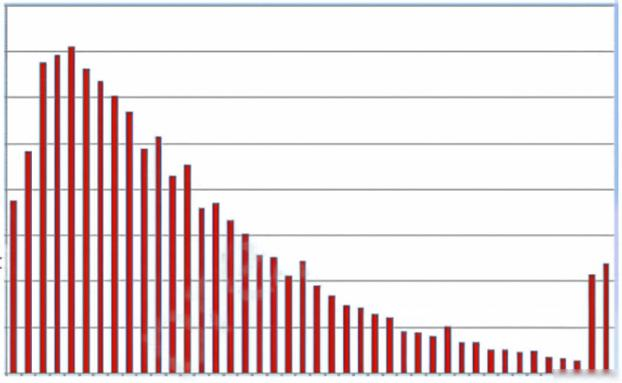

**Dữ kiện hình dạng chữ:** Histogram: most observations are concentrated on the left, with a long tail to the right and a small rise near the far right. Numerical axis labels are not shown.

**A.** Exponential transformation

**B.** Logarithmic transformation

**C.** Polynomial transformation

**D.** Sinusoidal transformation

**Chưa chốt đáp án.** Phương án tham khảo có điều kiện: **B**.

Log giúp giảm skew; hồi quy tuyến tính không bắt buộc các biến đầu vào có phân phối chuẩn.

Đáp án in trong PDF: `A` (giữ để đối chiếu nguồn, không dùng làm căn cứ chấm).

Nguồn đối chiếu: [1.1. Linear Models — scikit-learn 1.9.1 documentation](https://scikit-learn.org/stable/modules/linear_model.html); [Data Transformations Reference - Amazon Machine Learning](https://docs.aws.amazon.com/machine-learning/latest/dg/data-transformations-reference.html).

---

## Câu 107

Trang PDF: [236](../../Machine%20Learning%20-%20Specialty%20Exam.pdf#page=236) · ĐÃ ĐỐI CHIẾU

A Machine Learning Specialist is assigned to a Fraud Detection team and must tune an XGBoost model, which is working appropriately for test data. However, with unknown data, it is not working as expected. The existing parameters are provided as follows. Which parameter tuning guidelines should the Specialist follow to avoid overfitting?

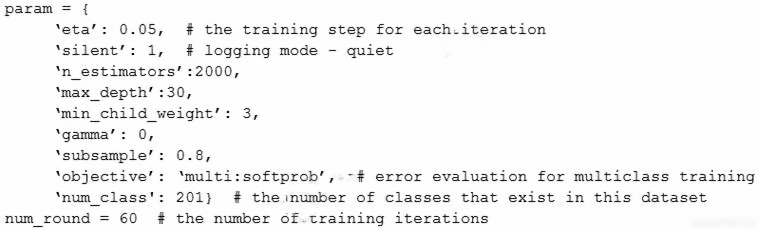

**Dữ kiện hình dạng chữ:** Code in image: param={'eta':0.05,'silent':1,'n_estimators':2000,'max_depth':30,'min_child_weight':3,'gamma':0,'subsample':0.8,'objective':'multi:softprob','num_class':201}; num_round=60.

**A.** Increase the max_depth parameter value.

**B.** Lower the max_depth parameter value.

**C.** Update the objective to binary:logistic.

**D.** Lower the min_child_weight parameter value.

**Đáp án sau đối chiếu: B.**

Giảm max_depth giảm độ phức tạp và nguy cơ overfit của cây.

Đáp án in trong PDF: `B` (giữ để đối chiếu nguồn, không dùng làm căn cứ chấm).

Nguồn đối chiếu: [XGBoost hyperparameters - Amazon SageMaker AI](https://docs.aws.amazon.com/sagemaker/latest/dg/xgboost_hyperparameters.html).

---

## Câu 108

Trang PDF: [238](../../Machine%20Learning%20-%20Specialty%20Exam.pdf#page=238) · BỐI CẢNH DỊCH VỤ CŨ

A data scientist is developing a pipeline to ingest streaming web traffic data. The data scientist needs to implement a process to identify unusual web traffic patterns as part of the pipeline. The patterns will be used downstream for alerting and incident response. The data scientist has access to unlabeled historic data to use, if needed. The solution needs to do the following: • Calculate an anomaly score for each web traffic entry. Adapt unusual event identification to changing web patterns over time. Which approach should the data scientist implement to meet these requirements?

**A.** Use historic web traffic data to train an anomaly detection model using the Amazon SageMaker Random Cut Forest (RCF) built-in model. Use an Amazon Kinesis Data Stream to process the incoming web traffic data. Attach a preprocessing AWS Lambda function to perform data enrichment by calling the RCF model to calculate the anomaly score for each record.

**B.** Use historic web traffic data to train an anomaly detection model using the Amazon SageMaker built-in XGBoost model. Use an Amazon Kinesis Data Stream to process the incoming web traffic data. Attach a preprocessing AWS Lambda function to perform data enrichment by calling the XGBoost model to calculate the anomaly score for each record.

**C.** Collect the streaming data using Amazon Kinesis Data Firehose. Map the delivery stream as an input source for Amazon Kinesis Data Analytics. Write a SQL query to run in real time against the streaming data with the k-Nearest Neighbors (kNN) SQL extension to calculate anomaly scores for each record using a tumbling window.

**D.** Collect the streaming data using Amazon Kinesis Data Firehose. Map the delivery stream as an input source for Amazon Kinesis Data Analytics. Write a SQL query to run in real time against the streaming data with the Amazon Random Cut Forest (RCF) SQL extension to calculate anomaly scores for each record using a sliding window.

**Đáp án sau đối chiếu: D.**

Streaming RCF thích nghi cửa sổ dữ liệu; lựa chọn thuộc Kinesis SQL cũ.

Đáp án in trong PDF: `A` (giữ để đối chiếu nguồn, không dùng làm căn cứ chấm).

Nguồn đối chiếu: [RANDOM_CUT_FOREST - Amazon Kinesis Data Analytics SQL Reference](https://docs.aws.amazon.com/kinesisanalytics/latest/sqlref/sqlrf-random-cut-forest.html); [What Is Amazon Kinesis Data Analytics for SQL Applications? - Amazon Kinesis Data Analytics for SQL Applications Developer Guide](https://docs.aws.amazon.com/kinesisanalytics/latest/dev/what-is.html).

---

## Câu 109

Trang PDF: [240](../../Machine%20Learning%20-%20Specialty%20Exam.pdf#page=240) · ĐÃ ĐỐI CHIẾU

A Data Scientist received a set of insurance records, each consisting of a record ID, the final outcome among 200 categories, and the date of the final outcome. Some partial information on claim contents is also provided, but only for a few of the 200 categories. For each outcome category, there are hundreds of records distributed over the past 3 years. The Data Scientist wants to predict how many claims to expect in each category from month to month, a few months in advance. What type of machine learning model should be used?

**A.** Classification month-to-month using supervised learning of the 200 categories based on claim contents.

**B.** Reinforcement learning using claim IDs and timestamps where the agent will identify how many claims in each category to expect from month to month.

**C.** Forecasting using claim IDs and timestamps to identify how many claims in each category to expect from month to month.

**D.** Classification with supervised learning of the categories for which partial information on claim contents is provided, and forecasting using claim IDs and timestamps for all other categories.

**Đáp án sau đối chiếu: C.**

Đích là số claim theo tháng cho từng nhóm, nên dùng forecasting.

Đáp án in trong PDF: `D` (giữ để đối chiếu nguồn, không dùng làm căn cứ chấm).

Nguồn đối chiếu: [Use the SageMaker AI DeepAR forecasting algorithm - Amazon SageMaker AI](https://docs.aws.amazon.com/sagemaker/latest/dg/deepar.html).

---

## Câu 110

Trang PDF: [242](../../Machine%20Learning%20-%20Specialty%20Exam.pdf#page=242) · ĐÃ ĐỐI CHIẾU

A company that promotes healthy sleep patterns by providing cloud-connected devices currently hosts a sleep tracking application on AWS. The application collects device usage information from device users. The company's Data Science team is building a machine learning model to predict if and when a user will stop utilizing the company's devices. Predictions from this model are used by a downstream application that determines the best approach for contacting users. The Data Science team is building multiple versions of the machine learning model to evaluate each version against the company's business goals. To measure long-term effectiveness, the team wants to run multiple versions of the model in parallel for long periods of time, with the ability to control the portion of inferences served by the models. Which solution satisfies these requirements with MINIMAL effort?

**A.** Build and host multiple models in Amazon SageMaker. Create multiple Amazon SageMaker endpoints, one for each model. Programmatically control invoking different models for inference at the application layer.

**B.** Build and host multiple models in Amazon SageMaker. Create an Amazon SageMaker endpoint configuration with multiple production variants. Programmatically control the portion of the inferences served by the multiple models by updating the endpoint configuration.

**C.** Build and host multiple models in Amazon SageMaker Neo to take into account different types of medical devices. Programmatically control which model is invoked for inference based on the medical device type.

**D.** Build and host multiple models in Amazon SageMaker. Create a single endpoint that accesses multiple models. Use Amazon SageMaker batch transform to control invoking the different models through the single endpoint.

**Đáp án sau đối chiếu: B.**

Production variants chia lưu lượng giữa các model trên cùng endpoint.

Đáp án in trong PDF: `D` (giữ để đối chiếu nguồn, không dùng làm căn cứ chấm).

Nguồn đối chiếu: [Testing models with production variants - Amazon SageMaker AI](https://docs.aws.amazon.com/sagemaker/latest/dg/model-ab-testing.html).

---

## Câu 111

Trang PDF: [244](../../Machine%20Learning%20-%20Specialty%20Exam.pdf#page=244) · ĐÃ ĐỐI CHIẾU

An agricultural company is interested in using machine learning to detect specific types of weeds in a 100-acre grassland field. Currently, the company uses tractor-mounted cameras to capture multiple images of the field as 10 × 10 grids. The company also has a large training dataset that consists of annotated images of popular weed classes like broadleaf and non-broadleaf docks. The company wants to build a weed detection model that will detect specific types of weeds and the location of each type within the field. Once the model is ready, it will be hosted on Amazon SageMaker endpoints. The model will perform real-time inferencing using the images captured by the cameras. Which approach should a Machine Learning Specialist take to obtain accurate predictions?

**A.** Prepare the images in RecordIO format and upload them to Amazon S3. Use Amazon SageMaker to train, test, and validate the model using an image classification algorithm to categorize images into various weed classes.

**B.** Prepare the images in Apache Parquet format and upload them to Amazon S3. Use Amazon SageMaker to train, test, and validate the model using an object- detection single-shot multibox detector (SSD) algorithm.

**C.** Prepare the images in RecordIO format and upload them to Amazon S3. Use Amazon SageMaker to train, test, and validate the model using an object- detection single-shot multibox detector (SSD) algorithm.

**D.** Prepare the images in Apache Parquet format and upload them to Amazon S3. Use Amazon SageMaker to train, test, and validate the model using an image classification algorithm to categorize images into various weed classes.

**Đáp án sau đối chiếu: C.**

Object detection SSD trả loại và vị trí đối tượng; built-in hỗ trợ RecordIO.

Đáp án in trong PDF: `C` (giữ để đối chiếu nguồn, không dùng làm căn cứ chấm).

Nguồn đối chiếu: [Object Detection - MXNet - Amazon SageMaker AI](https://docs.aws.amazon.com/sagemaker/latest/dg/object-detection.html).

---

## Câu 112

Trang PDF: [246](../../Machine%20Learning%20-%20Specialty%20Exam.pdf#page=246) · ĐÃ ĐỐI CHIẾU

A manufacturer is operating a large number of factories with a complex supply chain relationship where unexpected downtime of a machine can cause production to stop at several factories. A data scientist wants to analyze sensor data from the factories to identify equipment in need of preemptive maintenance and then dispatch a service team to prevent unplanned downtime. The sensor readings from a single machine can include up to 200 data points including temperatures, voltages, vibrations, RPMs, and pressure readings. To collect this sensor data, the manufacturer deployed Wi-Fi and LANs across the factories. Even though many factory locations do not have reliable or high- speed internet connectivity, the manufacturer would like to maintain near-real-time inference capabilities. Which deployment architecture for the model will address these business requirements?

**A.** Deploy the model in Amazon SageMaker. Run sensor data through this model to predict which machines need maintenance.

**B.** Deploy the model on AWS IoT Greengrass in each factory. Run sensor data through this model to infer which machines need maintenance.

**C.** Deploy the model to an Amazon SageMaker batch transformation job. Generate inferences in a daily batch report to identify machines that need maintenance.

**D.** Deploy the model in Amazon SageMaker and use an IoT rule to write data to an Amazon DynamoDB table. Consume a DynamoDB stream from the table with an AWS Lambda function to invoke the endpoint.

**Đáp án sau đối chiếu: B.**

Inference tại edge không phụ thuộc kết nối internet liên tục.

Đáp án in trong PDF: `A` (giữ để đối chiếu nguồn, không dùng làm căn cứ chấm).

Nguồn đối chiếu: [Perform machine learning inference - AWS IoT Greengrass](https://docs.aws.amazon.com/greengrass/v2/developerguide/perform-machine-learning-inference.html).

---

## Câu 113

Trang PDF: [248](../../Machine%20Learning%20-%20Specialty%20Exam.pdf#page=248) · ĐÃ ĐỐI CHIẾU

A Machine Learning Specialist is designing a scalable data storage solution for Amazon SageMaker. There is an existing TensorFlow-based model implemented as a train.py script that relies on static training data that is currently stored as TFRecords. Which method of providing training data to Amazon SageMaker would meet the business requirements with the LEAST development overhead?

**A.** Use Amazon SageMaker script mode and use train.py unchanged. Point the Amazon SageMaker training invocation to the local path of the data without reformatting the training data.

**B.** Use Amazon SageMaker script mode and use train.py unchanged. Put the TFRecord data into an Amazon S3 bucket. Point the Amazon SageMaker training invocation to the S3 bucket without reformatting the training data.

**C.** Rewrite the train.py script to add a section that converts TFRecords to protobuf and ingests the protobuf data instead of TFRecords.

**D.** Prepare the data in the format accepted by Amazon SageMaker. Use AWS Glue or AWS Lambda to reformat and store the data in an Amazon S3 bucket.

**Đáp án sau đối chiếu: B.**

Script mode đọc TFRecord từ S3; không cần đổi sang định dạng built-in khác.

Đáp án in trong PDF: `D` (giữ để đối chiếu nguồn, không dùng làm căn cứ chấm).

Nguồn đối chiếu: [Launching TensorFlow distributed training easily with Horovod or Parameter Servers in Amazon SageMaker | Artificial Intelligence](https://aws.amazon.com/blogs/machine-learning/launching-tensorflow-distributed-training-easily-with-horovod-or-parameter-servers-in-amazon-sagemaker/).

---

## Câu 114

Trang PDF: [250](../../Machine%20Learning%20-%20Specialty%20Exam.pdf#page=250) · ĐÃ ĐỐI CHIẾU

The chief editor for a product catalog wants the research and development team to build a machine learning system that can be used to detect whether or not individuals in a collection of images are wearing the company's retail brand. The team has a set of training data. Which machine learning algorithm should the researchers use that BEST meets their requirements?

**A.** Latent Dirichlet Allocation (LDA)

**B.** Recurrent neural network (RNN)

**C.** K-means

**D.** Convolutional neural network (CNN)

**Đáp án sau đối chiếu: D.**

CNN học đặc trưng không gian cho bài toán nhận diện trong ảnh.

Đáp án in trong PDF: `D` (giữ để đối chiếu nguồn, không dùng làm căn cứ chấm).

Nguồn đối chiếu: [Image Classification - MXNet - Amazon SageMaker AI](https://docs.aws.amazon.com/sagemaker/latest/dg/image-classification.html).

---

## Câu 115

Trang PDF: [251](../../Machine%20Learning%20-%20Specialty%20Exam.pdf#page=251) · ĐÃ ĐỐI CHIẾU

A retail company is using Amazon Personalize to provide personalized product recommendations for its customers during a marketing campaign. The company sees a significant increase in sales of recommended items to existing customers immediately after deploying a new solution version, but these sales decrease a short time after deployment. Only historical data from before the marketing campaign is available for training. How should a data scientist adjust the solution?

**A.** Use the event tracker in Amazon Personalize to include real-time user interactions.

**B.** Add user metadata and use the HRNN-Metadata recipe in Amazon Personalize.

**C.** Implement a new solution using the built-in factorization machines (FM) algorithm in Amazon SageMaker.

**D.** Add event type and event value fields to the interactions dataset in Amazon Personalize.

**Đáp án sau đối chiếu: A.**

Event tracker đưa tương tác mới vào hệ thống Personalize.

Đáp án in trong PDF: `D` (giữ để đối chiếu nguồn, không dùng làm căn cứ chấm).

Nguồn đối chiếu: [Recording real-time item interaction events - Amazon Personalize](https://docs.aws.amazon.com/personalize/latest/dg/recording-item-interaction-events.html).

---

## Câu 116

Trang PDF: [252](../../Machine%20Learning%20-%20Specialty%20Exam.pdf#page=252) · ĐÃ ĐỐI CHIẾU

A machine learning (ML) specialist wants to secure calls to the Amazon SageMaker Service API. The specialist has configured Amazon VPC with a VPC interface endpoint for the Amazon SageMaker Service API and is attempting to secure traffic from specific sets of instances and IAM users. The VPC is configured with a single public subnet. Which combination of steps should the ML specialist take to secure the traffic? (Choose two.)

**A.** Add a VPC endpoint policy to allow access to the IAM users.

**B.** Modify the users' IAM policy to allow access to Amazon SageMaker Service API calls only.

**C.** Modify the security group on the endpoint network interface to restrict access to the instances.

**D.** Modify the ACL on the endpoint network interface to restrict access to the instances.

**E.** Add a SageMaker Runtime VPC endpoint interface to the VPC.

**Đáp án sau đối chiếu: A, C.**

Endpoint policy kiểm soát principal; security group của ENI kiểm soát nguồn mạng.

Đáp án in trong PDF: `AC` (giữ để đối chiếu nguồn, không dùng làm căn cứ chấm).

Nguồn đối chiếu: [Connect to SageMaker AI Within your VPC - Amazon SageMaker AI](https://docs.aws.amazon.com/sagemaker/latest/dg/interface-vpc-endpoint.html).

---

## Câu 117

Trang PDF: [254](../../Machine%20Learning%20-%20Specialty%20Exam.pdf#page=254) · ĐÃ ĐỐI CHIẾU

An e commerce company wants to launch a new cloud-based product recommendation feature for its web application. Due to data localization regulations, any sensitive data must not leave its on-premises data center, and the product recommendation model must be trained and tested using nonsensitive data only. Data transfer to the cloud must use IPsec. The web application is hosted on premises with a PostgreSQL database that contains all the data. The company wants the data to be uploaded securely to Amazon S3 each day for model retraining. How should a machine learning specialist meet these requirements?

**A.** Create an AWS Glue job to connect to the PostgreSQL DB instance. Ingest tables without sensitive data through an AWS Site-to-Site VPN connection directly into Amazon S3.

**B.** Create an AWS Glue job to connect to the PostgreSQL DB instance. Ingest all data through an AWS Site-to-Site VPN connection into Amazon S3 while removing sensitive data using a PySpark job.

**C.** Use AWS Database Migration Service (AWS DMS) with table mapping to select PostgreSQL tables with no sensitive data through an SSL connection. Replicate data directly into Amazon S3.

**D.** Use PostgreSQL logical replication to replicate all data to PostgreSQL in Amazon EC2 through AWS Direct Connect with a VPN connection. Use AWS Glue to move data from Amazon EC2 to Amazon S3.

**Đáp án sau đối chiếu: A.**

Chọn dữ liệu không nhạy cảm ngay tại nguồn; Site-to-Site VPN cung cấp IPsec.

Đáp án in trong PDF: `C` (giữ để đối chiếu nguồn, không dùng làm căn cứ chấm).

Nguồn đối chiếu: [JDBC connections - AWS Glue](https://docs.aws.amazon.com/glue/latest/dg/aws-glue-programming-etl-connect-jdbc-home.html); [What is AWS Site-to-Site VPN? - AWS Site-to-Site VPN](https://docs.aws.amazon.com/vpn/latest/s2svpn/VPC_VPN.html).

---

## Câu 118

Trang PDF: [256](../../Machine%20Learning%20-%20Specialty%20Exam.pdf#page=256) · CẦN XÁC MINH / SỬA ĐỀ

A logistics company needs a forecast model to predict next month's inventory requirements for a single item in 10 warehouses. A machine learning specialist uses Amazon Forecast to develop a forecast model from 3 years of monthly data. There is no missing data. The specialist selects the DeepAR+ algorithm to train a predictor. The predictor means absolute percentage error (MAPE) is much larger than the MAPE produced by the current human forecasters. Which changes to the CreatePredictor API call could improve the MAPE? (Choose two.)

**A.** Set PerformAutoML to true.

**B.** Set ForecastHorizon to 4.

**C.** Set ForecastFrequency to W for weekly.

**D.** Set PerformHPO to true.

**E.** Set FeaturizationMethodName to filling.

**Chưa chốt đáp án.** Phương án tham khảo có điều kiện: **A, D**.

AutoML hoặc HPO có thể cải thiện model, nhưng API cấm bật cả hai cùng lúc trong một CreatePredictor call.

Đáp án in trong PDF: `CD` (giữ để đối chiếu nguồn, không dùng làm căn cứ chấm).

Nguồn đối chiếu: [CreatePredictor - Amazon Forecast](https://docs.aws.amazon.com/forecast/latest/dg/API_CreatePredictor.html); [Document History for Amazon Forecast - Amazon Forecast](https://docs.aws.amazon.com/forecast/latest/dg/doc-history.html).

---

## Câu 119

Trang PDF: [259](../../Machine%20Learning%20-%20Specialty%20Exam.pdf#page=259) · BỐI CẢNH DỊCH VỤ CŨ

A data scientist wants to use Amazon Forecast to build a forecasting model for inventory demand for a retail company. The company has provided a dataset of historic inventory demand for its products as a .csv file stored in an Amazon S3 bucket. The table below shows a sample of the dataset. How should the data scientist transform the data?

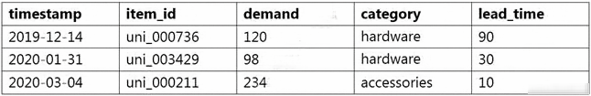

**Dữ kiện hình dạng chữ:** Table columns timestamp,item_id,demand,category,lead_time. Rows: 2019-12-14,uni_000736,120,hardware,90; 2020-01-31,uni_003429,98,hardware,30; 2020-03-04,uni_000211,234,accessories,10.

**A.** Use ETL jobs in AWS Glue to separate the dataset into a target time series dataset and an item metadata dataset. Upload both datasets as .csv files to Amazon S3.

**B.** Use a Jupyter notebook in Amazon SageMaker to separate the dataset into a related time series dataset and an item metadata dataset. Upload both datasets as tables in Amazon Aurora.

**C.** Use AWS Batch jobs to separate the dataset into a target time series dataset, a related time series dataset, and an item metadata dataset. Upload them directly to Forecast from a local machine.

**D.** Use a Jupyter notebook in Amazon SageMaker to transform the data into the optimized protobuf recordIO format. Upload the dataset in this format to Amazon S3.

**Đáp án sau đối chiếu: A.**

Forecast dùng target time series và item metadata, nhập CSV từ S3.

Đáp án in trong PDF: `B` (giữ để đối chiếu nguồn, không dùng làm căn cứ chấm).

Nguồn đối chiếu: [Importing Datasets - Amazon Forecast](https://docs.aws.amazon.com/forecast/latest/dg/howitworks-datasets-groups.html); [Document History for Amazon Forecast - Amazon Forecast](https://docs.aws.amazon.com/forecast/latest/dg/doc-history.html).

---

## Câu 120

Trang PDF: [261](../../Machine%20Learning%20-%20Specialty%20Exam.pdf#page=261) · BỐI CẢNH DỊCH VỤ CŨ

A machine learning specialist is running an Amazon SageMaker endpoint using the built-in object detection algorithm on a P3 instance for real-time predictions in a company's production application. When evaluating the model's resource utilization, the specialist notices that the model is using only a fraction of the GPU. Which architecture changes would ensure that provisioned resources are being utilized effectively?

**A.** Redeploy the model as a batch transform job on an M5 instance.

**B.** Redeploy the model on an M5 instance. Attach Amazon Elastic Inference to the instance.

**C.** Redeploy the model on a P3dn instance.

**D.** Deploy the model onto an Amazon Elastic Container Service (Amazon ECS) cluster using a P3 instance.

**Đáp án sau đối chiếu: B.**

Elastic Inference từng bổ sung GPU nhỏ cho CPU instance; dịch vụ đã ngừng nhận khách hàng mới.

Đáp án in trong PDF: `D` (giữ để đối chiếu nguồn, không dùng làm căn cứ chấm).

Nguồn đối chiếu: [Class: AWS.ElasticInference — AWS SDK for JavaScript](https://docs.aws.amazon.com/AWSJavaScriptSDK/latest/AWS/ElasticInference.html).

---

## Câu 121

Trang PDF: [263](../../Machine%20Learning%20-%20Specialty%20Exam.pdf#page=263) · ĐÃ ĐỐI CHIẾU

A data scientist uses an Amazon SageMaker notebook instance to conduct data exploration and analysis. This requires certain Python packages that are not natively available on Amazon SageMaker to be installed on the notebook instance. How can a machine learning specialist ensure that required packages are automatically available on the notebook instance for the data scientist to use?

**A.** Install AWS Systems Manager Agent on the underlying Amazon EC2 instance and use Systems Manager Automation to execute the package installation commands.

**B.** Create a Jupyter notebook file (.ipynb) with cells containing the package installation commands to execute and place the file under the /etc/init directory of each Amazon SageMaker notebook instance.

**C.** Use the conda package manager from within the Jupyter notebook console to apply the necessary conda packages to the default kernel of the notebook.

**D.** Create an Amazon SageMaker lifecycle configuration with package installation commands and assign the lifecycle configuration to the notebook instance.

**Đáp án sau đối chiếu: D.**

Lifecycle configuration tự cài package khi tạo hoặc khởi động notebook.

Đáp án in trong PDF: `B` (giữ để đối chiếu nguồn, không dùng làm căn cứ chấm).

Nguồn đối chiếu: [Customization of a SageMaker notebook instance using an LCC script - Amazon SageMaker AI](https://docs.aws.amazon.com/sagemaker/latest/dg/notebook-lifecycle-config.html).

---

## Câu 122

Trang PDF: [265](../../Machine%20Learning%20-%20Specialty%20Exam.pdf#page=265) · ĐÃ ĐỐI CHIẾU

A data scientist needs to identify fraudulent user accounts for a company's ecommerce platform. The company wants the ability to determine if a newly created account is associated with a previously known fraudulent user. The data scientist is using AWS Glue to cleanse the company's application logs during ingestion. Which strategy will allow the data scientist to identify fraudulent accounts?

**A.** Execute the built-in FindDuplicates Amazon Athena query.

**B.** Create a FindMatches machine learning transform in AWS Glue.

**C.** Create an AWS Glue crawler to infer duplicate accounts in the source data.

**D.** Search for duplicate accounts in the AWS Glue Data Catalog.

**Đáp án sau đối chiếu: B.**

Glue FindMatches hỗ trợ entity matching và nhận diện bản ghi trùng.

Đáp án in trong PDF: `B` (giữ để đối chiếu nguồn, không dùng làm căn cứ chấm).

Nguồn đối chiếu: [Record matching with AWS Lake Formation FindMatches - AWS Glue](https://docs.aws.amazon.com/glue/latest/dg/machine-learning.html).

---

## Câu 123

Trang PDF: [266](../../Machine%20Learning%20-%20Specialty%20Exam.pdf#page=266) · ĐÃ ĐỐI CHIẾU

A Data Scientist is developing a machine learning model to classify whether a financial transaction is fraudulent. The labeled data available for training consists of 100,000 non-fraudulent observations and 1,000 fraudulent observations. The Data Scientist applies the XGBoost algorithm to the data, resulting in the following confusion matrix when the trained model is applied to a previously unseen validation dataset. The accuracy of the model is 99.1%, but the Data Scientist needs to reduce the number of false negatives. Which combination of steps should the Data Scientist take to reduce the number of false negative predictions by the model? (Choose two.)

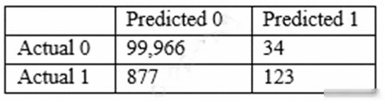

**Dữ kiện hình dạng chữ:** Confusion matrix: rows Actual 0, Actual 1; columns Predicted 0, Predicted 1. Actual 0: [99966,34]. Actual 1: [877,123].

**A.** Change the XGBoost eval_metric parameter to optimize based on Root Mean Square Error (RMSE).

**B.** Increase the XGBoost scale_pos_weight parameter to adjust the balance of positive and negative weights.

**C.** Increase the XGBoost max_depth parameter because the model is currently underfitting the data.

**D.** Change the XGBoost eval_metric parameter to optimize based on Area Under the ROC Curve (AUC).

**E.** Decrease the XGBoost max_depth parameter because the model is currently overfitting the data.

**Đáp án sau đối chiếu: B, D.**

scale_pos_weight tăng trọng số fraud; AUC phù hợp phân loại hơn RMSE.

Đáp án in trong PDF: `DE` (giữ để đối chiếu nguồn, không dùng làm căn cứ chấm).

Nguồn đối chiếu: [XGBoost hyperparameters - Amazon SageMaker AI](https://docs.aws.amazon.com/sagemaker/latest/dg/xgboost_hyperparameters.html); [Binary Model Insights - Amazon Machine Learning](https://docs.aws.amazon.com/machine-learning/latest/dg/binary-model-insights.html).

---

## Câu 124

Trang PDF: [268](../../Machine%20Learning%20-%20Specialty%20Exam.pdf#page=268) · ĐÃ ĐỐI CHIẾU

A data scientist has developed a machine learning translation model for English to Japanese by using Amazon SageMaker's built-in seq2seq algorithm with 500,000 aligned sentence pairs. While testing with sample sentences, the data scientist finds that the translation quality is reasonable for an example as short as five words. However, the quality becomes unacceptable if the sentence is 100 words long. Which action will resolve the problem?

**A.** Change preprocessing to use n-grams.

**B.** Add more nodes to the recurrent neural network (RNN) than the largest sentence's word count.

**C.** Adjust hyperparameters related to the attention mechanism.

**D.** Choose a different weight initialization type.

**Đáp án sau đối chiếu: C.**

Attention giúp decoder truy cập các phần liên quan của chuỗi đầu vào dài.

Đáp án in trong PDF: `B` (giữ để đối chiếu nguồn, không dùng làm căn cứ chấm).

Nguồn đối chiếu: [Sequence-to-Sequence Algorithm - Amazon SageMaker AI](https://docs.aws.amazon.com/sagemaker/latest/dg/seq-2-seq.html).

---

## Câu 125

Trang PDF: [270](../../Machine%20Learning%20-%20Specialty%20Exam.pdf#page=270) · ĐÃ ĐỐI CHIẾU

A financial company is trying to detect credit card fraud. The company observed that, on average, 2% of credit card transactions were fraudulent. A data scientist trained a classifier on a year's worth of credit card transactions data. The model needs to identify the fraudulent transactions (positives) from the regular ones (negatives). The company's goal is to accurately capture as many positives as possible. Which metrics should the data scientist use to optimize the model? (Choose two.)

**A.** Specificity

**B.** False positive rate

**C.** Accuracy

**D.** Area under the precision-recall curve

**E.** True positive rate

**Đáp án sau đối chiếu: D, E.**

Recall đo tỷ lệ bắt được fraud; PR-AUC thích hợp khi lớp dương hiếm.

Đáp án in trong PDF: `AB` (giữ để đối chiếu nguồn, không dùng làm căn cứ chấm).

Nguồn đối chiếu: [3.4. Metrics and scoring: quantifying the quality of predictions — scikit-learn 1.9.1 documentation](https://scikit-learn.org/stable/modules/model_evaluation.html).

---

## Câu 126

Trang PDF: [273](../../Machine%20Learning%20-%20Specialty%20Exam.pdf#page=273) · ĐÃ ĐỐI CHIẾU

A machine learning specialist is developing a proof of concept for government users whose primary concern is security. The specialist is using Amazon SageMaker to train a convolutional neural network (CNN) model for a photo classifier application. The specialist wants to protect the data so that it cannot be accessed and transferred to a remote host by malicious code accidentally installed on the training container. Which action will provide the MOST secure protection?

**A.** Remove Amazon S3 access permissions from the SageMaker execution role.

**B.** Encrypt the weights of the CNN model.

**C.** Encrypt the training and validation dataset.

**D.** Enable network isolation for training jobs.

**Đáp án sau đối chiếu: D.**

Network isolation chặn outbound network từ training container.

Đáp án in trong PDF: `D` (giữ để đối chiếu nguồn, không dùng làm căn cứ chấm).

Nguồn đối chiếu: [Run Training and Inference Containers in Internet-Free Mode - Amazon SageMaker AI](https://docs.aws.amazon.com/sagemaker/latest/dg/mkt-algo-model-internet-free.html).

---

## Câu 127

Trang PDF: [275](../../Machine%20Learning%20-%20Specialty%20Exam.pdf#page=275) · ĐÃ ĐỐI CHIẾU

A medical imaging company wants to train a computer vision model to detect areas of concern on patients' CT scans. The company has a large collection of unlabeled CT scans that are linked to each patient and stored in an Amazon S3 bucket. The scans must be accessible to authorized users only. A machine learning engineer needs to build a labeling pipeline. Which set of steps should the engineer take to build the labeling pipeline with the LEAST effort?

**A.** Create a workforce with AWS Identity and Access Management (IAM). Build a labeling tool on Amazon EC2 Queue images for labeling by using Amazon Simple Queue Service (Amazon SQS). Write the labeling instructions.

**B.** Create an Amazon Mechanical Turk workforce and manifest file. Create a labeling job by using the built-in image classification task type in Amazon SageMaker Ground Truth. Write the labeling instructions.

**C.** Create a private workforce and manifest file. Create a labeling job by using the built-in bounding box task type in Amazon SageMaker Ground Truth. Write the labeling instructions.

**D.** Create a workforce with Amazon Cognito. Build a labeling web application with AWS Amplify. Build a labeling workflow backend using AWS Lambda. Write the labeling instructions.

**Đáp án sau đối chiếu: C.**

Bounding boxes xác định vùng bất thường; private workforce giữ giới hạn người được truy cập.

Đáp án in trong PDF: `B` (giữ để đối chiếu nguồn, không dùng làm căn cứ chấm).

Nguồn đối chiếu: [Automate data labeling - Amazon SageMaker AI](https://docs.aws.amazon.com/sagemaker/latest/dg/sms-automated-labeling.html); [Workforces - Amazon SageMaker AI](https://docs.aws.amazon.com/sagemaker/latest/dg/sms-workforce-management.html).

---

## Câu 128

Trang PDF: [277](../../Machine%20Learning%20-%20Specialty%20Exam.pdf#page=277) · BỐI CẢNH DỊCH VỤ CŨ

A company is using Amazon Textract to extract textual data from thousands of scanned text-heavy legal documents daily. The company uses this information to process loan applications automatically. Some of the documents fail business validation and are returned to human reviewers, who investigate the errors. This activity increases the time to process the loan applications. What should the company do to reduce the processing time of loan applications?

**A.** Configure Amazon Textract to route low-confidence predictions to Amazon SageMaker Ground Truth. Perform a manual review on those words before performing a business validation.

**B.** Use an Amazon Textract synchronous operation instead of an asynchronous operation.

**C.** Configure Amazon Textract to route low-confidence predictions to Amazon Augmented AI (Amazon A2I). Perform a manual review on those words before performing a business validation.

**D.** Use Amazon Rekognition's feature to detect text in an image to extract the data from scanned images. Use this information to process the loan applications.

**Đáp án sau đối chiếu: C.**

A2I tích hợp Textract để đưa dự đoán confidence thấp cho người kiểm tra. A2I hiện không nhận khách hàng mới.

Đáp án in trong PDF: `C` (giữ để đối chiếu nguồn, không dùng làm căn cứ chấm).

Nguồn đối chiếu: [Using Amazon Augmented AI for Human Review - Amazon SageMaker AI](https://docs.aws.amazon.com/sagemaker/latest/dg/a2i-use-augmented-ai-a2i-human-review-loops.html).

---

## Câu 129

Trang PDF: [279](../../Machine%20Learning%20-%20Specialty%20Exam.pdf#page=279) · ĐÃ ĐỐI CHIẾU

A company ingests machine learning (ML) data from web advertising clicks into an Amazon S3 data lake. Click data is added to an Amazon Kinesis data stream by using the Kinesis Producer Library (KPL). The data is loaded into the S3 data lake from the data stream by using an Amazon Kinesis Data Firehose delivery stream. As the data volume increases, an ML specialist notices that the rate of data ingested into Amazon S3 is relatively constant. There also is an increasing backlog of data for Kinesis Data Streams and Kinesis Data Firehose to ingest. Which next step is MOST likely to improve the data ingestion rate into Amazon S3?

**A.** Increase the number of S3 prefixes for the delivery stream to write to.

**B.** Decrease the retention period for the data stream.

**C.** Increase the number of shards for the data stream.

**D.** Add more consumers using the Kinesis Client Library (KCL).

**Đáp án sau đối chiếu: C.**

Thêm shard tăng tổng throughput của Kinesis Data Streams.

Đáp án in trong PDF: `C` (giữ để đối chiếu nguồn, không dùng làm căn cứ chấm).

Nguồn đối chiếu: [Amazon Kinesis Data Streams Terminology and concepts - Amazon Kinesis Data Streams](https://docs.aws.amazon.com/streams/latest/dev/key-concepts.html).

---

## Câu 130

Trang PDF: [281](../../Machine%20Learning%20-%20Specialty%20Exam.pdf#page=281) · ĐÃ ĐỐI CHIẾU

A data scientist must build a custom recommendation model in Amazon SageMaker for an online retail company. Due to the nature of the company's products, customers buy only 4-5 products every 5-10 years. So, the company relies on a steady stream of new customers. When a new customer signs up, the company collects data on the customer's preferences. Below is a sample of the data available to the data scientist. How should the data scientist split the dataset into a training and test set for this use case?

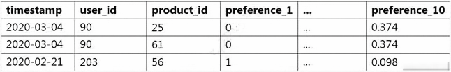

**Dữ kiện hình dạng chữ:** Table columns timestamp,user_id,product_id,preference_1,...,preference_10. Rows: 2020-03-04,90,25,0,...,0.374; 2020-03-04,90,61,0,...,0.374; 2020-02-21,203,56,1,...,0.098.

**A.** Shuffle all interaction data. Split off the last 10% of the interaction data for the test set.

**B.** Identify the most recent 10% of interactions for each user. Split off these interactions for the test set.

**C.** Identify the 10% of users with the least interaction data. Split off all interaction data from these users for the test set.

**D.** Randomly select 10% of the users. Split off all interaction data from these users for the test set.

**Đáp án sau đối chiếu: D.**

Giữ nguyên toàn bộ tương tác của người dùng test để mô phỏng khách hàng mới.

Đáp án in trong PDF: `D` (giữ để đối chiếu nguồn, không dùng làm căn cứ chấm).

Nguồn đối chiếu: [3.1. Cross-validation: evaluating estimator performance — scikit-learn 1.9.1 documentation](https://scikit-learn.org/stable/modules/cross_validation.html).

---

## Câu 131

Trang PDF: [284](../../Machine%20Learning%20-%20Specialty%20Exam.pdf#page=284) · ĐÃ ĐỐI CHIẾU

A financial services company wants to adopt Amazon SageMaker as its default data science environment. The company's data scientists run machine learning (ML) models on confidential financial data. The company is worried about data egress and wants an ML engineer to secure the environment. Which mechanisms can the ML engineer use to control data egress from SageMaker? (Choose three.)

**A.** Connect to SageMaker by using a VPC interface endpoint powered by AWS PrivateLink.

**B.** Use SCPs to restrict access to SageMaker.

**C.** Disable root access on the SageMaker notebook instances.

**D.** Enable network isolation for training jobs and models.

**E.** Restrict notebook presigned URLs to specific IPs used by the company.

**F.** Protect data with encryption at rest and in transit. Use AWS Key Management Service (AWS KMS) to manage encryption keys.

**Đáp án sau đối chiếu: A, D, E.**

PrivateLink, network isolation và giới hạn presigned URL kiểm soát đường truy cập/thoát dữ liệu; cần endpoint policy phù hợp.

Đáp án in trong PDF: `BDF` (giữ để đối chiếu nguồn, không dùng làm căn cứ chấm).

Nguồn đối chiếu: [Connect to a Notebook Instance Through a VPC Interface Endpoint - Amazon SageMaker AI](https://docs.aws.amazon.com/sagemaker/latest/dg/notebook-interface-endpoint.html).

---

## Câu 132

Trang PDF: [287](../../Machine%20Learning%20-%20Specialty%20Exam.pdf#page=287) · ĐÃ ĐỐI CHIẾU

A company needs to quickly make sense of a large amount of data and gain insight from it. The data is in different formats, the schemas change frequently, and new data sources are added regularly. The company wants to use AWS services to explore multiple data sources, suggest schemas, and enrich and transform the data. The solution should require the least possible coding effort for the data flows and the least possible infrastructure management. Which combination of AWS services will meet these requirements?

**A.** • Amazon EMR for data discovery, enrichment, and transformation • Amazon Athena for querying and analyzing the results in Amazon S3 using standard SQL • Amazon QuickSight for reporting and getting insights

**B.** • Amazon Kinesis Data Analytics for data ingestion • Amazon EMR for data discovery, enrichment, and transformation • Amazon Redshift for querying and analyzing the results in Amazon S3

**C.** • AWS Glue for data discovery, enrichment, and transformation • Amazon Athena for querying and analyzing the results in Amazon S3 using standard SQL • Amazon QuickSight for reporting and getting insights

**D.** • AWS Data Pipeline for data transfer • AWS Step Functions for orchestrating AWS Lambda jobs for data discovery, enrichment, and transformation • Amazon Athena for querying and analyzing the results in Amazon S3 using standard SQL • Amazon QuickSight for reporting and getting insights

**Đáp án sau đối chiếu: C.**

Glue khám phá/ETL, Athena SQL và QuickSight hiển thị dữ liệu với ít hạ tầng cần quản lý.

Đáp án in trong PDF: `A` (giữ để đối chiếu nguồn, không dùng làm căn cứ chấm).

Nguồn đối chiếu: [Data discovery and cataloging in AWS Glue - AWS Glue](https://docs.aws.amazon.com/glue/latest/dg/catalog-and-crawler.html); [What is Amazon Athena? - Amazon Athena](https://docs.aws.amazon.com/athena/latest/ug/what-is.html); [Gaining insights with machine learning (ML) in Amazon Quick Sight - Amazon Quick](https://docs.aws.amazon.com/quick/latest/userguide/making-data-driven-decisions-with-ml-in-quicksight.html).

---

## Câu 133

Trang PDF: [289](../../Machine%20Learning%20-%20Specialty%20Exam.pdf#page=289) · ĐÃ ĐỐI CHIẾU

A company is converting a large number of unstructured paper receipts into images. The company wants to create a model based on natural language processing (NLP) to find relevant entities such as date, location, and notes, as well as some custom entities such as receipt numbers. The company is using optical character recognition (OCR) to extract text for data labeling. However, documents are in different structures and formats, and the company is facing challenges with setting up the manual workflows for each document type. Additionally, the company trained a named entity recognition (NER) model for custom entity detection using a small sample size. This model has a very low confidence score and will require retraining with a large dataset. Which solution for text extraction and entity detection will require the LEAST amount of effort?

**A.** Extract text from receipt images by using Amazon Textract. Use the Amazon SageMaker BlazingText algorithm to train on the text for entities and custom entities.

**B.** Extract text from receipt images by using a deep learning OCR model from the AWS Marketplace. Use the NER deep learning model to extract entities.

**C.** Extract text from receipt images by using Amazon Textract. Use Amazon Comprehend for entity detection, and use Amazon Comprehend custom entity recognition for custom entity detection.

**D.** Extract text from receipt images by using a deep learning OCR model from the AWS Marketplace. Use Amazon Comprehend for entity detection, and use Amazon Comprehend custom entity recognition for custom entity detection.

**Đáp án sau đối chiếu: C.**

Textract đọc văn bản; Comprehend cung cấp entity detection và custom entity recognition.

Đáp án in trong PDF: `C` (giữ để đối chiếu nguồn, không dùng làm căn cứ chấm).

Nguồn đối chiếu: [Custom entity recognition - Amazon Comprehend](https://docs.aws.amazon.com/comprehend/latest/dg/custom-entity-recognition.html).

---

## Câu 134

Trang PDF: [291](../../Machine%20Learning%20-%20Specialty%20Exam.pdf#page=291) · ĐÃ ĐỐI CHIẾU

A company is building a predictive maintenance model based on machine learning (ML). The data is stored in a fully private Amazon S3 bucket that is encrypted at rest with AWS Key Management Service (AWS KMS) CMKs. An ML specialist must run data preprocessing by using an Amazon SageMaker Processing job that is triggered from code in an Amazon SageMaker notebook. The job should read data from Amazon S3, process it, and upload it back to the same S3 bucket. The preprocessing code is stored in a container image in Amazon Elastic Container Registry (Amazon ECR). The ML specialist needs to grant permissions to ensure a smooth data preprocessing workflow. Which set of actions should the ML specialist take to meet these requirements?

**A.** Create an IAM role that has permissions to create Amazon SageMaker Processing jobs, S3 read and write access to the relevant S3 bucket, and appropriate KMS and ECR permissions. Attach the role to the SageMaker notebook instance. Create an Amazon SageMaker Processing job from the notebook.

**B.** Create an IAM role that has permissions to create Amazon SageMaker Processing jobs. Attach the role to the SageMaker notebook instance. Create an Amazon SageMaker Processing job with an IAM role that has read and write permissions to the relevant S3 bucket, and appropriate KMS and ECR permissions.

**C.** Create an IAM role that has permissions to create Amazon SageMaker Processing jobs and to access Amazon ECR. Attach the role to the SageMaker notebook instance. Set up both an S3 endpoint and a KMS endpoint in the default VPC. Create Amazon SageMaker Processing jobs from the notebook.

**D.** Create an IAM role that has permissions to create Amazon SageMaker Processing jobs. Attach the role to the SageMaker notebook instance. Set up an S3 endpoint in the default VPC. Create Amazon SageMaker Processing jobs with the access key and secret key of the IAM user with appropriate KMS and ECR permissions.

**Đáp án sau đối chiếu: B.**

Tách role gọi job và execution role của Processing; caller còn cần iam:PassRole.

Đáp án in trong PDF: `D` (giữ để đối chiếu nguồn, không dùng làm căn cứ chấm).

Nguồn đối chiếu: [How to use SageMaker AI execution roles - Amazon SageMaker AI](https://docs.aws.amazon.com/sagemaker/latest/dg/sagemaker-roles.html).

---

## Câu 135

Trang PDF: [294](../../Machine%20Learning%20-%20Specialty%20Exam.pdf#page=294) · ĐÃ ĐỐI CHIẾU

A data scientist has been running an Amazon SageMaker notebook instance for a few weeks. During this time, a new version of Jupyter Notebook was released along with additional software updates. The security team mandates that all running SageMaker notebook instances use the latest security and software updates provided by SageMaker. How can the data scientist meet this requirements?

**A.** Call the CreateNotebookInstanceLifecycleConfig API operation

**B.** Create a new SageMaker notebook instance and mount the Amazon Elastic Block Store (Amazon EBS) volume from the original instance

**C.** Stop and then restart the SageMaker notebook instance

**D.** Call the UpdateNotebookInstanceLifecycleConfig API operation

**Đáp án sau đối chiếu: C.**

Stop/start notebook áp dụng bản cập nhật do SageMaker cung cấp.

Đáp án in trong PDF: `C` (giữ để đối chiếu nguồn, không dùng làm căn cứ chấm).

Nguồn đối chiếu: [Amazon SageMaker notebook instances - Amazon SageMaker AI](https://docs.aws.amazon.com/sagemaker/latest/dg/nbi.html).

---

## Câu 136

Trang PDF: [295](../../Machine%20Learning%20-%20Specialty%20Exam.pdf#page=295) · BỐI CẢNH DỊCH VỤ CŨ

A library is developing an automatic book-borrowing system that uses Amazon Rekognition. Images of library members' faces are stored in an Amazon S3 bucket. When members borrow books, the Amazon Rekognition CompareFaces API operation compares real faces against the stored faces in Amazon S3. The library needs to improve security by making sure that images are encrypted at rest. Also, when the images are used with Amazon Rekognition. they need to be encrypted in transit. The library also must ensure that the images are not used to improve Amazon Rekognition as a service. How should a machine learning specialist architect the solution to satisfy these requirements?

**A.** Enable server-side encryption on the S3 bucket. Submit an AWS Support ticket to opt out of allowing images to be used for improving the service, and follow the process provided by AWS Support.

**B.** Switch to using an Amazon Rekognition collection to store the images. Use the IndexFaces and SearchFacesByImage API operations instead of the CompareFaces API operation.

**C.** Switch to using the AWS GovCloud (US) Region for Amazon S3 to store images and for Amazon Rekognition to compare faces. Set up a VPN connection and only call the Amazon Rekognition API operations through the VPN.

**D.** Enable client-side encryption on the S3 bucket. Set up a VPN connection and only call the Amazon Rekognition API operations through the VPN.

**Đáp án sau đối chiếu: A.**

SSE-S3 và HTTPS bảo vệ ảnh; cơ chế opt-out hiện dùng AWS Organizations AI services policy, thay quy trình Support cũ.

Đáp án in trong PDF: `B` (giữ để đối chiếu nguồn, không dùng làm căn cứ chấm).

Nguồn đối chiếu: [AI services opt-out policies - AWS Organizations](https://docs.aws.amazon.com/organizations/latest/userguide/orgs_manage_policies_ai-opt-out.html).

---

## Câu 137

Trang PDF: [297](../../Machine%20Learning%20-%20Specialty%20Exam.pdf#page=297) · BỐI CẢNH DỊCH VỤ CŨ

A company is building a line-counting application for use in a quick-service restaurant. The company wants to use video cameras pointed at the line of customers at a given register to measure how many people are in line and deliver notifications to managers if the line grows too long. The restaurant locations have limited bandwidth for connections to external services and cannot accommodate multiple video streams without impacting other operations. Which solution should a machine learning specialist implement to meet these requirements?

**A.** Install cameras compatible with Amazon Kinesis Video Streams to stream the data to AWS over the restaurant's existing internet connection. Write an AWS Lambda function to take an image and send it to Amazon Rekognition to count the number of faces in the image. Send an Amazon Simple Notification Service (Amazon SNS) notification if the line is too long.

**B.** Deploy AWS DeepLens cameras in the restaurant to capture video. Enable Amazon Rekognition on the AWS DeepLens device, and use it to trigger a local AWS Lambda function when a person is recognized. Use the Lambda function to send an Amazon Simple Notification Service (Amazon SNS) notification if the line is too long.

**C.** Build a custom model in Amazon SageMaker to recognize the number of people in an image. Install cameras compatible with Amazon Kinesis Video Streams in the restaurant. Write an AWS Lambda function to take an image. Use the SageMaker endpoint to call the model to count people. Send an Amazon Simple Notification Service (Amazon SNS) notification if the line is too long.

**D.** Build a custom model in Amazon SageMaker to recognize the number of people in an image. Deploy AWS DeepLens cameras in the restaurant. Deploy the model to the cameras. Deploy an AWS Lambda function to the cameras to use the model to count people and send an Amazon Simple Notification Service (Amazon SNS) notification if the line is too long.

**Đáp án sau đối chiếu: D.**

Inference cục bộ đáp ứng băng thông thấp; AWS DeepLens trong lựa chọn đã ngừng hỗ trợ.

Đáp án in trong PDF: `A` (giữ để đối chiếu nguồn, không dùng làm căn cứ chấm).

Nguồn đối chiếu: [Services in Full Shutdown - AWS General Reference](https://docs.aws.amazon.com/general/latest/gr/elastictranscoder.html).

---

## Câu 138

Trang PDF: [300](../../Machine%20Learning%20-%20Specialty%20Exam.pdf#page=300) · ĐÃ ĐỐI CHIẾU

A company has set up and deployed its machine learning (ML) model into production with an endpoint using Amazon SageMaker hosting services. The ML team has configured automatic scaling for its SageMaker instances to support workload changes. During testing, the team notices that additional instances are being launched before the new instances are ready. This behavior needs to change as soon as possible. How can the ML team solve this issue?

**A.** Decrease the cooldown period for the scale-in activity. Increase the configured maximum capacity of instances.

**B.** Replace the current endpoint with a multi-model endpoint using SageMaker.

**C.** Set up Amazon API Gateway and AWS Lambda to trigger the SageMaker inference endpoint.

**D.** Increase the cooldown period for the scale-out activity.

**Đáp án sau đối chiếu: D.**

Tăng scale-out cooldown để chờ instance mới sẵn sàng trước lần scale tiếp.

Đáp án in trong PDF: `A` (giữ để đối chiếu nguồn, không dùng làm căn cứ chấm).

Nguồn đối chiếu: [Define a scaling policy - Amazon SageMaker AI](https://docs.aws.amazon.com/sagemaker/latest/dg/endpoint-auto-scaling-add-code-define.html).

---

## Câu 139

Trang PDF: [302](../../Machine%20Learning%20-%20Specialty%20Exam.pdf#page=302) · ĐÃ ĐỐI CHIẾU

A telecommunications company is developing a mobile app for its customers. The company is using an Amazon SageMaker hosted endpoint for machine learning model inferences. Developers want to introduce a new version of the model for a limited number of users who subscribed to a preview feature of the app. After the new version of the model is tested as a preview, developers will evaluate its accuracy. If a new version of the model has better accuracy, developers need to be able to gradually release the new version for all users over a fixed period of time. How can the company implement the testing model with the LEAST amount of operational overhead?

**A.** Update the ProductionVariant data type with the new version of the model by using the CreateEndpointConfig operation with the InitialVariantWeight parameter set to 0. Specify the TargetVariant parameter for InvokeEndpoint calls for users who subscribed to the preview feature. When the new version of the model is ready for release, gradually increase InitialVariantWeight until all users have the updated version.

**B.** Configure two SageMaker hosted endpoints that serve the different versions of the model. Create an Application Load Balancer (ALB) to route traffic to both endpoints based on the TargetVariant query string parameter. Reconfigure the app to send the TargetVariant query string parameter for users who subscribed to the preview feature. When the new version of the model is ready for release, change the ALB's routing algorithm to weighted until all users have the updated version.

**C.** Update the DesiredWeightsAndCapacity data type with the new version of the model by using the UpdateEndpointWeightsAndCapacities operation with the DesiredWeight parameter set to 0. Specify the TargetVariant parameter for InvokeEndpoint calls for users who subscribed to the preview feature. When the new version of the model is ready for release, gradually increase DesiredWeight until all users have the updated version.

**D.** Configure two SageMaker hosted endpoints that serve the different versions of the model. Create an Amazon Route 53 record that is configured with a simple routing policy and that points to the current version of the model. Configure the mobile app to use the endpoint URL for users who subscribed to the preview feature and to use the Route 53 record for other users. When the new version of the model is ready for release, add a new model version endpoint to Route 53, and switch the policy to weighted until all users have the updated version.

**Đáp án sau đối chiếu: A.**

Thêm model cần cấu hình endpoint mới; UpdateEndpointWeightsAndCapacities chỉ đổi variant đã tồn tại.

Đáp án in trong PDF: `D` (giữ để đối chiếu nguồn, không dùng làm căn cứ chấm).

Nguồn đối chiếu: [Testing models with production variants - Amazon SageMaker AI](https://docs.aws.amazon.com/sagemaker/latest/dg/model-ab-testing.html); [UpdateEndpointWeightsAndCapacities - Amazon SageMaker](https://docs.aws.amazon.com/sagemaker/latest/APIReference/API_UpdateEndpointWeightsAndCapacities.html).

---

## Câu 140

Trang PDF: [305](../../Machine%20Learning%20-%20Specialty%20Exam.pdf#page=305) · ĐÃ ĐỐI CHIẾU

A company offers an online shopping service to its customers. The company wants to enhance the site's security by requesting additional information when customers access the site from locations that are different from their normal location. The company wants to update the process to call a machine learning (ML) model to determine when additional information should be requested. The company has several terabytes of data from its existing ecommerce web servers containing the source IP addresses for each request made to the web server. For authenticated requests, the records also contain the login name of the requesting user. Which approach should an ML specialist take to implement the new security feature in the web application?

**A.** Use Amazon SageMaker Ground Truth to label each record as either a successful or failed access attempt. Use Amazon SageMaker to train a binary classification model using the factorization machines (FM) algorithm.

**B.** Use Amazon SageMaker to train a model using the IP Insights algorithm. Schedule updates and retraining of the model using new log data nightly.

**C.** Use Amazon SageMaker Ground Truth to label each record as either a successful or failed access attempt. Use Amazon SageMaker to train a binary classification model using the IP Insights algorithm.

**D.** Use Amazon SageMaker to train a model using the Object2Vec algorithm. Schedule updates and retraining of the model using new log data nightly.

**Đáp án sau đối chiếu: B.**

IP Insights học quan hệ giữa user/entity và IP từ dữ liệu không nhãn.

Đáp án in trong PDF: `C` (giữ để đối chiếu nguồn, không dùng làm căn cứ chấm).

Nguồn đối chiếu: [IP Insights - Amazon SageMaker AI](https://docs.aws.amazon.com/sagemaker/latest/dg/ip-insights.html).

---

## Câu 141

Trang PDF: [306](../../Machine%20Learning%20-%20Specialty%20Exam.pdf#page=306) · ĐÃ ĐỐI CHIẾU

A retail company wants to combine its customer orders with the product description data from its product catalog. The structure and format of the records in each dataset is different. A data analyst tried to use a spreadsheet to combine the datasets, but the effort resulted in duplicate records and records that were not properly combined. The company needs a solution that it can use to combine similar records from the two datasets and remove any duplicates. Which solution will meet these requirements?

**A.** Use an AWS Lambda function to process the data. Use two arrays to compare equal strings in the fields from the two datasets and remove any duplicates.

**B.** Create AWS Glue crawlers for reading and populating the AWS Glue Data Catalog. Call the AWS Glue SearchTables API operation to perform a fuzzy- matching search on the two datasets, and cleanse the data accordingly.

**C.** Create AWS Glue crawlers for reading and populating the AWS Glue Data Catalog. Use the FindMatches transform to cleanse the data.

**D.** Create an AWS Lake Formation custom transform. Run a transformation for matching products from the Lake Formation console to cleanse the data automatically.

**Đáp án sau đối chiếu: C.**

FindMatches hỗ trợ nối các entity tương tự và loại trùng khi chuỗi không khớp hoàn toàn.

Đáp án in trong PDF: `D` (giữ để đối chiếu nguồn, không dùng làm căn cứ chấm).

Nguồn đối chiếu: [Record matching with AWS Lake Formation FindMatches - AWS Glue](https://docs.aws.amazon.com/glue/latest/dg/machine-learning.html).

---

## Câu 142

Trang PDF: [308](../../Machine%20Learning%20-%20Specialty%20Exam.pdf#page=308) · ĐÃ ĐỐI CHIẾU

A company provisions Amazon SageMaker notebook instances for its data science team and creates Amazon VPC interface endpoints to ensure communication between the VPC and the notebook instances. All connections to the Amazon SageMaker API are contained entirely and securely using the AWS network. However, the data science team realizes that individuals outside the VPC can still connect to the notebook instances across the internet. Which set of actions should the data science team take to fix the issue?

**A.** Modify the notebook instances' security group to allow traffic only from the CIDR ranges of the VPC. Apply this security group to all of the notebook instances' VPC interfaces.

**B.** Create an IAM policy that allows the sagemaker:CreatePresignedNotebooklnstanceUrl and sagemaker:DescribeNotebooklnstance actions from only the VPC endpoints. Apply this policy to all IAM users, groups, and roles used to access the notebook instances.

**C.** Add a NAT gateway to the VPC. Convert all of the subnets where the Amazon SageMaker notebook instances are hosted to private subnets. Stop and start all of the notebook instances to reassign only private IP addresses.

**D.** Change the network ACL of the subnet the notebook is hosted in to restrict access to anyone outside the VPC.

**Đáp án sau đối chiếu: B.**

IAM condition theo VPC endpoint giới hạn quyền tạo và sử dụng presigned notebook URL.

Đáp án in trong PDF: `B` (giữ để đối chiếu nguồn, không dùng làm căn cứ chấm).

Nguồn đối chiếu: [Connect to a Notebook Instance Through a VPC Interface Endpoint - Amazon SageMaker AI](https://docs.aws.amazon.com/sagemaker/latest/dg/notebook-interface-endpoint.html).

---

## Câu 143

Trang PDF: [311](../../Machine%20Learning%20-%20Specialty%20Exam.pdf#page=311) · ĐÃ ĐỐI CHIẾU

A company will use Amazon SageMaker to train and host a machine learning (ML) model for a marketing campaign. The majority of data is sensitive customer data. The data must be encrypted at rest. The company wants AWS to maintain the root of trust for the master keys and wants encryption key usage to be logged. Which implementation will meet these requirements?

**A.** Use encryption keys that are stored in AWS Cloud HSM to encrypt the ML data volumes, and to encrypt the model artifacts and data in Amazon S3.

**B.** Use SageMaker built-in transient keys to encrypt the ML data volumes. Enable default encryption for new Amazon Elastic Block Store (Amazon EBS) volumes.

**C.** Use customer managed keys in AWS Key Management Service (AWS KMS) to encrypt the ML data volumes, and to encrypt the model artifacts and data in Amazon S3.

**D.** Use AWS Security Token Service (AWS STS) to create temporary tokens to encrypt the ML storage volumes, and to encrypt the model artifacts and data in Amazon S3.

**Đáp án sau đối chiếu: C.**

Customer managed KMS key hỗ trợ mã hóa volumes/S3 và ghi log sử dụng khóa.

Đáp án in trong PDF: `C` (giữ để đối chiếu nguồn, không dùng làm căn cứ chấm).

Nguồn đối chiếu: [Protect Data at Rest Using Encryption - Amazon SageMaker AI](https://docs.aws.amazon.com/sagemaker/latest/dg/encryption-at-rest.html).

---

## Câu 144

Trang PDF: [312](../../Machine%20Learning%20-%20Specialty%20Exam.pdf#page=312) · ĐÃ ĐỐI CHIẾU

A machine learning specialist stores IoT soil sensor data in Amazon DynamoDB table and stores weather event data as JSON files in Amazon S3. The dataset in DynamoDB is 10 GB in size and the dataset in Amazon S3 is 5 GB in size. The specialist wants to train a model on this data to help predict soil moisture levels as a function of weather events using Amazon SageMaker. Which solution will accomplish the necessary transformation to train the Amazon SageMaker model with the LEAST amount of administrative overhead?

**A.** Launch an Amazon EMR cluster. Create an Apache Hive external table for the DynamoDB table and S3 data. Join the Hive tables and write the results out to Amazon S3.

**B.** Crawl the data using AWS Glue crawlers. Write an AWS Glue ETL job that merges the two tables and writes the output to an Amazon Redshift cluster.

**C.** Enable Amazon DynamoDB Streams on the sensor table. Write an AWS Lambda function that consumes the stream and appends the results to the existing weather files in Amazon S3.

**D.** Crawl the data using AWS Glue crawlers. Write an AWS Glue ETL job that merges the two tables and writes the output in CSV format to Amazon S3.

**Đáp án sau đối chiếu: D.**

Glue đọc hai nguồn, join và ghi CSV vào S3 cho training.

Đáp án in trong PDF: `C` (giữ để đối chiếu nguồn, không dùng làm căn cứ chấm).

Nguồn đối chiếu: [Program AWS Glue ETL scripts in PySpark - AWS Glue](https://docs.aws.amazon.com/glue/latest/dg/aws-glue-programming-python.html).

---

## Câu 145

Trang PDF: [313](../../Machine%20Learning%20-%20Specialty%20Exam.pdf#page=313) · ĐÃ ĐỐI CHIẾU

A company sells thousands of products on a public website and wants to automatically identify products with potential durability problems. The company has 1.000 reviews with date, star rating, review text, review summary, and customer email fields, but many reviews are incomplete and have empty fields. Each review has already been labeled with the correct durability result. A machine learning specialist must train a model to identify reviews expressing concerns over product durability. The first model needs to be trained and ready to review in 2 days. What is the MOST direct approach to solve this problem within 2 days?

**A.** Train a custom classifier by using Amazon Comprehend.

**B.** Build a recurrent neural network (RNN) in Amazon SageMaker by using Gluon and Apache MXNet.

**C.** Train a built-in BlazingText model using Word2Vec mode in Amazon SageMaker.

**D.** Use a built-in seq2seq model in Amazon SageMaker.

**Đáp án sau đối chiếu: A.**

Comprehend custom classification huấn luyện trực tiếp từ văn bản đã gán nhãn.

Đáp án in trong PDF: `B` (giữ để đối chiếu nguồn, không dùng làm căn cứ chấm).

Nguồn đối chiếu: [Custom classification - Amazon Comprehend](https://docs.aws.amazon.com/comprehend/latest/dg/how-document-classification.html).

---

## Câu 146

Trang PDF: [315](../../Machine%20Learning%20-%20Specialty%20Exam.pdf#page=315) · ĐÃ ĐỐI CHIẾU

A company that runs an online library is implementing a chatbot using Amazon Lex to provide book recommendations based on category. This intent is fulfilled by an AWS Lambda function that queries an Amazon DynamoDB table for a list of book titles, given a particular category. For testing, there are only three categories implemented as the custom slot types: "comedy," "adventure,` and "documentary.` A machine learning (ML) specialist notices that sometimes the request cannot be fulfilled because Amazon Lex cannot understand the category spoken by users with utterances such as "funny," "fun," and "humor." The ML specialist needs to fix the problem without changing the Lambda code or data in DynamoDB. How should the ML specialist fix the problem?

**A.** Add the unrecognized words in the enumeration values list as new values in the slot type.

**B.** Create a new custom slot type, add the unrecognized words to this slot type as enumeration values, and use this slot type for the slot.

**C.** Use the AMAZON.SearchQuery built-in slot types for custom searches in the database.

**D.** Add the unrecognized words as synonyms in the custom slot type.

**Đáp án sau đối chiếu: D.**

Slot synonyms ánh xạ các cách nói khác nhau về giá trị chuẩn.

Đáp án in trong PDF: `C` (giữ để đối chiếu nguồn, không dùng làm căn cứ chấm).

Nguồn đối chiếu: [Custom slot type - Amazon Lex](https://docs.aws.amazon.com/lexv2/latest/dg/custom-slot-types.html).

---

## Câu 147

Trang PDF: [317](../../Machine%20Learning%20-%20Specialty%20Exam.pdf#page=317) · ĐÃ ĐỐI CHIẾU

A manufacturing company uses machine learning (ML) models to detect quality issues. The models use images that are taken of the company's product at the end of each production step. The company has thousands of machines at the production site that generate one image per second on average. The company ran a successful pilot with a single manufacturing machine. For the pilot, ML specialists used an industrial PC that ran AWS IoT Greengrass with a long-running AWS Lambda function that uploaded the images to Amazon S3. The uploaded images invoked a Lambda function that was written in Python to perform inference by using an Amazon SageMaker endpoint that ran a custom model. The inference results were forwarded back to a web service that was hosted at the production site to prevent faulty products from being shipped. The company scaled the solution out to all manufacturing machines by installing similarly configured industrial PCs on each production machine. However, latency for predictions increased beyond acceptable limits. Analysis shows that the internet connection is at its capacity limit. How can the company resolve this issue MOST cost-effectively?

**A.** Set up a 10 Gbps AWS Direct Connect connection between the production site and the nearest AWS Region. Use the Direct Connect connection to upload the images. Increase the size of the instances and the number of instances that are used by the SageMaker endpoint.

**B.** Extend the long-running Lambda function that runs on AWS IoT Greengrass to compress the images and upload the compressed files to Amazon S3. Decompress the files by using a separate Lambda function that invokes the existing Lambda function to run the inference pipeline.

**C.** Use auto scaling for SageMaker. Set up an AWS Direct Connect connection between the production site and the nearest AWS Region. Use the Direct Connect connection to upload the images.

**D.** Deploy the Lambda function and the ML models onto the AWS IoT Greengrass core that is running on the industrial PCs that are installed on each machine. Extend the long-running Lambda function that runs on AWS IoT Greengrass to invoke the Lambda function with the captured images and run the inference on the edge component that forwards the results directly to the web service.

**Đáp án sau đối chiếu: D.**

Đưa model xuống Greengrass tránh tải luồng ảnh lên internet cho mỗi inference.

Đáp án in trong PDF: `D` (giữ để đối chiếu nguồn, không dùng làm căn cứ chấm).

Nguồn đối chiếu: [Perform machine learning inference - AWS IoT Greengrass](https://docs.aws.amazon.com/greengrass/v2/developerguide/perform-machine-learning-inference.html).

---

## Câu 148

Trang PDF: [318](../../Machine%20Learning%20-%20Specialty%20Exam.pdf#page=318) · ĐÃ ĐỐI CHIẾU

A data scientist is using an Amazon SageMaker notebook instance and needs to securely access data stored in a specific Amazon S3 bucket. How should the data scientist accomplish this?

**A.** Add an S3 bucket policy allowing GetObject, PutObject, and ListBucket permissions to the Amazon SageMaker notebook ARN as principal.

**B.** Encrypt the objects in the S3 bucket with a custom AWS Key Management Service (AWS KMS) key that only the notebook owner has access to.

**C.** Attach the policy to the IAM role associated with the notebook that allows GetObject, PutObject, and ListBucket operations to the specific S3 bucket.

**D.** Use a script in a lifecycle configuration to configure the AWS CLI on the instance with an access key ID and secret.

**Đáp án sau đối chiếu: C.**

Notebook sử dụng execution role; cấp quyền S3 cho role thay vì notebook ARN hoặc access key.

Đáp án in trong PDF: `C` (giữ để đối chiếu nguồn, không dùng làm căn cứ chấm).

Nguồn đối chiếu: [How to use SageMaker AI execution roles - Amazon SageMaker AI](https://docs.aws.amazon.com/sagemaker/latest/dg/sagemaker-roles.html).

---

## Câu 149

Trang PDF: [320](../../Machine%20Learning%20-%20Specialty%20Exam.pdf#page=320) · ĐÃ ĐỐI CHIẾU

A company is launching a new product and needs to build a mechanism to monitor comments about the company and its new product on social media. The company needs to be able to evaluate the sentiment expressed in social media posts, and visualize trends and configure alarms based on various thresholds. The company needs to implement this solution quickly, and wants to minimize the infrastructure and data science resources needed to evaluate the messages. The company already has a solution in place to collect posts and store them within an Amazon S3 bucket. What services should the data science team use to deliver this solution?

**A.** Train a model in Amazon SageMaker by using the BlazingText algorithm to detect sentiment in the corpus of social media posts. Expose an endpoint that can be called by AWS Lambda. Trigger a Lambda function when posts are added to the S3 bucket to invoke the endpoint and record the sentiment in an Amazon DynamoDB table and in a custom Amazon CloudWatch metric. Use CloudWatch alarms to notify analysts of trends.

**B.** Train a model in Amazon SageMaker by using the semantic segmentation algorithm to model the semantic content in the corpus of social media posts. Expose an endpoint that can be called by AWS Lambda. Trigger a Lambda function when objects are added to the S3 bucket to invoke the endpoint and record the sentiment in an Amazon DynamoDB table. Schedule a second Lambda function to query recently added records and send an Amazon Simple Notification Service (Amazon SNS) notification to notify analysts of trends.

**C.** Trigger an AWS Lambda function when social media posts are added to the S3 bucket. Call Amazon Comprehend for each post to capture the sentiment in the message and record the sentiment in an Amazon DynamoDB table. Schedule a second Lambda function to query recently added records and send an Amazon Simple Notification Service (Amazon SNS) notification to notify analysts of trends.

**D.** Trigger an AWS Lambda function when social media posts are added to the S3 bucket. Call Amazon Comprehend for each post to capture the sentiment in the message and record the sentiment in a custom Amazon CloudWatch metric and in S3. Use CloudWatch alarms to notify analysts of trends.

**Đáp án sau đối chiếu: D.**

Comprehend phân tích sentiment; CloudWatch metric/alarm hỗ trợ xu hướng và cảnh báo.

Đáp án in trong PDF: `A` (giữ để đối chiếu nguồn, không dùng làm căn cứ chấm).

Nguồn đối chiếu: [Sentiment - Amazon Comprehend](https://docs.aws.amazon.com/comprehend/latest/dg/how-sentiment.html); [Amazon SageMaker AI metrics in Amazon CloudWatch - Amazon SageMaker AI](https://docs.aws.amazon.com/sagemaker/latest/dg/monitoring-cloudwatch.html).

---

## Câu 150

Trang PDF: [322](../../Machine%20Learning%20-%20Specialty%20Exam.pdf#page=322) · ĐÃ ĐỐI CHIẾU

A bank wants to launch a low-rate credit promotion. The bank is located in a town that recently experienced economic hardship. Only some of the bank's customers were affected by the crisis, so the bank's credit team must identify which customers to target with the promotion. However, the credit team wants to make sure that loyal customers' full credit history is considered when the decision is made. The bank's data science team developed a model that classifies account transactions and understands credit eligibility. The data science team used the XGBoost algorithm to train the model. The team used 7 years of bank transaction historical data for training and hyperparameter tuning over the course of several days. The accuracy of the model is sufficient, but the credit team is struggling to explain accurately why the model denies credit to some customers. The credit team has almost no skill in data science. What should the data science team do to address this issue in the MOST operationally efficient manner?

**A.** Use Amazon SageMaker Studio to rebuild the model. Create a notebook that uses the XGBoost training container to perform model training. Deploy the model at an endpoint. Enable Amazon SageMaker Model Monitor to store inferences. Use the inferences to create Shapley values that help explain model behavior. Create a chart that shows features and SHapley Additive exPlanations (SHAP) values to explain to the credit team how the features affect the model outcomes.

**B.** Use Amazon SageMaker Studio to rebuild the model. Create a notebook that uses the XGBoost training container to perform model training. Activate Amazon SageMaker Debugger, and configure it to calculate and collect Shapley values. Create a chart that shows features and SHapley Additive exPlanations (SHAP) values to explain to the credit team how the features affect the model outcomes.

**C.** Create an Amazon SageMaker notebook instance. Use the notebook instance and the XGBoost library to locally retrain the model. Use the plot_importance() method in the Python XGBoost interface to create a feature importance chart. Use that chart to explain to the credit team how the features affect the model outcomes.

**D.** Use Amazon SageMaker Studio to rebuild the model. Create a notebook that uses the XGBoost training container to perform model training. Deploy the model at an endpoint. Use Amazon SageMaker Processing to post-analyze the model and create a feature importance explainability chart automatically for the credit team.

**Đáp án sau đối chiếu: B.**

Debugger hỗ trợ thu thập SHAP values của XGBoost để giải thích dự đoán.

Đáp án in trong PDF: `C` (giữ để đối chiếu nguồn, không dùng làm căn cứ chấm).

Nguồn đối chiếu: [Bias and Explainability - Machine Learning Best Practices for Public Sector Organizations](https://docs.aws.amazon.com/whitepapers/latest/ml-best-practices-public-sector-organizations/bias-and-explainability.html).

---

## Câu 151

Trang PDF: [325](../../Machine%20Learning%20-%20Specialty%20Exam.pdf#page=325) · ĐÃ ĐỐI CHIẾU

A data science team is planning to build a natural language processing (NLP) application. The application's text preprocessing stage will include part-of-speech tagging and key phase extraction. The preprocessed text will be input to a custom classification algorithm that the data science team has already written and trained using Apache MXNet. Which solution can the team build MOST quickly to meet these requirements?

**A.** Use Amazon Comprehend for the part-of-speech tagging, key phase extraction, and classification tasks.

**B.** Use an NLP library in Amazon SageMaker for the part-of-speech tagging. Use Amazon Comprehend for the key phase extraction. Use AWS Deep Learning Containers with Amazon SageMaker to build the custom classifier.

**C.** Use Amazon Comprehend for the part-of-speech tagging and key phase extraction tasks. Use Amazon SageMaker built-in Latent Dirichlet Allocation (LDA) algorithm to build the custom classifier.

**D.** Use Amazon Comprehend for the part-of-speech tagging and key phase extraction tasks. Use AWS Deep Learning Containers with Amazon SageMaker to build the custom classifier.

**Đáp án sau đối chiếu: D.**

Comprehend hỗ trợ syntax/key phrases; container SageMaker dùng classifier MXNet có sẵn.

Đáp án in trong PDF: `B` (giữ để đối chiếu nguồn, không dùng làm căn cứ chấm).

Nguồn đối chiếu: [Syntax analysis - Amazon Comprehend](https://docs.aws.amazon.com/comprehend/latest/dg/how-syntax.html); [Custom Inference Code with Hosting Services - Amazon SageMaker AI](https://docs.aws.amazon.com/sagemaker/latest/dg/your-algorithms-inference-code.html).

---

## Câu 152

Trang PDF: [328](../../Machine%20Learning%20-%20Specialty%20Exam.pdf#page=328) · ĐÃ ĐỐI CHIẾU

A machine learning (ML) specialist must develop a classification model for a financial services company. A domain expert provides the dataset, which is tabular with 10,000 rows and 1,020 features. During exploratory data analysis, the specialist finds no missing values and a small percentage of duplicate rows. There are correlation scores of > 0.9 for 200 feature pairs. The mean value of each feature is similar to its 50th percentile. Which feature engineering strategy should the ML specialist use with Amazon SageMaker?

**A.** Apply dimensionality reduction by using the principal component analysis (PCA) algorithm.

**B.** Drop the features with low correlation scores by using a Jupyter notebook.

**C.** Apply anomaly detection by using the Random Cut Forest (RCF) algorithm.

**D.** Concatenate the features with high correlation scores by using a Jupyter notebook.

**Đáp án sau đối chiếu: A.**

PCA giảm các đặc trưng tương quan mạnh.

Đáp án in trong PDF: `C` (giữ để đối chiếu nguồn, không dùng làm căn cứ chấm).

Nguồn đối chiếu: [Principal Component Analysis (PCA) Algorithm - Amazon SageMaker AI](https://docs.aws.amazon.com/sagemaker/latest/dg/pca.html).

---

## Câu 153

Trang PDF: [330](../../Machine%20Learning%20-%20Specialty%20Exam.pdf#page=330) · ĐÃ ĐỐI CHIẾU

A manufacturing company asks its machine learning specialist to develop a model that classifies defective parts into one of eight defect types. The company has provided roughly 100,000 images per defect type for training. During the initial training of the image classification model, the specialist notices that the validation accuracy is 80%, while the training accuracy is 90%. It is known that human-level performance for this type of image classification is around 90%. What should the specialist consider to fix this issue?

**A.** A longer training time

**B.** Making the network larger

**C.** Using a different optimizer

**D.** Using some form of regularization

**Đáp án sau đối chiếu: D.**

Training gần mức con người nhưng validation thấp cho thấy variance cao; tăng regularization.

Đáp án in trong PDF: `D` (giữ để đối chiếu nguồn, không dùng làm căn cứ chấm).

Nguồn đối chiếu: [Model Fit: Underfitting vs. Overfitting - Amazon Machine Learning](https://docs.aws.amazon.com/machine-learning/latest/dg/model-fit-underfitting-vs-overfitting.html).

---

## Câu 154

Trang PDF: [332](../../Machine%20Learning%20-%20Specialty%20Exam.pdf#page=332) · BỐI CẢNH DỊCH VỤ CŨ

A machine learning specialist needs to analyze comments on a news website with users across the globe. The specialist must find the most discussed topics in the comments that are in either English or Spanish. What steps could be used to accomplish this task? (Choose two.)

**A.** Use an Amazon SageMaker BlazingText algorithm to find the topics independently from language. Proceed with the analysis.

**B.** Use an Amazon SageMaker seq2seq algorithm to translate from Spanish to English, if necessary. Use a SageMaker Latent Dirichlet Allocation (LDA) algorithm to find the topics.

**C.** Use Amazon Translate to translate from Spanish to English, if necessary. Use Amazon Comprehend topic modeling to find the topics.

**D.** Use Amazon Translate to translate from Spanish to English, if necessary. Use Amazon Lex to extract topics form the content.

**E.** Use Amazon Translate to translate from Spanish to English, if necessary. Use Amazon SageMaker Neural Topic Model (NTM) to find the topics.

**Đáp án sau đối chiếu: C, E.**

Translate kết hợp Comprehend topic modeling hoặc SageMaker NTM; BlazingText không phải topic modeling. Comprehend topic modeling hiện không mở cho khách hàng mới.

Đáp án in trong PDF: `B` (giữ để đối chiếu nguồn, không dùng làm căn cứ chấm).

Ghi chú bản gốc: PDF answer has 1 choice(s), but the question requires 2.

Nguồn đối chiếu: [Topic modeling - Amazon Comprehend](https://docs.aws.amazon.com/comprehend/latest/dg/topic-modeling.html); [Neural Topic Model (NTM) Algorithm - Amazon SageMaker AI](https://docs.aws.amazon.com/sagemaker/latest/dg/ntm.html).

---

## Câu 155

Trang PDF: [335](../../Machine%20Learning%20-%20Specialty%20Exam.pdf#page=335) · ĐÃ ĐỐI CHIẾU

A machine learning (ML) specialist is administering a production Amazon SageMaker endpoint with model monitoring configured. Amazon SageMaker Model Monitor detects violations on the SageMaker endpoint, so the ML specialist retrains the model with the latest dataset. This dataset is statistically representative of the current production traffic. The ML specialist notices that even after deploying the new SageMaker model and running the first monitoring job, the SageMaker endpoint still has violations. What should the ML specialist do to resolve the violations?

**A.** Manually trigger the monitoring job to re-evaluate the SageMaker endpoint traffic sample.

**B.** Run the Model Monitor baseline job again on the new training set. Configure Model Monitor to use the new baseline.

**C.** Delete the endpoint and recreate it with the original configuration.

**D.** Retrain the model again by using a combination of the original training set and the new training set.

**Đáp án sau đối chiếu: B.**

Model mới cần baseline phù hợp tập training mới trước khi đánh giá drift.

Đáp án in trong PDF: `B` (giữ để đối chiếu nguồn, không dùng làm căn cứ chấm).

Nguồn đối chiếu: [Create a Baseline - Amazon SageMaker AI](https://docs.aws.amazon.com/sagemaker/latest/dg/model-monitor-create-baseline.html).

---

## Câu 156

Trang PDF: [337](../../Machine%20Learning%20-%20Specialty%20Exam.pdf#page=337) · CẦN XÁC MINH / SỬA ĐỀ

A company supplies wholesale clothing to thousands of retail stores. A data scientist must create a model that predicts the daily sales volume for each item for each store. The data scientist discovers that more than half of the stores have been in business for less than 6 months. Sales data is highly consistent from week to week. Daily data from the database has been aggregated weekly, and weeks with no sales are omitted from the current dataset. Five years (100 MB) of sales data is available in Amazon S3. Which factors will adversely impact the performance of the forecast model to be developed, and which actions should the data scientist take to mitigate them? (Choose two.)

**A.** Detecting seasonality for the majority of stores will be an issue. Request categorical data to relate new stores with similar stores that have more historical data.

**B.** The sales data does not have enough variance. Request external sales data from other industries to improve the model's ability to generalize.

**C.** Sales data is aggregated by week. Request daily sales data from the source database to enable building a daily model.

**D.** The sales data is missing zero entries for item sales. Request that item sales data from the source database include zero entries to enable building the model.

**E.** Only 100 MB of sales data is available in Amazon S3. Request 10 years of sales data, which would provide 200 MB of training data for the model.

**Chưa chốt đáp án.**

C và D trực tiếp sửa độ phân giải và dữ liệu zero bị bỏ; A cũng có thể hỗ trợ cold-start/seasonality. Đề chưa loại trừ một bộ đôi duy nhất.

Đáp án in trong PDF: `AB` (giữ để đối chiếu nguồn, không dùng làm căn cứ chấm).

Nguồn đối chiếu: [Use the SageMaker AI DeepAR forecasting algorithm - Amazon SageMaker AI](https://docs.aws.amazon.com/sagemaker/latest/dg/deepar.html); [Handling Missing Values - Amazon Forecast](https://docs.aws.amazon.com/forecast/latest/dg/howitworks-missing-values.html).

---

## Câu 157

Trang PDF: [339](../../Machine%20Learning%20-%20Specialty%20Exam.pdf#page=339) · ĐÃ ĐỐI CHIẾU

An ecommerce company is automating the categorization of its products based on images. A data scientist has trained a computer vision model using the Amazon SageMaker image classification algorithm. The images for each product are classified according to specific product lines. The accuracy of the model is too low when categorizing new products. All of the product images have the same dimensions and are stored within an Amazon S3 bucket. The company wants to improve the model so it can be used for new products as soon as possible. Which steps would improve the accuracy of the solution? (Choose three.)

**A.** Use the SageMaker semantic segmentation algorithm to train a new model to achieve improved accuracy.

**B.** Use the Amazon Rekognition DetectLabels API to classify the products in the dataset.

**C.** Augment the images in the dataset. Use open source libraries to crop, resize, flip, rotate, and adjust the brightness and contrast of the images.

**D.** Use a SageMaker notebook to implement the normalization of pixels and scaling of the images. Store the new dataset in Amazon S3.

**E.** Use Amazon Rekognition Custom Labels to train a new model.

**F.** Check whether there are class imbalances in the product categories, and apply oversampling or undersampling as required. Store the new dataset in Amazon S3.

**Đáp án sau đối chiếu: C, E, F.**

Augmentation, cân bằng lớp và Custom Labels là ba hướng phù hợp trong các lựa chọn; cần đánh giá lại trên validation set.

Đáp án in trong PDF: `BCE` (giữ để đối chiếu nguồn, không dùng làm căn cứ chấm).

Nguồn đối chiếu: [Data augmentation  |  TensorFlow Core](https://www.tensorflow.org/tutorials/images/data_augmentation); [What is Amazon Rekognition Custom Labels? - Rekognition](https://docs.aws.amazon.com/rekognition/latest/customlabels-dg/what-is.html); [Linear learner hyperparameters - Amazon SageMaker AI](https://docs.aws.amazon.com/sagemaker/latest/dg/ll_hyperparameters.html); [Image Classification Hyperparameters - Amazon SageMaker AI](https://docs.aws.amazon.com/sagemaker/latest/dg/IC-Hyperparameter.html).

---

## Câu 158

Trang PDF: [342](../../Machine%20Learning%20-%20Specialty%20Exam.pdf#page=342) · ĐÃ ĐỐI CHIẾU

A data scientist is training a text classification model by using the Amazon SageMaker built-in BlazingText algorithm. There are 5 classes in the dataset, with 300 samples for category A, 292 samples for category B, 240 samples for category C, 258 samples for category D, and 310 samples for category E. The data scientist shuffles the data and splits off 10% for testing. After training the model, the data scientist generates confusion matrices for the training and test sets. What could the data scientist conclude form these results?

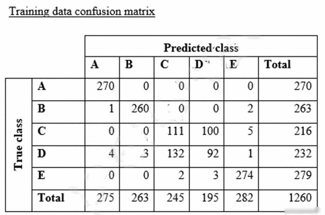

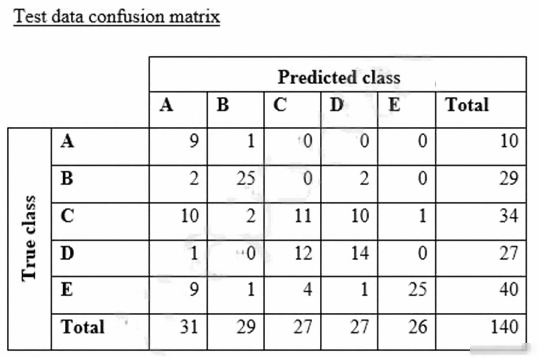

**Dữ kiện hình dạng chữ:** Two confusion matrices, rows=True A–E and columns=Predicted A–E. Training: A[270,0,0,0,0]; B[1,260,0,0,2]; C[0,0,111,100,5]; D[4,3,132,92,1]; E[0,0,2,3,274]. Column totals [275,263,245,195,282], total 1260. Test: A[9,1,0,0,0]; B[2,25,0,2,0]; C[10,2,11,10,1]; D[1,0,12,14,0]; E[9,1,4,1,25]. Column totals [31,29,27,27,26], total 140.

**A.** Classes C and D are too similar.

**B.** The dataset is too small for holdout cross-validation.

**C.** The data distribution is skewed.

**D.** The model is overfitting for classes B and E.

**Đáp án sau đối chiếu: A.**

Hai ma trận đều nhầm C với D nhiều; lỗi này xuất hiện cả trong training.

Đáp án in trong PDF: `B` (giữ để đối chiếu nguồn, không dùng làm căn cứ chấm).

Nguồn đối chiếu: [Binary Model Insights - Amazon Machine Learning](https://docs.aws.amazon.com/machine-learning/latest/dg/binary-model-insights.html).

---

## Câu 159

Trang PDF: [345](../../Machine%20Learning%20-%20Specialty%20Exam.pdf#page=345) · CẦN XÁC MINH / SỬA ĐỀ

A company that manufactures mobile devices wants to determine and calibrate the appropriate sales price for its devices. The company is collecting the relevant data and is determining data features that it can use to train machine learning (ML) models. There are more than 1,000 features, and the company wants to determine the primary features that contribute to the sales price. Which techniques should the company use for feature selection? (Choose three.)

**A.** Data scaling with standardization and normalization

**B.** Correlation plot with heat maps

**C.** Data binning

**D.** Univariate selection

**E.** Feature importance with a tree-based classifier

**F.** Data augmentation

**Chưa chốt đáp án.** Phương án tham khảo có điều kiện: **B, D, E**.

B/D/E là nhóm chọn đặc trưng; E ghi classifier dù giá bán liên tục cần regressor hoặc cách chia nhãn rõ ràng.

Đáp án in trong PDF: `CDF` (giữ để đối chiếu nguồn, không dùng làm căn cứ chấm).

Nguồn đối chiếu: [1.13. Feature selection — scikit-learn 1.9.1 documentation](https://scikit-learn.org/stable/modules/feature_selection.html).

---

## Câu 160

Trang PDF: [347](../../Machine%20Learning%20-%20Specialty%20Exam.pdf#page=347) · BỐI CẢNH DỊCH VỤ CŨ

A power company wants to forecast future energy consumption for its customers in residential properties and commercial business properties. Historical power consumption data for the last 10 years is available. A team of data scientists who performed the initial data analysis and feature selection will include the historical power consumption data and data such as weather, number of individuals on the property, and public holidays. The data scientists are using Amazon Forecast to generate the forecasts. Which algorithm in Forecast should the data scientists use to meet these requirements?

**A.** Autoregressive Integrated Moving Average (AIRMA)

**B.** Exponential Smoothing (ETS)

**C.** Convolutional Neural Network - Quantile Regression (CNN-QR)

**D.** Prophet

**Đáp án sau đối chiếu: C.**

CNN-QR hỗ trợ nhiều chuỗi cùng covariates và metadata trong Forecast.

Đáp án in trong PDF: `B` (giữ để đối chiếu nguồn, không dùng làm căn cứ chấm).

Nguồn đối chiếu: [CNN-QR Algorithm - Amazon Forecast](https://docs.aws.amazon.com/forecast/latest/dg/aws-forecast-algo-cnnqr.html); [Document History for Amazon Forecast - Amazon Forecast](https://docs.aws.amazon.com/forecast/latest/dg/doc-history.html).

---

## Câu 161

Trang PDF: [349](../../Machine%20Learning%20-%20Specialty%20Exam.pdf#page=349) · ĐÃ ĐỐI CHIẾU

A company wants to use automatic speech recognition (ASR) to transcribe messages that are less than 60 seconds long from a voicemail-style application. The company requires the correct identification of 200 unique product names, some of which have unique spellings or pronunciations. The company has 4,000 words of Amazon SageMaker Ground Truth voicemail transcripts it can use to customize the chosen ASR model. The company needs to ensure that everyone can update their customizations multiple times each hour. Which approach will maximize transcription accuracy during the development phase?

**A.** Use a voice-driven Amazon Lex bot to perform the ASR customization. Create customer slots within the bot that specifically identify each of the required product names. Use the Amazon Lex synonym mechanism to provide additional variations of each product name as mis-transcriptions are identified in development.

**B.** Use Amazon Transcribe to perform the ASR customization. Analyze the word confidence scores in the transcript, and automatically create or update a custom vocabulary file with any word that has a confidence score below an acceptable threshold value. Use this updated custom vocabulary file in all future transcription tasks.

**C.** Create a custom vocabulary file containing each product name with phonetic pronunciations, and use it with Amazon Transcribe to perform the ASR customization. Analyze the transcripts and manually update the custom vocabulary file to include updated or additional entries for those names that are not being correctly identified.

**D.** Use the audio transcripts to create a training dataset and build an Amazon Transcribe custom language model. Analyze the transcripts and update the training dataset with a manually corrected version of transcripts where product names are not being transcribed correctly. Create an updated custom language model.

**Đáp án sau đối chiếu: C.**

Custom vocabulary nhắm vào tên sản phẩm và chỉnh nhanh; custom language model cần corpus lớn hơn.

Đáp án in trong PDF: `A` (giữ để đối chiếu nguồn, không dùng làm căn cứ chấm).

Nguồn đối chiếu: [Custom vocabularies - Amazon Transcribe](https://docs.aws.amazon.com/transcribe/latest/dg/custom-vocabulary.html).

---

## Câu 162

Trang PDF: [351](../../Machine%20Learning%20-%20Specialty%20Exam.pdf#page=351) · ĐÃ ĐỐI CHIẾU

A company is building a demand forecasting model based on machine learning (ML). In the development stage, an ML specialist uses an Amazon SageMaker notebook to perform feature engineering during work hours that consumes low amounts of CPU and memory resources. A data engineer uses the same notebook to perform data preprocessing once a day on average that requires very high memory and completes in only 2 hours. The data preprocessing is not configured to use GPU. All the processes are running well on an ml.m5.4xlarge notebook instance. The company receives an AWS Budgets alert that the billing for this month exceeds the allocated budget. Which solution will result in the MOST cost savings?

**A.** Change the notebook instance type to a memory optimized instance with the same vCPU number as the ml.m5.4xlarge instance has. Stop the notebook when it is not in use. Run both data preprocessing and feature engineering development on that instance.

**B.** Keep the notebook instance type and size the same. Stop the notebook when it is not in use. Run data preprocessing on a P3 instance type with the same memory as the ml.m5.4xlarge instance by using Amazon SageMaker Processing.

**C.** Change the notebook instance type to a smaller general purpose instance. Stop the notebook when it is not in use. Run data preprocessing on an ml.r5 instance with the same memory size as the ml.m5.4xlarge instance by using Amazon SageMaker Processing.

**D.** Change the notebook instance type to a smaller general purpose instance. Stop the notebook when it is not in use. Run data preprocessing on an R5 instance with the same memory size as the ml.m5.4xlarge instance by using the Reserved Instance option.

**Đáp án sau đối chiếu: C.**

Notebook nhỏ cho phát triển; job Processing chỉ thuê RAM lớn trong thời gian xử lý.

Đáp án in trong PDF: `B` (giữ để đối chiếu nguồn, không dùng làm căn cứ chấm).

Nguồn đối chiếu: [Data transformation workloads with SageMaker Processing - Amazon SageMaker AI](https://docs.aws.amazon.com/sagemaker/latest/dg/processing-job.html).

---

## Câu 163

Trang PDF: [353](../../Machine%20Learning%20-%20Specialty%20Exam.pdf#page=353) · CẦN XÁC MINH / SỬA ĐỀ

A machine learning specialist is developing a regression model to predict rental rates from rental listings. A variable named Wall_Color represents the most prominent exterior wall color of the property. The following is the sample data, excluding all other variables: The specialist chose a model that needs numerical input data. Which feature engineering approaches should the specialist use to allow the regression model to learn from the Wall_Color data? (Choose two.)

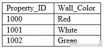

**Dữ kiện hình dạng chữ:** Table columns Property ID, Wall Color. Rows: 1000,Red; 1001,White; 1002,Green.

**A.** Apply integer transformation and set Red = 1, White = 5, and Green = 10.

**B.** Add new columns that store one-hot representation of colors.

**C.** Replace the color name string by its length.

**D.** Create three columns to encode the color in RGB format.

**E.** Replace each color name by its training set frequency.

**Chưa chốt đáp án.**

One-hot chắc chắn phù hợp; RGB và frequency encoding đều có thể dùng với giả định khác nhau, nên không có cặp duy nhất từ đề.

Đáp án in trong PDF: `AD` (giữ để đối chiếu nguồn, không dùng làm căn cứ chấm).

Nguồn đối chiếu: [8.3. Preprocessing data — scikit-learn 1.9.1 documentation](https://scikit-learn.org/stable/modules/preprocessing.html).

---

## Câu 164

Trang PDF: [356](../../Machine%20Learning%20-%20Specialty%20Exam.pdf#page=356) · ĐÃ ĐỐI CHIẾU

A data scientist is working on a public sector project for an urban traffic system. While studying the traffic patterns, it is clear to the data scientist that the traffic behavior at each light is correlated, subject to a small stochastic error term. The data scientist must model the traffic behavior to analyze the traffic patterns and reduce congestion. How will the data scientist MOST effectively model the problem?

**A.** The data scientist should obtain a correlated equilibrium policy by formulating this problem as a multi-agent reinforcement learning problem.

**B.** The data scientist should obtain the optimal equilibrium policy by formulating this problem as a single-agent reinforcement learning problem.

**C.** Rather than finding an equilibrium policy, the data scientist should obtain accurate predictors of traffic flow by using historical data through a supervised learning approach.

**D.** Rather than finding an equilibrium policy, the data scientist should obtain accurate predictors of traffic flow by using unlabeled simulated data representing the new traffic patterns in the city and applying an unsupervised learning approach.

**Đáp án sau đối chiếu: A.**

Các đèn tương tác phù hợp multi-agent reinforcement learning để phối hợp chính sách.

Đáp án in trong PDF: `D` (giữ để đối chiếu nguồn, không dùng làm căn cứ chấm).

Nguồn đối chiếu: [Use Reinforcement Learning with Amazon SageMaker AI - Amazon SageMaker AI](https://docs.aws.amazon.com/sagemaker/latest/dg/reinforcement-learning.html).

---

## Câu 165

Trang PDF: [357](../../Machine%20Learning%20-%20Specialty%20Exam.pdf#page=357) · ĐÃ ĐỐI CHIẾU

A data scientist is using the Amazon SageMaker Neural Topic Model (NTM) algorithm to build a model that recommends tags from blog posts. The raw blog post data is stored in an Amazon S3 bucket in JSON format. During model evaluation, the data scientist discovered that the model recommends certain stopwords such as "a," "an," and "the" as tags to certain blog posts, along with a few rare words that are present only in certain blog entries. After a few iterations of tag review with the content team, the data scientist notices that the rare words are unusual but feasible. The data scientist also must ensure that the tag recommendations of the generated model do not include the stopwords. What should the data scientist do to meet these requirements?

**A.** Use the Amazon Comprehend entity recognition API operations. Remove the detected words from the blog post data. Replace the blog post data source in the S3 bucket.

**B.** Run the SageMaker built-in principal component analysis (PCA) algorithm with the blog post data from the S3 bucket as the data source. Replace the blog post data in the S3 bucket with the results of the training job.

**C.** Use the SageMaker built-in Object Detection algorithm instead of the NTM algorithm for the training job to process the blog post data.

**D.** Remove the stopwords from the blog post data by using the CountVectorizer function in the scikit-learn library. Replace the blog post data in the S3 bucket with the results of the vectorizer.

**Đáp án sau đối chiếu: D.**

CountVectorizer có stop_words để loại từ dừng mà vẫn giữ từ hiếm hợp lệ.

Đáp án in trong PDF: `D` (giữ để đối chiếu nguồn, không dùng làm căn cứ chấm).

Nguồn đối chiếu: [8.2. Feature extraction — scikit-learn 1.9.1 documentation](https://scikit-learn.org/stable/modules/feature_extraction.html).

---

## Câu 166

Trang PDF: [359](../../Machine%20Learning%20-%20Specialty%20Exam.pdf#page=359) · ĐÃ ĐỐI CHIẾU

A company wants to create a data repository in the AWS Cloud for machine learning (ML) projects. The company wants to use AWS to perform complete ML lifecycles and wants to use Amazon S3 for the data storage. All of the company's data currently resides on premises and is 40 [unit unreadable in source] in size. The company wants a solution that can transfer and automatically update data between the on-premises object storage and Amazon S3. The solution must support encryption, scheduling, monitoring, and data integrity validation. Which solution meets these requirements?

**A.** Use the S3 sync command to compare the source S3 bucket and the destination S3 bucket. Determine which source files do not exist in the destination S3 bucket and which source files were modified.

**B.** Use AWS Transfer for FTPS to transfer the files from the on-premises storage to Amazon S3.

**C.** Use AWS DataSync to make an initial copy of the entire dataset. Schedule subsequent incremental transfers of changing data until the final cutover from on premises to AWS.

**D.** Use S3 Batch Operations to pull data periodically from the on-premises storage. Enable S3 Versioning on the S3 bucket to protect against accidental overwrites.

**Đáp án sau đối chiếu: C.**

DataSync hỗ trợ copy ban đầu, incremental transfer, lịch chạy và kiểm tra toàn vẹn.

Đáp án in trong PDF: `C` (giữ để đối chiếu nguồn, không dùng làm căn cứ chấm).

Ghi chú bản gốc: The data-size unit is corrupted in the original PDF; no unit has been guessed.

Nguồn đối chiếu: [What is AWS DataSync? - AWS DataSync](https://docs.aws.amazon.com/datasync/latest/userguide/what-is-datasync.html).

---

## Câu 167

Trang PDF: [361](../../Machine%20Learning%20-%20Specialty%20Exam.pdf#page=361) · ĐÃ ĐỐI CHIẾU

A company has video feeds and images of a subway train station. The company wants to create a deep learning model that will alert the station manager if any passenger crosses the yellow safety line when there is no train in the station. The alert will be based on the video feeds. The company wants the model to detect the yellow line, the passengers who cross the yellow line, and the trains in the video feeds. This task requires labeling. The video data must remain confidential. A data scientist creates a bounding box to label the sample data and uses an object detection model. However, the object detection model cannot clearly demarcate the yellow line, the passengers who cross the yellow line, and the trains. Which labeling approach will help the company improve this model?

**A.** Use Amazon Rekognition Custom Labels to label the dataset and create a custom Amazon Rekognition object detection model. Create a private workforce. Use Amazon Augmented AI (Amazon A2I) to review the low-confidence predictions and retrain the custom Amazon Rekognition model.

**B.** Use an Amazon SageMaker Ground Truth object detection labeling task. Use Amazon Mechanical Turk as the labeling workforce.

**C.** Use Amazon Rekognition Custom Labels to label the dataset and create a custom Amazon Rekognition object detection model. Create a workforce with a third-party AWS Marketplace vendor. Use Amazon Augmented AI (Amazon A2I) to review the low-confidence predictions and retrain the custom Amazon Rekognition model.

**D.** Use an Amazon SageMaker Ground Truth semantic segmentation labeling task. Use a private workforce as the labeling workforce.

**Đáp án sau đối chiếu: D.**

Semantic segmentation gán nhãn từng pixel để phân ranh giới chính xác; dùng private workforce.

Đáp án in trong PDF: `B` (giữ để đối chiếu nguồn, không dùng làm căn cứ chấm).

Nguồn đối chiếu: [Identify image contents using semantic segmentation - Amazon SageMaker AI](https://docs.aws.amazon.com/sagemaker/latest/dg/sms-semantic-segmentation.html); [Workforces - Amazon SageMaker AI](https://docs.aws.amazon.com/sagemaker/latest/dg/sms-workforce-management.html).

---

## Câu 168

Trang PDF: [365](../../Machine%20Learning%20-%20Specialty%20Exam.pdf#page=365) · ĐÃ ĐỐI CHIẾU

A data engineer at a bank is evaluating a new tabular dataset that includes customer data. The data engineer will use the customer data to create a new model to predict customer behavior. After creating a correlation matrix for the variables, the data engineer notices that many of the 100 features are highly correlated with each other. Which steps should the data engineer take to address this issue? (Choose two.)

**A.** Use a linear-based algorithm to train the model.

**B.** Apply principal component analysis (PCA).

**C.** Remove a portion of highly correlated features from the dataset.

**D.** Apply min-max feature scaling to the dataset.

**E.** Apply one-hot encoding category-based variables.

**Đáp án sau đối chiếu: B, C.**

PCA hoặc loại bớt đặc trưng tương quan giải quyết dư thừa; scaling không loại tương quan.

Đáp án in trong PDF: `BD` (giữ để đối chiếu nguồn, không dùng làm căn cứ chấm).

Nguồn đối chiếu: [Principal Component Analysis (PCA) Algorithm - Amazon SageMaker AI](https://docs.aws.amazon.com/sagemaker/latest/dg/pca.html).

---

## Câu 169

Trang PDF: [367](../../Machine%20Learning%20-%20Specialty%20Exam.pdf#page=367) · ĐÃ ĐỐI CHIẾU

A company is building a new version of a recommendation engine. Machine learning (ML) specialists need to keep adding new data from users to improve personalized recommendations. The ML specialists gather data from the users' interactions on the platform and from sources such as external websites and social media. The pipeline cleans, transforms, enriches, and compresses terabytes of data daily, and this data is stored in Amazon S3. A set of Python scripts was coded to do the job and is stored in a large Amazon EC2 instance. The whole process takes more than 20 hours to finish, with each script taking at least an hour. The company wants to move the scripts out of Amazon EC2 into a more managed solution that will eliminate the need to maintain servers. Which approach will address all of these requirements with the LEAST development effort?

**A.** Load the data into an Amazon Redshift cluster. Execute the pipeline by using SQL. Store the results in Amazon S3.

**B.** Load the data into Amazon DynamoDB. Convert the scripts to an AWS Lambda function. Execute the pipeline by triggering Lambda executions. Store the results in Amazon S3.

**C.** Create an AWS Glue job. Convert the scripts to PySpark. Execute the pipeline. Store the results in Amazon S3.

**D.** Create a set of individual AWS Lambda functions to execute each of the scripts. Build a step function by using the AWS Step Functions Data Science SDK. Store the results in Amazon S3.

**Đáp án sau đối chiếu: C.**

Glue PySpark xử lý dữ liệu lớn và job lâu; Lambda bị giới hạn thời gian mỗi invocation.

Đáp án in trong PDF: `B` (giữ để đối chiếu nguồn, không dùng làm căn cứ chấm).

Nguồn đối chiếu: [Program AWS Glue ETL scripts in PySpark - AWS Glue](https://docs.aws.amazon.com/glue/latest/dg/aws-glue-programming-python.html).

---

## Câu 170

Trang PDF: [369](../../Machine%20Learning%20-%20Specialty%20Exam.pdf#page=369) · ĐÃ ĐỐI CHIẾU

A retail company is selling products through a global online marketplace. The company wants to use machine learning (ML) to analyze customer feedback and identify specific areas for improvement. A developer has built a tool that collects customer reviews from the online marketplace and stores them in an Amazon S3 bucket. This process yields a dataset of 40 reviews. A data scientist building the ML models must identify additional sources of data to increase the size of the dataset. Which data sources should the data scientist use to augment the dataset of reviews? (Choose three.)

**A.** Emails exchanged by customers and the company's customer service agents

**B.** Social media posts containing the name of the company or its products

**C.** A publicly available collection of news articles

**D.** A publicly available collection of customer reviews

**E.** Product sales revenue figures for the company

**F.** Instruction manuals for the company's products

**Đáp án sau đối chiếu: A, B, D.**

Email khách hàng, mạng xã hội và review công khai chứa ý kiến trực tiếp.

Đáp án in trong PDF: `BDF` (giữ để đối chiếu nguồn, không dùng làm căn cứ chấm).

Nguồn đối chiếu: [Custom classification - Amazon Comprehend](https://docs.aws.amazon.com/comprehend/latest/dg/how-document-classification.html).

---

## Câu 171

Trang PDF: [371](../../Machine%20Learning%20-%20Specialty%20Exam.pdf#page=371) · ĐÃ ĐỐI CHIẾU

A machine learning (ML) specialist wants to create a data preparation job that uses a PySpark script with complex window aggregation operations to create data for training and testing. The ML specialist needs to evaluate the impact of the number of features and the sample count on model performance. Which approach should the ML specialist use to determine the ideal data transformations for the model?

**A.** Add an Amazon SageMaker Debugger hook to the script to capture key metrics. Run the script as an AWS Glue job.

**B.** Add an Amazon SageMaker Experiments tracker to the script to capture key metrics. Run the script as an AWS Glue job.

**C.** Add an Amazon SageMaker Debugger hook to the script to capture key parameters. Run the script as a SageMaker processing job.

**D.** Add an Amazon SageMaker Experiments tracker to the script to capture key parameters. Run the script as a SageMaker processing job.

**Đáp án sau đối chiếu: D.**

SageMaker Experiments theo dõi tham số; Spark Processing chạy preprocessing được quản lý.

Đáp án in trong PDF: `B` (giữ để đối chiếu nguồn, không dùng làm căn cứ chấm).

Nguồn đối chiếu: [Amazon SageMaker Experiments in Studio Classic - Amazon SageMaker AI](https://docs.aws.amazon.com/sagemaker/latest/dg/experiments.html); [Data transformation workloads with SageMaker Processing - Amazon SageMaker AI](https://docs.aws.amazon.com/sagemaker/latest/dg/processing-job.html).

---

## Câu 172

Trang PDF: [373](../../Machine%20Learning%20-%20Specialty%20Exam.pdf#page=373) · ĐÃ ĐỐI CHIẾU

A data scientist has a dataset of machine part images stored in Amazon Elastic File System (Amazon EFS). The data scientist needs to use Amazon SageMaker to create and train an image classification machine learning model based on this dataset. Because of budget and time constraints, management wants the data scientist to create and train a model with the least number of steps and integration work required. How should the data scientist meet these requirements?

**A.** Mount the EFS file system to a SageMaker notebook and run a script that copies the data to an Amazon FSx for Lustre file system. Run the SageMaker training job with the FSx for Lustre file system as the data source.

**B.** Launch a transient Amazon EMR cluster. Configure steps to mount the EFS file system and copy the data to an Amazon S3 bucket by using S3DistCp. Run the SageMaker training job with Amazon S3 as the data source.

**C.** Mount the EFS file system to an Amazon EC2 instance and use the AWS CLI to copy the data to an Amazon S3 bucket. Run the SageMaker training job with Amazon S3 as the data source.

**D.** Run a SageMaker training job with an EFS file system as the data source.

**Đáp án sau đối chiếu: D.**

SageMaker training hỗ trợ EFS làm nguồn dữ liệu trực tiếp.

Đáp án in trong PDF: `A` (giữ để đối chiếu nguồn, không dùng làm căn cứ chấm).

Nguồn đối chiếu: [Setting up training jobs to access datasets - Amazon SageMaker AI](https://docs.aws.amazon.com/sagemaker/latest/dg/model-access-training-data.html).

---

## Câu 173

Trang PDF: [375](../../Machine%20Learning%20-%20Specialty%20Exam.pdf#page=375) · ĐÃ ĐỐI CHIẾU

A retail company uses a machine learning (ML) model for daily sales forecasting. The company's brand manager reports that the model has provided inaccurate results for the past 3 weeks. At the end of each day, an AWS Glue job consolidates the input data that is used for the forecasting with the actual daily sales data and the predictions of the model. The AWS Glue job stores the data in Amazon S3. The company's ML team is using an Amazon SageMaker Studio notebook to gain an understanding about the source of the model's inaccuracies. What should the ML team do on the SageMaker Studio notebook to visualize the model's degradation MOST accurately?

**A.** Create a histogram of the daily sales over the last 3 weeks. In addition, create a histogram of the daily sales from before that period.

**B.** Create a histogram of the model errors over the last 3 weeks. In addition, create a histogram of the model errors from before that period.

**C.** Create a line chart with the weekly mean absolute error (MAE) of the model.

**D.** Create a scatter plot of daily sales versus model error for the last 3 weeks. In addition, create a scatter plot of daily sales versus model error from before that period.

**Đáp án sau đối chiếu: C.**

MAE theo tuần biểu diễn mức lỗi thay đổi qua thời gian.

Đáp án in trong PDF: `C` (giữ để đối chiếu nguồn, không dùng làm căn cứ chấm).

Nguồn đối chiếu: [1.1. Linear Models — scikit-learn 1.9.1 documentation](https://scikit-learn.org/stable/modules/linear_model.html).

---

## Câu 174

Trang PDF: [378](../../Machine%20Learning%20-%20Specialty%20Exam.pdf#page=378) · ĐÃ ĐỐI CHIẾU

An ecommerce company sends a weekly email newsletter to all of its customers. Management has hired a team of writers to create additional targeted content. A data scientist needs to identify five customer segments based on age, income, and location. The customers' current segmentation is unknown. The data scientist previously built an XGBoost model to predict the likelihood of a customer responding to an email based on age, income, and location. Why does the XGBoost model NOT meet the current requirements, and how can this be fixed?

**A.** The XGBoost model provides a true/false binary output. Apply principal component analysis (PCA) with five feature dimensions to predict a segment.

**B.** The XGBoost model provides a true/false binary output. Increase the number of classes the XGBoost model predicts to five classes to predict a segment.

**C.** The XGBoost model is a supervised machine learning algorithm. Train a k-Nearest-Neighbors (kNN) model with K = 5 on the same dataset to predict a segment.

**D.** The XGBoost model is a supervised machine learning algorithm. Train a k-means model with K = 5 on the same dataset to predict a segment.

**Đáp án sau đối chiếu: D.**

Chưa có nhãn phân khúc nên dùng k-means với k=5.

Đáp án in trong PDF: `C` (giữ để đối chiếu nguồn, không dùng làm căn cứ chấm).

Nguồn đối chiếu: [K-Means Algorithm - Amazon SageMaker AI](https://docs.aws.amazon.com/sagemaker/latest/dg/k-means.html).

---

## Câu 175

Trang PDF: [380](../../Machine%20Learning%20-%20Specialty%20Exam.pdf#page=380) · ĐÃ ĐỐI CHIẾU

A global financial company is using machine learning to automate its loan approval process. The company has a dataset of customer information. The dataset contains some categorical fields, such as customer location by city and housing status. The dataset also includes financial fields in different units, such as account balances in US dollars and monthly interest in US cents. The company's data scientists are using a gradient boosting regression model to infer the credit score for each customer. The model has a training accuracy of 99% and a testing accuracy of 75%. The data scientists want to improve the model's testing accuracy. Which process will improve the testing accuracy the MOST?

**A.** Use a one-hot encoder for the categorical fields in the dataset. Perform standardization on the financial fields in the dataset. Apply L1 regularization to the data.

**B.** Use tokenization of the categorical fields in the dataset. Perform binning on the financial fields in the dataset. Remove the outliers in the data by using the z- score.

**C.** Use a label encoder for the categorical fields in the dataset. Perform L1 regularization on the financial fields in the dataset. Apply L2 regularization to the data.

**D.** Use a logarithm transformation on the categorical fields in the dataset. Perform binning on the financial fields in the dataset. Use imputation to populate missing values in the dataset.

**Đáp án sau đối chiếu: A.**

One-hot xử lý category, L1 giảm overfit; chuẩn hóa không bắt buộc cho cây nhưng không làm phương án sai.

Đáp án in trong PDF: `B` (giữ để đối chiếu nguồn, không dùng làm căn cứ chấm).

Nguồn đối chiếu: [8.3. Preprocessing data — scikit-learn 1.9.1 documentation](https://scikit-learn.org/stable/modules/preprocessing.html); [XGBoost hyperparameters - Amazon SageMaker AI](https://docs.aws.amazon.com/sagemaker/latest/dg/xgboost_hyperparameters.html).

---

## Câu 176

Trang PDF: [382](../../Machine%20Learning%20-%20Specialty%20Exam.pdf#page=382) · CẦN XÁC MINH / SỬA ĐỀ

A machine learning (ML) specialist needs to extract embedding vectors from a text series. The goal is to provide a ready-to-ingest feature space for a data scientist to develop downstream ML predictive models. The text consists of curated sentences in English. Many sentences use similar words but in different contexts. There are questions and answers among the sentences, and the embedding space must differentiate between them. Which options can produce the required embedding vectors that capture word context and sequential QA information? (Choose two.)

**A.** Amazon SageMaker seq2seq algorithm

**B.** Amazon SageMaker BlazingText algorithm in Skip-gram mode

**C.** Amazon SageMaker Object2Vec algorithm

**D.** Amazon SageMaker BlazingText algorithm in continuous bag-of-words (CBOW) mode

**E.** Combination of the Amazon SageMaker BlazingText algorithm in Batch Skip-gram mode with a custom recurrent neural network (RNN)

**Chưa chốt đáp án.**

Object2Vec hỗ trợ sentence embeddings. Phương án thứ hai phụ thuộc khả năng lấy encoder state hoặc thiết kế custom RNN; chưa đủ để chốt cặp.

Đáp án in trong PDF: `AC` (giữ để đối chiếu nguồn, không dùng làm căn cứ chấm).

Nguồn đối chiếu: [Object2Vec Algorithm - Amazon SageMaker AI](https://docs.aws.amazon.com/sagemaker/latest/dg/object2vec.html); [Sequence-to-Sequence Algorithm - Amazon SageMaker AI](https://docs.aws.amazon.com/sagemaker/latest/dg/seq-2-seq.html).

---

## Câu 177

Trang PDF: [385](../../Machine%20Learning%20-%20Specialty%20Exam.pdf#page=385) · ĐÃ ĐỐI CHIẾU

A retail company wants to update its customer support system. The company wants to implement automatic routing of customer claims to different queues to prioritize the claims by category. Currently, an operator manually performs the category assignment and routing. After the operator classifies and routes the claim, the company stores the claim's record in a central database. The claim's record includes the claim's category. The company has no data science team or experience in the field of machine learning (ML). The company's small development team needs a solution that requires no ML expertise. Which solution meets these requirements?

**A.** Export the database to a .csv file with two columns: claim_label and claim_text. Use the Amazon SageMaker Object2Vec algorithm and the .csv file to train a model. Use SageMaker to deploy the model to an inference endpoint. Develop a service in the application to use the inference endpoint to process incoming claims, predict the labels, and route the claims to the appropriate queue.

**B.** Export the database to a .csv file with one column: claim_text. Use the Amazon SageMaker Latent Dirichlet Allocation (LDA) algorithm and the .csv file to train a model. Use the LDA algorithm to detect labels automatically. Use SageMaker to deploy the model to an inference endpoint. Develop a service in the application to use the inference endpoint to process incoming claims, predict the labels, and route the claims to the appropriate queue.

**C.** Use Amazon Textract to process the database and automatically detect two columns: claim_label and claim_text. Use Amazon Comprehend custom classification and the extracted information to train the custom classifier. Develop a service in the application to use the Amazon Comprehend API to process incoming claims, predict the labels, and route the claims to the appropriate queue.

**D.** Export the database to a .csv file with two columns: claim_label and claim_text. Use Amazon Comprehend custom classification and the .csv file to train the custom classifier. Develop a service in the application to use the Amazon Comprehend API to process incoming claims, predict the labels, and route the claims to the appropriate queue.

**Đáp án sau đối chiếu: D.**

Xuất văn bản và nhãn đã có để train Comprehend custom classifier, không cần xây model thủ công.

Đáp án in trong PDF: `C` (giữ để đối chiếu nguồn, không dùng làm căn cứ chấm).

Nguồn đối chiếu: [Custom classification - Amazon Comprehend](https://docs.aws.amazon.com/comprehend/latest/dg/how-document-classification.html).

---

## Câu 178

Trang PDF: [387](../../Machine%20Learning%20-%20Specialty%20Exam.pdf#page=387) · CẦN XÁC MINH / SỬA ĐỀ

A machine learning (ML) specialist is using Amazon SageMaker hyperparameter optimization (HPO) to improve a model's accuracy. The learning rate parameter is specified in the following HPO configuration: During the results analysis, the ML specialist determines that most of the training jobs had a learning rate between 0.01 and 0.1. The best result had a learning rate of less than 0.01. Training jobs need to run regularly over a changing dataset. The ML specialist needs to find a tuning mechanism that uses different learning rates more evenly from the provided range between MinValue and MaxValue. Which solution provides the MOST accurate result?

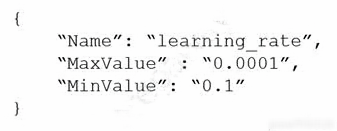

**Dữ kiện hình dạng chữ:** Configuration shown: {"Name":"learning_rate","MaxValue":"0.0001","MinValue":"0.1"}.

**A.** Modify the HPO configuration as follows: Select the most accurate hyperparameter configuration form this HPO job.

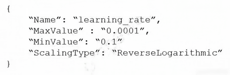

Image: {"Name":"learning_rate","MaxValue":"0.0001","MinValue":"0.1","ScalingType":"ReverseLogarithmic"}.

**B.** Run three different HPO jobs that use different learning rates form the following intervals for MinValue and MaxValue while using the same number of training jobs for each HPO job: • [0.01, 0.1] • [0.001, 0.01] • [0.0001, 0.001] Select the most accurate hyperparameter configuration form these three HPO jobs.

**C.** Modify the HPO configuration as follows: Select the most accurate hyperparameter configuration form this training job.

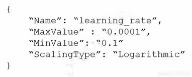

Image: {"Name":"learning_rate","MaxValue":"0.0001","MinValue":"0.1","ScalingType":"Logarithmic"}.

**D.** Run three different HPO jobs that use different learning rates form the following intervals for MinValue and MaxValue. Divide the number of training jobs for each HPO job by three: • [0.01, 0.1] • [0.001, 0.01] [0.0001, 0.001] Select the most accurate hyperparameter configuration form these three HPO jobs.

**Chưa chốt đáp án.** Phương án tham khảo có điều kiện: **C**.

Ý định là Logarithmic scaling; các hình gốc đảo MinValue=0.1 và MaxValue=0.0001 nên cấu hình phải sửa trước khi chạy.

Đáp án in trong PDF: `C` (giữ để đối chiếu nguồn, không dùng làm căn cứ chấm).

Nguồn đối chiếu: [Define Hyperparameter Ranges - Amazon SageMaker AI](https://docs.aws.amazon.com/sagemaker/latest/dg/automatic-model-tuning-define-ranges.html).

---

## Câu 179

Trang PDF: [389](../../Machine%20Learning%20-%20Specialty%20Exam.pdf#page=389) · ĐÃ ĐỐI CHIẾU

A manufacturing company wants to use machine learning (ML) to automate quality control in its facilities. The facilities are in remote locations and have limited internet connectivity. The company has 20 [unit unreadable in source] of training data that consists of labeled images of defective product parts. The training data is in the corporate on- premises data center. The company will use this data to train a model for real-time defect detection in new parts as the parts move on a conveyor belt in the facilities. The company needs a solution that minimizes costs for compute infrastructure and that maximizes the scalability of resources for training. The solution also must facilitate the company's use of an ML model in the low-connectivity environments. Which solution will meet these requirements?

**A.** Move the training data to an Amazon S3 bucket. Train and evaluate the model by using Amazon SageMaker. Optimize the model by using SageMaker Neo. Deploy the model on a SageMaker hosting services endpoint.

**B.** Train and evaluate the model on premises. Upload the model to an Amazon S3 bucket. Deploy the model on an Amazon SageMaker hosting services endpoint.

**C.** Move the training data to an Amazon S3 bucket. Train and evaluate the model by using Amazon SageMaker. Optimize the model by using SageMaker Neo. Set up an edge device in the manufacturing facilities with AWS IoT Greengrass. Deploy the model on the edge device.

**D.** Train the model on premises. Upload the model to an Amazon S3 bucket. Set up an edge device in the manufacturing facilities with AWS IoT Greengrass. Deploy the model on the edge device.

**Đáp án sau đối chiếu: C.**

Huấn luyện trong SageMaker rồi dùng Neo/Greengrass cho inference tại edge.

Đáp án in trong PDF: `A` (giữ để đối chiếu nguồn, không dùng làm căn cứ chấm).

Ghi chú bản gốc: The data-size unit is corrupted in the original PDF; no unit has been guessed.

Nguồn đối chiếu: [Perform machine learning inference - AWS IoT Greengrass](https://docs.aws.amazon.com/greengrass/v2/developerguide/perform-machine-learning-inference.html); [Model performance optimization with SageMaker Neo - Amazon SageMaker AI](https://docs.aws.amazon.com/sagemaker/latest/dg/neo.html).

---

## Câu 180

Trang PDF: [391](../../Machine%20Learning%20-%20Specialty%20Exam.pdf#page=391) · BỐI CẢNH DỊCH VỤ CŨ

A company has an ecommerce website with a product recommendation engine built in TensorFlow. The recommendation engine endpoint is hosted by Amazon SageMaker. Three compute-optimized instances support the expected peak load of the website. Response times on the product recommendation page are increasing at the beginning of each month. Some users are encountering errors. The website receives the majority of its traffic between 8 AM and 6 PM on weekdays in a single time zone. Which of the following options are the MOST effective in solving the issue while keeping costs to a minimum? (Choose two.)

**A.** Configure the endpoint to use Amazon Elastic Inference (EI) accelerators.

**B.** Create a new endpoint configuration with two production variants.

**C.** Configure the endpoint to automatically scale with the InvocationsPerInstance metric.

**D.** Deploy a second instance pool to support a blue/green deployment of models.

**E.** Reconfigure the endpoint to use burstable instances.

**Đáp án sau đối chiếu: A, C.**

Autoscaling giảm cấp phát dư; Elastic Inference là lựa chọn của kiến trúc cũ.

Đáp án in trong PDF: `BD` (giữ để đối chiếu nguồn, không dùng làm căn cứ chấm).

Nguồn đối chiếu: [Define a scaling policy - Amazon SageMaker AI](https://docs.aws.amazon.com/sagemaker/latest/dg/endpoint-auto-scaling-add-code-define.html); [Class: AWS.ElasticInference — AWS SDK for JavaScript](https://docs.aws.amazon.com/AWSJavaScriptSDK/latest/AWS/ElasticInference.html).

---

## Câu 181

Trang PDF: [393](../../Machine%20Learning%20-%20Specialty%20Exam.pdf#page=393) · ĐÃ ĐỐI CHIẾU

A real-estate company is launching a new product that predicts the prices of new houses. The historical data for the properties and prices is stored in .csv format in an Amazon S3 bucket. The data has a header, some categorical fields, and some missing values. The company's data scientists have used Python with a common open-source library to fill the missing values with zeros. The data scientists have dropped all of the categorical fields and have trained a model by using the open-source linear regression algorithm with the default parameters. The accuracy of the predictions with the current model is below 50%. The company wants to improve the model performance and launch the new product as soon as possible. Which solution will meet these requirements with the LEAST operational overhead?

**A.** Create a service-linked role for Amazon Elastic Container Service (Amazon ECS) with access to the S3 bucket. Create an ECS cluster that is based on an AWS Deep Learning Containers image. Write the code to perform the feature engineering. Train a logistic regression model for predicting the price, pointing to the bucket with the dataset. Wait for the training job to complete. Perform the inferences.

**B.** Create an Amazon SageMaker notebook with a new IAM role that is associated with the notebook. Pull the dataset from the S3 bucket. Explore different combinations of feature engineering transformations, regression algorithms, and hyperparameters. Compare all the results in the notebook, and deploy the most accurate configuration in an endpoint for predictions.

**C.** Create an IAM role with access to Amazon S3, Amazon SageMaker, and AWS Lambda. Create a training job with the SageMaker built-in XGBoost model pointing to the bucket with the dataset. Specify the price as the target feature. Wait for the job to complete. Load the model artifact to a Lambda function for inference on prices of new houses.

**D.** Create an IAM role for Amazon SageMaker with access to the S3 bucket. Create a SageMaker AutoML job with SageMaker Autopilot pointing to the bucket with the dataset. Specify the price as the target attribute. Wait for the job to complete. Deploy the best model for predictions.

**Đáp án sau đối chiếu: D.**

Autopilot tự chuẩn bị đặc trưng, thử model và tuning cho dữ liệu tabular.

Đáp án in trong PDF: `A` (giữ để đối chiếu nguồn, không dùng làm căn cứ chấm).

Nguồn đối chiếu: [SageMaker Autopilot - Amazon SageMaker AI](https://docs.aws.amazon.com/sagemaker/latest/dg/autopilot-automate-model-development.html).

---

## Câu 182

Trang PDF: [395](../../Machine%20Learning%20-%20Specialty%20Exam.pdf#page=395) · ĐÃ ĐỐI CHIẾU

A data scientist is reviewing customer comments about a company's products. The data scientist needs to present an initial exploratory analysis by using charts and a word cloud. The data scientist must use feature engineering techniques to prepare this analysis before starting a natural language processing (NLP) model. Which combination of feature engineering techniques should the data scientist use to meet these requirements? (Choose two.)

**A.** Named entity recognition

**B.** Coreference

**C.** Stemming

**D.** Term frequency-inverse document frequency (TF-IDF)

**E.** Sentiment analysis

**Đáp án sau đối chiếu: C, D.**

Stemming gom biến thể từ; TF-IDF biểu diễn độ quan trọng của từ.

Đáp án in trong PDF: `DE` (giữ để đối chiếu nguồn, không dùng làm căn cứ chấm).

Nguồn đối chiếu: [8.2. Feature extraction — scikit-learn 1.9.1 documentation](https://scikit-learn.org/stable/modules/feature_extraction.html).

---

## Câu 183

Trang PDF: [397](../../Machine%20Learning%20-%20Specialty%20Exam.pdf#page=397) · ĐÃ ĐỐI CHIẾU

A data scientist is evaluating a GluonTS on Amazon SageMaker DeepAR model. The evaluation metrics on the test set indicate that the coverage score is 0.489 and 0.889 at the 0.5 and 0.9 quantiles, respectively. What can the data scientist reasonably conclude about the distributional forecast related to the test set?

**A.** The coverage scores indicate that the distributional forecast is poorly calibrated. These scores should be approximately equal to each other at all quantiles.

**B.** The coverage scores indicate that the distributional forecast is poorly calibrated. These scores should peak at the median and be lower at the tails.

**C.** The coverage scores indicate that the distributional forecast is correctly calibrated. These scores should always fall below the quantile itself.

**D.** The coverage scores indicate that the distributional forecast is correctly calibrated. These scores should be approximately equal to the quantile itself.

**Đáp án sau đối chiếu: D.**

Forecast được calibration tốt khi coverage tại quantile q xấp xỉ q.

Đáp án in trong PDF: `D` (giữ để đối chiếu nguồn, không dùng làm căn cứ chấm).

Nguồn đối chiếu: [gluonts.evaluation.metrics module - GluonTS documentation](https://ts.gluon.ai/stable/api/gluonts/gluonts.evaluation.metrics.html).

---

## Câu 184

Trang PDF: [399](../../Machine%20Learning%20-%20Specialty%20Exam.pdf#page=399) · ĐÃ ĐỐI CHIẾU

An energy company has wind turbines, weather stations, and solar panels that generate telemetry data. The company wants to perform predictive maintenance on these devices. The devices are in various locations and have unstable internet connectivity. A team of data scientists is using the telemetry data to perform machine learning (ML) to conduct anomaly detection and predict maintenance before the devices start to deteriorate. The team needs a scalable, secure, high-velocity data ingestion mechanism. The team has decided to use Amazon S3 as the data storage location. Which approach meets these requirements?

**A.** Ingest the data by using an HTTP API call to a web server that is hosted on Amazon EC2. Set up EC2 instances in an Auto Scaling configuration behind an Elastic Load Balancer to load the data into Amazon S3.

**B.** Ingest the data over Message Queuing Telemetry Transport (MQTT) to AWS IoT Core. Set up a rule in AWS IoT Core to use Amazon Kinesis Data Firehose to send data to an Amazon Kinesis data stream that is configured to write to an S3 bucket.

**C.** Ingest the data over Message Queuing Telemetry Transport (MQTT) to AWS IoT Core. Set up a rule in AWS IoT Core to direct all MQTT data to an Amazon Kinesis Data Firehose delivery stream that is configured to write to an S3 bucket.

**D.** Ingest the data over Message Queuing Telemetry Transport (MQTT) to Amazon Kinesis data stream that is configured to write to an S3 bucket.

**Đáp án sau đối chiếu: C.**

IoT Core nhận MQTT, rule gửi Firehose và Firehose ghi S3.

Đáp án in trong PDF: `C` (giữ để đối chiếu nguồn, không dùng làm căn cứ chấm).

Nguồn đối chiếu: [Firehose - AWS IoT Core](https://docs.aws.amazon.com/iot/latest/developerguide/kinesis-firehose-rule-action.html).

---

## Câu 185

Trang PDF: [400](../../Machine%20Learning%20-%20Specialty%20Exam.pdf#page=400) · ĐÃ ĐỐI CHIẾU

A retail company collects customer comments about its products from social media, the company website, and customer call logs. A team of data scientists and engineers wants to find common topics and determine which products the customers are referring to in their comments. The team is using natural language processing (NLP) to build a model to help with this classification. Each product can be classified into multiple categories that the company defines. These categories are related but are not mutually exclusive. For example, if there is mention of "Sample Yogurt" in the document of customer comments, then "Sample Yogurt" should be classified as "yogurt," "snack," and "dairy product." The team is using Amazon Comprehend to train the model and must complete the project as soon as possible. Which functionality of Amazon Comprehend should the team use to meet these requirements?

**A.** Custom classification with multi-class mode

**B.** Custom classification with multi-label mode

**C.** Custom entity recognition

**D.** Built-in models

**Đáp án sau đối chiếu: B.**

Multi-label cho phép một văn bản thuộc nhiều nhãn không loại trừ nhau.

Đáp án in trong PDF: `A` (giữ để đối chiếu nguồn, không dùng làm căn cứ chấm).

Nguồn đối chiếu: [Custom classification - Amazon Comprehend](https://docs.aws.amazon.com/comprehend/latest/dg/how-document-classification.html).

---

## Câu 186

Trang PDF: [402](../../Machine%20Learning%20-%20Specialty%20Exam.pdf#page=402) · BỐI CẢNH DỊCH VỤ CŨ

A data engineer is using AWS Glue to create optimized, secure datasets in Amazon S3. The data science team wants the ability to access the ETL scripts directly from Amazon SageMaker notebooks within a VPC. After this setup is complete, the data science team wants the ability to run the AWS Glue job and invoke the SageMaker training job. Which combination of steps should the data engineer take to meet these requirements? (Choose three.)

**A.** Create a SageMaker development endpoint in the data science team's VPC.

**B.** Create an AWS Glue development endpoint in the data science team's VPC.

**C.** Create SageMaker notebooks by using the AWS Glue development endpoint.

**D.** Create SageMaker notebooks by using the SageMaker console.

**E.** Attach a decryption policy to the SageMaker notebooks.

**F.** Create an IAM policy and an IAM role for the SageMaker notebooks.

**Đáp án sau đối chiếu: B, C, F.**

Glue development endpoint, notebook tích hợp và IAM role là quy trình phát triển Glue cũ.

Đáp án in trong PDF: `ADF` (giữ để đối chiếu nguồn, không dùng làm căn cứ chấm).

Nguồn đối chiếu: [Developing scripts using development endpoints - AWS Glue](https://docs.aws.amazon.com/glue/latest/dg/dev-endpoint.html).

---

## Câu 187

Trang PDF: [404](../../Machine%20Learning%20-%20Specialty%20Exam.pdf#page=404) · ĐÃ ĐỐI CHIẾU

A data engineer needs to provide a team of data scientists with the appropriate dataset to run machine learning training jobs. The data will be stored in Amazon S3. The data engineer is obtaining the data from an Amazon Redshift database and is using join queries to extract a single tabular dataset. A portion of the schema is as follows: TransactionTimestamp (Timestamp) CardName (Varchar) CardNo (Varchar) The data engineer must provide the data so that any row with a CardNo value of NULL is removed. Also, the TransactionTimestamp column must be separated into a TransactionDate column and a TransactionTime column. Finally, the CardName column must be renamed to NameOnCard. The data will be extracted on a monthly basis and will be loaded into an S3 bucket. The solution must minimize the effort that is needed to set up infrastructure for the ingestion and transformation. The solution also must be automated and must minimize the load on the Amazon Redshift cluster. Which solution meets these requirements?

**A.** Set up an Amazon EMR cluster. Create an Apache Spark job to read the data from the Amazon Redshift cluster and transform the data. Load the data into the S3 bucket. Schedule the job to run monthly.

**B.** Set up an Amazon EC2 instance with a SQL client tool, such as SQL Workbench/J, to query the data from the Amazon Redshift cluster directly Export the resulting dataset into a file. Upload the file into the S3 bucket. Perform these tasks monthly.

**C.** Set up an AWS Glue job that has the Amazon Redshift cluster as the source and the S3 bucket as the destination. Use the built-in transforms Filter, Map, and RenameField to perform the required transformations. Schedule the job to run monthly.

**D.** Use Amazon Redshift Spectrum to run a query that writes the data directly to the S3 bucket. Create an AWS Lambda function to run the query monthly.

**Đáp án sau đối chiếu: C.**

Glue cung cấp Filter, Map, RenameField và lịch chạy ETL.

Đáp án in trong PDF: `C` (giữ để đối chiếu nguồn, không dùng làm căn cứ chấm).

Nguồn đối chiếu: [Program AWS Glue ETL scripts in PySpark - AWS Glue](https://docs.aws.amazon.com/glue/latest/dg/aws-glue-programming-python.html).

---

## Câu 188

Trang PDF: [406](../../Machine%20Learning%20-%20Specialty%20Exam.pdf#page=406) · ĐÃ ĐỐI CHIẾU

A machine learning (ML) specialist wants to bring a custom training algorithm to Amazon SageMaker. The ML specialist implements the algorithm in a Docker container that is supported by SageMaker. How should the ML specialist package the Docker container so that SageMaker can launch the training correctly?

**A.** Specify the server argument in the ENTRYPOINT instruction in the Dockerfile.

**B.** Specify the training program in the ENTRYPOINT instruction in the Dockerfile.

**C.** Include the path to the training data in the docker build command when packaging the container.

**D.** Use a COPY instruction in the Dockerfile to copy the training program to the /opt/ml/train directory.

**Đáp án sau đối chiếu: B.**

ENTRYPOINT chỉ định training program trong Docker image.

Đáp án in trong PDF: `B` (giữ để đối chiếu nguồn, không dùng làm căn cứ chấm).

Nguồn đối chiếu: [How Amazon SageMaker AI Runs Your Training Image - Amazon SageMaker AI](https://docs.aws.amazon.com/sagemaker/latest/dg/your-algorithms-training-algo-dockerfile.html).

---

## Câu 189

Trang PDF: [407](../../Machine%20Learning%20-%20Specialty%20Exam.pdf#page=407) · ĐÃ ĐỐI CHIẾU

An ecommerce company wants to use machine learning (ML) to monitor fraudulent transactions on its website. The company is using Amazon SageMaker to research, train, deploy, and monitor the ML models. The historical transactions data is in a .csv file that is stored in Amazon S3. The data contains features such as the user's IP address, navigation time, average time on each page, and the number of clicks for each session. There is no label in the data to indicate if a transaction is anomalous. Which models should the company use in combination to detect anomalous transactions? (Choose two.)

**A.** IP Insights

**B.** K-nearest neighbors (k-NN)

**C.** Linear learner with a logistic function

**D.** Random Cut Forest (RCF)

**E.** XGBoost

**Đáp án sau đối chiếu: A, D.**

IP Insights và RCF đều hỗ trợ phát hiện bất thường không cần nhãn.

Đáp án in trong PDF: `AC` (giữ để đối chiếu nguồn, không dùng làm căn cứ chấm).

Nguồn đối chiếu: [IP Insights - Amazon SageMaker AI](https://docs.aws.amazon.com/sagemaker/latest/dg/ip-insights.html); [Random Cut Forest (RCF) Algorithm - Amazon SageMaker AI](https://docs.aws.amazon.com/sagemaker/latest/dg/randomcutforest.html).

---

## Câu 190

Trang PDF: [409](../../Machine%20Learning%20-%20Specialty%20Exam.pdf#page=409) · ĐÃ ĐỐI CHIẾU

A healthcare company is using an Amazon SageMaker notebook instance to develop machine learning (ML) models. The company's data scientists will need to be able to access datasets stored in Amazon S3 to train the models. Due to regulatory requirements, access to the data from instances and services used for training must not be transmitted over the internet. Which combination of steps should an ML specialist take to provide this access? (Choose two.)

**A.** Configure the SageMaker notebook instance to be launched with a VPC attached and internet access disabled.

**B.** Create and configure a VPN tunnel between SageMaker and Amazon S3.

**C.** Create and configure an S3 VPC endpoint Attach it to the VPC.

**D.** Create an S3 bucket policy that allows traffic from the VPC and denies traffic from the internet.

**E.** Deploy AWS Transit Gateway Attach the S3 bucket and the SageMaker instance to the gateway.

**Đáp án sau đối chiếu: A, C.**

Tắt direct internet và thêm S3 gateway endpoint vào VPC.

Đáp án in trong PDF: `AC` (giữ để đối chiếu nguồn, không dùng làm căn cứ chấm).

Nguồn đối chiếu: [Connect a Notebook Instance in a VPC to External Resources - Amazon SageMaker AI](https://docs.aws.amazon.com/sagemaker/latest/dg/appendix-notebook-and-internet-access.html).

---

## Câu 191

Trang PDF: [411](../../Machine%20Learning%20-%20Specialty%20Exam.pdf#page=411) · ĐÃ ĐỐI CHIẾU

A machine learning (ML) specialist at a retail company is forecasting sales for one of the company's stores. The ML specialist is using data from the past 10 years. The company has provided a dataset that includes the total amount of money in sales each day for the store. Approximately 5% of the days are missing sales data. The ML specialist builds a simple forecasting model with the dataset and discovers that the model performs poorly. The performance is poor around the time of seasonal events, when the model consistently predicts sales figures that are too low or too high. Which actions should the ML specialist take to try to improve the model's performance? (Choose two.)

**A.** Add information about the store's sales periods to the dataset.

**B.** Aggregate sales figures from stores in the same proximity.

**C.** Apply smoothing to correct for seasonal variation.

**D.** Change the forecast frequency from daily to weekly.

**E.** Replace missing values in the dataset by using linear interpolation.

**Đáp án sau đối chiếu: A, E.**

Thêm biến sales period và xử lý giá trị thiếu; không xóa tín hiệu mùa vụ bằng smoothing tùy tiện.

Đáp án in trong PDF: `BE` (giữ để đối chiếu nguồn, không dùng làm căn cứ chấm).

Nguồn đối chiếu: [Handling Missing Values - Amazon Forecast](https://docs.aws.amazon.com/forecast/latest/dg/howitworks-missing-values.html); [Use the SageMaker AI DeepAR forecasting algorithm - Amazon SageMaker AI](https://docs.aws.amazon.com/sagemaker/latest/dg/deepar.html).

---

## Câu 192

Trang PDF: [413](../../Machine%20Learning%20-%20Specialty%20Exam.pdf#page=413) · ĐÃ ĐỐI CHIẾU

A newspaper publisher has a table of customer data that consists of several numerical and categorical features, such as age and education history, as well as subscription status. The company wants to build a targeted marketing model for predicting the subscription status based on the table data. Which Amazon SageMaker built-in algorithm should be used to model the targeted marketing?

**A.** Random Cut Forest (RCF)

**B.** XGBoost

**C.** Neural Topic Model (NTM)

**D.** DeepAR forecasting

**Đáp án sau đối chiếu: B.**

XGBoost phân loại trên dữ liệu tabular có biến số và category đã mã hóa.

Đáp án in trong PDF: `C` (giữ để đối chiếu nguồn, không dùng làm căn cứ chấm).

Nguồn đối chiếu: [XGBoost hyperparameters - Amazon SageMaker AI](https://docs.aws.amazon.com/sagemaker/latest/dg/xgboost_hyperparameters.html).

---

## Câu 193

Trang PDF: [415](../../Machine%20Learning%20-%20Specialty%20Exam.pdf#page=415) · ĐÃ ĐỐI CHIẾU

A company will use Amazon SageMaker to train and host a machine learning model for a marketing campaign. The data must be encrypted at rest. Most of the data is sensitive customer data. The company wants AWS to maintain the root of trust for the encryption keys and wants key usage to be logged. Which solution will meet these requirements with the LEAST operational overhead?

**A.** Use AWS Security Token Service (AWS STS) to create temporary tokens to encrypt the storage volumes for all SageMaker instances and to encrypt the model artifacts and data in Amazon S3.

**B.** Use customer managed keys in AWS Key Management Service (AWS KMS) to encrypt the storage volumes for all SageMaker instances and to encrypt the model artifacts and data in Amazon S3.

**C.** Use encryption keys stored in AWS CloudHSM to encrypt the storage volumes for all SageMaker instances and to encrypt the model artifacts and data in Amazon S3.

**D.** Use SageMaker built-in transient keys to encrypt the storage volumes for all SageMaker instances. Enable default encryption ffnew Amazon Elastic Block Store (Amazon EBS) volumes.

**Đáp án sau đối chiếu: B.**

KMS quản lý khóa mã hóa volumes/S3 và ghi nhận hoạt động sử dụng khóa.

Đáp án in trong PDF: `D` (giữ để đối chiếu nguồn, không dùng làm căn cứ chấm).

Nguồn đối chiếu: [Protect Data at Rest Using Encryption - Amazon SageMaker AI](https://docs.aws.amazon.com/sagemaker/latest/dg/encryption-at-rest.html).

---

## Câu 194

Trang PDF: [417](../../Machine%20Learning%20-%20Specialty%20Exam.pdf#page=417) · ĐÃ ĐỐI CHIẾU

A data scientist is working on a model to predict a company's required inventory stock levels. All historical data is stored in .csv files in the company's data lake on Amazon S3. The dataset consists of approximately 500 GB of data The data scientist wants to use SQL to explore the data before training the model. The company wants to minimize costs. Which option meets these requirements with the LEAST operational overhead?

**A.** Create an Amazon EMR cluster. Create external tables in the Apache Hive metastore, referencing the data that is stored in the S3 bucket. Explore the data from the Hive console.

**B.** Use AWS Glue to crawl the S3 bucket and create tables in the AWS Glue Data Catalog. Use Amazon Athena to explore the data.

**C.** Create an Amazon Redshift cluster. Use the COPY command to ingest the data from Amazon S3. Explore the data from the Amazon Redshift query editor GUI.

**D.** Create an Amazon Redshift cluster. Create external tables in an external schema, referencing the S3 bucket that contains the data. Explore the data from the Amazon Redshift query editor GUI.

**Đáp án sau đối chiếu: B.**

Glue catalog và Athena truy vấn S3 trực tiếp, không cần cluster riêng.

Đáp án in trong PDF: `D` (giữ để đối chiếu nguồn, không dùng làm căn cứ chấm).

Nguồn đối chiếu: [What is Amazon Athena? - Amazon Athena](https://docs.aws.amazon.com/athena/latest/ug/what-is.html).

---

## Câu 195

Trang PDF: [419](../../Machine%20Learning%20-%20Specialty%20Exam.pdf#page=419) · ĐÃ ĐỐI CHIẾU

A geospatial analysis company processes thousands of new satellite images each day to produce vessel detection data for commercial shipping. The company stores the training data in Amazon S3. The training data incrementally increases in size with new images each day. The company has configured an Amazon SageMaker training job to use a single ml.p2.xlarge instance with File input mode to train the built-in Object Detection algorithm. The training process was successful last month but is now failing because of a lack of storage. Aside from the addition of training data, nothing has changed in the model training process. A machine learning (ML) specialist needs to change the training configuration to fix the problem. The solution must optimize performance and must minimize the cost of training. Which solution will meet these requirements?

**A.** Modify the training configuration to use two ml.p2.xlarge instances.

**B.** Modify the training configuration to use Pipe input mode.

**C.** Modify the training configuration to use a single ml.p3.2xlarge instance.

**D.** Modify the training configuration to use Amazon Elastic File System (Amazon EFS) instead of Amazon S3 to store the input training data.

**Đáp án sau đối chiếu: B.**

Pipe mode không tải toàn bộ tập ảnh vào ổ đĩa training instance.

Đáp án in trong PDF: `C` (giữ để đối chiếu nguồn, không dùng làm căn cứ chấm).

Nguồn đối chiếu: [Setting up training jobs to access datasets - Amazon SageMaker AI](https://docs.aws.amazon.com/sagemaker/latest/dg/model-access-training-data.html); [Object Detection - MXNet - Amazon SageMaker AI](https://docs.aws.amazon.com/sagemaker/latest/dg/object-detection.html).

---

## Câu 196

Trang PDF: [420](../../Machine%20Learning%20-%20Specialty%20Exam.pdf#page=420) · BỐI CẢNH DỊCH VỤ CŨ

A company is using Amazon SageMaker to build a machine learning (ML) model to predict customer churn based on customer call transcripts. Audio files from customer calls are located in an on-premises VoIP system that has petabytes of recorded calls. The on-premises infrastructure has high-velocity networking and connects to the company's AWS infrastructure through a VPN connection over a 100 Mbps connection. The company has an algorithm for transcribing customer calls that requires GPUs for inference. The company wants to store these transcriptions in an Amazon S3 bucket in the AWS Cloud for model development. Which solution should an ML specialist use to deliver the transcriptions to the S3 bucket as quickly as possible?

**A.** Order and use an AWS Snowball Edge Compute Optimized device with an NVIDIA Tesla module to run the transcription algorithm. Use AWS DataSync to send the resulting transcriptions to the transcription S3 bucket.

**B.** Order and use an AWS Snowcone device with Amazon EC2 Inf1 instances to run the transcription algorithm. Use AWS DataSync to send the resulting transcriptions to the transcription S3 bucket.

**C.** Order and use AWS Outposts to run the transcription algorithm on GPU-based Amazon EC2 instances. Store the resulting transcriptions in the transcription S3 bucket.

**D.** Use AWS DataSync to ingest the audio files to Amazon S3. Create an AWS Lambda function to run the transcription algorithm on the audio files when they are uploaded to Amazon S3. Configure the function to write the resulting transcriptions to the transcription S3 bucket.

**Đáp án sau đối chiếu: A.**

Xử lý GPU tại chỗ trên Snowball Edge rồi chỉ chuyển transcript nhỏ qua mạng; lựa chọn thuộc dòng Snow cũ.

Đáp án in trong PDF: `D` (giữ để đối chiếu nguồn, không dùng làm căn cứ chấm).

Nguồn đối chiếu: [What is Snowball Edge? - AWS Snowball Edge Developer Guide](https://docs.aws.amazon.com/snowball/latest/developer-guide/whatisedge.html); [Services in Full Shutdown - AWS General Reference](https://docs.aws.amazon.com/general/latest/gr/elastictranscoder.html).

---

## Câu 197

Trang PDF: [423](../../Machine%20Learning%20-%20Specialty%20Exam.pdf#page=423) · ĐÃ ĐỐI CHIẾU

A company has a podcast platform that has thousands of users. The company has implemented an anomaly detection algorithm to detect low podcast engagement based on a 10-minute running window of user events such as listening, pausing, and exiting the podcast. A machine learning (ML) specialist is designing the data ingestion of these events with the knowledge that the event payload needs some small transformations before inference. How should the ML specialist design the data ingestion to meet these requirements with the LEAST operational overhead?

**A.** Ingest event data by using a GraphQLAPI in AWS AppSync. Store the data in an Amazon DynamoDB table. Use DynamoDB Streams to call an AWS Lambda function to transform the most recent 10 minutes of data before inference.

**B.** Ingest event data by using Amazon Kinesis Data Streams. Store the data in Amazon S3 by using Amazon Kinesis Data Firehose. Use AWS Glue to transform the most recent 10 minutes of data before inference.

**C.** Ingest event data by using Amazon Kinesis Data Streams. Use an Amazon Kinesis Data Analytics for Apache Flink application to transform the most recent 10 minutes of data before inference.

**D.** Ingest event data by using Amazon Managed Streaming for Apache Kafka (Amazon MSK). Use an AWS Lambda function to transform the most recent 10 minutes of data before inference.

**Đáp án sau đối chiếu: C.**

Flink xử lý cửa sổ thời gian trên stream và thực hiện transformation được quản lý.

Đáp án in trong PDF: `B` (giữ để đối chiếu nguồn, không dùng làm căn cứ chấm).

Nguồn đối chiếu: [Managed Service for Apache Flink: How it works - Managed Service for Apache Flink](https://docs.aws.amazon.com/managed-flink/latest/java/how-it-works.html).

---

## Câu 198

Trang PDF: [426](../../Machine%20Learning%20-%20Specialty%20Exam.pdf#page=426) · ĐÃ ĐỐI CHIẾU

A company wants to predict the classification of documents that are created from an application. New documents are saved to an Amazon S3 bucket every 3 seconds. The company has developed three versions of a machine learning (ML) model within Amazon SageMaker to classify document text. The company wants to deploy these three versions to predict the classification of each document. Which approach will meet these requirements with the LEAST operational overhead?

**A.** Configure an S3 event notification that invokes an AWS Lambda function when new documents are created. Configure the Lambda function to create three SageMaker batch transform jobs, one batch transform job for each model for each document.

**B.** Deploy all the models to a single SageMaker endpoint. Treat each model as a production variant. Configure an S3 event notification that invokes an AWS Lambda function when new documents are created. Configure the Lambda function to call each production variant and return the results of each model.

**C.** Deploy each model to its own SageMaker endpoint Configure an S3 event notification that invokes an AWS Lambda function when new documents are created. Configure the Lambda function to call each endpoint and return the results of each model.

**D.** Deploy each model to its own SageMaker endpoint. Create three AWS Lambda functions. Configure each Lambda function to call a different endpoint and return the results. Configure three S3 event notifications to invoke the Lambda functions when new documents are created.

**Đáp án sau đối chiếu: B.**

Đặt ba production variants trên một endpoint và gọi từng variant bằng TargetVariant.

Đáp án in trong PDF: `C` (giữ để đối chiếu nguồn, không dùng làm căn cứ chấm).

Nguồn đối chiếu: [Testing models with production variants - Amazon SageMaker AI](https://docs.aws.amazon.com/sagemaker/latest/dg/model-ab-testing.html).

---

## Câu 199

Trang PDF: [428](../../Machine%20Learning%20-%20Specialty%20Exam.pdf#page=428) · ĐÃ ĐỐI CHIẾU

A manufacturing company needs to identify returned smartphones that have been damaged by moisture. The company has an automated process that produces 2,000 diagnostic values for each phone. The database contains more than five million phone evaluations. The evaluation process is consistent, and there are no missing values in the data. A machine learning (ML) specialist has trained an Amazon SageMaker linear learner ML model to classify phones as moisture damaged or not moisture damaged by using all available features. The model's F1 score is 0.6. Which changes in model training would MOST likely improve the model's F1 score? (Choose two.)

**A.** Continue to use the SageMaker linear learner algorithm. Reduce the number of features with the SageMaker principal component analysis (PCA) algorithm.

**B.** Continue to use the SageMaker linear learner algorithm. Reduce the number of features with the scikit-learn multi-dimensional scaling (MDS) algorithm.

**C.** Continue to use the SageMaker linear learner algorithm. Set the predictor type to regressor.

**D.** Use the SageMaker k-means algorithm with k of less than 1,000 to train the model.

**E.** Use the SageMaker k-nearest neighbors (k-NN) algorithm. Set a dimension reduction target of less than 1,000 to train the model.

**Đáp án sau đối chiếu: A, E.**

PCA hoặc dimension reduction của k-NN giảm dư thừa trong 2.000 đặc trưng.

Đáp án in trong PDF: `AE` (giữ để đối chiếu nguồn, không dùng làm căn cứ chấm).

Nguồn đối chiếu: [Principal Component Analysis (PCA) Algorithm - Amazon SageMaker AI](https://docs.aws.amazon.com/sagemaker/latest/dg/pca.html); [K-Nearest Neighbors (k-NN) Algorithm - Amazon SageMaker AI](https://docs.aws.amazon.com/sagemaker/latest/dg/k-nearest-neighbors.html).

---

## Câu 200

Trang PDF: [430](../../Machine%20Learning%20-%20Specialty%20Exam.pdf#page=430) · BỐI CẢNH DỊCH VỤ CŨ

A company is building a machine learning (ML) model to classify images of plants. An ML specialist has trained the model using the Amazon SageMaker built-in Image Classification algorithm. The model is hosted using a SageMaker endpoint on an ml.m5.xlarge instance for real-time inference. When used by researchers in the field, the inference has greater latency than is acceptable. The latency gets worse when multiple researchers perform inference at the same time on their devices. Using Amazon CloudWatch metrics, the ML specialist notices that the ModelLatency metric shows a high value and is responsible for most of the response latency. The ML specialist needs to fix the performance issue so that researchers can experience less latency when performing inference from their devices. Which action should the ML specialist take to meet this requirement?

**A.** Change the endpoint instance to an ml.t3 burstable instance with the same vCPU number as the ml.m5.xlarge instance has.

**B.** Attach an Amazon Elastic Inference ml.eia2.medium accelerator to the endpoint instance.

**C.** Enable Amazon SageMaker Autopilot to automatically tune performance of the model.

**D.** Change the endpoint instance to use a memory optimized ML instance.

**Đáp án sau đối chiếu: B.**

Elastic Inference từng thêm GPU acceleration cho image inference; không còn là lựa chọn triển khai mới.

Đáp án in trong PDF: `A` (giữ để đối chiếu nguồn, không dùng làm căn cứ chấm).

Nguồn đối chiếu: [Class: AWS.ElasticInference — AWS SDK for JavaScript](https://docs.aws.amazon.com/AWSJavaScriptSDK/latest/AWS/ElasticInference.html).

---

## Câu 201

Trang PDF: [432](../../Machine%20Learning%20-%20Specialty%20Exam.pdf#page=432) · ĐÃ ĐỐI CHIẾU

An automotive company is using computer vision in its autonomous cars. The company has trained its models successfully by using transfer learning from a convolutional neural network (CNN). The models are trained with PyTorch through the use of the Amazon SageMaker SDK. The company wants to reduce the time that is required for performing inferences, given the low latency that is required for self-driving. Which solution should the company use to evaluate and improve the performance of the models?

**A.** Use Amazon CloudWatch algorithm metrics for visibility into the SageMaker training weights, gradients, biases, and activation outputs. Compute the filter ranks based on this information. Apply pruning to remove the low-ranking filters. Set the new weights. Run a new training job with the pruned model.

**B.** Use SageMaker Debugger for visibility into the training weights, gradients, biases, and activation outputs. Adjust the model hyperparameters, and look for lower inference times. Run a new training job.

**C.** Use SageMaker Debugger for visibility into the training weights, gradients, biases, and activation outputs. Compute the filter ranks based on this information. Apply pruning to remove the low-ranking filters. Set the new weights. Run a new training job with the pruned model.

**D.** Use SageMaker Model Monitor for visibility into the ModelLatency metric and OverheadLatency metric of the model after the model is deployed. Adjust the model hyperparameters, and look for lower inference times. Run a new training job.

**Đáp án sau đối chiếu: C.**

Debugger thu tensors; pruning loại các filter ít đóng góp rồi huấn luyện lại.

Đáp án in trong PDF: `C` (giữ để đối chiếu nguồn, không dùng làm căn cứ chấm).

Nguồn đối chiếu: [Pruning machine learning models with Amazon SageMaker Debugger and Amazon SageMaker Experiments | Artificial Intelligence](https://aws.amazon.com/blogs/machine-learning/pruning-machine-learning-models-with-amazon-sagemaker-debugger-and-amazon-sagemaker-experiments/).

---

## Câu 202

Trang PDF: [434](../../Machine%20Learning%20-%20Specialty%20Exam.pdf#page=434) · ĐÃ ĐỐI CHIẾU

A company's machine learning (ML) specialist is designing a scalable data storage solution for Amazon SageMaker. The company has an existing TensorFlow-based model that uses a train.py script. The model relies on static training data that is currently stored in TFRecord format. What should the ML specialist do to provide the training data to SageMaker with the LEAST development overhead?

**A.** Put the TFRecord data into an Amazon S3 bucket. Use AWS Glue or AWS Lambda to reformat the data to protobuf format and store the data in a second S3 bucket. Point the SageMaker training invocation to the second S3 bucket.

**B.** Rewrite the train.py script to add a section that converts TFRecord data to protobuf format. Point the SageMaker training invocation to the local path of the data. Ingest the protobuf data instead of the TFRecord data.

**C.** Use SageMaker script mode, and use train.py unchanged. Point the SageMaker training invocation to the local path of the data without reformatting the training data.

**D.** Use SageMaker script mode, and use train.py unchanged. Put the TFRecord data into an Amazon S3 bucket. Point the SageMaker training invocation to the S3 bucket without reformatting the training data.

**Đáp án sau đối chiếu: D.**

TensorFlow script mode có thể đọc TFRecord từ S3, không cần đổi định dạng.

Đáp án in trong PDF: `B` (giữ để đối chiếu nguồn, không dùng làm căn cứ chấm).

Nguồn đối chiếu: [Launching TensorFlow distributed training easily with Horovod or Parameter Servers in Amazon SageMaker | Artificial Intelligence](https://aws.amazon.com/blogs/machine-learning/launching-tensorflow-distributed-training-easily-with-horovod-or-parameter-servers-in-amazon-sagemaker/).

---

## Câu 203

Trang PDF: [436](../../Machine%20Learning%20-%20Specialty%20Exam.pdf#page=436) · ĐÃ ĐỐI CHIẾU

An ecommerce company wants to train a large image classification model with 10,000 classes. The company runs multiple model training iterations and needs to minimize operational overhead and cost. The company also needs to avoid loss of work and model retraining. Which solution will meet these requirements?

**A.** Create the training jobs as AWS Batch jobs that use Amazon EC2 Spot Instances in a managed compute environment.

**B.** Use Amazon EC2 Spot Instances to run the training jobs. Use a Spot Instance interruption notice to save a snapshot of the model to Amazon S3 before an instance is terminated.

**C.** Use AWS Lambda to run the training jobs. Save model weights to Amazon S3.

**D.** Use managed spot training in Amazon SageMaker. Launch the training jobs with checkpointing enabled.

**Đáp án sau đối chiếu: D.**

Managed Spot Training kết hợp checkpoint giảm chi phí và cho phép phục hồi tiến trình.

Đáp án in trong PDF: `C` (giữ để đối chiếu nguồn, không dùng làm căn cứ chấm).

Nguồn đối chiếu: [Managed Spot Training in Amazon SageMaker AI - Amazon SageMaker AI](https://docs.aws.amazon.com/sagemaker/latest/dg/model-managed-spot-training.html).

---

## Câu 204

Trang PDF: [438](../../Machine%20Learning%20-%20Specialty%20Exam.pdf#page=438) · ĐÃ ĐỐI CHIẾU

A retail company uses a machine learning (ML) model for daily sales forecasting. The model has provided inaccurate results for the past 3 weeks. At the end of each day, an AWS Glue job consolidates the input data that is used for the forecasting with the actual daily sales data and the predictions of the model. The AWS Glue job stores the data in Amazon S3. The company's ML team determines that the inaccuracies are occurring because of a change in the value distributions of the model features. The ML team must implement a solution that will detect when this type of change occurs in the future. Which solution will meet these requirements with the LEAST amount of operational overhead?

**A.** Use Amazon SageMaker Model Monitor to create a data quality baseline. Confirm that the emit_metrics option is set to Enabled in the baseline constraints file. Set up an Amazon CloudWatch alarm for the metric.

**B.** Use Amazon SageMaker Model Monitor to create a model quality baseline. Confirm that the emit_metrics option is set to Enabled in the baseline constraints file. Set up an Amazon CloudWatch alarm for the metric.

**C.** Use Amazon SageMaker Debugger to create rules to capture feature values Set up an Amazon CloudWatch alarm for the rules.

**D.** Use Amazon CloudWatch to monitor Amazon SageMaker endpoints. Analyze logs in Amazon CloudWatch Logs to check for data drift.

**Đáp án sau đối chiếu: A.**

Data quality monitor phát hiện thay đổi phân phối feature; CloudWatch báo vi phạm baseline.

Đáp án in trong PDF: `A` (giữ để đối chiếu nguồn, không dùng làm căn cứ chấm).

Nguồn đối chiếu: [Create a Baseline - Amazon SageMaker AI](https://docs.aws.amazon.com/sagemaker/latest/dg/model-monitor-create-baseline.html).

---

## Câu 205

Trang PDF: [440](../../Machine%20Learning%20-%20Specialty%20Exam.pdf#page=440) · ĐÃ ĐỐI CHIẾU

A machine learning (ML) specialist has prepared and used a custom container image with Amazon SageMaker to train an image classification model. The ML specialist is performing hyperparameter optimization (HPO) with this custom container image to produce a higher quality image classifier. The ML specialist needs to determine whether HPO with the SageMaker built-in image classification algorithm will produce a better model than the model produced by HPO with the custom container image. All ML experiments and HPO jobs must be invoked from scripts inside SageMaker Studio notebooks. How can the ML specialist meet these requirements in the LEAST amount of time?

**A.** Prepare a custom HPO script that runs multiple training jobs in SageMaker Studio in local mode to tune the model of the custom container image. Use the automatic model tuning capability of SageMaker with early stopping enabled to tune the model of the built-in image classification algorithm. Select the model with the best objective metric value.

**B.** Use SageMaker Autopilot to tune the model of the custom container image. Use the automatic model tuning capability of SageMaker with early stopping enabled to tune the model of the built-in image classification algorithm. Compare the objective metric values of the resulting models of the SageMaker AutopilotAutoML job and the automatic model tuning job. Select the model with the best objective metric value.

**C.** Use SageMaker Experiments to run and manage multiple training jobs and tune the model of the custom container image. Use the automatic model tuning capability of SageMaker to tune the model of the built-in image classification algorithm. Select the model with the best objective metric value.

**D.** Use the automatic model tuning capability of SageMaker to tune the models of the custom container image and the built-in image classification algorithm at the same time. Select the model with the best objective metric value.

**Đáp án sau đối chiếu: D.**

Một tuning job có thể so sánh nhiều thuật toán theo cùng objective metric.

Đáp án in trong PDF: `B` (giữ để đối chiếu nguồn, không dùng làm căn cứ chấm).

Nguồn đối chiếu: [Tune Multiple Algorithms with Hyperparameter Optimization to Find the Best Model - Amazon SageMaker AI](https://docs.aws.amazon.com/sagemaker/latest/dg/multiple-algorithm-hpo.html).

---

## Câu 206

Trang PDF: [443](../../Machine%20Learning%20-%20Specialty%20Exam.pdf#page=443) · ĐÃ ĐỐI CHIẾU

A company wants to deliver digital car management services to its customers. The company plans to analyze data to predict the likelihood of users changing cars. The company has 10 TB of data that is stored in an Amazon Redshift cluster. The company's data engineering team is using Amazon SageMaker Studio for data analysis and model development. Only a subset of the data is relevant for developing the machine learning models. The data engineering team needs a secure and cost-effective way to export the data to a data repository in Amazon S3 for model development. Which solutions will meet these requirements? (Choose two.)

**A.** Launch multiple medium-sized instances in a distributed SageMaker Processing job. Use the prebuilt Docker images for Apache Spark to query and plot the relevant data and to export the relevant data from Amazon Redshift to Amazon S3.

**B.** Launch multiple medium-sized notebook instances with a PySpark kernel in distributed mode. Download the data from Amazon Redshift to the notebook cluster. Query and plot the relevant data. Export the relevant data from the notebook cluster to Amazon S3.

**C.** Use AWS Secrets Manager to store the Amazon Redshift credentials. From a SageMaker Studio notebook, use the stored credentials to connect to Amazon Redshift with a Python adapter. Use the Python client to query the relevant data and to export the relevant data from Amazon Redshift to Amazon S3.

**D.** Use AWS Secrets Manager to store the Amazon Redshift credentials. Launch a SageMaker extra-large notebook instance with block storage that is slightly larger than 10 TB. Use the stored credentials to connect to Amazon Redshift with a Python adapter. Download, query, and plot the relevant data. Export the relevant data from the local notebook drive to Amazon S3.

**E.** Use SageMaker Data Wrangler to query and plot the relevant data and to export the relevant data from Amazon Redshift to Amazon S3.

**Đáp án sau đối chiếu: C, E.**

Truy vấn phần dữ liệu cần thiết rồi xuất S3; dùng Secrets Manager hoặc tích hợp Redshift của Data Wrangler.

Đáp án in trong PDF: `AC` (giữ để đối chiếu nguồn, không dùng làm căn cứ chấm).

Nguồn đối chiếu: [Import - Amazon SageMaker AI](https://docs.aws.amazon.com/sagemaker/latest/dg/data-wrangler-import.html).

---

## Câu 207

Trang PDF: [445](../../Machine%20Learning%20-%20Specialty%20Exam.pdf#page=445) · CẦN XÁC MINH / SỬA ĐỀ

A company is building an application that can predict spam email messages based on email text. The company can generate a few thousand human-labeled datasets that contain a list of email messages and a label of "spam" or "not spam" for each email message. A machine learning (ML) specialist wants to use transfer learning with a Bidirectional Encoder Representations from Transformers (BERT) model that is trained on English Wikipedia text data. What should the ML specialist do to initialize the model to fine-tune the model with the custom data?

**A.** Initialize the model with pretrained weights in all layers except the last fully connected layer.

**B.** Initialize the model with pretrained weights in all layers. Stack a classifier on top of the first output position. Train the classifier with the labeled data.

**C.** Initialize the model with random weights in all layers. Replace the last fully connected layer with a classifier. Train the classifier with the labeled data.

**D.** Initialize the model with pretrained weights in all layers. Replace the last fully connected layer with a classifier. Train the classifier with the labeled data.

**Chưa chốt đáp án.** Phương án tham khảo có điều kiện: **B**.

B mô tả đúng phân loại BERT bằng token đầu [CLS]. D cũng có thể diễn giải là thay task head; đề cần nói rõ kiến trúc head để loại mơ hồ.

Đáp án in trong PDF: `D` (giữ để đối chiếu nguồn, không dùng làm căn cứ chấm).

Nguồn đối chiếu: [[1810.04805] BERT: Pre-training of Deep Bidirectional Transformers for Language Understanding](https://arxiv.org/abs/1810.04805).

---

## Câu 208

Trang PDF: [447](../../Machine%20Learning%20-%20Specialty%20Exam.pdf#page=447) · CẦN XÁC MINH / SỬA ĐỀ

A company is using a legacy telephony platform and has several years remaining on its contract. The company wants to move to AWS and wants to implement the following machine learning features: • Call transcription in multiple languages • Categorization of calls based on the transcript • Detection of the main customer issues in the calls • Customer sentiment analysis for each line of the transcript, with positive or negative indication and scoring of that sentiment Which AWS solution will meet these requirements with the LEAST amount of custom model training?

**A.** Use Amazon Transcribe to process audio calls to produce transcripts, categorize calls, and detect issues. Use Amazon Comprehend to analyze sentiment.

**B.** Use Amazon Transcribe to process audio calls to produce transcripts. Use Amazon Comprehend to categorize calls, detect issues, and analyze sentiment

**C.** Use Contact Lens for Amazon Connect to process audio calls to produce transcripts, categorize calls, detect issues, and analyze sentiment.

**D.** Use Contact Lens for Amazon Connect to process audio calls to produce transcripts. Use Amazon Comprehend to categorize calls, detect issues, and analyze sentiment.

**Chưa chốt đáp án.** Phương án tham khảo có điều kiện: **C**.

C phù hợp khi nền tảng cũ hỗ trợ tích hợp SIPREC/Contact Lens. A cũng khả thi nếu Transcribe được hiểu là Call Analytics. Đề chưa chỉ rõ khả năng tích hợp và phiên bản dịch vụ để chốt duy nhất.

Đáp án in trong PDF: `D` (giữ để đối chiếu nguồn, không dùng làm căn cứ chấm).

Nguồn đối chiếu: [Analyzing call center audio with Call Analytics - Amazon Transcribe](https://docs.aws.amazon.com/transcribe/latest/dg/call-analytics.html); [Integrate Connect Customer conversational analytics with external voice systems - Amazon Connect Customer](https://docs.aws.amazon.com/connect/latest/adminguide/contact-lens-integration.html).

---

## Câu 209

Trang PDF: [450](../../Machine%20Learning%20-%20Specialty%20Exam.pdf#page=450) · ĐÃ ĐỐI CHIẾU

A finance company needs to forecast the price of a commodity. The company has compiled a dataset of historical daily prices. A data scientist must train various forecasting models on 80% of the dataset and must validate the efficacy of those models on the remaining 20% of the dataset. How should the data scientist split the dataset into a training dataset and a validation dataset to compare model performance?

**A.** Pick a date so that 80% of the data points precede the date. Assign that group of data points as the training dataset. Assign all the remaining data points to the validation dataset.

**B.** Pick a date so that 80% of the data points occur after the date. Assign that group of data points as the training dataset. Assign all the remaining data points to the validation dataset.

**C.** Starting from the earliest date in the dataset, pick eight data points for the training dataset and two data points for the validation dataset. Repeat this stratified sampling until no data points remain.

**D.** Sample data points randomly without replacement so that 80% of the data points are in the training dataset. Assign all the remaining data points to the validation dataset.

**Đáp án sau đối chiếu: A.**

Train trên quá khứ và kiểm tra trên đoạn tương lai để tránh rò rỉ thời gian.

Đáp án in trong PDF: `B` (giữ để đối chiếu nguồn, không dùng làm căn cứ chấm).

Nguồn đối chiếu: [3.1. Cross-validation: evaluating estimator performance — scikit-learn 1.9.1 documentation](https://scikit-learn.org/stable/modules/cross_validation.html).

---

## Câu 210

Trang PDF: [452](../../Machine%20Learning%20-%20Specialty%20Exam.pdf#page=452) · ĐÃ ĐỐI CHIẾU

A retail company wants to build a recommendation system for the company's website. The system needs to provide recommendations for existing users and needs to base those recommendations on each user's past browsing history. The system also must filter out any items that the user previously purchased. Which solution will meet these requirements with the LEAST development effort?

**A.** Train a model by using a user-based collaborative filtering algorithm on Amazon SageMaker. Host the model on a SageMaker real-time endpoint. Configure an Amazon API Gateway API and an AWS Lambda function to handle real-time inference requests that the web application sends. Exclude the items that the user previously purchased from the results before sending the results back to the web application.

**B.** Use an Amazon Personalize PERSONALIZED_RANKING recipe to train a model. Create a real-time filter to exclude items that the user previously purchased. Create and deploy a campaign on Amazon Personalize. Use the GetPersonalizedRanking API operation to get the real-time recommendations.

**C.** Use an Amazon Personalize USER_PERSONALIZATION recipe to train a model. Create a real-time filter to exclude items that the user previously purchased. Create and deploy a campaign on Amazon Personalize. Use the GetRecommendations API operation to get the real-time recommendations.

**D.** Train a neural collaborative filtering model on Amazon SageMaker by using GPU instances. Host the model on a SageMaker real-time endpoint. Configure an Amazon API Gateway API and an AWS Lambda function to handle real-time inference requests that the web application sends. Exclude the items that the user previously purchased from the results before sending the results back to the web application.

**Đáp án sau đối chiếu: C.**

User-Personalization tạo recommendations; filter loại item đã mua trước khi trả kết quả.

Đáp án in trong PDF: `C` (giữ để đối chiếu nguồn, không dùng làm căn cứ chấm).

Nguồn đối chiếu: [Filtering recommendations and user segments - Amazon Personalize](https://docs.aws.amazon.com/personalize/latest/dg/filter.html).

---

## Câu 211

Trang PDF: [454](../../Machine%20Learning%20-%20Specialty%20Exam.pdf#page=454) · ĐÃ ĐỐI CHIẾU

A bank wants to use a machine learning (ML) model to predict if users will default on credit card payments. The training data consists of 30,000 labeled records and is evenly balanced between two categories. For the model, an ML specialist selects the Amazon SageMaker built-in XGBoost algorithm and configures a SageMaker automatic hyperparameter optimization job with the Bayesian method. The ML specialist uses the validation accuracy as the objective metric. When the bank implements the solution with this model, the prediction accuracy is 75%. The bank has given the ML specialist 1 day to improve the model in production. Which approach is the FASTEST way to improve the model's accuracy?

**A.** Run a SageMaker incremental training based on the best candidate from the current model's tuning job. Monitor the same metric that was used as the objective metric in the previous tuning, and look for improvements.

**B.** Set the Area Under the ROC Curve (AUC) as the objective metric for a new SageMaker automatic hyperparameter tuning job. Use the same maximum training jobs parameter that was used in the previous tuning job.

**C.** Run a SageMaker warm start hyperparameter tuning job based on the current model’s tuning job. Use the same objective metric that was used in the previous tuning.

**D.** Set the F1 score as the objective metric for a new SageMaker automatic hyperparameter tuning job. Double the maximum training jobs parameter that was used in the previous tuning job.

**Đáp án sau đối chiếu: C.**

Warm start tái sử dụng kết quả tuning trước khi objective metric không thay đổi.

Đáp án in trong PDF: `A` (giữ để đối chiếu nguồn, không dùng làm căn cứ chấm).

Nguồn đối chiếu: [Run a Warm Start Hyperparameter Tuning Job - Amazon SageMaker AI](https://docs.aws.amazon.com/sagemaker/latest/dg/automatic-model-tuning-warm-start.html).

---

## Câu 212

Trang PDF: [456](../../Machine%20Learning%20-%20Specialty%20Exam.pdf#page=456) · ĐÃ ĐỐI CHIẾU

A data scientist has 20 TB of data in CSV format in an Amazon S3 bucket. The data scientist needs to convert the data to Apache Parquet format. How can the data scientist convert the file format with the LEAST amount of effort?

**A.** Use an AWS Glue crawler to convert the file format.

**B.** Write a script to convert the file format. Run the script as an AWS Glue job.

**C.** Write a script to convert the file format. Run the script on an Amazon EMR cluster.

**D.** Write a script to convert the file format. Run the script in an Amazon SageMaker notebook.

**Đáp án sau đối chiếu: B.**

Glue ETL chuyển CSV sang Parquet; crawler chỉ khám phá metadata.

Đáp án in trong PDF: `D` (giữ để đối chiếu nguồn, không dùng làm căn cứ chấm).

Nguồn đối chiếu: [Program AWS Glue ETL scripts in PySpark - AWS Glue](https://docs.aws.amazon.com/glue/latest/dg/aws-glue-programming-python.html).

---

## Câu 213

Trang PDF: [458](../../Machine%20Learning%20-%20Specialty%20Exam.pdf#page=458) · ĐÃ ĐỐI CHIẾU

A company is building a pipeline that periodically retrains its machine learning (ML) models by using new streaming data from devices. The company's data engineering team wants to build a data ingestion system that has high throughput, durable storage, and scalability. The company can tolerate up to 5 minutes of latency for data ingestion. The company needs a solution that can apply basic data transformation during the ingestion process. Which solution will meet these requirements with the MOST operational efficiency?

**A.** Configure the devices to send streaming data to an Amazon Kinesis data stream. Configure an Amazon Kinesis Data Firehose delivery stream to automatically consume the Kinesis data stream, transform the data with an AWS Lambda function, and save the output into an Amazon S3 bucket.

**B.** Configure the devices to send streaming data to an Amazon S3 bucket. Configure an AWS Lambda function that is invoked by S3 event notifications to transform the data and load the data into an Amazon Kinesis data stream. Configure an Amazon Kinesis Data Firehose delivery stream to automatically consume the Kinesis data stream and load the output back into the S3 bucket.

**C.** Configure the devices to send streaming data to an Amazon S3 bucket. Configure an AWS Glue job that is invoked by S3 event notifications to read the data, transform the data, and load the output into a new S3 bucket.

**D.** Configure the devices to send streaming data to an Amazon Kinesis Data Firehose delivery stream. Configure an AWS Glue job that connects to the delivery stream to transform the data and load the output into an Amazon S3 bucket.

**Đáp án sau đối chiếu: A.**

Firehose dùng Lambda transformation rồi lưu dữ liệu S3.

Đáp án in trong PDF: `A` (giữ để đối chiếu nguồn, không dùng làm căn cứ chấm).

Nguồn đối chiếu: [Transform source data in Amazon Data Firehose - Amazon Data Firehose](https://docs.aws.amazon.com/firehose/latest/dev/data-transformation.html).

---

## Câu 214

Trang PDF: [460](../../Machine%20Learning%20-%20Specialty%20Exam.pdf#page=460) · ĐÃ ĐỐI CHIẾU

A retail company is ingesting purchasing records from its network of 20,000 stores to Amazon S3 by using Amazon Kinesis Data Firehose. The company uses a small, server-based application in each store to send the data to AWS over the internet. The company uses this data to train a machine learning model that is retrained each day. The company's data science team has identified existing attributes on these records that could be combined to create an improved model. Which change will create the required transformed records with the LEAST operational overhead?

**A.** Create an AWS Lambda function that can transform the incoming records. Enable data transformation on the ingestion Kinesis Data Firehose delivery stream. Use the Lambda function as the invocation target.

**B.** Deploy an Amazon EMR cluster that runs Apache Spark and includes the transformation logic. Use Amazon EventBridge (Amazon CloudWatch Events) to schedule an AWS Lambda function to launch the cluster each day and transform the records that accumulate in Amazon S3. Deliver the transformed records to Amazon S3.

**C.** Deploy an Amazon S3 File Gateway in the stores. Update the in-store software to deliver data to the S3 File Gateway. Use a scheduled daily AWS Glue job to transform the data that the S3 File Gateway delivers to Amazon S3.

**D.** Launch a fleet of Amazon EC2 instances that include the transformation logic. Configure the EC2 instances with a daily cron job to transform the records that accumulate in Amazon S3. Deliver the transformed records to Amazon S3.

**Đáp án sau đối chiếu: A.**

Lambda transformation của Firehose xử lý record trước khi ghi đích.

Đáp án in trong PDF: `C` (giữ để đối chiếu nguồn, không dùng làm căn cứ chấm).

Nguồn đối chiếu: [Transform source data in Amazon Data Firehose - Amazon Data Firehose](https://docs.aws.amazon.com/firehose/latest/dev/data-transformation.html).

---

## Câu 215

Trang PDF: [462](../../Machine%20Learning%20-%20Specialty%20Exam.pdf#page=462) · ĐÃ ĐỐI CHIẾU

A sports broadcasting company is planning to introduce subtitles in multiple languages for a live broadcast. The commentary is in English. The company needs the transcriptions to appear on screen in French or Spanish, depending on the broadcasting country. The transcriptions must be able to capture domain-specific terminology, names, and locations based on the commentary context. The company needs a solution that can support options to provide tuning data. Which combination of AWS services and features will meet these requirements with the LEAST operational overhead? (Choose two.)

**A.** Amazon Transcribe with custom vocabularies

**B.** Amazon Transcribe with custom language models

**C.** Amazon SageMaker Seq2Seq

**D.** Amazon SageMaker with Hugging Face Speech2Text

**E.** Amazon Translate

**Đáp án sau đối chiếu: B, E.**

Custom language model bổ sung ngữ cảnh lĩnh vực; Translate dịch transcript sang ngôn ngữ đích.

Đáp án in trong PDF: `BE` (giữ để đối chiếu nguồn, không dùng làm căn cứ chấm).

Nguồn đối chiếu: [Custom language models - Amazon Transcribe](https://docs.aws.amazon.com/transcribe/latest/dg/custom-language-models.html); [Amazon Transcribe FAQs – Amazon Web Services (AWS)](https://aws.amazon.com/transcribe/faqs/); [Supported languages and language-specific features - Amazon Transcribe](https://docs.aws.amazon.com/transcribe/latest/dg/supported-languages.html).

---

## Câu 216

Trang PDF: [464](../../Machine%20Learning%20-%20Specialty%20Exam.pdf#page=464) · BỐI CẢNH DỊCH VỤ CŨ

A data scientist at a retail company is forecasting sales for a product over the next 3 months. After preliminary analysis, the data scientist identifies that sales are seasonal and that holidays affect sales. The data scientist also determines that sales of the product are correlated with sales of other products in the same category. The data scientist needs to train a sales forecasting model that incorporates this information. Which solution will meet this requirement with the LEAST development effort?

**A.** Use Amazon Forecast with Holidays featurization and the built-in autoregressive integrated moving average (ARIMA) algorithm to train the model.

**B.** Use Amazon Forecast with Holidays featurization and the built-in DeepAR+ algorithm to train the model.

**C.** Use Amazon SageMaker Processing to enrich the data with holiday information. Train the model by using the SageMaker DeepAR built-in algorithm.

**D.** Use Amazon SageMaker Processing to enrich the data with holiday information. Train the model by using the Gluon Time Series (GluonTS) toolkit.

**Đáp án sau đối chiếu: B.**

DeepAR+ dùng chuỗi liên quan và thông tin holiday trong Forecast; Forecast không mở cho khách hàng mới.

Đáp án in trong PDF: `B` (giữ để đối chiếu nguồn, không dùng làm căn cứ chấm).

Nguồn đối chiếu: [DeepAR+ Algorithm - Amazon Forecast](https://docs.aws.amazon.com/forecast/latest/dg/aws-forecast-recipe-deeparplus.html); [Document History for Amazon Forecast - Amazon Forecast](https://docs.aws.amazon.com/forecast/latest/dg/doc-history.html).

---

## Câu 217

Trang PDF: [466](../../Machine%20Learning%20-%20Specialty%20Exam.pdf#page=466) · ĐÃ ĐỐI CHIẾU

A company is building a predictive maintenance model for its warehouse equipment. The model must predict the probability of failure of all machines in the warehouse. The company has collected 10,000 event samples within 3 months. The event samples include 100 failure cases that are evenly distributed across 50 different machine types. How should the company prepare the data for the model to improve the model's accuracy?

**A.** Adjust the class weight to account for each machine type.

**B.** Oversample the failure cases by using the Synthetic Minority Oversampling Technique (SMOTE).

**C.** Undersample the non-failure events. Stratify the non-failure events by machine type.

**D.** Undersample the non-failure events by using the Synthetic Minority Oversampling Technique (SMOTE).

**Đáp án sau đối chiếu: B.**

SMOTE tổng hợp thêm mẫu của lớp lỗi thiểu số trên training data.

Đáp án in trong PDF: `D` (giữ để đối chiếu nguồn, không dùng làm căn cứ chấm).

Nguồn đối chiếu: [2. Over-sampling — Version 0.14.2](https://imbalanced-learn.org/stable/over_sampling.html).

---

## Câu 218

Trang PDF: [467](../../Machine%20Learning%20-%20Specialty%20Exam.pdf#page=467) · ĐÃ ĐỐI CHIẾU

A company stores its documents in Amazon S3 with no predefined product categories. A data scientist needs to build a machine learning model to categorize the documents for all the company's products. Which solution will meet these requirements with the MOST operational efficiency?

**A.** Build a custom clustering model. Create a Dockerfile and build a Docker image. Register the Docker image in Amazon Elastic Container Registry (Amazon ECR). Use the custom image in Amazon SageMaker to generate a trained model.

**B.** Tokenize the data and transform the data into tabular data. Train an Amazon SageMaker k-means model to generate the product categories.

**C.** Train an Amazon SageMaker Neural Topic Model (NTM) model to generate the product categories.

**D.** Train an Amazon SageMaker Blazing Text model to generate the product categories.

**Đáp án sau đối chiếu: C.**

NTM khám phá chủ đề trong tài liệu không nhãn.

Đáp án in trong PDF: `B` (giữ để đối chiếu nguồn, không dùng làm căn cứ chấm).

Nguồn đối chiếu: [Neural Topic Model (NTM) Algorithm - Amazon SageMaker AI](https://docs.aws.amazon.com/sagemaker/latest/dg/ntm.html).

---

## Câu 219

Trang PDF: [469](../../Machine%20Learning%20-%20Specialty%20Exam.pdf#page=469) · ĐÃ ĐỐI CHIẾU

A sports analytics company is providing services at a marathon. Each runner in the marathon will have their race ID printed as text on the front of their shirt. The company needs to extract race IDs from images of the runners. Which solution will meet these requirements with the LEAST operational overhead?

**A.** Use Amazon Rekognition.

**B.** Use a custom convolutional neural network (CNN).

**C.** Use the Amazon SageMaker Object Detection algorithm.

**D.** Use Amazon Lookout for Vision.

**Đáp án sau đối chiếu: A.**

Rekognition DetectText đọc chữ trong hình.

Đáp án in trong PDF: `C` (giữ để đối chiếu nguồn, không dùng làm căn cứ chấm).

Nguồn đối chiếu: [Detecting text - Amazon Rekognition](https://docs.aws.amazon.com/rekognition/latest/dg/text-detection.html).

---

## Câu 220

Trang PDF: [470](../../Machine%20Learning%20-%20Specialty%20Exam.pdf#page=470) · ĐÃ ĐỐI CHIẾU

A manufacturing company wants to monitor its devices for anomalous behavior. A data scientist has trained an Amazon SageMaker scikit-learn model that classifies a device as normal or anomalous based on its 4-day telemetry. The 4-day telemetry of each device is collected in a separate file and is placed in an Amazon S3 bucket once every hour. The total time to run the model across the telemetry for all devices is 5 minutes. What is the MOST cost-effective solution for the company to use to run the model across the telemetry for all the devices?

**A.** SageMaker Batch Transform

**B.** SageMaker Asynchronous Inference

**C.** SageMaker Processing

**D.** A SageMaker multi-container endpoint

**Đáp án sau đối chiếu: A.**

Batch Transform phù hợp inference định kỳ, không giữ endpoint chạy liên tục.

Đáp án in trong PDF: `C` (giữ để đối chiếu nguồn, không dùng làm căn cứ chấm).

Nguồn đối chiếu: [Batch transform for inference with Amazon SageMaker AI - Amazon SageMaker AI](https://docs.aws.amazon.com/sagemaker/latest/dg/batch-transform.html).

---

## Câu 221

Trang PDF: [472](../../Machine%20Learning%20-%20Specialty%20Exam.pdf#page=472) · ĐÃ ĐỐI CHIẾU

A company wants to segment a large group of customers into subgroups based on shared characteristics. The company’s data scientist is planning to use the Amazon SageMaker built-in k-means clustering algorithm for this task. The data scientist needs to determine the optimal number of subgroups (k) to use. Which data visualization approach will MOST accurately determine the optimal value of k?

**A.** Calculate the principal component analysis (PCA) components. Run the k-means clustering algorithm for a range of k by using only the first two PCA components. For each value of k, create a scatter plot with a different color for each cluster. The optimal value of k is the value where the clusters start to look reasonably separated.

**B.** Calculate the principal component analysis (PCA) components. Create a line plot of the number of components against the explained variance. The optimal value of k is the number of PCA components after which the curve starts decreasing in a linear fashion.

**C.** Create a t-distributed stochastic neighbor embedding (t-SNE) plot for a range of perplexity values. The optimal value of k is the value of perplexity, where the clusters start to look reasonably separated.

**D.** Run the k-means clustering algorithm for a range of k. For each value of k, calculate the sum of squared errors (SSE). Plot a line chart of the SSE for each value of k. The optimal value of k is the point after which the curve starts decreasing in a linear fashion.

**Đáp án sau đối chiếu: D.**

Elbow chọn k tại điểm mức cải thiện SSE bắt đầu giảm rõ rệt.

Đáp án in trong PDF: `A` (giữ để đối chiếu nguồn, không dùng làm căn cứ chấm).

Nguồn đối chiếu: [Plan the locations of green car charging stations with an Amazon SageMaker built-in algorithm | Artificial Intelligence](https://aws.amazon.com/blogs/machine-learning/plan-the-locations-of-green-car-charging-stations-with-an-amazon-sagemaker-built-in-algorithm/).

---

## Câu 222

Trang PDF: [473](../../Machine%20Learning%20-%20Specialty%20Exam.pdf#page=473) · ĐÃ ĐỐI CHIẾU

A data scientist at a financial services company used Amazon SageMaker to train and deploy a model that predicts loan defaults. The model analyzes new loan applications and predicts the risk of loan default. To train the model, the data scientist manually extracted loan data from a database. The data scientist performed the model training and deployment steps in a Jupyter notebook that is hosted on SageMaker Studio notebooks. The model's prediction accuracy is decreasing over time. Which combination of steps is the MOST operationally efficient way for the data scientist to maintain the model's accuracy? (Choose two.)

**A.** Use SageMaker Pipelines to create an automated workflow that extracts fresh data, trains the model, and deploys a new version of the model.

**B.** Configure SageMaker Model Monitor with an accuracy threshold to check for model drift. Initiate an Amazon CloudWatch alarm when the threshold is exceeded. Connect the workflow in SageMaker Pipelines with the CloudWatch alarm to automatically initiate retraining.

**C.** Store the model predictions in Amazon S3. Create a daily SageMaker Processing job that reads the predictions from Amazon S3, checks for changes in model prediction accuracy, and sends an email notification if a significant change is detected.

**D.** Rerun the steps in the Jupyter notebook that is hosted on SageMaker Studio notebooks to retrain the model and redeploy a new version of the model.

**E.** Export the training and deployment code from the SageMaker Studio notebooks into a Python script. Package the script into an Amazon Elastic Container Service (Amazon ECS) task that an AWS Lambda function can initiate.

**Đáp án sau đối chiếu: A, B.**

Pipelines điều phối huấn luyện; Model Monitor phát hiện drift để kích hoạt luồng retraining.

Đáp án in trong PDF: `BC` (giữ để đối chiếu nguồn, không dùng làm căn cứ chấm).

Nguồn đối chiếu: [Pipelines - Amazon SageMaker AI](https://docs.aws.amazon.com/sagemaker/latest/dg/pipelines.html); [Data and model quality monitoring with Amazon SageMaker Model Monitor - Amazon SageMaker AI](https://docs.aws.amazon.com/sagemaker/latest/dg/model-monitor.html).

---

## Câu 223

Trang PDF: [475](../../Machine%20Learning%20-%20Specialty%20Exam.pdf#page=475) · ĐÃ ĐỐI CHIẾU

A retail company wants to create a system that can predict sales based on the price of an item. A machine learning (ML) engineer built an initial linear model that resulted in the following residual plot: Which actions should the ML engineer take to improve the accuracy of the predictions in the next phase of model building? (Choose three.)

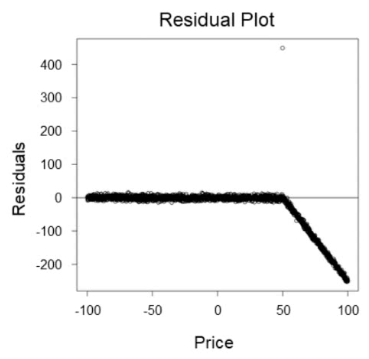

**Dữ kiện hình dạng chữ:** Residual-versus-price plot: residuals are close to zero for prices approximately −100 to 50; above approximately 50 they trend downward, reaching approximately −250 near price 100. One point near price 50 has residual around +400. Values are approximate.

**A.** Downsample the data uniformly to reduce the amount of data.

**B.** Create two different models for different sections of the data.

**C.** Downsample the data in sections where Price < 50.

**D.** Offset the input data by a constant value where Price > 50.

**E.** Examine the input data, and apply non-linear data transformations where appropriate.

**F.** Use a non-linear model instead of a linear model.

**Đáp án sau đối chiếu: B, E, F.**

Residual có cấu trúc ở vùng giá cao; thử mô hình phi tuyến, mô hình riêng hoặc biến đổi để mô tả quan hệ này.

Đáp án in trong PDF: `ACE` (giữ để đối chiếu nguồn, không dùng làm căn cứ chấm).

Nguồn đối chiếu: [1.1. Linear Models — scikit-learn 1.9.1 documentation](https://scikit-learn.org/stable/modules/linear_model.html).

---

## Câu 224

Trang PDF: [477](../../Machine%20Learning%20-%20Specialty%20Exam.pdf#page=477) · ĐÃ ĐỐI CHIẾU

A data scientist at a food production company wants to use an Amazon SageMaker built-in model to classify different vegetables. The current dataset has many features. The company wants to save on memory costs when the data scientist trains and deploys the model. The company also wants to be able to find similar data points for each test data point. Which algorithm will meet these requirements?

**A.** K-nearest neighbors (k-NN) with dimension reduction

**B.** Linear learner with early stopping

**C.** K-means

**D.** Principal component analysis (PCA) with the algorithm mode set to random

**Đáp án sau đối chiếu: A.**

Tuning số láng giềng và dimension reduction ảnh hưởng chất lượng k-NN.

Đáp án in trong PDF: `B` (giữ để đối chiếu nguồn, không dùng làm căn cứ chấm).

Nguồn đối chiếu: [K-Nearest Neighbors (k-NN) Algorithm - Amazon SageMaker AI](https://docs.aws.amazon.com/sagemaker/latest/dg/k-nearest-neighbors.html).

---

## Câu 225

Trang PDF: [480](../../Machine%20Learning%20-%20Specialty%20Exam.pdf#page=480) · ĐÃ ĐỐI CHIẾU

A data scientist is training a large PyTorch model by using Amazon SageMaker. It takes 10 hours on average to train the model on GPU instances. The data scientist suspects that training is not converging and that resource utilization is not optimal. What should the data scientist do to identify and address training issues with the LEAST development effort?

**A.** Use CPU utilization metrics that are captured in Amazon CloudWatch. Configure a CloudWatch alarm to stop the training job early if low CPU utilization occurs.

**B.** Use high-resolution custom metrics that are captured in Amazon CloudWatch. Configure an AWS Lambda function to analyze the metrics and to stop the training job early if issues are detected.

**C.** Use the SageMaker Debugger vanishing_gradient and LowGPUUtilization built-in rules to detect issues and to launch the StopTrainingJob action if issues are detected.

**D.** Use the SageMaker Debugger confusion and feature_importance_overweight built-in rules to detect issues and to launch the StopTrainingJob action if issues are detected.

**Đáp án sau đối chiếu: C.**

Debugger phát hiện vanishing gradients hoặc GPU utilization thấp và hỗ trợ dừng training job.

Đáp án in trong PDF: `D` (giữ để đối chiếu nguồn, không dùng làm căn cứ chấm).

Nguồn đối chiếu: [List of Debugger built-in rules - Amazon SageMaker AI](https://docs.aws.amazon.com/sagemaker/latest/dg/debugger-built-in-rules.html).

---

## Câu 226

Trang PDF: [481](../../Machine%20Learning%20-%20Specialty%20Exam.pdf#page=481) · ĐÃ ĐỐI CHIẾU

A bank wants to launch a low-rate credit promotion campaign. The bank must identify which customers to target with the promotion and wants to make sure that each customer's full credit history is considered when an approval or denial decision is made. The bank's data science team used the XGBoost algorithm to train a classification model based on account transaction features. The data science team deployed the model by using the Amazon SageMaker model hosting service. The accuracy of the model is sufficient, but the data science team wants to be able to explain why the model denies the promotion to some customers. What should the data science team do to meet this requirement in the MOST operationally efficient manner?

**A.** Create a SageMaker notebook instance. Upload the model artifact to the notebook. Use the plot_importance() method in the Python XGBoost interface to create a feature importance chart for the individual predictions.

**B.** Retrain the model by using SageMaker Debugger. Configure Debugger to calculate and collect Shapley values. Create a chart that shows features and SHapley. Additive explanations (SHAP) values to explain how the features affect the model outcomes.

**C.** Set up and run an explainability job powered by SageMaker Clarify to analyze the individual customer data, using the training data as a baseline. Create a chart that shows features and SHapley Additive explanations (SHAP) values to explain how the features affect the model outcomes.

**D.** Use SageMaker Model Monitor to create Shapley values that help explain model behavior. Store the Shapley values in Amazon S3. Create a chart that shows features and SHapley Additive explanations (SHAP) values to explain how the features affect the model outcomes.

**Đáp án sau đối chiếu: C.**

Clarify tạo SHAP explanations cho model đã huấn luyện.

Đáp án in trong PDF: `D` (giữ để đối chiếu nguồn, không dùng làm căn cứ chấm).

Nguồn đối chiếu: [Model Explainability - Amazon SageMaker AI](https://docs.aws.amazon.com/sagemaker/latest/dg/clarify-model-explainability.html).

---

## Câu 227

Trang PDF: [483](../../Machine%20Learning%20-%20Specialty%20Exam.pdf#page=483) · ĐÃ ĐỐI CHIẾU

A company has hired a data scientist to create a loan risk model. The dataset contains loan amounts and variables such as loan type, region, and other demographic variables. The data scientist wants to use Amazon SageMaker to test bias regarding the loan amount distribution with respect to some of these categorical variables. Which pretraining bias metrics should the data scientist use to check the bias distribution? (Choose three.)

**A.** Class imbalance

**B.** Conditional demographic disparity

**C.** Difference in proportions of labels

**D.** Jensen-Shannon divergence

**E.** Kullback-Leibler divergence

**F.** Total variation distance

**Đáp án sau đối chiếu: D, E, F.**

KL, JS và total variation so sánh phân phối của nhãn liên tục giữa các nhóm.

Đáp án in trong PDF: `ACF` (giữ để đối chiếu nguồn, không dùng làm căn cứ chấm).

Nguồn đối chiếu: [Pre-training Bias Metrics - Amazon SageMaker AI](https://docs.aws.amazon.com/sagemaker/latest/dg/clarify-measure-data-bias.html).

---

## Câu 228

Trang PDF: [485](../../Machine%20Learning%20-%20Specialty%20Exam.pdf#page=485) · BỐI CẢNH DỊCH VỤ CŨ

A retail company wants to use Amazon Forecast to predict daily stock levels of inventory. The cost of running out of items in stock is much higher for the company than the cost of having excess inventory. The company has millions of data samples for multiple years for thousands of items. The company’s purchasing department needs to predict demand for 30-day cycles for each item to ensure that restocking occurs. A machine learning (ML) specialist wants to use item-related features such as "category," "brand," and "safety stock count." The ML specialist also wants to use a binary time series feature that has "promotion applied?" as its name. Future promotion information is available only for the next 5 days. The ML specialist must choose an algorithm and an evaluation metric for a solution to produce prediction results that will maximize company profit. Which solution will meet these requirements?

**A.** Train a model by using the Autoregressive Integrated Moving Average (ARIMA) algorithm. Evaluate the model by using the Weighted Quantile Loss (wQL) metric at 0.75 (P75).

**B.** Train a model by using the Autoregressive Integrated Moving Average (ARIMA) algorithm. Evaluate the model by using the Weighted Absolute Percentage Error (WAPE) metric.

**C.** Train a model by using the Convolutional Neural Network - Quantile Regression (CNN-QR) algorithm. Evaluate the model by using the Weighted Quantile Loss (wQL) metric at 0.75 (P75).

**D.** Train a model by using the Convolutional Neural Network - Quantile Regression (CNN-QR) algorithm. Evaluate the model by using the Weighted Absolute Percentage Error (WAPE) metric.

**Đáp án sau đối chiếu: C.**

CNN-QR hỗ trợ covariates chỉ có trong quá khứ; quantile P75 ưu tiên giảm thiếu hàng.

Đáp án in trong PDF: `D` (giữ để đối chiếu nguồn, không dùng làm căn cứ chấm).

Nguồn đối chiếu: [CNN-QR Algorithm - Amazon Forecast](https://docs.aws.amazon.com/forecast/latest/dg/aws-forecast-algo-cnnqr.html); [Document History for Amazon Forecast - Amazon Forecast](https://docs.aws.amazon.com/forecast/latest/dg/doc-history.html).

---

## Câu 229

Trang PDF: [487](../../Machine%20Learning%20-%20Specialty%20Exam.pdf#page=487) · ĐÃ ĐỐI CHIẾU

An online retail company wants to develop a natural language processing (NLP) model to improve customer service. A machine learning (ML) specialist is setting up distributed training of a Bidirectional Encoder Representations from Transformers (BERT) model on Amazon SageMaker. SageMaker will use eight compute instances for the distributed training. The ML specialist wants to ensure the security of the data during the distributed training. The data is stored in an Amazon S3 bucket. Which combination of steps should the ML specialist take to protect the data during the distributed training? (Choose three.)

**A.** Run distributed training jobs in a private VPC. Enable inter-container traffic encryption.

**B.** Run distributed training jobs across multiple VPCs. Enable VPC peering.

**C.** Create an S3 VPC endpoint. Then configure network routes, endpoint policies, and S3 bucket policies.

**D.** Grant read-only access to SageMaker resources by using an IAM role.

**E.** Create a NAT gateway. Assign an Elastic IP address for the NAT gateway.

**F.** Configure an inbound rule to allow traffic from a security group that is associated with the training instances.

**Đáp án sau đối chiếu: A, C, F.**

Mã hóa inter-container traffic, S3 VPC endpoint và security group cho phép các training instances liên lạc.

Đáp án in trong PDF: `BEF` (giữ để đối chiếu nguồn, không dùng làm căn cứ chấm).

Nguồn đối chiếu: [Give SageMaker AI Training Jobs Access to Resources in Your Amazon VPC - Amazon SageMaker AI](https://docs.aws.amazon.com/sagemaker/latest/dg/train-vpc.html).

---

## Câu 230

Trang PDF: [489](../../Machine%20Learning%20-%20Specialty%20Exam.pdf#page=489) · BỐI CẢNH DỊCH VỤ CŨ

An analytics company has an Amazon SageMaker hosted endpoint for an image classification model. The model is a custom-built convolutional neural network (CNN) and uses the PyTorch deep learning framework. The company wants to increase throughput and decrease latency for customers that use the model. Which solution will meet these requirements MOST cost-effectively?

**A.** Use Amazon Elastic Inference on the SageMaker hosted endpoint.

**B.** Retrain the CNN with more layers and a larger dataset.

**C.** Retrain the CNN with more layers and a smaller dataset.

**D.** Choose a SageMaker instance type that has multiple GPUs.

**Đáp án sau đối chiếu: A.**

Elastic Inference là đáp án của kiến trúc cũ, không còn dùng để triển khai mới.

Đáp án in trong PDF: `C` (giữ để đối chiếu nguồn, không dùng làm căn cứ chấm).

Nguồn đối chiếu: [Class: AWS.ElasticInference — AWS SDK for JavaScript](https://docs.aws.amazon.com/AWSJavaScriptSDK/latest/AWS/ElasticInference.html).

---

## Câu 231

Trang PDF: [490](../../Machine%20Learning%20-%20Specialty%20Exam.pdf#page=490) · ĐÃ ĐỐI CHIẾU

An ecommerce company is collecting structured data and unstructured data from its website, mobile apps, and IoT devices. The data is stored in several databases and Amazon S3 buckets. The company is implementing a scalable repository to store structured data and unstructured data. The company must implement a solution that provides a central data catalog, self-service access to the data, and granular data access policies and encryption to protect the data. Which combination of actions will meet these requirements with the LEAST amount of setup? (Choose three.)

**A.** Identify the existing data in the databases and S3 buckets. Link the data to AWS Lake Formation.

**B.** Identify the existing data in the databases and S3 buckets. Link the data to AWS Glue.

**C.** Run AWS Glue crawlers on the linked data sources to create a central data catalog.

**D.** Apply granular access policies by using AWS Identity and Access Management (1AM). Configure server-side encryption on each data source.

**E.** Apply granular access policies and encryption by using AWS Lake Formation.

**F.** Apply granular access policies and encryption by using AWS Glue.

**Đáp án sau đối chiếu: A, C, E.**

Lake Formation quản lý lake và quyền; Glue crawler xây Data Catalog.

Đáp án in trong PDF: `ADE` (giữ để đối chiếu nguồn, không dùng làm căn cứ chấm).

Nguồn đối chiếu: [What is AWS Lake Formation? - AWS Lake Formation](https://docs.aws.amazon.com/lake-formation/latest/dg/what-is-lake-formation.html).

---

## Câu 232

Trang PDF: [492](../../Machine%20Learning%20-%20Specialty%20Exam.pdf#page=492) · ĐÃ ĐỐI CHIẾU

A machine learning (ML) specialist is developing a deep learning sentiment analysis model that is based on data from movie reviews. After the ML specialist trains the model and reviews the model results on the validation set, the ML specialist discovers that the model is overfitting. Which solutions will MOST improve the model generalization and reduce overfitting? (Choose three.)

**A.** Shuffle the dataset with a different seed.

**B.** Decrease the learning rate.

**C.** Increase the number of layers in the network.

**D.** Add L1 regularization and L2 regularization.

**E.** Add dropout.

**F.** Decrease the number of layers in the network.

**Đáp án sau đối chiếu: D, E, F.**

Regularization, dropout và giảm độ sâu hạn chế overfitting.

Đáp án in trong PDF: `CEF` (giữ để đối chiếu nguồn, không dùng làm căn cứ chấm).

Nguồn đối chiếu: [Model Fit: Underfitting vs. Overfitting - Amazon Machine Learning](https://docs.aws.amazon.com/machine-learning/latest/dg/model-fit-underfitting-vs-overfitting.html); [Dropout layer](https://keras.io/api/layers/regularization_layers/dropout/).

---

## Câu 233

Trang PDF: [494](../../Machine%20Learning%20-%20Specialty%20Exam.pdf#page=494) · ĐÃ ĐỐI CHIẾU

An online advertising company is developing a linear model to predict the bid price of advertisements in real time with low-latency predictions. A data scientist has trained the linear model by using many features, but the model is overfitting the training dataset. The data scientist needs to prevent overfitting and must reduce the number of features. Which solution will meet these requirements?

**A.** Retrain the model with L1 regularization applied.

**B.** Retrain the model with L2 regularization applied.

**C.** Retrain the model with dropout regularization applied.

**D.** Retrain the model by using more data.

**Đáp án sau đối chiếu: A.**

L1 có thể đưa hệ số về zero, đồng thời giảm overfit và chọn đặc trưng.

Đáp án in trong PDF: `A` (giữ để đối chiếu nguồn, không dùng làm căn cứ chấm).

Nguồn đối chiếu: [1.13. Feature selection — scikit-learn 1.9.1 documentation](https://scikit-learn.org/stable/modules/feature_selection.html).

---

## Câu 234

Trang PDF: [495](../../Machine%20Learning%20-%20Specialty%20Exam.pdf#page=495) · ĐÃ ĐỐI CHIẾU

A credit card company wants to identify fraudulent transactions in real time. A data scientist builds a machine learning model for this purpose. The transactional data is captured and stored in Amazon S3. The historic data is already labeled with two classes: fraud (positive) and fair transactions (negative). The data scientist removes all the missing data and builds a classifier by using the XGBoost algorithm in Amazon SageMaker. The model produces the following results: • True positive rate (TPR): 0.700 • False negative rate (FNR): 0.300 • True negative rate (TNR): 0.977 • False positive rate (FPR): 0.023 • Overall accuracy: 0.949 Which solution should the data scientist use to improve the performance of the model?

**A.** Apply the Synthetic Minority Oversampling Technique (SMOTE) on the minority class in the training dataset. Retrain the model with the updated training data.

**B.** Apply the Synthetic Minority Oversampling Technique (SMOTE) on the majority class in the training dataset. Retrain the model with the updated training data.

**C.** Undersample the minority class.

**D.** Oversample the majority class.

**Đáp án sau đối chiếu: A.**

SMOTE trên lớp fraud thiểu số giúp cân bằng dữ liệu training.

Đáp án in trong PDF: `C` (giữ để đối chiếu nguồn, không dùng làm căn cứ chấm).

Nguồn đối chiếu: [2. Over-sampling — Version 0.14.2](https://imbalanced-learn.org/stable/over_sampling.html).

---

## Câu 235

Trang PDF: [496](../../Machine%20Learning%20-%20Specialty%20Exam.pdf#page=496) · ĐÃ ĐỐI CHIẾU

A company is training machine learning (ML) models on Amazon SageMaker by using 200 TB of data that is stored in Amazon S3 buckets. The training data consists of individual files that are each larger than 200 MB in size. The company needs a data access solution that offers the shortest processing time and the least amount of setup. Which solution will meet these requirements?

**A.** Use File mode in SageMaker to copy the dataset from the S3 buckets to the ML instance storage.

**B.** Create an Amazon FSx for Lustre file system. Link the file system to the S3 buckets.

**C.** Create an Amazon Elastic File System (Amazon EFS) file system. Mount the file system to the training instances.

**D.** Use FastFile mode in SageMaker to stream the files on demand from the S3 buckets.

**Đáp án sau đối chiếu: D.**

FastFile đọc dữ liệu S3 theo nhu cầu, không tải trước toàn bộ 200 TB.

Đáp án in trong PDF: `D` (giữ để đối chiếu nguồn, không dùng làm căn cứ chấm).

Nguồn đối chiếu: [Setting up training jobs to access datasets - Amazon SageMaker AI](https://docs.aws.amazon.com/sagemaker/latest/dg/model-access-training-data.html).

---

## Câu 236

Trang PDF: [498](../../Machine%20Learning%20-%20Specialty%20Exam.pdf#page=498) · ĐÃ ĐỐI CHIẾU

An online store is predicting future book sales by using a linear regression model that is based on past sales data. The data includes duration, a numerical feature that represents the number of days that a book has been listed in the online store. A data scientist performs an exploratory data analysis and discovers that the relationship between book sales and duration is skewed and non-linear. Which data transformation step should the data scientist take to improve the predictions of the model?

**A.** One-hot encoding

**B.** Cartesian product transformation

**C.** Quantile binning

**D.** Normalization

**Đáp án sau đối chiếu: C.**

Quantile binning biểu diễn quan hệ phi tuyến bằng các khoảng của biến số lệch.

Đáp án in trong PDF: `A` (giữ để đối chiếu nguồn, không dùng làm căn cứ chấm).

Nguồn đối chiếu: [Data Transformations Reference - Amazon Machine Learning](https://docs.aws.amazon.com/machine-learning/latest/dg/data-transformations-reference.html).

---

## Câu 237

Trang PDF: [500](../../Machine%20Learning%20-%20Specialty%20Exam.pdf#page=500) · ĐÃ ĐỐI CHIẾU

A company's data engineer wants to use Amazon S3 to share datasets with data scientists. The data scientists work in three departments: Finance. Marketing, and Human Resources. Each department has its own IAM user group. Some datasets contain sensitive information and should be accessed only by the data scientists from the Finance department. How can the data engineer set up access to meet these requirements?

**A.** Create an S3 bucket for each dataset. Create an ACL for each S3 bucket. For each S3 bucket that contains a sensitive dataset, set the ACL to allow access only from the Finance department user group. Allow all three department user groups to access each S3 bucket that contains a non-sensitive dataset.

**B.** Create an S3 bucket for each dataset. For each S3 bucket that contains a sensitive dataset, set the bucket policy to allow access only from the Finance department user group. Allow all three department user groups to access each S3 bucket that contains a non-sensitive dataset.

**C.** Create a single S3 bucket that includes two folders to separate the sensitive datasets from the non-sensitive datasets. For the Finance department user group, attach an IAM policy that provides access to both folders. For the Marketing and Human Resources department user groups, attach an IAM policy that provides access to only the folder that contains the non-sensitive datasets.

**D.** Create a single S3 bucket that includes two folders to separate the sensitive datasets from the non-sensitive datasets. Set the policy for the S3 bucket to allow only the Finance department user group to access the folder that contains the sensitive datasets. Allow all three department user groups to access the folder that contains the non-sensitive datasets.

**Đáp án sau đối chiếu: C.**

Gắn identity policy cho IAM group; IAM group không dùng làm Principal trong bucket policy hoặc ACL.

Đáp án in trong PDF: `D` (giữ để đối chiếu nguồn, không dùng làm căn cứ chấm).

Nguồn đối chiếu: [AWS JSON policy elements: Principal - AWS Identity and Access Management](https://docs.aws.amazon.com/IAM/latest/UserGuide/reference_policies_elements_principal.html).

---

## Câu 238

Trang PDF: [503](../../Machine%20Learning%20-%20Specialty%20Exam.pdf#page=503) · ĐÃ ĐỐI CHIẾU

A company operates an amusement park. The company wants to collect, monitor, and store real-time traffic data at several park entrances by using strategically placed cameras. The company’s security team must be able to immediately access the data for viewing. Stored data must be indexed and must be accessible to the company’s data science team. Which solution will meet these requirements MOST cost-effectively?

**A.** Use Amazon Kinesis Video Streams to ingest, index, and store the data. Use the built-in integration with Amazon Rekognition for viewing by the security team.

**B.** Use Amazon Kinesis Video Streams to ingest, index, and store the data. Use the built-in HTTP live streaming (HLS) capability for viewing by the security team.

**C.** Use Amazon Rekognition Video and the GStreamer plugin to ingest the data for viewing by the security team. Use Amazon Kinesis Data Streams to index and store the data.

**D.** Use Amazon Kinesis Data Firehose to ingest, index, and store the data. Use the built-in HTTP live streaming (HLS) capability for viewing by the security team.

**Đáp án sau đối chiếu: B.**

Kinesis Video Streams lưu/index video và HLS phục vụ xem trực tiếp.

Đáp án in trong PDF: `B` (giữ để đối chiếu nguồn, không dùng làm căn cứ chấm).

Nguồn đối chiếu: [Video playback with HLS - Amazon Kinesis Video Streams](https://docs.aws.amazon.com/kinesisvideostreams/latest/dg/hls-playback.html).

---

## Câu 239

Trang PDF: [504](../../Machine%20Learning%20-%20Specialty%20Exam.pdf#page=504) · BỐI CẢNH DỊCH VỤ CŨ

An engraving company wants to automate its quality control process for plaques. The company performs the process before mailing each customized plaque to a customer. The company has created an Amazon S3 bucket that contains images of defects that should cause a plaque to be rejected. Low-confidence predictions must be sent to an internal team of reviewers who are using Amazon Augmented AI (Amazon A2I). Which solution will meet these requirements?

**A.** Use Amazon Textract for automatic processing. Use Amazon A2I with Amazon Mechanical Turk for manual review.

**B.** Use Amazon Rekognition for automatic processing. Use Amazon A2I with a private workforce option for manual review.

**C.** Use Amazon Transcribe for automatic processing. Use Amazon A2I with a private workforce option for manual review.

**D.** Use AWS Panorama for automatic processing. Use Amazon A2I with Amazon Mechanical Turk for manual review.

**Đáp án sau đối chiếu: B.**

Rekognition xử lý ảnh; A2I private workforce gửi ca cần kiểm tra cho đội nội bộ. A2I hiện không nhận khách hàng mới.

Đáp án in trong PDF: `C` (giữ để đối chiếu nguồn, không dùng làm căn cứ chấm).

Nguồn đối chiếu: [Using Amazon Augmented AI for Human Review - Amazon SageMaker AI](https://docs.aws.amazon.com/sagemaker/latest/dg/a2i-use-augmented-ai-a2i-human-review-loops.html); [What is Amazon Rekognition Custom Labels? - Rekognition](https://docs.aws.amazon.com/rekognition/latest/customlabels-dg/what-is.html); [Workforces - Amazon SageMaker AI](https://docs.aws.amazon.com/sagemaker/latest/dg/sms-workforce-management.html).

---

## Câu 240

Trang PDF: [505](../../Machine%20Learning%20-%20Specialty%20Exam.pdf#page=505) · BỐI CẢNH DỊCH VỤ CŨ

A machine learning (ML) engineer at a bank is building a data ingestion solution to provide transaction features to financial ML models. Raw transactional data is available in an Amazon Kinesis data stream. The solution must compute rolling averages of the ingested data from the data stream and must store the results in Amazon SageMaker Feature Store. The solution also must serve the results to the models in near real time. Which solution will meet these requirements?

**A.** Load the data into an Amazon S3 bucket by using Amazon Kinesis Data Firehose. Use a SageMaker Processing job to aggregate the data and to load the results into SageMaker Feature Store as an online feature group.

**B.** Write the data directly from the data stream into SageMaker Feature Store as an online feature group. Calculate the rolling averages in place within SageMaker Feature Store by using the SageMaker GetRecord API operation.

**C.** Consume the data stream by using an Amazon Kinesis Data Analytics SQL application that calculates the rolling averages. Generate a result stream. Consume the result stream by using a custom AWS Lambda function that publishes the results to SageMaker Feature Store as an online feature group.

**D.** Load the data into an Amazon S3 bucket by using Amazon Kinesis Data Firehose. Use a SageMaker Processing job to load the data into SageMaker Feature Store as an offline feature group. Compute the rolling averages at query time.

**Đáp án sau đối chiếu: C.**

SQL window tính rolling average, Lambda ghi online store; dịch vụ Kinesis SQL cũ đã ngừng hoạt động.

Đáp án in trong PDF: `A` (giữ để đối chiếu nguồn, không dùng làm căn cứ chấm).

Nguồn đối chiếu: [What Is Amazon Kinesis Data Analytics for SQL Applications? - Amazon Kinesis Data Analytics for SQL Applications Developer Guide](https://docs.aws.amazon.com/kinesisanalytics/latest/dev/what-is.html); [Create, store, and share features with Feature Store - Amazon SageMaker AI](https://docs.aws.amazon.com/sagemaker/latest/dg/feature-store.html).

---

## Câu 241

Trang PDF: [506](../../Machine%20Learning%20-%20Specialty%20Exam.pdf#page=506) · ĐÃ ĐỐI CHIẾU

Each morning, a data scientist at a rental car company creates insights about the previous day’s rental car reservation demands. The company needs to automate this process by streaming the data to Amazon S3 in near real time. The solution must detect high-demand rental cars at each of the company’s locations. The solution also must create a visualization dashboard that automatically refreshes with the most recent data. Which solution will meet these requirements with the LEAST development time?

**A.** Use Amazon Kinesis Data Firehose to stream the reservation data directly to Amazon S3. Detect high-demand outliers by using Amazon QuickSight ML Insights. Visualize the data in QuickSight.

**B.** Use Amazon Kinesis Data Streams to stream the reservation data directly to Amazon S3. Detect high-demand outliers by using the Random Cut Forest (RCF) trained model in Amazon SageMaker. Visualize the data in Amazon QuickSight.

**C.** Use Amazon Kinesis Data Firehose to stream the reservation data directly to Amazon S3. Detect high-demand outliers by using the Random Cut Forest (RCF) trained model in Amazon SageMaker. Visualize the data in Amazon QuickSight.

**D.** Use Amazon Kinesis Data Streams to stream the reservation data directly to Amazon S3. Detect high-demand outliers by using Amazon QuickSight ML Insights. Visualize the data in QuickSight.

**Đáp án sau đối chiếu: A.**

Firehose ghi S3; QuickSight ML Insights phát hiện bất thường và trực quan hóa.

Đáp án in trong PDF: `A` (giữ để đối chiếu nguồn, không dùng làm căn cứ chấm).

Nguồn đối chiếu: [Gaining insights with machine learning (ML) in Amazon Quick Sight - Amazon Quick](https://docs.aws.amazon.com/quick/latest/userguide/making-data-driven-decisions-with-ml-in-quicksight.html).

---

## Câu 242

Trang PDF: [507](../../Machine%20Learning%20-%20Specialty%20Exam.pdf#page=507) · CẦN XÁC MINH / SỬA ĐỀ

A company is planning a marketing campaign to promote a new product to existing customers. The company has data for past promotions that are similar. The company decides to try an experiment to send a more expensive marketing package to a smaller number of customers. The company wants to target the marketing campaign to customers who are most likely to buy the new product. The experiment requires that at least 90% of the customers who are likely to purchase the new product receive the marketing materials. The company trains a model by using the linear learner algorithm in Amazon SageMaker. The model has a recall score of 80% and a precision of 75%. How should the company retrain the model to meet these requirements?

**A.** Set the target_recall hyperparameter to 90%. Set the binary_classifier_model_selection_criteria hyperparameter to recall_at_target_precision.

**B.** Set the target_precision hyperparameter to 90%. Set the binary_classifier_model_selection_criteria hyperparameter to precision_at_target_recall.

**C.** Use 90% of the historical data for training. Set the number of epochs to 20.

**D.** Set the normalize_label hyperparameter to true. Set the number of classes to 2.

**Chưa chốt đáp án.**

Không phương án nào ghép đúng hai tham số. Cần target_recall=0.9 và binary_classifier_model_selection_criteria=precision_at_target_recall.

Đáp án in trong PDF: `B` (giữ để đối chiếu nguồn, không dùng làm căn cứ chấm).

Nguồn đối chiếu: [Linear learner hyperparameters - Amazon SageMaker AI](https://docs.aws.amazon.com/sagemaker/latest/dg/ll_hyperparameters.html).

---

## Câu 243

Trang PDF: [509](../../Machine%20Learning%20-%20Specialty%20Exam.pdf#page=509) · ĐÃ ĐỐI CHIẾU

A wildlife research company has a set of images of lions and cheetahs. The company created a dataset of the images. The company labeled each image with a binary label that indicates whether an image contains a lion or cheetah. The company wants to train a model to identify whether new images contain a lion or cheetah. Which Amazon SageMaker algorithm will meet this requirement?

**A.** XGBoost

**B.** Image Classification - TensorFlow

**C.** Object Detection - TensorFlow

**D.** Semantic segmentation - MXNet

**Đáp án sau đối chiếu: B.**

Image Classification trả nhãn cho toàn ảnh khi không cần bounding boxes.

Đáp án in trong PDF: `B` (giữ để đối chiếu nguồn, không dùng làm căn cứ chấm).

Nguồn đối chiếu: [Image Classification - MXNet - Amazon SageMaker AI](https://docs.aws.amazon.com/sagemaker/latest/dg/image-classification.html).

---

## Câu 244

Trang PDF: [510](../../Machine%20Learning%20-%20Specialty%20Exam.pdf#page=510) · ĐÃ ĐỐI CHIẾU

A data scientist for a medical diagnostic testing company has developed a machine learning (ML) model to identify patients who have a specific disease. The dataset that the scientist used to train the model is imbalanced. The dataset contains a large number of healthy patients and only a small number of patients who have the disease. The model should consider that patients who are incorrectly identified as positive for the disease will increase costs for the company. Which metric will MOST accurately evaluate the performance of this model?

**A.** Recall

**B.** F1 score

**C.** Accuracy

**D.** Precision

**Đáp án sau đối chiếu: D.**

Precision tập trung vào tỷ lệ bệnh thật trong các dự đoán dương, phù hợp yêu cầu giảm false positive.

Đáp án in trong PDF: `D` (giữ để đối chiếu nguồn, không dùng làm căn cứ chấm).

Nguồn đối chiếu: [3.4. Metrics and scoring: quantifying the quality of predictions — scikit-learn 1.9.1 documentation](https://scikit-learn.org/stable/modules/model_evaluation.html).

---

## Câu 245

Trang PDF: [511](../../Machine%20Learning%20-%20Specialty%20Exam.pdf#page=511) · ĐÃ ĐỐI CHIẾU

A machine learning (ML) specialist is training a linear regression model. The specialist notices that the model is overfitting. The specialist applies an L1 regularization parameter and runs the model again. This change results in all features having zero weights. What should the ML specialist do to improve the model results?

**A.** Increase the L1 regularization parameter. Do not change any other training parameters.

**B.** Decrease the L1 regularization parameter. Do not change any other training parameters.

**C.** Introduce a large L2 regularization parameter. Do not change the current L1 regularization value.

**D.** Introduce a small L2 regularization parameter. Do not change the current L1 regularization value.

**Đáp án sau đối chiếu: B.**

L1 quá mạnh xóa mọi hệ số; giảm regularization để mô hình học tín hiệu.

Đáp án in trong PDF: `B` (giữ để đối chiếu nguồn, không dùng làm căn cứ chấm).

Nguồn đối chiếu: [1.13. Feature selection — scikit-learn 1.9.1 documentation](https://scikit-learn.org/stable/modules/feature_selection.html).

---

## Câu 246

Trang PDF: [512](../../Machine%20Learning%20-%20Specialty%20Exam.pdf#page=512) · ĐÃ ĐỐI CHIẾU

A machine learning (ML) engineer is integrating a production model with a customer metadata repository for real-time inference. The repository is hosted in Amazon SageMaker Feature Store. The engineer wants to retrieve only the latest version of the customer metadata record for a single customer at a time. Which solution will meet these requirements?

**A.** Use the SageMaker Feature Store BatchGetRecord API with the record identifier. Filter to find the latest record.

**B.** Create an Amazon Athena query to retrieve the data from the feature table.

**C.** Create an Amazon Athena query to retrieve the data from the feature table. Use the write_time value to find the latest record.

**D.** Use the SageMaker Feature Store GetRecord API with the record identifier.

**Đáp án sau đối chiếu: D.**

GetRecord đọc bản ghi mới nhất của một identifier trong online store.

Đáp án in trong PDF: `D` (giữ để đối chiếu nguồn, không dùng làm căn cứ chấm).

Nguồn đối chiếu: [Create, store, and share features with Feature Store - Amazon SageMaker AI](https://docs.aws.amazon.com/sagemaker/latest/dg/feature-store.html); [GetRecord - Amazon SageMaker](https://docs.aws.amazon.com/sagemaker/latest/APIReference/API_feature_store_GetRecord.html).

---

## Câu 247

Trang PDF: [513](../../Machine%20Learning%20-%20Specialty%20Exam.pdf#page=513) · ĐÃ ĐỐI CHIẾU

A company’s data scientist has trained a new machine learning model that performs better on test data than the company’s existing model performs in the production environment. The data scientist wants to replace the existing model that runs on an Amazon SageMaker endpoint in the production environment. However, the company is concerned that the new model might not work well on the production environment data. The data scientist needs to perform A/B testing in the production environment to evaluate whether the new model performs well on production environment data. Which combination of steps must the data scientist take to perform the A/B testing? (Choose two.)

**A.** Create a new endpoint configuration that includes a production variant for each of the two models.

**B.** Create a new endpoint configuration that includes two target variants that point to different endpoints.

**C.** Deploy the new model to the existing endpoint.

**D.** Update the existing endpoint to activate the new model.

**E.** Update the existing endpoint to use the new endpoint configuration.

**Đáp án sau đối chiếu: A, E.**

Tạo endpoint configuration với hai variants, rồi UpdateEndpoint dùng configuration mới.

Đáp án in trong PDF: `AC` (giữ để đối chiếu nguồn, không dùng làm căn cứ chấm).

Nguồn đối chiếu: [Testing models with production variants - Amazon SageMaker AI](https://docs.aws.amazon.com/sagemaker/latest/dg/model-ab-testing.html).

---

## Câu 248

Trang PDF: [515](../../Machine%20Learning%20-%20Specialty%20Exam.pdf#page=515) · ĐÃ ĐỐI CHIẾU

A data scientist is working on a forecast problem by using a dataset that consists of .csv files that are stored in Amazon S3. The files contain a timestamp variable in the following format: March 1st, 2020, 08:14pm - There is a hypothesis about seasonal differences in the dependent variable. This number could be higher or lower for weekdays because some days and hours present varying values, so the day of the week, month, or hour could be an important factor. As a result, the data scientist needs to transform the timestamp into weekdays, month, and day as three separate variables to conduct an analysis. Which solution requires the LEAST operational overhead to create a new dataset with the added features?

**A.** Create an Amazon EMR cluster. Develop PySpark code that can read the timestamp variable as a string, transform and create the new variables, and save the dataset as a new file in Amazon S3.

**B.** Create a processing job in Amazon SageMaker. Develop Python code that can read the timestamp variable as a string, transform and create the new variables, and save the dataset as a new file in Amazon S3.

**C.** Create a new flow in Amazon SageMaker Data Wrangler. Import the S3 file, use the Featurize date/time transform to generate the new variables, and save the dataset as a new file in Amazon S3.

**D.** Create an AWS Glue job. Develop code that can read the timestamp variable as a string, transform and create the new variables, and save the dataset as a new file in Amazon S3.

**Đáp án sau đối chiếu: C.**

Data Wrangler có Featurize date/time, không cần viết job ETL riêng.

Đáp án in trong PDF: `C` (giữ để đối chiếu nguồn, không dùng làm căn cứ chấm).

Nguồn đối chiếu: [Transform Data - Amazon SageMaker AI](https://docs.aws.amazon.com/sagemaker/latest/dg/data-wrangler-transform.html).

---

## Câu 249

Trang PDF: [516](../../Machine%20Learning%20-%20Specialty%20Exam.pdf#page=516) · ĐÃ ĐỐI CHIẾU

A manufacturing company has a production line with sensors that collect hundreds of quality metrics. The company has stored sensor data and manual inspection results in a data lake for several months. To automate quality control, the machine learning team must build an automated mechanism that determines whether the produced goods are good quality, replacement market quality, or scrap quality based on the manual inspection results. Which modeling approach will deliver the MOST accurate prediction of product quality?

**A.** Amazon SageMaker DeepAR forecasting algorithm

**B.** Amazon SageMaker XGBoost algorithm

**C.** Amazon SageMaker Latent Dirichlet Allocation (LDA) algorithm

**D.** A convolutional neural network (CNN) and ResNet

**Đáp án sau đối chiếu: B.**

XGBoost phân loại chất lượng từ các feature số và nhãn inspection.

Đáp án in trong PDF: `B` (giữ để đối chiếu nguồn, không dùng làm căn cứ chấm).

Nguồn đối chiếu: [XGBoost hyperparameters - Amazon SageMaker AI](https://docs.aws.amazon.com/sagemaker/latest/dg/xgboost_hyperparameters.html).

---

## Câu 250

Trang PDF: [517](../../Machine%20Learning%20-%20Specialty%20Exam.pdf#page=517) · ĐÃ ĐỐI CHIẾU

A healthcare company wants to create a machine learning (ML) model to predict patient outcomes. A data science team developed an ML model by using a custom ML library. The company wants to use Amazon SageMaker to train this model. The data science team creates a custom SageMaker image to train the model. When the team tries to launch the custom image in SageMaker Studio, the data scientists encounter an error within the application. Which service can the data scientists use to access the logs for this error?

**A.** Amazon S3

**B.** Amazon Elastic Block Store (Amazon EBS)

**C.** AWS CloudTrail

**D.** Amazon CloudWatch

**Đáp án sau đối chiếu: D.**

CloudWatch Logs lưu log ứng dụng/container của SageMaker Studio.

Đáp án in trong PDF: `A` (giữ để đối chiếu nguồn, không dùng làm căn cứ chấm).

Nguồn đối chiếu: [CloudWatch Logs for Amazon SageMaker AI - Amazon SageMaker AI](https://docs.aws.amazon.com/sagemaker/latest/dg/logging-cloudwatch.html).

---

## Câu 251

Trang PDF: [518](../../Machine%20Learning%20-%20Specialty%20Exam.pdf#page=518) · ĐÃ ĐỐI CHIẾU

A data scientist wants to build a financial trading bot to automate investment decisions. The financial bot should recommend the quantity and price of an asset to buy or sell to maximize long-term profit. The data scientist will continuously stream financial transactions to the bot for training purposes. The data scientist must select the appropriate machine learning (ML) algorithm to develop the financial trading bot. Which type of ML algorithm will meet these requirements?

**A.** Supervised learning

**B.** Unsupervised learning

**C.** Semi-supervised learning

**D.** Reinforcement learning

**Đáp án sau đối chiếu: D.**

Reinforcement learning tối ưu phần thưởng tích lũy qua chuỗi hành động.

Đáp án in trong PDF: `C` (giữ để đối chiếu nguồn, không dùng làm căn cứ chấm).

Nguồn đối chiếu: [Use Reinforcement Learning with Amazon SageMaker AI - Amazon SageMaker AI](https://docs.aws.amazon.com/sagemaker/latest/dg/reinforcement-learning.html).

---

## Câu 252

Trang PDF: [519](../../Machine%20Learning%20-%20Specialty%20Exam.pdf#page=519) · CẦN XÁC MINH / SỬA ĐỀ

A manufacturing company wants to create a machine learning (ML) model to predict when equipment is likely to fail. A data science team already constructed a deep learning model by using TensorFlow and a custom Python script in a local environment. The company wants to use Amazon SageMaker to train the model. Which TensorFlow estimator configuration will train the model MOST cost-effectively?

**A.** Turn on SageMaker Training Compiler by adding compiler_config=TrainingCompilerConfig() as a parameter. Pass the script to the estimator in the call to the TensorFlow fit() method.

**B.** Turn on SageMaker Training Compiler by adding compiler_config=TrainingCompilerConfig() as a parameter. Turn on managed spot training by setting the use_spot_instances parameter to True. Pass the script to the estimator in the call to the TensorFlow fit() method.

**C.** Adjust the training script to use distributed data parallelism. Specify appropriate values for the distribution parameter. Pass the script to the estimator in the call to the TensorFlow fit() method.

**D.** Turn on SageMaker Training Compiler by adding compiler_config=TrainingCompilerConfig() as a parameter. Set the MaxWaitTimeInSeconds parameter to be equal to the MaxRuntimeInSeconds parameter. Pass the script to the estimator in the call to the TensorFlow fit() method.

**Chưa chốt đáp án.** Phương án tham khảo có điều kiện: **B**.

Ý định là Training Compiler kết hợp Spot. Mọi lựa chọn mô tả truyền script vào fit() không đúng SDK: script đặt ở entry_point; Compiler còn phụ thuộc model được hỗ trợ.

Đáp án in trong PDF: `D` (giữ để đối chiếu nguồn, không dùng làm căn cứ chấm).

Nguồn đối chiếu: [Managed Spot Training in Amazon SageMaker AI - Amazon SageMaker AI](https://docs.aws.amazon.com/sagemaker/latest/dg/model-managed-spot-training.html); [Amazon SageMaker Training Compiler - Amazon SageMaker AI](https://docs.aws.amazon.com/sagemaker/latest/dg/training-compiler.html).

---

## Câu 253

Trang PDF: [520](../../Machine%20Learning%20-%20Specialty%20Exam.pdf#page=520) · ĐÃ ĐỐI CHIẾU

An automotive company uses computer vision in its autonomous cars. The company trained its object detection models successfully by using transfer learning from a convolutional neural network (CNN). The company trained the models by using PyTorch through the Amazon SageMaker SDK. The vehicles have limited hardware and compute power. The company wants to optimize the model to reduce memory, battery, and hardware consumption without a significant sacrifice in accuracy. Which solution will improve the computational efficiency of the models?

**A.** Use Amazon CloudWatch metrics to gain visibility into the SageMaker training weights, gradients, biases, and activation outputs. Compute the filter ranks based on the training information. Apply pruning to remove the low-ranking filters. Set new weights based on the pruned set of filters. Run a new training job with the pruned model.

**B.** Use Amazon SageMaker Ground Truth to build and run data labeling workflows. Collect a larger labeled dataset with the labelling workflows. Run a new training job that uses the new labeled data with previous training data.

**C.** Use Amazon SageMaker Debugger to gain visibility into the training weights, gradients, biases, and activation outputs. Compute the filter ranks based on the training information. Apply pruning to remove the low-ranking filters. Set the new weights based on the pruned set of filters. Run a new training job with the pruned model.

**D.** Use Amazon SageMaker Model Monitor to gain visibility into the ModelLatency metric and OverheadLatency metric of the model after the company deploys the model. Increase the model learning rate. Run a new training job.

**Đáp án sau đối chiếu: C.**

Dùng tensor từ Debugger để xếp hạng và prune filters, rồi huấn luyện lại.

Đáp án in trong PDF: `C` (giữ để đối chiếu nguồn, không dùng làm căn cứ chấm).

Nguồn đối chiếu: [Pruning machine learning models with Amazon SageMaker Debugger and Amazon SageMaker Experiments | Artificial Intelligence](https://aws.amazon.com/blogs/machine-learning/pruning-machine-learning-models-with-amazon-sagemaker-debugger-and-amazon-sagemaker-experiments/).

---

## Câu 254

Trang PDF: [521](../../Machine%20Learning%20-%20Specialty%20Exam.pdf#page=521) · CẦN XÁC MINH / SỬA ĐỀ

A data scientist wants to improve the fit of a machine learning (ML) model that predicts house prices. The data scientist makes a first attempt to fit the model, but the fitted model has poor accuracy on both the training dataset and the test dataset. Which steps must the data scientist take to improve model accuracy? (Choose three.)

**A.** Increase the amount of regularization that the model uses.

**B.** Decrease the amount of regularization that the model uses.

**C.** Increase the number of training examples that that model uses.

**D.** Increase the number of test examples that the model uses.

**E.** Increase the number of model features that the model uses.

**F.** Decrease the number of model features that the model uses.

**Chưa chốt đáp án.**

B và E phù hợp underfitting. Thêm training examples không bảo đảm giảm high bias; đề yêu cầu ba lựa chọn nhưng thiếu lựa chọn thứ ba có căn cứ.

Đáp án in trong PDF: `BDF` (giữ để đối chiếu nguồn, không dùng làm căn cứ chấm).

Nguồn đối chiếu: [Model Fit: Underfitting vs. Overfitting - Amazon Machine Learning](https://docs.aws.amazon.com/machine-learning/latest/dg/model-fit-underfitting-vs-overfitting.html).

---

## Câu 255

Trang PDF: [523](../../Machine%20Learning%20-%20Specialty%20Exam.pdf#page=523) · ĐÃ ĐỐI CHIẾU

A car company is developing a machine learning solution to detect whether a car is present in an image. The image dataset consists of one million images. Each image in the dataset is 200 pixels in height by 200 pixels in width. Each image is labeled as either having a car or not having a car. Which architecture is MOST likely to produce a model that detects whether a car is present in an image with the highest accuracy?

**A.** Use a deep convolutional neural network (CNN) classifier with the images as input. Include a linear output layer that outputs the probability that an image contains a car.

**B.** Use a deep convolutional neural network (CNN) classifier with the images as input. Include a softmax output layer that outputs the probability that an image contains a car.

**C.** Use a deep multilayer perceptron (MLP) classifier with the images as input. Include a linear output layer that outputs the probability that an image contains a car.

**D.** Use a deep multilayer perceptron (MLP) classifier with the images as input. Include a softmax output layer that outputs the probability that an image contains a car.

**Đáp án sau đối chiếu: B.**

CNN khai thác cấu trúc ảnh; softmax hai lớp trả phân phối xác suất hợp lệ.

Đáp án in trong PDF: `D` (giữ để đối chiếu nguồn, không dùng làm căn cứ chấm).

Nguồn đối chiếu: [Image Classification - MXNet - Amazon SageMaker AI](https://docs.aws.amazon.com/sagemaker/latest/dg/image-classification.html); [torch.nn.functional.softmax — PyTorch main documentation](https://docs.pytorch.org/docs/main/generated/torch.nn.functional.softmax.html).

---

## Câu 256

Trang PDF: [525](../../Machine%20Learning%20-%20Specialty%20Exam.pdf#page=525) · ĐÃ ĐỐI CHIẾU

A company is creating an application to identify, count, and classify animal images that are uploaded to the company’s website. The company is using the Amazon SageMaker image classification algorithm with an ImageNetV2 convolutional neural network (CNN). The solution works well for most animal images but does not recognize many animal species that are less common. The company obtains 10,000 labeled images of less common animal species and stores the images in Amazon S3. A machine learning (ML) engineer needs to incorporate the images into the model by using Pipe mode in SageMaker. Which combination of steps should the ML engineer take to train the model? (Choose two.)

**A.** Use a ResNet model. Initiate full training mode by initializing the network with random weights.

**B.** Use an Inception model that is available with the SageMaker image classification algorithm.

**C.** Create a .lst file that contains a list of image files and corresponding class labels. Upload the .lst file to Amazon S3.

**D.** Initiate transfer learning. Train the model by using the images of less common species.

**E.** Use an augmented manifest file in JSON Lines format.

**Đáp án sau đối chiếu: D, E.**

Transfer learning bổ sung lớp ít gặp; augmented manifest JSON Lines hỗ trợ Pipe mode cho ảnh.

Đáp án in trong PDF: `BD` (giữ để đối chiếu nguồn, không dùng làm căn cứ chấm).

Nguồn đối chiếu: [Image Classification - MXNet - Amazon SageMaker AI](https://docs.aws.amazon.com/sagemaker/latest/dg/image-classification.html).

---

## Câu 257

Trang PDF: [527](../../Machine%20Learning%20-%20Specialty%20Exam.pdf#page=527) · ĐÃ ĐỐI CHIẾU

A music streaming company is building a pipeline to extract features. The company wants to store the features for offline model training and online inference. The company wants to track feature history and to give the company’s data science teams access to the features. Which solution will meet these requirements with the MOST operational efficiency?

**A.** Use Amazon SageMaker Feature Store to store features for model training and inference. Create an online store for online inference. Create an offline store for model training. Create an IAM role for data scientists to access and search through feature groups.

**B.** Use Amazon SageMaker Feature Store to store features for model training and inference. Create an online store for both online inference and model training. Create an IAM role for data scientists to access and search through feature groups.

**C.** Create one Amazon S3 bucket to store online inference features. Create a second S3 bucket to store offline model training features. Turn on versioning for the S3 buckets and use tags to specify which tags are for online inference features and which are for offline model training features. Use Amazon Athena to query the S3 bucket for online inference. Connect the S3 bucket for offline model training to a SageMaker training job. Create an IAM policy that allows data scientists to access both buckets.

**D.** Create two separate Amazon DynamoDB tables to store online inference features and offline model training features. Use time-based versioning on both tables. Query the DynamoDB table for online inference. Move the data from DynamoDB to Amazon S3 when a new SageMaker training job is launched. Create an IAM policy that allows data scientists to access both tables.

**Đáp án sau đối chiếu: A.**

Online store phục vụ độ trễ thấp; offline store giữ lịch sử cho training.

Đáp án in trong PDF: `B` (giữ để đối chiếu nguồn, không dùng làm căn cứ chấm).

Nguồn đối chiếu: [Create, store, and share features with Feature Store - Amazon SageMaker AI](https://docs.aws.amazon.com/sagemaker/latest/dg/feature-store.html).

---

## Câu 258

Trang PDF: [529](../../Machine%20Learning%20-%20Specialty%20Exam.pdf#page=529) · CẦN XÁC MINH / SỬA ĐỀ

A beauty supply store wants to understand some characteristics of visitors to the store. The store has security video recordings from the past several years. The store wants to generate a report of hourly visitors from the recordings. The report should group visitors by hair style and hair color. Which solution will meet these requirements with the LEAST amount of effort?

**A.** Use an object detection algorithm to identify a visitor’s hair in video frames. Pass the identified hair to an ResNet-50 algorithm to determine hair style and hair color.

**B.** Use an object detection algorithm to identify a visitor’s hair in video frames. Pass the identified hair to an XGBoost algorithm to determine hair style and hair color.

**C.** Use a semantic segmentation algorithm to identify a visitor’s hair in video frames. Pass the identified hair to an ResNet-50 algorithm to determine hair style and hair color.

**D.** Use a semantic segmentation algorithm to identify a visitor’s hair in video frames. Pass the identified hair to an XGBoost algorithm to determine hair style and hair.

**Chưa chốt đáp án.** Phương án tham khảo có điều kiện: **A**.

Object detection + ResNet thường ít công sức hơn gán nhãn pixel. Segmentation + ResNet cũng khả thi; đề không cho ràng buộc độ chính xác để chốt duy nhất.

Đáp án in trong PDF: `C` (giữ để đối chiếu nguồn, không dùng làm căn cứ chấm).

Nguồn đối chiếu: [Object Detection - MXNet - Amazon SageMaker AI](https://docs.aws.amazon.com/sagemaker/latest/dg/object-detection.html); [Identify image contents using semantic segmentation - Amazon SageMaker AI](https://docs.aws.amazon.com/sagemaker/latest/dg/sms-semantic-segmentation.html).

---

## Câu 259

Trang PDF: [531](../../Machine%20Learning%20-%20Specialty%20Exam.pdf#page=531) · ĐÃ ĐỐI CHIẾU

A financial services company wants to automate its loan approval process by building a machine learning (ML) model. Each loan data point contains credit history from a third-party data source and demographic information about the customer. Each loan approval prediction must come with a report that contains an explanation for why the customer was approved for a loan or was denied for a loan. The company will use Amazon SageMaker to build the model. Which solution will meet these requirements with the LEAST development effort?

**A.** Use SageMaker Model Debugger to automatically debug the predictions, generate the explanation, and attach the explanation report.

**B.** Use AWS Lambda to provide feature importance and partial dependence plots. Use the plots to generate and attach the explanation report.

**C.** Use SageMaker Clarify to generate the explanation report. Attach the report to the predicted results.

**D.** Use custom Amazon CloudWatch metrics to generate the explanation report. Attach the report to the predicted results.

**Đáp án sau đối chiếu: C.**

Clarify cung cấp feature attributions giải thích dự đoán.

Đáp án in trong PDF: `A` (giữ để đối chiếu nguồn, không dùng làm căn cứ chấm).

Nguồn đối chiếu: [Model Explainability - Amazon SageMaker AI](https://docs.aws.amazon.com/sagemaker/latest/dg/clarify-model-explainability.html).

---

## Câu 260

Trang PDF: [532](../../Machine%20Learning%20-%20Specialty%20Exam.pdf#page=532) · ĐÃ ĐỐI CHIẾU

A financial company sends special offers to customers through weekly email campaigns. A bulk email marketing system takes the list of email addresses as an input and sends the marketing campaign messages in batches. Few customers use the offers from the campaign messages. The company does not want to send irrelevant offers to customers. A machine learning (ML) team at the company is using Amazon SageMaker to build a model to recommend specific offers to each customer based on the customer's profile and the offers that the customer has accepted in the past. Which solution will meet these requirements with the MOST operational efficiency?

**A.** Use the Factorization Machines algorithm to build a model that can generate personalized offer recommendations for customers. Deploy a SageMaker endpoint to generate offer recommendations. Feed the offer recommendations into the bulk email marketing system.

**B.** Use the Neural Collaborative Filtering algorithm to build a model that can generate personalized offer recommendations for customers. Deploy a SageMaker endpoint to generate offer recommendations. Feed the offer recommendations into the bulk email marketing system.

**C.** Use the Neural Collaborative Filtering algorithm to build a model that can generate personalized offer recommendations for customers. Deploy a SageMaker batch inference job to generate offer recommendations. Feed the offer recommendations into the bulk email marketing system.

**D.** Use the Factorization Machines algorithm to build a model that can generate personalized offer recommendations for customers. Deploy a SageMaker batch inference job to generate offer recommendations. Feed the offer recommendations into the bulk email marketing system.

**Đáp án sau đối chiếu: D.**

Factorization Machines là built-in hỗ trợ recommendation; Batch Transform phù hợp chiến dịch tuần.

Đáp án in trong PDF: `C` (giữ để đối chiếu nguồn, không dùng làm căn cứ chấm).

Nguồn đối chiếu: [Factorization Machines Algorithm - Amazon SageMaker AI](https://docs.aws.amazon.com/sagemaker/latest/dg/fact-machines.html); [Batch transform for inference with Amazon SageMaker AI - Amazon SageMaker AI](https://docs.aws.amazon.com/sagemaker/latest/dg/batch-transform.html).

---

## Câu 261

Trang PDF: [534](../../Machine%20Learning%20-%20Specialty%20Exam.pdf#page=534) · ĐÃ ĐỐI CHIẾU

A social media company wants to develop a machine learning (ML) model to detect inappropriate or offensive content in images. The company has collected a large dataset of labeled images and plans to use the built-in Amazon SageMaker image classification algorithm to train the model. The company also intends to use SageMaker pipe mode to speed up the training. The company splits the dataset into training, validation, and testing datasets. The company stores the training and validation images in folders that are named Training and Validation, respectively. The folders contain subfolders that correspond to the names of the dataset classes. The company resizes the images to the same size and generates two input manifest files named training.lst and validation.lst, for the training dataset and the validation dataset, respectively. Finally, the company creates two separate Amazon S3 buckets for uploads of the training dataset and the validation dataset. Which additional data preparation steps should the company take before uploading the files to Amazon S3?

**A.** Generate two Apache Parquet files, training.parquet and validation.parquet, by reading the images into a Pandas data frame and storing the data frame as a Parquet file. Upload the Parquet files to the training S3 bucket.

**B.** Compress the training and validation directories by using the Snappy compression library. Upload the manifest and compressed files to the training S3 bucket.

**C.** Compress the training and validation directories by using the gzip compression library. Upload the manifest and compressed files to the training S3 bucket.

**D.** Generate two RecordIO files, training.rec and validation.rec, from the manifest files by using the im2rec Apache MXNet utility tool. Upload the RecordIO files to the training S3 bucket.

**Đáp án sau đối chiếu: D.**

Chuyển ảnh thành RecordIO bằng im2rec để dùng Pipe mode. Cần đặt training/validation đúng channel khi cấu hình job.

Đáp án in trong PDF: `C` (giữ để đối chiếu nguồn, không dùng làm căn cứ chấm).

Nguồn đối chiếu: [Image Classification - MXNet - Amazon SageMaker AI](https://docs.aws.amazon.com/sagemaker/latest/dg/image-classification.html).

---

## Câu 262

Trang PDF: [535](../../Machine%20Learning%20-%20Specialty%20Exam.pdf#page=535) · CẦN XÁC MINH / SỬA ĐỀ

A media company wants to create a solution that identifies celebrities in pictures that users upload. The company also wants to identify the IP address and the timestamp details from the users so the company can prevent users from uploading pictures from unauthorized locations. Which solution will meet these requirements with LEAST development effort?

**A.** Use AWS Panorama to identify celebrities in the pictures. Use AWS CloudTrail to capture IP address and timestamp details.

**B.** Use AWS Panorama to identify celebrities in the pictures. Make calls to the AWS Panorama Device SDK to capture IP address and timestamp details.

**C.** Use Amazon Rekognition to identify celebrities in the pictures. Use AWS CloudTrail to capture IP address and timestamp details.

**D.** Use Amazon Rekognition to identify celebrities in the pictures. Use the text detection feature to capture IP address and timestamp details.

**Chưa chốt đáp án.** Phương án tham khảo có điều kiện: **C**.

Rekognition nhận diện celebrity; CloudTrail ghi IP của API caller. Nếu upload qua backend, đó không tự động là IP người dùng cuối; cần bổ sung logging tại ingress.

Đáp án in trong PDF: `C` (giữ để đối chiếu nguồn, không dùng làm căn cứ chấm).

Nguồn đối chiếu: [Recognizing celebrities - Amazon Rekognition](https://docs.aws.amazon.com/rekognition/latest/dg/celebrities.html); [Logging Amazon SageMaker AI API calls using AWS CloudTrail - Amazon SageMaker AI](https://docs.aws.amazon.com/sagemaker/latest/dg/logging-using-cloudtrail.html).

---

## Câu 263

Trang PDF: [536](../../Machine%20Learning%20-%20Specialty%20Exam.pdf#page=536) · ĐÃ ĐỐI CHIẾU

A pharmaceutical company performs periodic audits of clinical trial sites to quickly resolve critical findings. The company stores audit documents in text format. Auditors have requested help from a data science team to quickly analyze the documents. The auditors need to discover the 10 main topics within the documents to prioritize and distribute the review work among the auditing team members. Documents that describe adverse events must receive the highest priority. A data scientist will use statistical modeling to discover abstract topics and to provide a list of the top words for each category to help the auditors assess the relevance of the topic. Which algorithms are best suited to this scenario? (Choose two.)

**A.** Latent Dirichlet allocation (LDA)

**B.** Random forest classifier

**C.** Neural topic modeling (NTM)

**D.** Linear support vector machine

**E.** Linear regression

**Đáp án sau đối chiếu: A, C.**

LDA và NTM khám phá các topic trong tập văn bản không gán nhãn.

Đáp án in trong PDF: `BC` (giữ để đối chiếu nguồn, không dùng làm căn cứ chấm).

Nguồn đối chiếu: [Neural Topic Model (NTM) Algorithm - Amazon SageMaker AI](https://docs.aws.amazon.com/sagemaker/latest/dg/ntm.html); [Latent Dirichlet Allocation (LDA) Algorithm - Amazon SageMaker AI](https://docs.aws.amazon.com/sagemaker/latest/dg/lda.html).

---

## Câu 264

Trang PDF: [538](../../Machine%20Learning%20-%20Specialty%20Exam.pdf#page=538) · ĐÃ ĐỐI CHIẾU

A company needs to deploy a chatbot to answer common questions from customers. The chatbot must base its answers on company documentation. Which solution will meet these requirements with the LEAST development effort?

**A.** Index company documents by using Amazon Kendra. Integrate the chatbot with Amazon Kendra by using the Amazon Kendra Query API operation to answer customer questions.

**B.** Train a Bidirectional Attention Flow (BiDAF) network based on past customer questions and company documents. Deploy the model as a real-time Amazon SageMaker endpoint. Integrate the model with the chatbot by using the SageMaker Runtime InvokeEndpoint API operation to answer customer questions.

**C.** Train an Amazon SageMaker Blazing Text model based on past customer questions and company documents. Deploy the model as a real-time SageMaker endpoint. Integrate the model with the chatbot by using the SageMaker Runtime InvokeEndpoint API operation to answer customer questions.

**D.** Index company documents by using Amazon OpenSearch Service. Integrate the chatbot with OpenSearch Service by using the OpenSearch Service k-nearest neighbors (k-NN) Query API operation to answer customer questions.

**Đáp án sau đối chiếu: A.**

Kendra index tài liệu và Query API cung cấp kết quả phù hợp câu hỏi.

Đáp án in trong PDF: `B` (giữ để đối chiếu nguồn, không dùng làm căn cứ chấm).

Nguồn đối chiếu: [What is Amazon Kendra? - Amazon Kendra](https://docs.aws.amazon.com/kendra/latest/dg/what-is-kendra.html).

---

## Câu 265

Trang PDF: [540](../../Machine%20Learning%20-%20Specialty%20Exam.pdf#page=540) · ĐÃ ĐỐI CHIẾU

A company wants to conduct targeted marketing to sell solar panels to homeowners. The company wants to use machine learning (ML) technologies to identify which houses already have solar panels. The company has collected 8,000 satellite images as training data and will use Amazon SageMaker Ground Truth to label the data. The company has a small internal team that is working on the project. The internal team has no ML expertise and no ML experience. Which solution will meet these requirements with the LEAST amount of effort from the internal team?

**A.** Set up a private workforce that consists of the internal team. Use the private workforce and the SageMaker Ground Truth active learning feature to label the data. Use Amazon Rekognition Custom Labels for model training and hosting.

**B.** Set up a private workforce that consists of the internal team. Use the private workforce to label the data. Use Amazon Rekognition Custom Labels for model training and hosting.

**C.** Set up a private workforce that consists of the internal team. Use the private workforce and the SageMaker Ground Truth active learning feature to label the data. Use the SageMaker Object Detection algorithm to train a model. Use SageMaker batch transform for inference.

**D.** Set up a public workforce. Use the public workforce to label the data. Use the SageMaker Object Detection algorithm to train a model. Use SageMaker batch transform for inference.

**Đáp án sau đối chiếu: A.**

Ground Truth automated labeling giảm việc gán nhãn; Custom Labels giảm công sức xây và host model.

Đáp án in trong PDF: `B` (giữ để đối chiếu nguồn, không dùng làm căn cứ chấm).

Nguồn đối chiếu: [Automate data labeling - Amazon SageMaker AI](https://docs.aws.amazon.com/sagemaker/latest/dg/sms-automated-labeling.html); [What is Amazon Rekognition Custom Labels? - Rekognition](https://docs.aws.amazon.com/rekognition/latest/customlabels-dg/what-is.html); [Workforces - Amazon SageMaker AI](https://docs.aws.amazon.com/sagemaker/latest/dg/sms-workforce-management.html).

---

## Câu 266

Trang PDF: [542](../../Machine%20Learning%20-%20Specialty%20Exam.pdf#page=542) · ĐÃ ĐỐI CHIẾU

A company hosts a machine learning (ML) dataset repository on Amazon S3. A data scientist is preparing the repository to train a model. The data scientist needs to redact personally identifiable information (PH) from the dataset. Which solution will meet these requirements with the LEAST development effort?

**A.** Use Amazon SageMaker Data Wrangler with a custom transformation to identify and redact the PII.

**B.** Create a custom AWS Lambda function to read the files, identify the PII. and redact the PII

**C.** Use AWS Glue DataBrew to identity and redact the PII

**D.** Use an AWS Glue development endpoint to implement the PII redaction from within a notebook

**Đáp án sau đối chiếu: C.**

DataBrew có transformation nhận diện và redact PII.

Đáp án in trong PDF: `A` (giữ để đối chiếu nguồn, không dùng làm căn cứ chấm).

Nguồn đối chiếu: [Identifying and handling personally identifiable information (PII) - AWS Glue DataBrew Developer Guide](https://docs.aws.amazon.com/databrew/latest/dg/personal-information-protection.html).

---

## Câu 267

Trang PDF: [543](../../Machine%20Learning%20-%20Specialty%20Exam.pdf#page=543) · ĐÃ ĐỐI CHIẾU

A company is deploying a new machine learning (ML) model in a production environment. The company is concerned that the ML model will drift over time, so the company creates a script to aggregate all inputs and predictions into a single file at the end of each day. The company stores the file as an object in an Amazon S3 bucket. The total size of the daily file is 100 GB. The daily file size will increase over time. Four times a year, the company samples the data from the previous 90 days to check the ML model for drift. After the 90-day period, the company must keep the files for compliance reasons. The company needs to use S3 storage classes to minimize costs. The company wants to maintain the same storage durability of the data. Which solution will meet these requirements?

**A.** Store the daily objects in the S3 Standard-InfrequentAccess (S3 Standard-IA) storage class. Configure an S3 Lifecycle rule to move the objects to S3 Glacier Flexible Retrieval after 90 days.

**B.** Store the daily objects in the S3 One Zone-Infrequent Access (S3 One Zone-IA) storage class. Configure an S3 Lifecycle rule to move the objects to S3 Glacier Flexible Retrieval after 90 days.

**C.** Store the daily objects in the S3 Standard-InfrequentAccess (S3 Standard-IA) storage class. Configure an S3 Lifecycle rule to move the objects to S3 Glacier Deep Archive after 90 days.

**D.** Store the daily objects in the S3 One Zone-Infrequent Access (S3 One Zone-IA) storage class. Configure an S3 Lifecycle rule to move the objects to S3 Glacier Deep Archive after 90 days.

**Đáp án sau đối chiếu: C.**

Standard-IA giữ dữ liệu ít truy cập trước 90 ngày; Deep Archive phù hợp lưu compliance dài hạn.

Đáp án in trong PDF: `C` (giữ để đối chiếu nguồn, không dùng làm căn cứ chấm).

Nguồn đối chiếu: [Understanding and managing Amazon S3 storage classes - Amazon Simple Storage Service](https://docs.aws.amazon.com/AmazonS3/latest/userguide/storage-class-intro.html).

---

## Câu 268

Trang PDF: [546](../../Machine%20Learning%20-%20Specialty%20Exam.pdf#page=546) · CẦN XÁC MINH / SỬA ĐỀ

A company wants to enhance audits for its machine learning (ML) systems. The auditing system must be able to perform metadata analysis on the features that the ML models use. The audit solution must generate a report that analyzes the metadata. The solution also must be able to set the data sensitivity and authorship of features. Which solution will meet these requirements with the LEAST development effort?

**A.** Use Amazon SageMaker Feature Store to select the features. Create a data flow to perform feature-level metadata analysis. Create an Amazon DynamoDB table to store feature-level metadata. Use Amazon QuickSight to analyze the metadata.

**B.** Use Amazon SageMaker Feature Store to set feature groups for the current features that the ML models use. Assign the required metadata for each feature. Use SageMaker Studio to analyze the metadata.

**C.** Use Amazon SageMaker Features Store to apply custom algorithms to analyze the feature-level metadata that the company requires. Create an Amazon DynamoDB table to store feature-level metadata. Use Amazon QuickSight to analyze the metadata.

**D.** Use Amazon SageMaker Feature Store to set feature groups for the current features that the ML models use. Assign the required metadata for each feature. Use Amazon QuickSight to analyze the metadata.

**Chưa chốt đáp án.** Phương án tham khảo có điều kiện: **B**.

B có cơ sở cho metadata author/sensitivity và tra cứu trong Studio. D cần thêm bước đưa metadata sang nguồn dữ liệu QuickSight. Yêu cầu tạo báo cáo chưa đủ chi tiết để kết luận một phương án hoàn chỉnh.

Đáp án in trong PDF: `B` (giữ để đối chiếu nguồn, không dùng làm căn cứ chấm).

Nguồn đối chiếu: [Promote feature discovery and reuse across your organization using Amazon SageMaker Feature Store and its feature-level metadata capability | Artificial Intelligence](https://aws.amazon.com/blogs/machine-learning/promote-feature-discovery-and-reuse-across-your-organization-using-amazon-sagemaker-feature-store-and-its-feature-level-metadata-capability/).

---

## Câu 269

Trang PDF: [548](../../Machine%20Learning%20-%20Specialty%20Exam.pdf#page=548) · ĐÃ ĐỐI CHIẾU

A machine learning (ML) specialist uploads a dataset to an Amazon S3 bucket that is protected by server-side encryption with AWS KMS keys (SSE-KMS). The ML specialist needs to ensure that an Amazon SageMaker notebook instance can read the dataset that is in Amazon S3. Which solution will meet these requirements?

**A.** Define security groups to allow all HTTP inbound and outbound traffic. Assign the security groups to the SageMaker notebook instance.

**B.** Configure the SageMaker notebook instance to have access to the VPC. Grant permission in the AWS Key Management Service (AWS KMS) key policy to the notebook’s VPC.

**C.** Assign an IAM role that provides S3 read access for the dataset to the SageMaker notebook. Grant permission in the KMS key policy to the IAM role.

**D.** Assign the same KMS key that encrypts the data in Amazon S3 to the SageMaker notebook instance.

**Đáp án sau đối chiếu: C.**

Execution role cần quyền đọc S3 và sử dụng KMS key; gán cùng key cho notebook chưa đủ.

Đáp án in trong PDF: `C` (giữ để đối chiếu nguồn, không dùng làm căn cứ chấm).

Nguồn đối chiếu: [How to use SageMaker AI execution roles - Amazon SageMaker AI](https://docs.aws.amazon.com/sagemaker/latest/dg/sagemaker-roles.html); [Protect Data at Rest Using Encryption - Amazon SageMaker AI](https://docs.aws.amazon.com/sagemaker/latest/dg/encryption-at-rest.html).

---

## Câu 270

Trang PDF: [549](../../Machine%20Learning%20-%20Specialty%20Exam.pdf#page=549) · ĐÃ ĐỐI CHIẾU

A company has a podcast platform that has thousands of users. The company implemented an algorithm to detect low podcast engagement based on a 10-minute running window of user events such as listening to, pausing, and closing the podcast. A machine learning (ML) specialist is designing the ingestion process for these events. The ML specialist needs to transform the data to prepare the data for inference. How should the ML specialist design the transformation step to meet these requirements with the LEAST operational effort?

**A.** Use an Amazon Managed Streaming for Apache Kafka (Amazon MSK) cluster to ingest event data. Use Amazon Kinesis Data Analytics to transform the most recent 10 minutes of data before inference.

**B.** Use Amazon Kinesis Data Streams to ingest event data. Store the data in Amazon S3 by using Amazon Kinesis Data Firehose. Use AWS Lambda to transform the most recent 10 minutes of data before inference.

**C.** Use Amazon Kinesis Data Streams to ingest event data. Use Amazon Kinesis Data Analytics to transform the most recent 10 minutes of data before inference.

**D.** Use an Amazon Managed Streaming for Apache Kafka (Amazon MSK) cluster to ingest event data. Use AWS Lambda to transform the most recent 10 minutes of data before inference.

**Đáp án sau đối chiếu: C.**

Kinesis nhận event, ứng dụng xử lý stream duy trì cửa sổ 10 phút; triển khai mới dùng Managed Service for Apache Flink.

Đáp án in trong PDF: `C` (giữ để đối chiếu nguồn, không dùng làm căn cứ chấm).

Nguồn đối chiếu: [Managed Service for Apache Flink: How it works - Managed Service for Apache Flink](https://docs.aws.amazon.com/managed-flink/latest/java/how-it-works.html).

---

## Câu 271

Trang PDF: [550](../../Machine%20Learning%20-%20Specialty%20Exam.pdf#page=550) · ĐÃ ĐỐI CHIẾU

A machine learning (ML) specialist is training a multilayer perceptron (MLP) on a dataset with multiple classes. The target class of interest is unique compared to the other classes in the dataset, but it does not achieve an acceptable recall metric. The ML specialist varies the number and size of the MLP's hidden layers, but the results do not improve significantly. Which solution will improve recall in the LEAST amount of time?

**A.** Add class weights to the MLP's loss function, and then retrain.

**B.** Gather more data by using Amazon Mechanical Turk, and then retrain.

**C.** Train a k-means algorithm instead of an MLP.

**D.** Train an anomaly detection model instead of an MLP.

**Đáp án sau đối chiếu: A.**

Class weights tăng mức phạt khi bỏ sót lớp mục tiêu, không cần thu thập thêm dữ liệu.

Đáp án in trong PDF: `A` (giữ để đối chiếu nguồn, không dùng làm căn cứ chấm).

Nguồn đối chiếu: [Linear learner hyperparameters - Amazon SageMaker AI](https://docs.aws.amazon.com/sagemaker/latest/dg/ll_hyperparameters.html).

---

## Câu 272

Trang PDF: [551](../../Machine%20Learning%20-%20Specialty%20Exam.pdf#page=551) · ĐÃ ĐỐI CHIẾU

A machine learning (ML) specialist uploads 5 TB of data to an Amazon SageMaker Studio environment. The ML specialist performs initial data cleansing. Before the ML specialist begins to train a model, the ML specialist needs to create and view an analysis report that details potential bias in the uploaded data. Which combination of actions will meet these requirements with the LEAST operational overhead? (Choose two.)

**A.** Use SageMaker Clarify to automatically detect data bias

**B.** Turn on the bias detection option in SageMaker Ground Truth to automatically analyze data features.

**C.** Use SageMaker Model Monitor to generate a bias drift report.

**D.** Configure SageMaker Data Wrangler to generate a bias report.

**E.** Use SageMaker Experiments to perform a data check

**Đáp án sau đối chiếu: A, D.**

Clarify phân tích bias trước huấn luyện; Data Wrangler cung cấp giao diện báo cáo bias.

Đáp án in trong PDF: `AD` (giữ để đối chiếu nguồn, không dùng làm căn cứ chấm).

Nguồn đối chiếu: [Pre-training Bias Metrics - Amazon SageMaker AI](https://docs.aws.amazon.com/sagemaker/latest/dg/clarify-measure-data-bias.html); [Analyze and Visualize - Amazon SageMaker AI](https://docs.aws.amazon.com/sagemaker/latest/dg/data-wrangler-analyses.html).

---

## Câu 273

Trang PDF: [553](../../Machine%20Learning%20-%20Specialty%20Exam.pdf#page=553) · BỐI CẢNH DỊCH VỤ CŨ

A network security vendor needs to ingest telemetry data from thousands of endpoints that run all over the world. The data is transmitted every 30 seconds in the form of records that contain 50 fields. Each record is up to 1 KB in size. The security vendor uses Amazon Kinesis Data Streams to ingest the data. The vendor requires hourly summaries of the records that Kinesis Data Streams ingests. The vendor will use Amazon Athena to query the records and to generate the summaries. The Athena queries will target 7 to 12 of the available data fields. Which solution will meet these requirements with the LEAST amount of customization to transform and store the ingested data?

**A.** Use AWS Lambda to read and aggregate the data hourly. Transform the data and store it in Amazon S3 by using Amazon Kinesis Data Firehose.

**B.** Use Amazon Kinesis Data Firehose to read and aggregate the data hourly. Transform the data and store it in Amazon S3 by using a short-lived Amazon EMR cluster.

**C.** Use Amazon Kinesis Data Analytics to read and aggregate the data hourly. Transform the data and store it in Amazon S3 by using Amazon Kinesis Data Firehose.

**D.** Use Amazon Kinesis Data Firehose to read and aggregate the data hourly. Transform the data and store it in Amazon S3 by using AWS Lambda.

**Đáp án sau đối chiếu: C.**

Windowed analytics tổng hợp theo giờ rồi Firehose ghi S3; nếu dùng Kinesis SQL thì cần chuyển sang Flink hiện nay.

Đáp án in trong PDF: `C` (giữ để đối chiếu nguồn, không dùng làm căn cứ chấm).

Nguồn đối chiếu: [What Is Amazon Kinesis Data Analytics for SQL Applications? - Amazon Kinesis Data Analytics for SQL Applications Developer Guide](https://docs.aws.amazon.com/kinesisanalytics/latest/dev/what-is.html); [Managed Service for Apache Flink: How it works - Managed Service for Apache Flink](https://docs.aws.amazon.com/managed-flink/latest/java/how-it-works.html).

---

## Câu 274

Trang PDF: [555](../../Machine%20Learning%20-%20Specialty%20Exam.pdf#page=555) · ĐÃ ĐỐI CHIẾU

A medical device company is building a machine learning (ML) model to predict the likelihood of device recall based on customer data that the company collects from a plain text survey. One of the survey questions asks which medications the customer is taking. The data for this field contains the names of medications that customers enter manually. Customers misspell some of the medication names. The column that contains the medication name data gives a categorical feature with high cardinality but redundancy. What is the MOST effective way to encode this categorical feature into a numeric feature?

**A.** Spell check the column. Use Amazon SageMaker one-hot encoding on the column to transform a categorical feature to a numerical feature.

**B.** Fix the spelling in the column by using char-RNN. Use Amazon SageMaker Data Wrangler one-hot encoding to transform a categorical feature to a numerical feature.

**C.** Use Amazon SageMaker Data Wrangler similarity encoding on the column to create embeddings of vectors of real numbers.

**D.** Use Amazon SageMaker Data Wrangler ordinal encoding on the column to encode categories into an integer between 0 and the total number of categories in the column.

**Đáp án sau đối chiếu: C.**

Similarity encoding phù hợp category cardinality cao có chuỗi gần giống và lỗi chính tả.

Đáp án in trong PDF: `D` (giữ để đối chiếu nguồn, không dùng làm căn cứ chấm).

Nguồn đối chiếu: [Transform Data - Amazon SageMaker AI](https://docs.aws.amazon.com/sagemaker/latest/dg/data-wrangler-transform.html).

---

## Câu 275

Trang PDF: [556](../../Machine%20Learning%20-%20Specialty%20Exam.pdf#page=556) · ĐÃ ĐỐI CHIẾU

A machine learning (ML) engineer has created a feature repository in Amazon SageMaker Feature Store for the company. The company has AWS accounts for development, integration, and production. The company hosts a feature store in the development account. The company uses Amazon S3 buckets to store feature values offline. The company wants to share features and to allow the integration account and the production account to reuse the features that are in the feature repository. Which combination of steps will meet these requirements? (Choose two.)

**A.** Create an IAM role in the development account that the integration account and production account can assume. Attach IAM policies to the role that allow access to the feature repository and the S3 buckets.

**B.** Share the feature repository that is associated the S3 buckets from the development account to the integration account and the production account by using AWS Resource Access Manager (AWS RAM).

**C.** Use AWS Security Token Service (AWS STS) from the integration account and the production account to retrieve credentials for the development account.

**D.** Set up S3 replication between the development S3 buckets and the integration and production S3 buckets.

**E.** Create an AWS PrivateLink endpoint in the development account for SageMaker.

**Đáp án sau đối chiếu: A, C.**

Role cross-account cùng STS AssumeRole cấp credentials tạm để dùng Feature Store và S3 nguồn.

Đáp án in trong PDF: `AD` (giữ để đối chiếu nguồn, không dùng làm căn cứ chấm).

Nguồn đối chiếu: [Enable feature reuse across accounts and teams using Amazon SageMaker Feature Store | Artificial Intelligence](https://aws.amazon.com/blogs/machine-learning/enable-feature-reuse-across-accounts-and-teams-using-amazon-sagemaker-feature-store/).

---

## Câu 276

Trang PDF: [557](../../Machine%20Learning%20-%20Specialty%20Exam.pdf#page=557) · ĐÃ ĐỐI CHIẾU

A company is building a new supervised classification model in an AWS environment. The company's data science team notices that the dataset has a large quantity of variables. All the variables are numeric. The model accuracy for training and validation is low. The model's processing time is affected by high latency. The data science team needs to increase the accuracy of the model and decrease the processing time. What should the data science team do to meet these requirements?

**A.** Create new features and interaction variables.

**B.** Use a principal component analysis (PCA) model.

**C.** Apply normalization on the feature set.

**D.** Use a multiple correspondence analysis (MCA) model.

**Đáp án sau đối chiếu: B.**

PCA giảm số chiều numeric, loại bớt dư thừa và giảm chi phí tính toán.

Đáp án in trong PDF: `B` (giữ để đối chiếu nguồn, không dùng làm căn cứ chấm).

Nguồn đối chiếu: [Principal Component Analysis (PCA) Algorithm - Amazon SageMaker AI](https://docs.aws.amazon.com/sagemaker/latest/dg/pca.html).

---

## Câu 277

Trang PDF: [558](../../Machine%20Learning%20-%20Specialty%20Exam.pdf#page=558) · ĐÃ ĐỐI CHIẾU

An exercise analytics company wants to predict running speeds for its customers by using a dataset that contains multiple health-related features for each customer. Some of the features originate from sensors that provide extremely noisy values. The company is training a regression model by using the built-in Amazon SageMaker linear learner algorithm to predict the running speeds. While the company is training the model, a data scientist observes that the training loss decreases to almost zero, but validation loss increases. Which technique should the data scientist use to optimally fit the model?

**A.** Add L1 regularization to the linear learner regression model.

**B.** Perform a principal component analysis (PCA) on the dataset. Use the linear learner regression model.

**C.** Perform feature engineering by including quadratic and cubic terms. Train the linear learner regression model.

**D.** Add L2 regularization to the linear learner regression model.

**Đáp án sau đối chiếu: A.**

L1 loại bớt feature nhiễu bằng cách đưa một số hệ số về zero.

Đáp án in trong PDF: `C` (giữ để đối chiếu nguồn, không dùng làm căn cứ chấm).

Nguồn đối chiếu: [1.13. Feature selection — scikit-learn 1.9.1 documentation](https://scikit-learn.org/stable/modules/feature_selection.html).

---

## Câu 278

Trang PDF: [559](../../Machine%20Learning%20-%20Specialty%20Exam.pdf#page=559) · ĐÃ ĐỐI CHIẾU

A company's machine learning (ML) specialist is building a computer vision model to classify 10 different traffic signs. The company has stored 100 images of each class in Amazon S3, and the company has another 10,000 unlabeled images. All the images come from dash cameras and are a size of 224 pixels × 224 pixels. After several training runs, the model is overfitting on the training data. Which actions should the ML specialist take to address this problem? (Choose two.)

**A.** Use Amazon SageMaker Ground Truth to label the unlabeled images.

**B.** Use image preprocessing to transform the images into grayscale images.

**C.** Use data augmentation to rotate and translate the labeled images.

**D.** Replace the activation of the last layer with a sigmoid.

**E.** Use the Amazon SageMaker k-nearest neighbors (k-NN) algorithm to label the unlabeled images.

**Đáp án sau đối chiếu: A, C.**

Gán nhãn thêm dữ liệu và augmentation tăng số lượng/đa dạng mẫu training.

Đáp án in trong PDF: `DE` (giữ để đối chiếu nguồn, không dùng làm căn cứ chấm).

Nguồn đối chiếu: [Automate data labeling - Amazon SageMaker AI](https://docs.aws.amazon.com/sagemaker/latest/dg/sms-automated-labeling.html); [Data augmentation  |  TensorFlow Core](https://www.tensorflow.org/tutorials/images/data_augmentation).

---

## Câu 279

Trang PDF: [560](../../Machine%20Learning%20-%20Specialty%20Exam.pdf#page=560) · ĐÃ ĐỐI CHIẾU

A data science team is working with a tabular dataset that the team stores in Amazon S3. The team wants to experiment with different feature transformations such as categorical feature encoding. Then the team wants to visualize the resulting distribution of the dataset. After the team finds an appropriate set of feature transformations, the team wants to automate the workflow for feature transformations. Which solution will meet these requirements with the MOST operational efficiency?

**A.** Use Amazon SageMaker Data Wrangler preconfigured transformations to explore feature transformations. Use SageMaker Data Wrangler templates for visualization. Export the feature processing workflow to a SageMaker pipeline for automation.

**B.** Use an Amazon SageMaker notebook instance to experiment with different feature transformations. Save the transformations to Amazon S3. Use Amazon QuickSight for visualization. Package the feature processing steps into an AWS Lambda function for automation.

**C.** Use AWS Glue Studio with custom code to experiment with different feature transformations. Save the transformations to Amazon S3. Use Amazon QuickSight for visualization. Package the feature processing steps into an AWS Lambda function for automation.

**D.** Use Amazon SageMaker Data Wrangler preconfigured transformations to experiment with different feature transformations. Save the transformations to Amazon S3. Use Amazon QuickSight for visualization. Package each feature transformation step into a separate AWS Lambda function. Use AWS Step Functions for workflow automation.

**Đáp án sau đối chiếu: A.**

Data Wrangler có transforms, visualization và export workflow sang Pipelines.

Đáp án in trong PDF: `C` (giữ để đối chiếu nguồn, không dùng làm căn cứ chấm).

Nguồn đối chiếu: [Export - Amazon SageMaker AI](https://docs.aws.amazon.com/sagemaker/latest/dg/data-wrangler-data-export.html).

---

## Câu 280

Trang PDF: [561](../../Machine%20Learning%20-%20Specialty%20Exam.pdf#page=561) · ĐÃ ĐỐI CHIẾU

A company plans to build a custom natural language processing (NLP) model to classify and prioritize user feedback. The company hosts the data and all machine learning (ML) infrastructure in the AWS Cloud. The ML team works from the company's office, which has an IPsec VPN connection to one VPC in the AWS Cloud. The company has set both the enableDnsHostnames attribute and the enableDnsSupport attribute of the VPC to true. The company's DNS resolvers point to the VPC DNS. The company does not allow the ML team to access Amazon SageMaker notebooks through connections that use the public internet. The connection must stay within a private network and within the AWS internal network. Which solution will meet these requirements with the LEAST development effort?

**A.** Create a VPC interface endpoint for the SageMaker notebook in the VPC. Access the notebook through a VPN connection and the VPC endpoint.

**B.** Create a bastion host by using Amazon EC2 in a public subnet within the VPC. Log in to the bastion host through a VPN connection. Access the SageMaker notebook from the bastion host.

**C.** Create a bastion host by using Amazon EC2 in a private subnet within the VPC with a NAT gateway. Log in to the bastion host through a VPN connection. Access the SageMaker notebook from the bastion host.

**D.** Create a NAT gateway in the VPC. Access the SageMaker notebook HTTPS endpoint through a VPN connection and the NAT gateway.

**Đáp án sau đối chiếu: A.**

Notebook interface endpoint kết hợp VPN giữ kết nối trong mạng riêng.

Đáp án in trong PDF: `B` (giữ để đối chiếu nguồn, không dùng làm căn cứ chấm).

Nguồn đối chiếu: [Connect to a Notebook Instance Through a VPC Interface Endpoint - Amazon SageMaker AI](https://docs.aws.amazon.com/sagemaker/latest/dg/notebook-interface-endpoint.html).

---

## Câu 281

Trang PDF: [562](../../Machine%20Learning%20-%20Specialty%20Exam.pdf#page=562) · ĐÃ ĐỐI CHIẾU

A data scientist is using Amazon Comprehend to perform sentiment analysis on a dataset of one million social media posts. Which approach will process the dataset in the LEAST time?

**A.** Use a combination of AWS Step Functions and an AWS Lambda function to call the DetectSentiment API operation for each post synchronously.

**B.** Use a combination of AWS Step Functions and an AWS Lambda function to call the BatchDetectSentiment API operation with batches of up to 25 posts at a time.

**C.** Upload the posts to Amazon S3. Pass the S3 storage path to an AWS Lambda function that calls the StartSentimentDetectionJob API operation.

**D.** Use an AWS Lambda function to call the BatchDetectSentiment API operation with the whole dataset.

**Đáp án sau đối chiếu: C.**

Asynchronous sentiment job xử lý tập lớn trên S3; BatchDetectSentiment chỉ nhận tối đa 25 documents mỗi lần.

Đáp án in trong PDF: `D` (giữ để đối chiếu nguồn, không dùng làm căn cứ chấm).

Nguồn đối chiếu: [Sentiment - Amazon Comprehend](https://docs.aws.amazon.com/comprehend/latest/dg/how-sentiment.html).

---

## Câu 282

Trang PDF: [563](../../Machine%20Learning%20-%20Specialty%20Exam.pdf#page=563) · ĐÃ ĐỐI CHIẾU

A machine learning (ML) specialist at a retail company must build a system to forecast the daily sales for one of the company's stores. The company provided the ML specialist with sales data for this store from the past 10 years. The historical dataset includes the total amount of sales on each day for the store. Approximately 10% of the days in the historical dataset are missing sales data. The ML specialist builds a forecasting model based on the historical dataset. The specialist discovers that the model does not meet the performance standards that the company requires. Which action will MOST likely improve the performance for the forecasting model?

**A.** Aggregate sales from stores in the same geographic area.

**B.** Apply smoothing to correct for seasonal variation.

**C.** Change the forecast frequency from daily to weekly.

**D.** Replace missing values in the dataset by using linear interpolation.

**Đáp án sau đối chiếu: D.**

Điền ngày thiếu giúp giữ chuỗi daily liên tục; interpolation phải thực hiện tránh dùng dữ liệu tương lai ngoài tập train.

Đáp án in trong PDF: `A` (giữ để đối chiếu nguồn, không dùng làm căn cứ chấm).

Nguồn đối chiếu: [8.4. Imputation of missing values — scikit-learn 1.9.1 documentation](https://scikit-learn.org/stable/modules/impute.html).

---

## Câu 283

Trang PDF: [565](../../Machine%20Learning%20-%20Specialty%20Exam.pdf#page=565) · ĐÃ ĐỐI CHIẾU

A mining company wants to use machine learning (ML) models to identify mineral images in real time. A data science team built an image recognition model that is based on convolutional neural network (CNN). The team trained the model on Amazon SageMaker by using GPU instances. The team will deploy the model to a SageMaker endpoint. The data science team already knows the workload traffic patterns. The team must determine instance type and configuration for the workloads. Which solution will meet these requirements with the LEAST development effort?

**A.** Register the model artifact and container to the SageMaker Model Registry. Use the SageMaker Inference Recommender Default job type. Provide the known traffic pattern for load testing to select the best instance type and configuration based on the workloads.

**B.** Register the model artifact and container to the SageMaker Model Registry. Use the SageMaker Inference Recommender Advanced job type. Provide the known traffic pattern for load testing to select the best instance type and configuration based on the workloads.

**C.** Deploy the model to an endpoint by using GPU instances. Use AWS Lambda and Amazon API Gateway to handle invocations from the web. Use open-source tools to perform load testing against the endpoint and to select the best instance type and configuration.

**D.** Deploy the model to an endpoint by using CPU instances. Use AWS Lambda and Amazon API Gateway to handle invocations from the web. Use open-source tools to perform load testing against the endpoint and to select the best instance type and configuration.

**Đáp án sau đối chiếu: B.**

Advanced recommendation job cho phép traffic pattern/load test tùy chỉnh.

Đáp án in trong PDF: `B` (giữ để đối chiếu nguồn, không dùng làm căn cứ chấm).

Nguồn đối chiếu: [Run a custom load test - Amazon SageMaker AI](https://docs.aws.amazon.com/sagemaker/latest/dg/inference-recommender-load-test.html).

---

## Câu 284

Trang PDF: [567](../../Machine%20Learning%20-%20Specialty%20Exam.pdf#page=567) · ĐÃ ĐỐI CHIẾU

A company is building custom deep learning models in Amazon SageMaker by using training and inference containers that run on Amazon EC2 instances. The company wants to reduce training costs but does not want to change the current architecture. The SageMaker training job can finish after interruptions. The company can wait days for the results. Which combination of resources should the company use to meet these requirements MOST cost-effectively? (Choose two.)

**A.** On-Demand Instances

**B.** Checkpoints

**C.** Reserved Instances

**D.** Incremental training

**E.** Spot instances

**Đáp án sau đối chiếu: B, E.**

Spot giảm giá compute; checkpoint phục hồi tiến trình sau interruption.

Đáp án in trong PDF: `CE` (giữ để đối chiếu nguồn, không dùng làm căn cứ chấm).

Nguồn đối chiếu: [Managed Spot Training in Amazon SageMaker AI - Amazon SageMaker AI](https://docs.aws.amazon.com/sagemaker/latest/dg/model-managed-spot-training.html).

---

## Câu 285

Trang PDF: [568](../../Machine%20Learning%20-%20Specialty%20Exam.pdf#page=568) · ĐÃ ĐỐI CHIẾU

A company hosts a public web application on AWS. The application provides a user feedback feature that consists of free-text fields where users can submit text to provide feedback. The company receives a large amount of free-text user feedback from the online web application. The product managers at the company classify the feedback into a set of fixed categories including user interface issues, performance issues, new feature request, and chat issues for further actions by the company's engineering teams. A machine learning (ML) engineer at the company must automate the classification of new user feedback into these fixed categories by using Amazon SageMaker. A large set of accurate data is available from the historical user feedback that the product managers previously classified. Which solution should the ML engineer apply to perform multi-class text classification of the user feedback?

**A.** Use the SageMaker Latent Dirichlet Allocation (LDA) algorithm.

**B.** Use the SageMaker BlazingText algorithm.

**C.** Use the SageMaker Neural Topic Model (NTM) algorithm.

**D.** Use the SageMaker CatBoost algorithm.

**Đáp án sau đối chiếu: B.**

BlazingText supervised mode hỗ trợ multi-class text classification.

Đáp án in trong PDF: `B` (giữ để đối chiếu nguồn, không dùng làm căn cứ chấm).

Nguồn đối chiếu: [BlazingText algorithm - Amazon SageMaker AI](https://docs.aws.amazon.com/sagemaker/latest/dg/blazingtext.html).

---

## Câu 286

Trang PDF: [569](../../Machine%20Learning%20-%20Specialty%20Exam.pdf#page=569) · ĐÃ ĐỐI CHIẾU

A digital media company wants to build a customer churn prediction model by using tabular data. The model should clearly indicate whether a customer will stop using the company's services. The company wants to clean the data because the data contains some empty fields, duplicate values, and rare values. Which solution will meet these requirements with the LEAST development effort?

**A.** Use SageMaker Canvas to automatically clean the data and to prepare a categorical model.

**B.** Use SageMaker Data Wrangler to clean the data. Use the built-in SageMaker XGBoost algorithm to train a classification model.

**C.** Use SageMaker Canvas automatic data cleaning and preparation tools. Use the built-in SageMaker XGBoost algorithm to train a regression model.

**D.** Use SageMaker Data Wrangler to clean the data. Use the SageMaker Autopilot to train a regression model

**Đáp án sau đối chiếu: A.**

Canvas hỗ trợ chuẩn bị dữ liệu và xây categorical prediction model qua giao diện ít code.

Đáp án in trong PDF: `A` (giữ để đối chiếu nguồn, không dùng làm căn cứ chấm).

Nguồn đối chiếu: [Prepare data for model building - Amazon SageMaker AI](https://docs.aws.amazon.com/sagemaker/latest/dg/canvas-prepare-data.html).

---

## Câu 287

Trang PDF: [571](../../Machine%20Learning%20-%20Specialty%20Exam.pdf#page=571) · ĐÃ ĐỐI CHIẾU

A data engineer is evaluating customer data in Amazon SageMaker Data Wrangler. The data engineer will use the customer data to create a new model to predict customer behavior. The engineer needs to increase the model performance by checking for multicollinearity in the dataset. Which steps can the data engineer take to accomplish this with the LEAST operational effort? (Choose two.)

**A.** Use SageMaker Data Wrangler to refit and transform the dataset by applying one-hot encoding to category-based variables.

**B.** Use SageMaker Data Wrangler diagnostic visualization. Use principal components analysis (PCA) and singular value decomposition (SVD) to calculate singular values.

**C.** Use the SageMaker Data Wrangler Quick Model visualization to quickly evaluate the dataset and to produce importance scores for each feature.

**D.** Use the SageMaker Data Wrangler Min Max Scaler transform to normalize the data.

**E.** Use SageMaker Data Wrangler diagnostic visualization. Use least absolute shrinkage and selection operator (LASSO) to plot coefficient values from a LASSO model that is trained on the dataset.

**Đáp án sau đối chiếu: B, E.**

Data Wrangler multicollinearity diagnostics hỗ trợ PCA/SVD và LASSO coefficient paths.

Đáp án in trong PDF: `AE` (giữ để đối chiếu nguồn, không dùng làm căn cứ chấm).

Nguồn đối chiếu: [Analyze and Visualize - Amazon SageMaker AI](https://docs.aws.amazon.com/sagemaker/latest/dg/data-wrangler-analyses.html).

---

## Câu 288

Trang PDF: [573](../../Machine%20Learning%20-%20Specialty%20Exam.pdf#page=573) · CẦN XÁC MINH / SỬA ĐỀ

A company processes millions of orders every day. The company uses Amazon DynamoDB tables to store order information. When customers submit new orders, the new orders are immediately added to the DynamoDB tables. New orders arrive in the DynamoDB tables continuously. A data scientist must build a peak-time prediction solution. The data scientist must also create an Amazon QuickSight dashboard to display near real-time order insights. The data scientist needs to build a solution that will give QuickSight access to the data as soon as new order information arrives. Which solution will meet these requirements with the LEAST delay between when a new order is processed and when QuickSight can access the new order information?

**A.** Use AWS Glue to export the data from Amazon DynamoDB to Amazon S3. Configure QuickSight to access the data in Amazon S3.

**B.** Use Amazon Kinesis Data Streams to export the data from Amazon DynamoDB to Amazon S3. Configure QuickSight to access the data in Amazon S3.

**C.** Use an API call from QuickSight to access the data that is in Amazon DynamoDB directly.

**D.** Use Amazon Kinesis Data Firehose to export the data from Amazon DynamoDB to Amazon S3. Configure QuickSight to access the data in Amazon S3.

**Chưa chốt đáp án.** Phương án tham khảo có điều kiện: **D**.

Firehose có thể ghi S3 nhưng không tự đọc trực tiếp DynamoDB. Cần DynamoDB→Kinesis Data Streams→Firehose (hoặc Lambda); các lựa chọn đều lược thiếu một bước.

Đáp án in trong PDF: `B` (giữ để đối chiếu nguồn, không dùng làm căn cứ chấm).

Nguồn đối chiếu: [Using Kinesis Data Streams to capture changes to DynamoDB - Amazon DynamoDB](https://docs.aws.amazon.com/amazondynamodb/latest/developerguide/kds.html); [Convert input data format in Amazon Data Firehose - Amazon Data Firehose](https://docs.aws.amazon.com/firehose/latest/dev/record-format-conversion.html).

---

## Câu 289

Trang PDF: [575](../../Machine%20Learning%20-%20Specialty%20Exam.pdf#page=575) · ĐÃ ĐỐI CHIẾU

A data engineer is preparing a dataset that a retail company will use to predict the number of visitors to stores. The data engineer created an Amazon S3 bucket. The engineer subscribed the S3 bucket to an AWS Data Exchange data product for general economic indicators. The data engineer wants to join the economic indicator data to an existing table in Amazon Athena to merge with the business data. All these transformations must finish running in 30-60 minutes. Which solution will meet these requirements MOST cost-effectively?

**A.** Configure the AWS Data Exchange product as a producer for an Amazon Kinesis data stream. Use an Amazon Kinesis Data Firehose delivery stream to transfer the data to Amazon S3. Run an AWS Glue job that will merge the existing business data with the Athena table. Write the result set back to Amazon S3.

**B.** Use an S3 event on the AWS Data Exchange S3 bucket to invoke an AWS Lambda function. Program the Lambda function to use Amazon SageMaker Data Wrangler to merge the existing business data with the Athena table. Write the result set back to Amazon S3.

**C.** Use an S3 event on the AWS Data Exchange S3 bucket to invoke an AWS Lambda function. Program the Lambda function to run an AWS Glue job that will merge the existing business data with the Athena table. Write the results back to Amazon S3.

**D.** Provision an Amazon Redshift cluster. Subscribe to the AWS Data Exchange product and use the product to create an Amazon Redshift table. Merge the data in Amazon Redshift. Write the results back to Amazon S3.

**Đáp án sau đối chiếu: C.**

S3 event kích hoạt Lambda khởi chạy Glue job; Glue xử lý tác vụ 30–60 phút.

Đáp án in trong PDF: `D` (giữ để đối chiếu nguồn, không dùng làm căn cứ chấm).

Nguồn đối chiếu: [Program AWS Glue ETL scripts in PySpark - AWS Glue](https://docs.aws.amazon.com/glue/latest/dg/aws-glue-programming-python.html).

---

## Câu 290

Trang PDF: [576](../../Machine%20Learning%20-%20Specialty%20Exam.pdf#page=576) · ĐÃ ĐỐI CHIẾU

A company operates large cranes at a busy port The company plans to use machine learning (ML) for predictive maintenance of the cranes to avoid unexpected breakdowns and to improve productivity. The company already uses sensor data from each crane to monitor the health of the cranes in real time. The sensor data includes rotation speed, tension, energy consumption, vibration, pressure, and temperature for each crane. The company contracts AWS ML experts to implement an ML solution. Which potential findings would indicate that an ML-based solution is suitable for this scenario? (Choose two.)

**A.** The historical sensor data does not include a significant number of data points and attributes for certain time periods.

**B.** The historical sensor data shows that simple rule-based thresholds can predict crane failures.

**C.** The historical sensor data contains failure data for only one type of crane model that is in operation and lacks failure data of most other types of crane that are in operation.

**D.** The historical sensor data from the cranes are available with high granularity for the last 3 years.

**E.** The historical sensor data contains most common types of crane failures that the company wants to predict.

**Đáp án sau đối chiếu: D, E.**

Dữ liệu lịch sử đủ chi tiết và bao phủ các failure mục tiêu hỗ trợ xây supervised predictive maintenance.

Đáp án in trong PDF: `AD` (giữ để đối chiếu nguồn, không dùng làm căn cứ chấm).

Nguồn đối chiếu: [Automatic model tuning with SageMaker AI - Amazon SageMaker AI](https://docs.aws.amazon.com/sagemaker/latest/dg/automatic-model-tuning.html).

---

## Câu 291

Trang PDF: [577](../../Machine%20Learning%20-%20Specialty%20Exam.pdf#page=577) · ĐÃ ĐỐI CHIẾU

A company wants to create an artificial intelligence (AI) yoga instructor that can lead large classes of students. The company needs to create a feature that can accurately count the number of students who are in a class. The company also needs a feature that can differentiate students who are performing a yoga stretch correctly from students who are performing a stretch incorrectly. Determine whether students are performing a stretch correctly, the solution needs to measure the location and angle of each student’s arms and legs. A data scientist must use Amazon SageMaker to access video footage of a yoga class by extracting image frames and applying computer vision models. Which combination of models will meet these requirements with the LEAST effort? (Choose two.)

**A.** Image Classification

**B.** Optical Character Recognition (OCR)

**C.** Object Detection

**D.** Pose estimation

**E.** Image Generative Adversarial Networks (GANs)

**Đáp án sau đối chiếu: C, D.**

Object detection đếm người; pose estimation xác định khớp, góc tay/chân.

Đáp án in trong PDF: `A` (giữ để đối chiếu nguồn, không dùng làm căn cứ chấm).

Ghi chú bản gốc: PDF answer has 1 choice(s), but the question requires 2.

Nguồn đối chiếu: [Estimating 3D pose for athlete tracking using 2D videos and Amazon SageMaker Studio | Artificial Intelligence](https://aws.amazon.com/blogs/machine-learning/estimating-3d-pose-for-athlete-tracking-using-2d-videos-and-amazon-sagemaker-studio/).

---

## Câu 292

Trang PDF: [578](../../Machine%20Learning%20-%20Specialty%20Exam.pdf#page=578) · ĐÃ ĐỐI CHIẾU

An ecommerce company has used Amazon SageMaker to deploy a factorization machines (FM) model to suggest products for customers. The company’s data science team has developed two new models by using the TensorFlow and PyTorch deep learning frameworks. The company needs to use A/B testing to evaluate the new models against the deployed model. The required A/B testing setup is as follows: • Send 70% of traffic to the FM model, 15% of traffic to the TensorFlow model, and 15% of traffic to the PyTorch model. • For customers who are from Europe, send all traffic to the TensorFlow model. Which architecture can the company use to implement the required A/B testing setup?

**A.** Create two new SageMaker endpoints for the TensorFlow and PyTorch models in addition to the existing SageMaker endpoint. Create an Application Load Balancer. Create a target group for each endpoint. Configure listener rules and add weight to the target groups. To send traffic to the TensorFlow model for customers who are from Europe, create an additional listener rule to forward traffic to the TensorFlow target group.

**B.** Create two production variants for the TensorFlow and PyTorch models. Create an auto scaling policy and configure the desired A/B weights to direct traffic to each production variant. Update the existing SageMaker endpoint with the auto scaling policy. To send traffic to the TensorFlow model for customers who are from Europe, set the TargetVariant header in the request to point to the variant name of the TensorFlow model.

**C.** Create two new SageMaker endpoints for the TensorFlow and PyTorch models in addition to the existing SageMaker endpoint. Create a Network Load Balancer. Create a target group for each endpoint. Configure listener rules and add weight to the target groups. To send traffic to the TensorFlow model for customers who are from Europe, create an additional listener rule to forward traffic to the TensorFlow target group.

**D.** Create two production variants for the TensorFlow and PyTorch models. Specify the weight for each production variant in the SageMaker endpoint configuration. Update the existing SageMaker endpoint with the new configuration. To send traffic to the TensorFlow model for customers who are from Europe, set the TargetVariant header in the request to point to the variant name of the TensorFlow model.

**Đáp án sau đối chiếu: D.**

Variant weights chia 70/15/15; TargetVariant ghi đè routing theo người dùng châu Âu.

Đáp án in trong PDF: `D` (giữ để đối chiếu nguồn, không dùng làm căn cứ chấm).

Nguồn đối chiếu: [Testing models with production variants - Amazon SageMaker AI](https://docs.aws.amazon.com/sagemaker/latest/dg/model-ab-testing.html).

---

## Câu 293

Trang PDF: [579](../../Machine%20Learning%20-%20Specialty%20Exam.pdf#page=579) · ĐÃ ĐỐI CHIẾU

A data scientist stores financial datasets in Amazon S3. The data scientist uses Amazon Athena to query the datasets by using SQL. The data scientist uses Amazon SageMaker to deploy a machine learning (ML) model. The data scientist wants to obtain inferences from the model at the SageMaker endpoint. However, when the data scientist attempts to invoke the SageMaker endpoint, the data scientist receives SQL statement failures. The data scientist’s IAM user is currently unable to invoke the SageMaker endpoint. Which combination of actions will give the data scientist’s IAM user the ability to invoke the SageMaker endpoint? (Choose three.)

**A.** Attach the AmazonAthenaFullAccess AWS managed policy to the user identity.

**B.** Include a policy statement for the data scientist's IAM user that allows the IAM user to perform the sagemaker:InvokeEndpoint action.

**C.** Include an inline policy for the data scientist’s IAM user that allows SageMaker to read S3 objects.

**D.** Include a policy statement for the data scientist’s IAM user that allows the IAM user to perform the sagemaker:GetRecord action.

**E.** Include the SQL statement "USING EXTERNAL FUNCTION ml_function_name'' in the Athena SQL query.

**F.** Perform a user remapping in SageMaker to map the IAM user to another IAM user that is on the hosted endpoint.

**Đáp án sau đối chiếu: A, B, E.**

Athena cần quyền sử dụng dịch vụ, InvokeEndpoint và khai báo external ML function trong SQL.

Đáp án in trong PDF: `D` (giữ để đối chiếu nguồn, không dùng làm căn cứ chấm).

Ghi chú bản gốc: PDF answer has 1 choice(s), but the question requires 3.

Nguồn đối chiếu: [Use Machine Learning (ML) with Amazon Athena - Amazon Athena](https://docs.aws.amazon.com/athena/latest/ug/querying-mlmodel.html).

---

## Câu 294

Trang PDF: [580](../../Machine%20Learning%20-%20Specialty%20Exam.pdf#page=580) · CẦN XÁC MINH / SỬA ĐỀ

A data scientist is building a linear regression model. The scientist inspects the dataset and notices that the mode of the distribution is lower than the median, and the median is lower than the mean. Which data transformation will give the data scientist the ability to apply a linear regression model?

**A.** Exponential transformation

**B.** Logarithmic transformation

**C.** Polynomial transformation

**D.** Sinusoidal transformation

**Chưa chốt đáp án.** Phương án tham khảo có điều kiện: **B**.

Mode < median < mean gợi ý lệch phải; log có thể hữu ích với giá trị dương. OLS không bắt buộc feature có phân phối chuẩn.

Đáp án in trong PDF: `D` (giữ để đối chiếu nguồn, không dùng làm căn cứ chấm).

Nguồn đối chiếu: [Data Transformations Reference - Amazon Machine Learning](https://docs.aws.amazon.com/machine-learning/latest/dg/data-transformations-reference.html); [1.1. Linear Models — scikit-learn 1.9.1 documentation](https://scikit-learn.org/stable/modules/linear_model.html).

---

## Câu 295

Trang PDF: [581](../../Machine%20Learning%20-%20Specialty%20Exam.pdf#page=581) · ĐÃ ĐỐI CHIẾU

A data scientist receives a collection of insurance claim records. Each record includes a claim ID. the final outcome of the insurance claim, and the date of the final outcome. The final outcome of each claim is a selection from among 200 outcome categories. Some claim records include only partial information. However, incomplete claim records include only 3 or 4 outcome categories from among the 200 available outcome categories. The collection includes hundreds of records for each outcome category. The records are from the previous 3 years. The data scientist must create a solution to predict the number of claims that will be in each outcome category every month, several months in advance. Which solution will meet these requirements?

**A.** Perform classification every month by using supervised learning of the 200 outcome categories based on claim contents.

**B.** Perform reinforcement learning by using claim IDs and dates. Instruct the insurance agents who submit the claim records to estimate the expected number of claims in each outcome category every month.

**C.** Perform forecasting by using claim IDs and dates to identify the expected number of claims in each outcome category every month.

**D.** Perform classification by using supervised learning of the outcome categories for which partial information on claim contents is provided. Perform forecasting by using claim IDs and dates for all other outcome categories.

**Đáp án sau đối chiếu: C.**

Mục tiêu là số claims mỗi tháng theo category nên cần forecasting theo chuỗi thời gian.

Đáp án in trong PDF: `C` (giữ để đối chiếu nguồn, không dùng làm căn cứ chấm).

Nguồn đối chiếu: [Use the SageMaker AI DeepAR forecasting algorithm - Amazon SageMaker AI](https://docs.aws.amazon.com/sagemaker/latest/dg/deepar.html).

---

## Câu 296

Trang PDF: [583](../../Machine%20Learning%20-%20Specialty%20Exam.pdf#page=583) · BỐI CẢNH DỊCH VỤ CŨ

A retail company stores 100 GB of daily transactional data in Amazon S3 at periodic intervals. The company wants to identify the schema of the transactional data. The company also wants to perform transformations on the transactional data that is in Amazon S3. The company wants to use a machine learning (ML) approach to detect fraud in the transformed data. Which combination of solutions will meet these requirements with the LEAST operational overhead? (Choose three.)

**A.** Use Amazon Athena to scan the data and identify the schema.

**B.** Use AWS Glue crawlers to scan the data and identify the schema.

**C.** Use Amazon Redshift to store procedures to perform data transformations.

**D.** Use AWS Glue workflows and AWS Glue jobs to perform data transformations.

**E.** Use Amazon Redshift ML to train a model to detect fraud.

**F.** Use Amazon Fraud Detector to train a model to detect fraud.

**Đáp án sau đối chiếu: B, D, F.**

Glue crawler + ETL + Fraud Detector giảm quản lý hạ tầng; Fraud Detector đã đóng với khách hàng mới.

Đáp án in trong PDF: `BDF` (giữ để đối chiếu nguồn, không dùng làm căn cứ chấm).

Nguồn đối chiếu: [What is Amazon Fraud Detector? - Amazon Fraud Detector](https://docs.aws.amazon.com/frauddetector/latest/ug/what-is-frauddetector.html); [Data discovery and cataloging in AWS Glue - AWS Glue](https://docs.aws.amazon.com/glue/latest/dg/catalog-and-crawler.html); [Amazon Fraud Detector availability change - Amazon Fraud Detector](https://docs.aws.amazon.com/frauddetector/latest/ug/frauddetector-availability-change.html).

---

## Câu 297

Trang PDF: [584](../../Machine%20Learning%20-%20Specialty%20Exam.pdf#page=584) · ĐÃ ĐỐI CHIẾU

A data scientist uses Amazon SageMaker Data Wrangler to define and perform transformations and feature engineering on historical data. The data scientist saves the transformations to SageMaker Feature Store. The historical data is periodically uploaded to an Amazon S3 bucket. The data scientist needs to transform the new historic data and add it to the online feature store. The data scientist needs to prepare the new historic data for training and inference by using native integrations. Which solution will meet these requirements with the LEAST development effort?

**A.** Use AWS Lambda to run a predefined SageMaker pipeline to perform the transformations on each new dataset that arrives in the S3 bucket.

**B.** Run an AWS Step Functions step and a predefined SageMaker pipeline to perform the transformations on each new dataset that arrives in the S3 bucket.

**C.** Use Apache Airflow to orchestrate a set of predefined transformations on each new dataset that arrives in the S3 bucket.

**D.** Configure Amazon EventBridge to run a predefined SageMaker pipeline to perform the transformations when a new data is detected in the S3 bucket.

**Đáp án sau đối chiếu: D.**

EventBridge hỗ trợ target SageMaker Pipeline theo sự kiện S3.

Đáp án in trong PDF: `C` (giữ để đối chiếu nguồn, không dùng làm căn cứ chấm).

Nguồn đối chiếu: [Schedule Pipeline Runs - Amazon SageMaker AI](https://docs.aws.amazon.com/sagemaker/latest/dg/pipeline-eventbridge.html).

---

## Câu 298

Trang PDF: [585](../../Machine%20Learning%20-%20Specialty%20Exam.pdf#page=585) · ĐÃ ĐỐI CHIẾU

An insurance company developed a new experimental machine learning (ML) model to replace an existing model that is in production. The company must validate the quality of predictions from the new experimental model in a production environment before the company uses the new experimental model to serve general user requests. New one model can serve user requests at a time. The company must measure the performance of the new experimental model without affecting the current live traffic. Which solution will meet these requirements?

**A.** A/B testing

**B.** Canary release

**C.** Shadow deployment

**D.** Blue/green deployment

**Đáp án sau đối chiếu: C.**

Shadow variant nhận bản sao traffic nhưng response không trả cho người dùng.

Đáp án in trong PDF: `D` (giữ để đối chiếu nguồn, không dùng làm căn cứ chấm).

Nguồn đối chiếu: [Testing models with shadow variants - Amazon SageMaker AI](https://docs.aws.amazon.com/sagemaker/latest/dg/model-shadow-deployment.html).

---

## Câu 299

Trang PDF: [586](../../Machine%20Learning%20-%20Specialty%20Exam.pdf#page=586) · ĐÃ ĐỐI CHIẾU

A company deployed a machine learning (ML) model on the company website to predict real estate prices. Several months after deployment, an ML engineer notices that the accuracy of the model has gradually decreased. The ML engineer needs to improve the accuracy of the model. The engineer also needs to receive notifications for any future performance issues. Which solution will meet these requirements?

**A.** Perform incremental training to update the model. Activate Amazon SageMaker Model Monitor to detect model performance issues and to send notifications.

**B.** Use Amazon SageMaker Model Governance. Configure Model Governance to automatically adjust model hyperparameters. Create a performance threshold alarm in Amazon CloudWatch to send notifications.

**C.** Use Amazon SageMaker Debugger with appropriate thresholds. Configure Debugger to send Amazon CloudWatch alarms to alert the team. Retrain the model by using only data from the previous several months.

**D.** Use only data from the previous several months to perform incremental training to update the model. Use Amazon SageMaker Model Monitor to detect model performance issues and to send notifications.

**Đáp án sau đối chiếu: A.**

Cập nhật model bằng dữ liệu mới và dùng Model Monitor theo dõi drift/performance; incremental training cần thuật toán hỗ trợ.

Đáp án in trong PDF: `C` (giữ để đối chiếu nguồn, không dùng làm căn cứ chấm).

Nguồn đối chiếu: [Data and model quality monitoring with Amazon SageMaker Model Monitor - Amazon SageMaker AI](https://docs.aws.amazon.com/sagemaker/latest/dg/model-monitor.html).

---

## Câu 300

Trang PDF: [587](../../Machine%20Learning%20-%20Specialty%20Exam.pdf#page=587) · ĐÃ ĐỐI CHIẾU

A university wants to develop a targeted recruitment strategy to increase new student enrollment. A data scientist gathers information about the academic performance history of students. The data scientist wants to use the data to build student profiles. The university will use the profiles to direct resources to recruit students who are likely to enroll in the university. Which combination of steps should the data scientist take to predict whether a particular student applicant is likely to enroll in the university? (Choose two.)

**A.** Use Amazon SageMaker Ground Truth to sort the data into two groups named "enrolled" or "not enrolled."

**B.** Use a forecasting algorithm to run predictions.

**C.** Use a regression algorithm to run predictions.

**D.** Use a classification algorithm to run predictions.

**E.** Use the built-in Amazon SageMaker k-means algorithm to cluster the data into two groups named "enrolled" or "not enrolled."

**Đáp án sau đối chiếu: A, D.**

Dùng nhãn enrolled/not enrolled để huấn luyện classifier. Ground Truth tạo nhãn; clustering không tự gán ý nghĩa nhãn này.

Đáp án in trong PDF: `D` (giữ để đối chiếu nguồn, không dùng làm căn cứ chấm).

Ghi chú bản gốc: PDF answer has 1 choice(s), but the question requires 2.

Nguồn đối chiếu: [Automate data labeling - Amazon SageMaker AI](https://docs.aws.amazon.com/sagemaker/latest/dg/sms-automated-labeling.html); [Linear Learner Algorithm - Amazon SageMaker AI](https://docs.aws.amazon.com/sagemaker/latest/dg/linear-learner.html); [Workforces - Amazon SageMaker AI](https://docs.aws.amazon.com/sagemaker/latest/dg/sms-workforce-management.html).

---

## Câu 301

Trang PDF: [588](../../Machine%20Learning%20-%20Specialty%20Exam.pdf#page=588) · ĐÃ ĐỐI CHIẾU

A machine learning (ML) specialist is using the Amazon SageMaker DeepAR forecasting algorithm to train a model on CPU-based Amazon EC2 On-Demand instances. The model currently takes multiple hours to train. The ML specialist wants to decrease the training time of the model. Which approaches will meet this requirement? (Choose two.)

**A.** Replace On-Demand Instances with Spot Instances.

**B.** Configure model auto scaling dynamically to adjust the number of instances automatically.

**C.** Replace CPU-based EC2 instances with GPU-based EC2 instances.

**D.** Use multiple training instances.

**E.** Use a pre-trained version of the model. Run incremental training.

**Đáp án sau đối chiếu: C, D.**

DeepAR hỗ trợ GPU và distributed training; Spot chủ yếu giảm chi phí, không tăng tốc tính toán.

Đáp án in trong PDF: `AD` (giữ để đối chiếu nguồn, không dùng làm căn cứ chấm).

Nguồn đối chiếu: [Use the SageMaker AI DeepAR forecasting algorithm - Amazon SageMaker AI](https://docs.aws.amazon.com/sagemaker/latest/dg/deepar.html).

---

## Câu 302

Trang PDF: [589](../../Machine%20Learning%20-%20Specialty%20Exam.pdf#page=589) · ĐÃ ĐỐI CHIẾU

A chemical company has developed several machine learning (ML) solutions to identify chemical process abnormalities. The time series values of independent variables and the labels are available for the past 2 years and are sufficient to accurately model the problem. The regular operation label is marked as 0 The abnormal operation label is marked as 1. Process abnormalities have a significant negative effect on the company’s profits. The company must avoid these abnormalities. Which metrics will indicate an ML solution that will provide the GREATEST probability of detecting an abnormality?

**A.** Precision = 0.91 - Recall = 0.6

**B.** Precision = 0.61 - Recall = 0.98

**C.** Precision = 0.7 - Recall = 0.9

**D.** Precision = 0.98 - Recall = 0.8

**Đáp án sau đối chiếu: B.**

Recall 0,98 là cao nhất nên bỏ sót ít abnormality nhất trong các phương án.

Đáp án in trong PDF: `A` (giữ để đối chiếu nguồn, không dùng làm căn cứ chấm).

Nguồn đối chiếu: [3.4. Metrics and scoring: quantifying the quality of predictions — scikit-learn 1.9.1 documentation](https://scikit-learn.org/stable/modules/model_evaluation.html).

---

## Câu 303

Trang PDF: [590](../../Machine%20Learning%20-%20Specialty%20Exam.pdf#page=590) · ĐÃ ĐỐI CHIẾU

An online delivery company wants to choose the fastest courier for each delivery at the moment an order is placed. The company wants to implement this feature for existing users and new users of its application. Data scientists have trained separate models with XGBoost for this purpose, and the models are stored in Amazon S3. There is one model for each city where the company operates. Operation engineers are hosting these models in Amazon EC2 for responding to the web client requests, with one instance for each model, but the instances have only a 5% utilization in CPU and memory. The operation engineers want to avoid managing unnecessary resources. Which solution will enable the company to achieve its goal with the LEAST operational overhead?

**A.** Create an Amazon SageMaker notebook instance for pulling all the models from Amazon S3 using the boto3 library. Remove the existing instances and use the notebook to perform a SageMaker batch transform for performing inferences offline for all the possible users in all the cities. Store the results in different files in Amazon S3. Point the web client to the files.

**B.** Prepare an Amazon SageMaker Docker container based on the open-source multi-model server. Remove the existing instances and create a multi-model endpoint in SageMaker instead, pointing to the S3 bucket containing all the models. Invoke the endpoint from the web client at runtime, specifying the TargetModel parameter according to the city of each request.

**C.** Keep only a single EC2 instance for hosting all the models. Install a model server in the instance and load each model by pulling it from Amazon S3. Integrate the instance with the web client using Amazon API Gateway for responding to the requests in real time, specifying the target resource according to the city of each request.

**D.** Prepare a Docker container based on the prebuilt images in Amazon SageMaker. Replace the existing instances with separate SageMaker endpoints, one for each city where the company operates. Invoke the endpoints from the web client, specifying the URL and EndpointName parameter according to the city of each request.

**Đáp án sau đối chiếu: B.**

Multi-model endpoint dùng chung tài nguyên; TargetModel chọn model theo thành phố.

Đáp án in trong PDF: `B` (giữ để đối chiếu nguồn, không dùng làm căn cứ chấm).

Nguồn đối chiếu: [Multi-model endpoints - Amazon SageMaker AI](https://docs.aws.amazon.com/sagemaker/latest/dg/multi-model-endpoints.html).

---

## Câu 304

Trang PDF: [591](../../Machine%20Learning%20-%20Specialty%20Exam.pdf#page=591) · ĐÃ ĐỐI CHIẾU

A company builds computer-vision models that use deep learning for the autonomous vehicle industry. A machine learning (ML) specialist uses an Amazon EC2 instance that has a CPU:GPU ratio of 12:1 to train the models. The ML specialist examines the instance metric logs and notices that the GPU is idle half of the time. The ML specialist must reduce training costs without increasing the duration of the training jobs. Which solution will meet these requirements?

**A.** Switch to an instance type that has only CPUs.

**B.** Use a heterogeneous cluster that has two different instances groups.

**C.** Use memory-optimized EC2 Spot Instances for the training jobs.

**D.** Switch to an instance type that has a CPU:GPU ratio of 6:1.

**Đáp án sau đối chiếu: B.**

Heterogeneous training tách CPU preprocessing và GPU model computation để sử dụng tài nguyên hiệu quả.

Đáp án in trong PDF: `C` (giữ để đối chiếu nguồn, không dùng làm căn cứ chấm).

Nguồn đối chiếu: [Running training jobs on a heterogeneous cluster - Amazon SageMaker AI](https://docs.aws.amazon.com/sagemaker/latest/dg/train-heterogeneous-cluster.html).

---

## Câu 305

Trang PDF: [592](../../Machine%20Learning%20-%20Specialty%20Exam.pdf#page=592) · ĐÃ ĐỐI CHIẾU

A company wants to forecast the daily price of newly launched products based on 3 years of data for older product prices, sales, and rebates. The time-series data has irregular timestamps and is missing some values. Data scientist must build a dataset to replace the missing values. The data scientist needs a solution that resamples the data daily and exports the data for further modeling. Which solution will meet these requirements with the LEAST implementation effort?

**A.** Use Amazon EMR Serverless with PySpark.

**B.** Use AWS Glue DataBrew.

**C.** Use Amazon SageMaker Studio Data Wrangler.

**D.** Use Amazon SageMaker Studio Notebook with Pandas.

**Đáp án sau đối chiếu: C.**

Data Wrangler có time-series resampling và xử lý missing values qua UI.

Đáp án in trong PDF: `B` (giữ để đối chiếu nguồn, không dùng làm căn cứ chấm).

Nguồn đối chiếu: [Transform Data - Amazon SageMaker AI](https://docs.aws.amazon.com/sagemaker/latest/dg/data-wrangler-transform.html).

---

## Câu 306

Trang PDF: [593](../../Machine%20Learning%20-%20Specialty%20Exam.pdf#page=593) · ĐÃ ĐỐI CHIẾU

A data scientist is building a forecasting model for a retail company by using the most recent 5 years of sales records that are stored in a data warehouse. The dataset contains sales records for each of the company’s stores across five commercial regions. The data scientist creates a working dataset with StoreID. Region. Date, and Sales Amount as columns. The data scientist wants to analyze yearly average sales for each region. The scientist also wants to compare how each region performed compared to average sales across all commercial regions. Which visualization will help the data scientist better understand the data trend?

**A.** Create an aggregated dataset by using the Pandas GroupBy function to get average sales for each year for each store. Create a bar plot, faceted by year, of average sales for each store. Add an extra bar in each facet to represent average sales.

**B.** Create an aggregated dataset by using the Pandas GroupBy function to get average sales for each year for each store. Create a bar plot, colored by region and faceted by year, of average sales for each store. Add a horizontal line in each facet to represent average sales.

**C.** Create an aggregated dataset by using the Pandas GroupBy function to get average sales for each year for each region. Create a bar plot of average sales for each region. Add an extra bar in each facet to represent average sales.

**D.** Create an aggregated dataset by using the Pandas GroupBy function to get average sales for each year for each region. Create a bar plot, faceted by year, of average sales for each region. Add a horizontal line in each facet to represent average sales.

**Đáp án sau đối chiếu: D.**

GroupBy theo year/region; facet theo year và đường trung bình chung đáp ứng đúng phép so sánh.

Đáp án in trong PDF: `A` (giữ để đối chiếu nguồn, không dùng làm căn cứ chấm).

Nguồn đối chiếu: [Group by: split-apply-combine — pandas 3.0.6 documentation](https://pandas.pydata.org/docs/user_guide/groupby.html).

---

## Câu 307

Trang PDF: [594](../../Machine%20Learning%20-%20Specialty%20Exam.pdf#page=594) · ĐÃ ĐỐI CHIẾU

A company uses sensors on devices such as motor engines and factory machines to measure parameters, temperature and pressure. The company wants to use the sensor data to predict equipment malfunctions and reduce services outages. Machine learning (ML) specialist needs to gather the sensors data to train a model to predict device malfunctions. The ML specialist must ensure that the data does not contain outliers before training the model. How can the ML specialist meet these requirements with the LEAST operational overhead?

**A.** Load the data into an Amazon SageMaker Studio notebook. Calculate the first and third quartile. Use a SageMaker Data Wrangler data flow to remove only values that are outside of those quartiles.

**B.** Use an Amazon SageMaker Data Wrangler bias report to find outliers in the dataset. Use a Data Wrangler data flow to remove outliers based on the bias report.

**C.** Use an Amazon SageMaker Data Wrangler anomaly detection visualization to find outliers in the dataset. Add a transformation to a Data Wrangler data flow to remove outliers.

**D.** Use Amazon Lookout for Equipment to find and remove outliers from the dataset.

**Đáp án sau đối chiếu: C.**

Anomaly visualization tìm điểm bất thường; Data Wrangler flow lọc theo transformation.

Đáp án in trong PDF: `C` (giữ để đối chiếu nguồn, không dùng làm căn cứ chấm).

Nguồn đối chiếu: [Analyze and Visualize - Amazon SageMaker AI](https://docs.aws.amazon.com/sagemaker/latest/dg/data-wrangler-analyses.html).

---

## Câu 308

Trang PDF: [595](../../Machine%20Learning%20-%20Specialty%20Exam.pdf#page=595) · ĐÃ ĐỐI CHIẾU

A data scientist obtains a tabular dataset that contains 150 correlated features with different ranges to build a regression model. The data scientist needs to achieve more efficient model training by implementing a solution that minimizes impact on the model’s performance. The data scientist decides to perform a principal component analysis (PCA) preprocessing step to reduce the number of features to a smaller set of independent features before the data scientist uses the new features in the regression model. Which preprocessing step will meet these requirements?

**A.** Use the Amazon SageMaker built-in algorithm for PCA on the dataset to transform the data.

**B.** Load the data into Amazon SageMaker Data Wrangler. Scale the data with a Min Max Scaler transformation step. Use the SageMaker built-in algorithm for PCA on the scaled dataset to transform the data.

**C.** Reduce the dimensionality of the dataset by removing the features that have the highest correlation. Load the data into Amazon SageMaker Data Wrangler. Perform a Standard Scaler transformation step to scale the data. Use the SageMaker built-in algorithm for PCA on the scaled dataset to transform the data.

**D.** Reduce the dimensionality of the dataset by removing the features that have the lowest correlation. Load the data into Amazon SageMaker Data Wrangler. Perform a Min Max Scaler transformation step to scale the data. Use the SageMaker built-in algorithm for PCA on the scaled dataset to transform the data.

**Đáp án sau đối chiếu: B.**

Scale các feature trước PCA; không cần xóa thông tin tương quan mà PCA có thể tổng hợp.

Đáp án in trong PDF: `D` (giữ để đối chiếu nguồn, không dùng làm căn cứ chấm).

Nguồn đối chiếu: [Principal Component Analysis (PCA) Algorithm - Amazon SageMaker AI](https://docs.aws.amazon.com/sagemaker/latest/dg/pca.html); [8.3. Preprocessing data — scikit-learn 1.9.1 documentation](https://scikit-learn.org/stable/modules/preprocessing.html).

---

## Câu 309

Trang PDF: [596](../../Machine%20Learning%20-%20Specialty%20Exam.pdf#page=596) · ĐÃ ĐỐI CHIẾU

An online retailer collects the following data on customer orders: demographics, behaviors, location, shipment progress, and delivery time. A data scientist joins all the collected datasets. The result is a single dataset that includes 980 variables. The data scientist must develop a machine learning (ML) model to identify groups of customers who are likely to respond to a marketing campaign. Which combination of algorithms should the data scientist use to meet this requirement? (Choose two.)

**A.** Latent Dirichlet Allocation (LDA)

**B.** K-means

**C.** Semantic segmentation

**D.** Principal component analysis (PCA)

**E.** Factorization machines (FM)

**Đáp án sau đối chiếu: B, D.**

PCA giảm 980 biến, k-means tìm nhóm khách hàng khi không có nhãn sẵn.

Đáp án in trong PDF: `AE` (giữ để đối chiếu nguồn, không dùng làm căn cứ chấm).

Nguồn đối chiếu: [Principal Component Analysis (PCA) Algorithm - Amazon SageMaker AI](https://docs.aws.amazon.com/sagemaker/latest/dg/pca.html); [K-Means Algorithm - Amazon SageMaker AI](https://docs.aws.amazon.com/sagemaker/latest/dg/k-means.html).

---

## Câu 310

Trang PDF: [597](../../Machine%20Learning%20-%20Specialty%20Exam.pdf#page=597) · ĐÃ ĐỐI CHIẾU

A machine learning engineer is building a bird classification model. The engineer randomly separates a dataset into a training dataset and a validation dataset. During the training phase, the model achieves very high accuracy. However, the model did not generalize well during validation of the validation dataset. The engineer realizes that the original dataset was imbalanced. What should the engineer do to improve the validation accuracy of the model?

**A.** Perform stratified sampling on the original dataset.

**B.** Acquire additional data about the majority classes in the original dataset.

**C.** Use a smaller, randomly sampled version of the training dataset.

**D.** Perform systematic sampling on the original dataset.

**Đáp án sau đối chiếu: A.**

Stratified split bảo toàn tỷ lệ lớp giữa train và validation.

Đáp án in trong PDF: `A` (giữ để đối chiếu nguồn, không dùng làm căn cứ chấm).

Nguồn đối chiếu: [3.1. Cross-validation: evaluating estimator performance — scikit-learn 1.9.1 documentation](https://scikit-learn.org/stable/modules/cross_validation.html).

---

## Câu 311

Trang PDF: [598](../../Machine%20Learning%20-%20Specialty%20Exam.pdf#page=598) · ĐÃ ĐỐI CHIẾU

A data engineer wants to perform exploratory data analysis (EDA) on a petabyte of data. The data engineer does not want to manage compute resources and wants to pay only for queries that are run. The data engineer must write the analysis by using Python from a Jupyter notebook. Which solution will meet these requirements?

**A.** Use Apache Spark from within Amazon Athena.

**B.** Use Apache Spark from within Amazon SageMaker.

**C.** Use Apache Spark from within an Amazon EMR cluster.

**D.** Use Apache Spark through an integration with Amazon Redshift.

**Đáp án sau đối chiếu: A.**

Athena for Apache Spark hỗ trợ notebook Python và compute được quản lý, tính phí theo mức sử dụng.

Đáp án in trong PDF: `B` (giữ để đối chiếu nguồn, không dùng làm căn cứ chấm).

Nguồn đối chiếu: [Use Apache Spark in Amazon Athena - Amazon Athena](https://docs.aws.amazon.com/athena/latest/ug/notebooks-spark.html).

---

## Câu 312

Trang PDF: [599](../../Machine%20Learning%20-%20Specialty%20Exam.pdf#page=599) · ĐÃ ĐỐI CHIẾU

A data scientist receives a new dataset in .csv format and stores the dataset in Amazon S3. The data scientist will use the dataset to train a machine learning (ML) model. The data scientist first needs to identify any potential data quality issues in the dataset. The data scientist must identify values that are missing or values that are not valid. The data scientist must also identify the number of outliers in the dataset. Which solution will meet these requirements with the LEAST operational effort?

**A.** Create an AWS Glue job to transform the data from .csv format to Apache Parquet format. Use an AWS Glue crawler and Amazon Athena with appropriate SQL queries to retrieve the required information.

**B.** Leave the dataset in .csv format. Use an AWS Glue crawler and Amazon Athena with appropriate SQL queries to retrieve the required information.

**C.** Create an AWS Glue job to transform the data from .csv format to Apache Parquet format. Import the data into Amazon SageMaker Data Wrangler. Use the Data Quality and Insights Report to retrieve the required information.

**D.** Leave the dataset in .csv format. Import the data into Amazon SageMaker Data Wrangler. Use the Data Quality and Insights Report to retrieve the required information.

**Đáp án sau đối chiếu: D.**

Data Wrangler đọc CSV trực tiếp và tạo Data Quality and Insights Report.

Đáp án in trong PDF: `D` (giữ để đối chiếu nguồn, không dùng làm căn cứ chấm).

Nguồn đối chiếu: [Get Insights On Data and Data Quality - Amazon SageMaker AI](https://docs.aws.amazon.com/sagemaker/latest/dg/data-wrangler-data-insights.html).

---

## Câu 313

Trang PDF: [600](../../Machine%20Learning%20-%20Specialty%20Exam.pdf#page=600) · CẦN XÁC MINH / SỬA ĐỀ

An ecommerce company has developed a XGBoost model in Amazon SageMaker to predict whether a customer will return a purchased item. The dataset is imbalanced. Only 5% of customers return items. A data scientist must find the hyperparameters to capture as many instances of returned items as possible. The company has a small budget for compute. How should the data scientist meet these requirements MOST cost-effectively?

**A.** Tune all possible hyperparameters by using automatic model tuning (AMT). Optimize on {"HyperParameterTuningJobObjective": {"MetricName": "validation:accuracy", "Type": "Maximize"}}.

**B.** Tune the csv_weight hyperparameter and the scale_pos_weight hyperparameter by using automatic model tuning (AMT). Optimize on {"HyperParameterTuningJobObjective": {"MetricName": "validation'll", "Type": "Maximize"}}.

**C.** Tune all possible hyperparameters by using automatic model tuning (AMT). Optimize on {"HyperParameterTuningJobObjective": {"MetricName": "validation:f1", "Type": "Maximize"}}.

**D.** Tune the csv_weight hyperparameter and the scale_pos_weight hyperparameter by using automatic model tuning (AMT). Optimize on {"HyperParameterTuningJobObjective": {"MetricName": "validation:f1", "Type": "Minimize"}}.

**Chưa chốt đáp án.**

B có metric bị hỏng ngay trong PDF và ghi csv_weight thay vì csv_weights. C tối đa hóa F1 nhưng tuning mọi tham số không tối ưu ngân sách. Cần sửa đề trước khi chốt; không tự thay metric thành f1 hoặc recall.

Đáp án in trong PDF: `C` (giữ để đối chiếu nguồn, không dùng làm căn cứ chấm).

Ghi chú bản gốc: Option B contains a malformed metric name in the original PDF (page 600); retained without guessing the intended metric.

Nguồn đối chiếu: [XGBoost hyperparameters - Amazon SageMaker AI](https://docs.aws.amazon.com/sagemaker/latest/dg/xgboost_hyperparameters.html); [Automatic model tuning with SageMaker AI - Amazon SageMaker AI](https://docs.aws.amazon.com/sagemaker/latest/dg/automatic-model-tuning.html).

---

## Câu 314

Trang PDF: [602](../../Machine%20Learning%20-%20Specialty%20Exam.pdf#page=602) · ĐÃ ĐỐI CHIẾU

A data scientist is trying to improve the accuracy of a neural network classification model. The data scientist wants to run a large hyperparameter tuning job in Amazon SageMaker. However, previous smaller tuning jobs on the same model often ran for several weeks. The ML specialist wants to reduce the computation time required to run the tuning job. Which actions will MOST reduce the computation time for the hyperparameter tuning job? (Choose two.)

**A.** Use the Hyperband tuning strategy.

**B.** Increase the number of hyperparameters.

**C.** Set a lower value for the MaxNumberOfTrainingJobs parameter.

**D.** Use the grid search tuning strategy.

**E.** Set a lower value for the MaxParallelTrainingJobs parameter.

**Đáp án sau đối chiếu: A, C.**

Hyperband dừng cấu hình kém; giới hạn số training jobs giảm tổng khối lượng tuning.

Đáp án in trong PDF: `AC` (giữ để đối chiếu nguồn, không dùng làm căn cứ chấm).

Nguồn đối chiếu: [Understand the hyperparameter tuning strategies available in Amazon SageMaker AI - Amazon SageMaker AI](https://docs.aws.amazon.com/sagemaker/latest/dg/automatic-model-tuning-how-it-works.html).

---

## Câu 315

Trang PDF: [603](../../Machine%20Learning%20-%20Specialty%20Exam.pdf#page=603) · ĐÃ ĐỐI CHIẾU

A machine learning (ML) specialist needs to solve a binary classification problem for a marketing dataset. The ML specialist must maximize the Area Under the ROC Curve (AUC) of the algorithm by training an XGBoost algorithm. The ML specialist must find values for the eta, alpha, min_child_weight, and max_depth hyperparameters that will generate the most accurate model. Which approach will meet these requirements with the LEAST operational overhead?

**A.** Use a bootstrap script to install scikit-learn on an Amazon EMR cluster. Deploy the EMR cluster. Apply k-fold cross-validation methods to the algorithm.

**B.** Deploy Amazon SageMaker prebuilt Docker images that have scikit-learn installed. Apply k-fold cross-validation methods to the algorithm.

**C.** Use Amazon SageMaker automatic model tuning (AMT). Specify a range of values for each hyperparameter.

**D.** Subscribe to an AUC algorithm that is on AWS Marketplace. Specify a range of values for each hyperparameter.

**Đáp án sau đối chiếu: C.**

AMT tìm hyperparameters theo objective metric và các khoảng giá trị đã đặt.

Đáp án in trong PDF: `C` (giữ để đối chiếu nguồn, không dùng làm căn cứ chấm).

Nguồn đối chiếu: [Automatic model tuning with SageMaker AI - Amazon SageMaker AI](https://docs.aws.amazon.com/sagemaker/latest/dg/automatic-model-tuning.html).

---

## Câu 316

Trang PDF: [604](../../Machine%20Learning%20-%20Specialty%20Exam.pdf#page=604) · ĐÃ ĐỐI CHIẾU

A machine learning (ML) developer for an online retailer recently uploaded a sales dataset into Amazon SageMaker Studio. The ML developer wants to obtain importance scores for each feature of the dataset. The ML developer will use the importance scores to feature engineer the dataset. Which solution will meet this requirement with the LEAST development effort?

**A.** Use SageMaker Data Wrangler to perform a Gini importance score analysis.

**B.** Use a SageMaker notebook instance to perform principal component analysis (PCA).

**C.** Use a SageMaker notebook instance to perform a singular value decomposition analysis.

**D.** Use the multicollinearity feature to perform a lasso feature selection to perform an importance scores analysis.

**Đáp án sau đối chiếu: A.**

Quick Model trong Data Wrangler cung cấp Gini feature importance.

Đáp án in trong PDF: `A` (giữ để đối chiếu nguồn, không dùng làm căn cứ chấm).

Nguồn đối chiếu: [Analyze and Visualize - Amazon SageMaker AI](https://docs.aws.amazon.com/sagemaker/latest/dg/data-wrangler-analyses.html).

---

## Câu 317

Trang PDF: [605](../../Machine%20Learning%20-%20Specialty%20Exam.pdf#page=605) · ĐÃ ĐỐI CHIẾU

A company is setting up a mechanism for data scientists and engineers from different departments to access an Amazon SageMaker Studio domain. Each department has a unique SageMaker Studio domain. The company wants to build a central proxy application that data scientists and engineers can log in to by using their corporate credentials. The proxy application will authenticate users by using the company's existing Identity provider (IdP). The application will then route users to the appropriate SageMaker Studio domain. The company plans to maintain a table in Amazon DynamoDB that contains SageMaker domains for each department. How should the company meet these requirements?

**A.** Use the SageMaker CreatePresignedDomainUrl API to generate a presigned URL for each domain according to the DynamoDB table. Pass the presigned URL to the proxy application.

**B.** Use the SageMaker CreateHumanTaskUi API to generate a UI URL. Pass the URL to the proxy application.

**C.** Use the Amazon SageMaker ListHumanTaskUis API to list all UI URLs. Pass the appropriate URL to the DynamoDB table so that the proxy application can use the URL.

**D.** Use the SageMaker CreatePresignedNotebooklnstanceUrl API to generate a presigned URL. Pass the presigned URL to the proxy application.

**Đáp án sau đối chiếu: A.**

CreatePresignedDomainUrl tạo URL cho user profile trong Studio domain đã được xác thực.

Đáp án in trong PDF: `A` (giữ để đối chiếu nguồn, không dùng làm căn cứ chấm).

Nguồn đối chiếu: [CreatePresignedDomainUrl - Amazon SageMaker](https://docs.aws.amazon.com/sagemaker/latest/APIReference/API_CreatePresignedDomainUrl.html).

---

## Câu 318

Trang PDF: [606](../../Machine%20Learning%20-%20Specialty%20Exam.pdf#page=606) · ĐÃ ĐỐI CHIẾU

An insurance company is creating an application to automate car insurance claims. A machine learning (ML) specialist used an Amazon SageMaker Object Detection - TensorFlow built-in algorithm to train a model to detect scratches and dents in images of cars. After the model was trained, the ML specialist noticed that the model performed better on the training dataset than on the testing dataset. Which approach should the ML specialist use to improve the performance of the model on the testing data?

**A.** Increase the value of the momentum hyperparameter.

**B.** Reduce the value of the dropout_rate hyperparameter.

**C.** Reduce the value of the learning_rate hyperparameter

**D.** Increase the value of the L2 hyperparameter.

**Đáp án sau đối chiếu: D.**

Tăng L2 regularization giảm overfitting và cải thiện khả năng tổng quát hóa.

Đáp án in trong PDF: `B` (giữ để đối chiếu nguồn, không dùng làm căn cứ chấm).

Nguồn đối chiếu: [Model Fit: Underfitting vs. Overfitting - Amazon Machine Learning](https://docs.aws.amazon.com/machine-learning/latest/dg/model-fit-underfitting-vs-overfitting.html); [Object Detection - TensorFlow - Amazon SageMaker AI](https://docs.aws.amazon.com/sagemaker/latest/dg/object-detection-tensorflow.html).

---

## Câu 319

Trang PDF: [607](../../Machine%20Learning%20-%20Specialty%20Exam.pdf#page=607) · CẦN XÁC MINH / SỬA ĐỀ

A developer at a retail company is creating a daily demand forecasting model. The company stores the historical hourly demand data in an Amazon S3 bucket. However, the historical data does not include demand data for some hours. The developer wants to verify that an autoregressive integrated moving average (ARIMA) approach will be a suitable model for the use case. How should the developer verify the suitability of an ARIMA approach?

**A.** Use Amazon SageMaker Data Wrangler. Import the data from Amazon S3. Impute hourly missing data. Perform a Seasonal Trend decomposition.

**B.** Use Amazon SageMaker Autopilot. Create a new experiment that specifies the S3 data location. Choose ARIMA as the machine learning (ML) problem. Check the model performance.

**C.** Use Amazon SageMaker Data Wrangler. Import the data from Amazon S3. Resample data by using the aggregate daily total. Perform a Seasonal Trend decomposition.

**D.** Use Amazon SageMaker Autopilot. Create a new experiment that specifies the S3 data location. Impute missing hourly values. Choose ARIMA as the machine learning (ML) problem. Check the model performance.

**Chưa chốt đáp án.** Phương án tham khảo có điều kiện: **C**.

C tạo chuỗi daily đúng tần suất dự báo, nhưng decomposition không đủ chứng minh ARIMA phù hợp; còn cần xử lý giờ thiếu và kiểm tra stationarity/residuals.

Đáp án in trong PDF: `C` (giữ để đối chiếu nguồn, không dùng làm căn cứ chấm).

Nguồn đối chiếu: [Transform Data - Amazon SageMaker AI](https://docs.aws.amazon.com/sagemaker/latest/dg/data-wrangler-transform.html).

---

## Câu 320

Trang PDF: [608](../../Machine%20Learning%20-%20Specialty%20Exam.pdf#page=608) · CẦN XÁC MINH / SỬA ĐỀ

A company decides to use Amazon SageMaker to develop machine learning (ML) models. The company will host SageMaker notebook instances in a VPC. The company stores training data in an Amazon S3 bucket. Company security policy states that SageMaker notebook instances must not have internet connectivity. Which solution will meet the company’s security requirements?

**A.** Connect the SageMaker notebook instances that are in the VPC by using AWS Site-to-Site VPN to encrypt all internet-bound traffic. Configure VPC flow logs. Monitor all network traffic to detect and prevent any malicious activity.

**B.** Configure the VPC that contains the SageMaker notebook instances to use VPC interface endpoints to establish connections for training and hosting. Modify any existing security groups that are associated with the VPC interface endpoint to allow only outbound connections for training and hosting.

**C.** Create an IAM policy that prevents access the internet. Apply the IAM policy to an IAM role. Assign the IAM role to the SageMaker notebook instances in addition to any IAM roles that are already assigned to the instances.

**D.** Create VPC security groups to prevent all incoming and outgoing traffic. Assign the security groups to the SageMaker notebook instances.

**Chưa chốt đáp án.**

Không lựa chọn nào đầy đủ: phải tắt direct internet, có S3 gateway/API endpoints, và cho phép inbound HTTPS tại endpoint SG. B ghi chỉ outbound nên sai cấu hình.

Đáp án in trong PDF: `B` (giữ để đối chiếu nguồn, không dùng làm căn cứ chấm).

Nguồn đối chiếu: [Connect a Notebook Instance in a VPC to External Resources - Amazon SageMaker AI](https://docs.aws.amazon.com/sagemaker/latest/dg/appendix-notebook-and-internet-access.html); [Connect to SageMaker AI Within your VPC - Amazon SageMaker AI](https://docs.aws.amazon.com/sagemaker/latest/dg/interface-vpc-endpoint.html).

---

## Câu 321

Trang PDF: [609](../../Machine%20Learning%20-%20Specialty%20Exam.pdf#page=609) · ĐÃ ĐỐI CHIẾU

A machine learning (ML) engineer uses Bayesian optimization for a hyperpara meter tuning job in Amazon SageMaker. The ML engineer uses precision as the objective metric. The ML engineer wants to use recall as the objective metric. The ML engineer also wants to expand the hyperparameter range for a new hyperparameter tuning job. The new hyperparameter range will include the range of the previously performed tuning job. Which approach will run the new hyperparameter tuning job in the LEAST amount of time?

**A.** Use a warm start hyperparameter tuning job.

**B.** Use a checkpointing hyperparameter tuning job.

**C.** Use the same random seed for the hyperparameter tuning job.

**D.** Use multiple jobs in parallel for the hyperparameter tuning job.

**Đáp án sau đối chiếu: D.**

Warm start yêu cầu cùng objective metric; đổi precision sang recall cần tuning mới, có thể chạy jobs song song.

Đáp án in trong PDF: `A` (giữ để đối chiếu nguồn, không dùng làm căn cứ chấm).

Nguồn đối chiếu: [Run a Warm Start Hyperparameter Tuning Job - Amazon SageMaker AI](https://docs.aws.amazon.com/sagemaker/latest/dg/automatic-model-tuning-warm-start.html).

---

## Câu 322

Trang PDF: [610](../../Machine%20Learning%20-%20Specialty%20Exam.pdf#page=610) · ĐÃ ĐỐI CHIẾU

A news company is developing an article search tool for its editors. The search tool should look for the articles that are most relevant and representative for particular words that are queried among a corpus of historical news documents. The editors test the first version of the tool and report that the tool seems to look for word matches in general. The editors have to spend additional time to filter the results to look for the articles where the queried words are most important. A group of data scientists must redesign the tool so that it isolates the most frequently used words in a document. The tool also must capture the relevance and importance of words for each document in the corpus. Which solution meets these requirements?

**A.** Extract the topics from each article by using Latent Dirichlet Allocation (LDA) topic modeling. Create a topic table by assigning the sum of the topic counts as a score for each word in the articles. Configure the tool to retrieve the articles where this topic count score is higher for the queried words.

**B.** Build a term frequency for each word in the articles that is weighted with the article's length. Build an inverse document frequency for each word that is weighted with all articles in the corpus. Define a final highlight score as the product of both of these frequencies. Configure the tool to retrieve the articles where this highlight score is higher for the queried words.

**C.** Download a pretrained word-embedding lookup table. Create a titles-embedding table by averaging the title's word embedding for each article in the corpus. Define a highlight score for each word as inversely proportional to the distance between its embedding and the title embedding. Configure the tool to retrieve the articles where this highlight score is higher for the queried words.

**D.** Build a term frequency score table for each word in each article of the corpus. Assign a score of zero to all stop words. For any other words, assign a score as the word’s frequency in the article. Configure the tool to retrieve the articles where this frequency score is higher for the queried words.

**Đáp án sau đối chiếu: B.**

TF-IDF kết hợp tần suất trong document và độ hiếm giữa documents.

Đáp án in trong PDF: `B` (giữ để đối chiếu nguồn, không dùng làm căn cứ chấm).

Nguồn đối chiếu: [8.2. Feature extraction — scikit-learn 1.9.1 documentation](https://scikit-learn.org/stable/modules/feature_extraction.html).

---

## Câu 323

Trang PDF: [611](../../Machine%20Learning%20-%20Specialty%20Exam.pdf#page=611) · CẦN XÁC MINH / SỬA ĐỀ

A growing company has a business-critical key performance indicator (KPI) for the uptime of a machine learning (ML) recommendation system. The company is using Amazon SageMaker hosting services to develop a recommendation model in a single Availability Zone within an AWS Region. A machine learning (ML) specialist must develop a solution to achieve high availability. The solution must have a recovery time objective (RTO) of 5 minutes. Which solution will meet these requirements with the LEAST effort?

**A.** Deploy multiple instances for each endpoint in a VPC that spans at least two Regions.

**B.** Use the SageMaker auto scaling feature for the hosted recommendation models.

**C.** Deploy multiple instances for each production endpoint in a VPC that spans least two subnets that are in a second Availability Zone.

**D.** Frequently generate backups of the production recommendation model. Deploy the backups in a second Region.

**Chưa chốt đáp án.** Phương án tham khảo có điều kiện: **C**.

Ý định là nhiều instances trên ít nhất hai AZ. C viết hai subnet trong AZ thứ hai gây mơ hồ; chỉ hai subnet cùng AZ không tạo khả năng chịu lỗi đa AZ, cũng chưa chứng minh RTO 5 phút.

Đáp án in trong PDF: `C` (giữ để đối chiếu nguồn, không dùng làm căn cứ chấm).

Nguồn đối chiếu: [Create a Multi-Model Endpoint - Amazon SageMaker AI](https://docs.aws.amazon.com/sagemaker/latest/dg/create-multi-model-endpoint.html).

---

## Câu 324

Trang PDF: [612](../../Machine%20Learning%20-%20Specialty%20Exam.pdf#page=612) · ĐÃ ĐỐI CHIẾU

A global company receives and processes hundreds of documents daily. The documents are in printed .pdf format or .jpg format. A machine learning (ML) specialist wants to build an automated document processing workflow to extract text from specific fields from the documents and to classify the documents. The ML specialist wants a solution that requires low maintenance. Which solution will meet these requirements with the LEAST operational effort?

**A.** Use a PaddleOCR model in Amazon SageMaker to detect and extract the required text and fields. Use a SageMaker text classification model to classify the document.

**B.** Use a PaddleOCR model in Amazon SageMaker to detect and extract the required text and fields. Use Amazon Comprehend to classify the document.

**C.** Use Amazon Textract to detect and extract the required text and fields. Use Amazon Rekognition to classify the document.

**D.** Use Amazon Textract to detect and extract the required text and fields. Use Amazon Comprehend to classify the document.

**Đáp án sau đối chiếu: D.**

Textract trích xuất chữ/fields; Comprehend custom classification phân loại tài liệu.

Đáp án in trong PDF: `D` (giữ để đối chiếu nguồn, không dùng làm căn cứ chấm).

Nguồn đối chiếu: [What is Amazon Textract? - Amazon Textract](https://docs.aws.amazon.com/textract/latest/dg/what-is.html); [Custom classification - Amazon Comprehend](https://docs.aws.amazon.com/comprehend/latest/dg/how-document-classification.html).

---

## Câu 325

Trang PDF: [613](../../Machine%20Learning%20-%20Specialty%20Exam.pdf#page=613) · ĐÃ ĐỐI CHIẾU

A company wants to detect credit card fraud. The company has observed that an average of 2% of credit card transactions are fraudulent. A data scientist trains a classifier on a year's worth of credit card transaction data. The classifier needs to identify the fraudulent transactions. The company wants to accurately capture as many fraudulent transactions as possible. Which metrics should the data scientist use to optimize the classifier? (Choose two.)

**A.** Specificity

**B.** False positive rate

**C.** Accuracy

**D.** F1 score

**E.** True positive rate

**Đáp án sau đối chiếu: D, E.**

True positive rate là recall; F1 cân bằng precision và recall trong dữ liệu lệch lớp.

Đáp án in trong PDF: `DE` (giữ để đối chiếu nguồn, không dùng làm căn cứ chấm).

Nguồn đối chiếu: [3.4. Metrics and scoring: quantifying the quality of predictions — scikit-learn 1.9.1 documentation](https://scikit-learn.org/stable/modules/model_evaluation.html).

---

## Câu 326

Trang PDF: [614](../../Machine%20Learning%20-%20Specialty%20Exam.pdf#page=614) · ĐÃ ĐỐI CHIẾU

A data scientist is designing a repository that will contain many images of vehicles. The repository must scale automatically in size to store new images every day. The repository must support versioning of the images. The data scientist must implement a solution that maintains multiple immediately accessible copies of the data in different AWS Regions. Which solution will meet these requirements?

**A.** Amazon S3 with S3 Cross-Region Replication (CRR)

**B.** Amazon Elastic Block Store (Amazon EBS) with snapshots that are shared in a secondary Region

**C.** Amazon Elastic File System (Amazon EFS) Standard storage that is configured with Regional availability

**D.** AWS Storage Gateway Volume Gateway

**Đáp án sau đối chiếu: A.**

S3 versioning + Cross-Region Replication duy trì bản sao ở Region khác.

Đáp án in trong PDF: `A` (giữ để đối chiếu nguồn, không dùng làm căn cứ chấm).

Nguồn đối chiếu: [Replicating objects within and across Regions - Amazon Simple Storage Service](https://docs.aws.amazon.com/AmazonS3/latest/userguide/replication.html).

---

## Câu 327

Trang PDF: [615](../../Machine%20Learning%20-%20Specialty%20Exam.pdf#page=615) · ĐÃ ĐỐI CHIẾU

An ecommerce company wants to update a production real-time machine learning (ML) recommendation engine API that uses Amazon SageMaker. The company wants to release a new model but does not want to make changes to applications that rely on the API. The company also wants to evaluate the performance of the new model in production traffic before the company fully rolls out the new model to all users. Which solution will meet these requirements with the LEAST operational overhead?

**A.** Create a new SageMaker endpoint for the new model. Configure an Application Load Balancer (ALB) to distribute traffic between the old model and the new model.

**B.** Modify the existing endpoint to use SageMaker production variants to distribute traffic between the old model and the new model.

**C.** Modify the existing endpoint to use SageMaker batch transform to distribute traffic between the old model and the new model.

**D.** Create a new SageMaker endpoint for the new model. Configure a Network Load Balancer (NLB) to distribute traffic between the old model and the new model.

**Đáp án sau đối chiếu: B.**

Production variants giữ nguyên endpoint API và chia traffic để kiểm tra model mới.

Đáp án in trong PDF: `B` (giữ để đối chiếu nguồn, không dùng làm căn cứ chấm).

Nguồn đối chiếu: [Testing models with production variants - Amazon SageMaker AI](https://docs.aws.amazon.com/sagemaker/latest/dg/model-ab-testing.html).

---

## Câu 328

Trang PDF: [616](../../Machine%20Learning%20-%20Specialty%20Exam.pdf#page=616) · ĐÃ ĐỐI CHIẾU

A machine learning (ML) specialist at a manufacturing company uses Amazon SageMaker DeepAR to forecast input materials and energy requirements for the company. Most of the data in the training dataset is missing values for the target variable. The company stores the training dataset as JSON files. The ML specialist develop a solution by using Amazon SageMaker DeepAR to account for the missing values in the training dataset. Which approach will meet these requirements with the LEAST development effort?

**A.** Impute the missing values by using the linear regression method. Use the entire dataset and the imputed values to train the DeepAR model.

**B.** Replace the missing values with not a number (NaN). Use the entire dataset and the encoded missing values to train the DeepAR model.

**C.** Impute the missing values by using a forward fill. Use the entire dataset and the imputed values to train the DeepAR model.

**D.** Impute the missing values by using the mean value. Use the entire dataset and the imputed values to train the DeepAR model.

**Đáp án sau đối chiếu: B.**

DeepAR hỗ trợ target missing được mã hóa bằng chuỗi NaN hoặc null trong JSON; NaN literal không phải JSON chuẩn.

Đáp án in trong PDF: `D` (giữ để đối chiếu nguồn, không dùng làm căn cứ chấm).

Nguồn đối chiếu: [Use the SageMaker AI DeepAR forecasting algorithm - Amazon SageMaker AI](https://docs.aws.amazon.com/sagemaker/latest/dg/deepar.html).

---

## Câu 329

Trang PDF: [617](../../Machine%20Learning%20-%20Specialty%20Exam.pdf#page=617) · ĐÃ ĐỐI CHIẾU

A law firm handles thousands of contracts every day. Every contract must be signed. Currently, a lawyer manually checks all contracts for signatures. The law firm is developing a machine learning (ML) solution to automate signature detection for each contract. The ML solution must also provide a confidence score for each contract page. Which Amazon Textract API action can the law firm use to generate a confidence score for each page of each contract?

**A.** Use the AnalyzeDocument API action. Set the FeatureTypes parameter to SIGNATURES. Return the confidence scores for each page.

**B.** Use the Prediction API call on the documents. Return the signatures and confidence scores for each page.

**C.** Use the StartDocumentAnalysis API action to detect the signatures. Return the confidence scores for each page.

**D.** Use the GetDocumentAnalysis API action to detect the signatures. Return the confidence scores for each page.

**Đáp án sau đối chiếu: A.**

AnalyzeDocument với FeatureTypes=SIGNATURES trả signature blocks, trang và confidence; tài liệu nhiều trang có thể dùng async flow.

Đáp án in trong PDF: `C` (giữ để đối chiếu nguồn, không dùng làm căn cứ chấm).

Nguồn đối chiếu: [AnalyzeDocument - Amazon Textract](https://docs.aws.amazon.com/textract/latest/dg/API_AnalyzeDocument.html).

---

## Câu 330

Trang PDF: [618](../../Machine%20Learning%20-%20Specialty%20Exam.pdf#page=618) · ĐÃ ĐỐI CHIẾU

A company that operates oil platforms uses drones to photograph locations on oil platforms that are difficult for humans to access to search for corrosion. Experienced engineers review the photos to determine the severity of corrosion. There can be several corroded areas in a single photo. The engineers determine whether the identified corrosion needs to be fixed immediately, scheduled for future maintenance, or requires no action. The corrosion appears in an average of 0.1% of all photos. A data science team needs to create a solution that automates the process of reviewing the photos and classifying the need for maintenance. Which combination of steps will meet these requirements? (Choose three.)

**A.** Use an object detection algorithm to train a model to identify corrosion areas of a photo.

**B.** Use Amazon Rekognition with label detection on the photos.

**C.** Use a k-means clustering algorithm to train a model to classify the severity of corrosion in a photo.

**D.** Use an XGBoost algorithm to train a model to classify the severity of corrosion in a photo.

**E.** Perform image augmentation on photos that contain corrosion.

**F.** Perform image augmentation on photos that do not contain corrosion.

**Đáp án sau đối chiếu: A, D, E.**

Object detection định vị, classifier dựa trên đặc trưng ảnh phân mức độ; augmentation tăng lớp corrosion hiếm.

Đáp án in trong PDF: `ABD` (giữ để đối chiếu nguồn, không dùng làm căn cứ chấm).

Nguồn đối chiếu: [Object Detection - MXNet - Amazon SageMaker AI](https://docs.aws.amazon.com/sagemaker/latest/dg/object-detection.html); [XGBoost hyperparameters - Amazon SageMaker AI](https://docs.aws.amazon.com/sagemaker/latest/dg/xgboost_hyperparameters.html); [Data augmentation  |  TensorFlow Core](https://www.tensorflow.org/tutorials/images/data_augmentation).

---

## Câu 331

Trang PDF: [619](../../Machine%20Learning%20-%20Specialty%20Exam.pdf#page=619) · ĐÃ ĐỐI CHIẾU

A company maintains a 2 TB dataset that contains information about customer behaviors. The company stores the dataset in Amazon S3. The company stores a trained model container in Amazon Elastic Container Registry (Amazon ECR). A machine learning (ML) specialist needs to score a batch model for the dataset to predict customer behavior. The ML specialist must select a scalable approach to score the model. Which solution will meet these requirements MOST cost-effectively?

**A.** Score the model by using AWS Batch managed Amazon EC2 Reserved Instances. Create an Amazon EC2 instance store volume and mount it to the Reserved Instances.

**B.** Score the model by using AWS Batch managed Amazon EC2 Spot Instances. Create an Amazon FSx for Lustre volume and mount it to the Spot Instances.

**C.** Score the model by using an Amazon SageMaker notebook on Amazon EC2 Reserved Instances. Create an Amazon EBS volume and mount it to the Reserved Instances.

**D.** Score the model by using Amazon SageMaker notebook on Amazon EC2 Spot Instances. Create an Amazon Elastic File System (Amazon EFS) file system and mount it to the Spot Instances.

**Đáp án sau đối chiếu: B.**

AWS Batch trên Spot mở rộng batch inference; FSx for Lustre cung cấp dữ liệu hiệu năng cao.

Đáp án in trong PDF: `B` (giữ để đối chiếu nguồn, không dùng làm căn cứ chấm).

Nguồn đối chiếu: [Run GPU jobs - AWS Batch](https://docs.aws.amazon.com/batch/latest/userguide/gpu-jobs.html); [Managed compute environments - AWS Batch](https://docs.aws.amazon.com/batch/latest/userguide/managed_compute_environments.html).

---

## Câu 332

Trang PDF: [620](../../Machine%20Learning%20-%20Specialty%20Exam.pdf#page=620) · ĐÃ ĐỐI CHIẾU

A data scientist is implementing a deep learning neural network model for an object detection task on images. The data scientist wants to experiment with a large number of parallel hyperparameter tuning jobs to find hyperparameters that optimize compute time. The data scientist must ensure that jobs that underperform are stopped. The data scientist must allocate computational resources to well-performing hyperparameter configurations. The data scientist is using the hyperparameter tuning job to tune the stochastic gradient descent (SGD) learning rate, momentum, epoch, and mini-batch size. Which technique will meet these requirements with LEAST computational time?

**A.** Grid search

**B.** Random search

**C.** Bayesian optimization

**D.** Hyperband

**Đáp án sau đối chiếu: D.**

Hyperband dừng sớm cấu hình kém và phân bổ tài nguyên cho cấu hình có triển vọng.

Đáp án in trong PDF: `D` (giữ để đối chiếu nguồn, không dùng làm căn cứ chấm).

Nguồn đối chiếu: [Understand the hyperparameter tuning strategies available in Amazon SageMaker AI - Amazon SageMaker AI](https://docs.aws.amazon.com/sagemaker/latest/dg/automatic-model-tuning-how-it-works.html).
